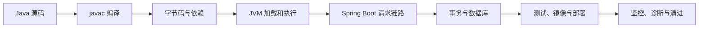
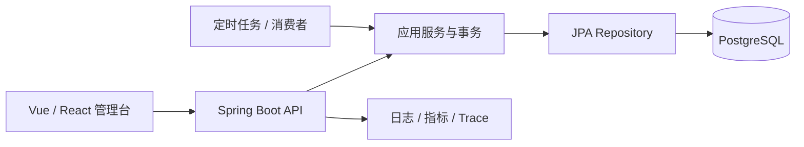

# Java 学习导览

## 适合谁看

适合准备进入后端开发、企业应用、Spring Boot、微服务或 JVM 生态的学习者。你不需要先有大型项目经验，但应该已经会使用变量、条件、循环和函数。

Java 的难点不只是语法。真正进入项目后，你还要同时理解：

- 源码、字节码、JDK、JVM 和构建工具之间是什么关系。
- 对象、引用、堆、栈、类加载和垃圾回收如何影响程序。
- 泛型、异常、线程、事务和代理为什么会产生“看起来没问题，运行却不对”的故障。
- Spring Boot 如何把 HTTP、校验、业务、数据库、日志、测试和部署串起来。

本模块按“先建立图景，再学习局部，最后完成可交付项目”的顺序组织，不要求你先背完所有 API。

## 当前学习基线

本站以 **Java 25 LTS** 作为项目学习和生产部署基线，以 **Spring Boot 4.1.0**、Maven、PostgreSQL 18 演示完整工程。Java 26 是当前非 LTS 功能版本，可以用于观察新特性，但不作为本教程的长期部署基线。

Spring Boot 4.1.0 最低支持 Java 17，并兼容到 Java 26。因此：

- 新学习项目直接使用 Java 25。
- 维护 Java 21 或 17 项目时，先保持现有基线，再通过测试逐步升级。
- 本地、CI、构建镜像和运行镜像必须固定同一 Java 主版本。
- 不要把“本机能编译”当作部署兼容性的证明。

## 先建立完整链路

只会写一个 Controller，还不等于会交付 Java 服务。你最终要能解释请求如何进入进程、Bean 如何创建、事务在哪里生效、SQL 何时执行、连接何时归还，以及进程收到终止信号后怎样停止。

## 你会学到什么

- Java 类型系统、面向对象、集合、泛型、异常、Stream 和常用类库。
- JVM 内存区域、对象生命周期、类加载、GC、线程转储、堆转储和 JFR。
- 平台线程、线程池、虚拟线程、可见性、竞态、锁和异步任务边界。
- Spring Boot 自动配置、Bean 生命周期、分层架构、输入校验和统一错误契约。
- JPA 实体状态、懒加载、N+1、事务代理、连接池和乐观锁。
- Flyway 迁移、PostgreSQL 表结构、约束、索引和数据一致性。
- 单元测试、MockMvc、Testcontainers、Docker、健康检查和优雅停机。
- 用证据排查类路径、Bean、事务、SQL、连接池、线程、内存和发布故障。

## 推荐学习顺序

<LearningPath :steps="[
  { title: '图解 Java 核心概念', description: '先用 29 张图建立语法、集合、Stream、JVM、并发、Spring、事务、测试和部署的整体模型。', link: '/java/visual-guide', badge: '图解' },
  { title: '环境、JDK 与构建工具', description: '固定 Java 版本，理解 javac、Maven、依赖树和可复现构建。', link: '/java/setup-tooling', badge: '环境' },
  { title: '语法与面向对象', description: '掌握值、引用、类、接口、继承、组合和不可变对象。', link: '/java/syntax-oop', badge: '基础' },
  { title: '集合、泛型与常用类库', description: '理解集合选择、equals/hashCode、泛型边界和类型擦除。', link: '/java/collections-generics', badge: '类型' },
  { title: '异常、日志与编码规范', description: '建立错误分类、异常上下文、结构化日志和 request id。', link: '/java/exceptions-logging', badge: '质量' },
  { title: 'Stream、Lambda 与数据处理', description: '学习函数式处理、惰性求值、副作用和并行流边界。', link: '/java/streams-lambda', badge: '数据' },
  { title: '并发、线程池与虚拟线程', description: '理解竞态、锁、线程池、虚拟线程、ThreadLocal 和取消。', link: '/java/concurrency-virtual-threads', badge: '并发' },
  { title: 'JVM 内存、GC 与诊断', description: '掌握堆栈、类加载、GC Roots、JFR、线程转储和堆转储。', link: '/java/jvm-memory-gc', badge: 'JVM' },
  { title: 'Spring Boot API 开发', description: '理解自动配置、Controller、Service、Repository、校验和配置。', link: '/java/spring-boot-api', badge: '框架' },
  { title: 'Spring Boot 从零到项目', description: '完成可运行、可测试、可部署的用户角色 API。', link: '/java/spring-boot-project-from-zero', badge: '实战' },
  { title: 'Spring Security 权限项目', description: '继续补齐认证、授权、密码、Token、审计和接口保护。', link: '/java/spring-security-permission', badge: '权限' },
  { title: '数据库、事务与 ORM', description: '掌握实体状态、事务传播、锁、索引、懒加载和查询性能。', link: '/java/persistence-transaction', badge: '数据' },
  { title: '测试、打包与部署', description: '建立单元、集成、容器测试和生产交付闭环。', link: '/java/testing-deployment', badge: '交付' },
  { title: 'Java 真实项目问题库', description: '处理 16 类 JVM、Spring、JPA、线程和发布故障。', link: '/projects/issues-java', badge: '排障' },
  { title: 'Java 专项练习', description: '通过 12 个故障注入练习验证工程能力。', link: '/roadmap/java-practice', badge: '练习' },
  { title: '常见问题', description: '快速排查 JDK、Maven、端口、Bean、事务和数据库连接。', link: '/java/troubleshooting', badge: '速查' }
]" />

## 三种阅读方式

### 第一次系统学习

按推荐顺序阅读。每章都要运行最小实验，并用自己的话解释图中的箭头。不要在还没理解对象、异常和集合时直接背 Spring 注解。

### 正在做 Java 项目

直接进入 [Spring Boot 从零到项目](/java/spring-boot-project-from-zero)。每完成数据库迁移、业务服务、错误处理、测试和容器中的一个阶段，就立即运行该阶段的验证，不要等全部代码写完再调试。

### 正在排查线上故障

先进入 [Java 真实项目问题库](/projects/issues-java)，按“启动、请求、事务、SQL、连接池、线程、内存、发布”分类。先收集异常链、线程转储、SQL、池指标和部署时间线，再修改代码。

## 每个阶段如何验收

| 阶段 | 不足以证明掌握 | 可验收结果 |
| --- | --- | --- |
| 语言 | 能背语法和注解 | 能解释值、引用、泛型擦除、异常传播和对象不变量 |
| JVM | 知道有堆和栈 | 能从线程转储、GC 日志或 JFR 找到一条异常证据 |
| 并发 | 会创建线程 | 能复现竞态，说明可见性、原子性、取消和线程池预算 |
| Spring | 能写 CRUD | 能解释 Bean、代理、请求链路、错误契约和配置来源 |
| 数据 | 能调用 Repository | 能证明事务边界、SQL 数量、连接归还和并发更新策略 |
| 测试 | 有测试文件 | 能用真实 PostgreSQL 验证迁移、约束、事务和接口 |
| 部署 | jar 能启动 | 镜像可构建，readiness 正确，SIGTERM 能优雅退出 |

## Java 在项目中的典型位置

Java 很适合长期维护的企业 API、交易系统、后台任务、数据处理和平台服务。但框架不会自动保证正确事务、查询性能或线程安全，团队仍要明确边界和证据。

## 推荐项目顺序

1. 用纯 Java 完成一个命令行任务管理器，练习对象、集合、异常和测试。
2. 完成 [Spring Boot 从零到项目](/java/spring-boot-project-from-zero)，建立 API、数据库和交付闭环。
3. 完成 [Spring Security 权限认证项目](/java/spring-security-permission)，补认证和授权。
4. 在 [Java 专项练习](/roadmap/java-practice) 中注入类路径、事务、N+1、连接池、线程和 GC 故障。
5. 用 [Java 真实项目问题库](/projects/issues-java) 写至少五份“现象—证据—根因—修复—回归”记录。

## 学习检查

- [ ] 能解释 JDK、JVM、字节码、Maven 和应用 jar 的关系。
- [ ] 能区分栈中的局部变量、堆中的对象和引用本身。
- [ ] 能说明泛型擦除、受检异常和异常链。
- [ ] 能解释 happens-before、线程池和虚拟线程的适用边界。
- [ ] 能画出 Spring MVC 从 Filter 到 Controller 的请求链路。
- [ ] 能解释为什么同类内部调用可能绕过 `@Transactional`。
- [ ] 能识别懒加载、N+1 和连接池耗尽。
- [ ] 能使用乐观锁阻止旧页面覆盖新数据。
- [ ] 能用 Testcontainers 在真实 PostgreSQL 上验证迁移和接口。
- [ ] 能区分 liveness、readiness，并完成一次优雅停机。

## 参考资料

- [Oracle Java SE Support Roadmap](https://www.oracle.com/java/technologies/java-se-support-roadmap.html)
- [Java SE Documentation](https://docs.oracle.com/en/java/javase/)
- [Spring Boot Documentation](https://docs.spring.io/spring-boot/documentation.html)
- [Spring Boot System Requirements](https://docs.spring.io/spring-boot/system-requirements.html)
- [PostgreSQL 18 Documentation](https://www.postgresql.org/docs/18/)

## 下一步

从 [图解 Java 核心概念](/java/visual-guide) 开始。完成图解后进入 [环境、JDK 与构建工具](/java/setup-tooling)，已经有基础的学习者可以直接进入 [Spring Boot 从零到项目](/java/spring-boot-project-from-zero)。
