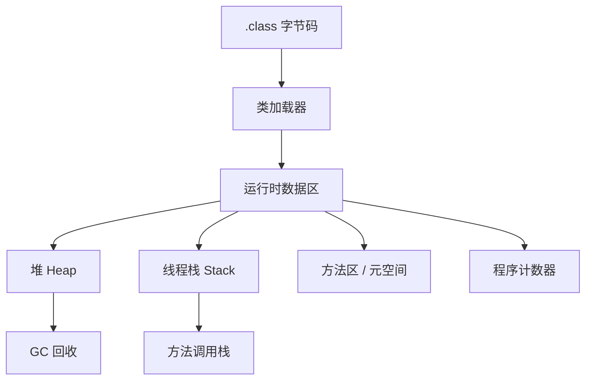
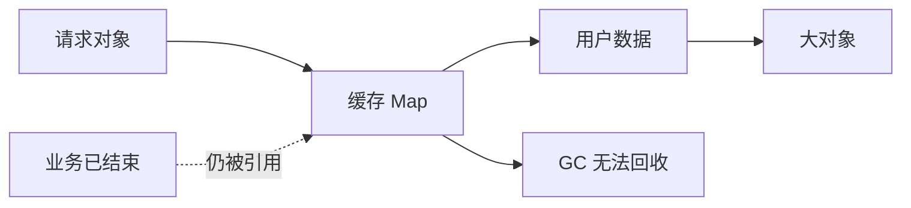

# JVM 内存、GC 与诊断

## 这个页面解决什么

Java 程序上线后，常见问题包括内存升高、Full GC、线程卡死、CPU 飙高、类加载冲突。理解 JVM 内存和诊断工具，是后端工程师排查线上问题的基础。

## JVM 运行结构

先按所有权理解三块主要区域：每条线程有自己的调用栈；Java 对象主要位于所有线程共享的堆；类元数据位于 Metaspace。GC 从 Roots 追踪可达对象，只会回收已经不可达的对象。

<DocFigure
  src="/images/java/jvm-memory-regions.webp"
  alt="JVM 多个线程拥有独立调用栈，共享对象堆和 Metaspace，GC 从 Roots 追踪对象可达性"
  caption="图中对象数量只是教学示意；准确内存占用、代际和回收行为要通过 GC 日志、JFR、jcmd 与堆转储确认。"
  :width="1440"
  :height="900"
/>

排障时先问“增长发生在哪个区域”：堆持续增长看对象与引用链，Metaspace 增长看 ClassLoader 和动态类，单线程栈异常看递归深度与线程数量。不要看到进程内存高就直接把 `-Xmx` 调大。

## 堆和栈

| 区域 | 存什么 | 常见问题 |
| --- | --- | --- |
| 堆 | 对象实例、数组 | 内存泄漏、频繁 GC |
| 栈 | 方法调用、局部变量 | 栈溢出、递归过深 |
| 元空间 | 类元数据 | 动态生成类过多 |
| 程序计数器 | 当前线程执行位置 | 很少直接排查 |

## GC 是什么

GC 负责回收不再使用的对象。它不是万能的：如果对象仍然被引用，即使业务已经不需要，GC 也不会回收。

常见 GC 现象：

- Young GC 频繁：短生命周期对象很多。
- Full GC：老年代或元空间压力大。
- GC 后内存不下降：可能存在长期引用。
- Stop-The-World 时间长：请求延迟抖动。

## 内存泄漏示意

## 常用诊断思路

### CPU 高

1. 找进程。
2. 找高 CPU 线程。
3. 转换线程 id。
4. 查看线程 dump。
5. 定位代码循环、锁竞争或序列化问题。

### 内存高

1. 查看堆使用曲线。
2. 判断是否频繁 GC。
3. 导出 heap dump。
4. 分析大对象、引用链和集合增长。
5. 回到业务代码找缓存、静态集合、未关闭资源。

### 请求卡死

1. 看线程 dump。
2. 看数据库连接池。
3. 看慢 SQL。
4. 看外部 HTTP 调用。
5. 看锁等待。

## 实际项目问题

### 1. 本地没问题，线上 OOM

常见原因：

- 线上数据量大。
- 分页一次查太多。
- 导出功能把全量数据放进内存。
- 缓存没有过期策略。
- 文件上传读取成完整 byte 数组。

处理方式：

- 分页读取。
- 流式处理文件。
- 缓存设置容量和过期时间。
- 大查询增加导出任务和异步文件。

### 2. 定时任务越跑越慢

可能是每次执行都累积对象、连接未释放、日志过大或重复加载配置。

### 3. 类冲突

表现为 `NoSuchMethodError`、`ClassNotFoundException`、`NoClassDefFoundError`。通常和依赖版本冲突、打包缺失、运行环境 classpath 不一致有关。

## 最佳实践

- 生产必须有 JVM 指标：堆、非堆、GC 次数、GC 耗时、线程数。
- 定期压测高数据量场景。
- 导出、导入、批处理不要一次性加载全量数据。
- 缓存必须有容量、过期和清理策略。
- 线上诊断先保留现场，再重启。

## 下一步学习

继续学习 [Spring Boot API 开发](/java/spring-boot-api)。
