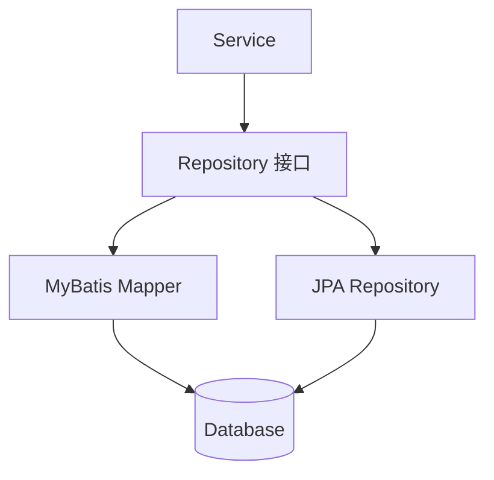
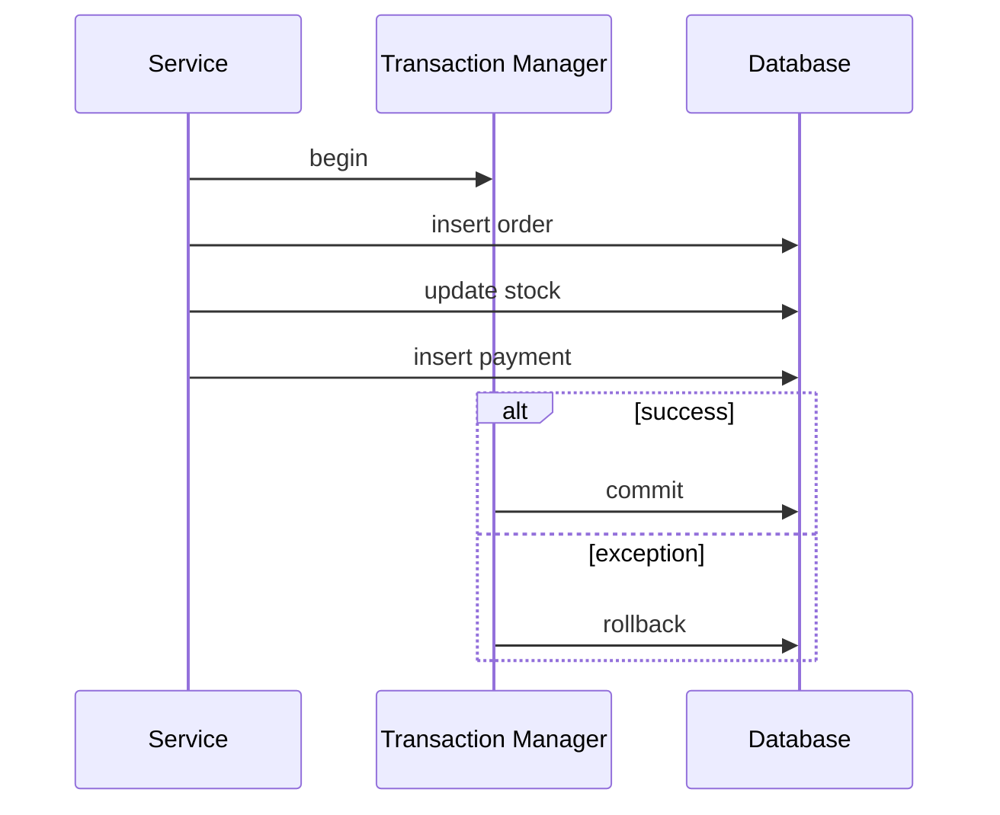

# 数据库、事务与 ORM

## 这个页面解决什么

Java 后端的大多数线上问题都离不开数据库：事务不生效、连接池耗尽、N+1 查询、慢 SQL、脏数据、锁等待。学数据库集成时，要同时理解代码、事务和 SQL。

## 常见数据访问方式

| 方式 | 特点 | 适合场景 |
| --- | --- | --- |
| JDBC | 最底层，直接写 SQL | 理解原理、少量手写访问 |
| MyBatis | SQL 可控，映射灵活 | 国内后台系统常见 |
| JPA/Hibernate | 面向对象映射，自动生成 SQL | 领域模型较清晰的项目 |
| Spring Data | Repository 抽象 | 简化常规 CRUD |

## Repository 边界



Service 不应该拼 SQL，也不应该关心连接细节。Repository 暴露业务需要的数据访问能力。

## 事务是什么

事务保证一组数据库操作要么全部成功，要么全部失败。

```java
@Transactional
public void createOrder(CreateOrderCommand command) {
    Order order = orderRepository.save(command.toOrder());
    stockRepository.decrease(command.productId(), command.quantity());
    paymentRepository.createPending(order.id());
}
```

## 事务边界图



## 事务不生效的常见原因

- 方法不是 `public`。
- 同一个类内部自调用。
- 异常被 catch 后没有继续抛出。
- 抛出的异常类型没有触发回滚。
- 数据源或事务管理器配置错误。
- 异步线程里执行了需要事务的逻辑。

## N+1 查询

问题：

```text
查询 1 次订单列表
每个订单再查 1 次用户
每个订单再查 1 次商品
```

订单 100 条时，可能变成 201 次查询。

解决：

- 使用 join。
- 批量查询相关 id。
- 使用 Map 组装。
- 对 JPA 使用 fetch join 或 EntityGraph。

## 连接池

连接池不是越大越好。连接太多会压垮数据库，连接太少会导致请求排队。需要结合：

- Web 并发。
- SQL 耗时。
- 数据库最大连接数。
- 慢查询数量。
- 事务持续时间。

## 实际项目问题

### 1. 导入数据一半成功一半失败

可能是事务边界不对，或者每行独立提交。需要明确：

- 整个文件一个事务。
- 每批一个事务。
- 每行一个事务。

不同选择影响回滚范围和用户体验。

### 2. 查询接口越来越慢

先看 SQL，而不是先加服务器：

- 是否缺索引。
- 是否 N+1。
- 是否一次查太多字段。
- 是否分页深度过大。
- 是否排序字段没有索引。

### 3. 事务里调用外部接口

外部接口慢会拖长数据库事务，导致锁持有时间变长。

建议：

- 事务内只处理数据库一致性。
- 外部通知使用事件、消息或事务提交后回调。

## 最佳实践

- Service 层定义事务边界。
- 事务内不要做耗时外部调用。
- 查询接口默认分页。
- SQL 需要可观测：慢查询、执行计划、参数。
- 批量处理要控制批次大小。
- 数据变更必须有迁移脚本和回滚说明。

## 下一步学习

继续学习 [测试、打包与部署](/java/testing-deployment)。
