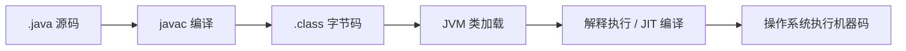

# 环境、JDK 与构建工具

## 这个页面解决什么

很多 Java 初学者会被 JDK、JRE、JVM、Maven、Gradle、Spring Boot 插件这些词绕晕。先把工具链关系理清，后面排查问题会轻松很多。

## 基本概念

| 名称 | 作用 | 初学者要记住 |
| --- | --- | --- |
| JVM | Java 虚拟机，负责执行字节码 | 程序最终跑在 JVM 上 |
| JRE | 运行 Java 程序需要的环境 | 只运行程序才关心 |
| JDK | 开发工具包，包含编译器和工具 | 开发必须安装 JDK |
| Maven | 构建、依赖和生命周期工具 | 企业项目非常常见 |
| Gradle | 更灵活的构建工具 | Android 和部分后端项目常见 |
| IDE | IntelliJ IDEA、VS Code 等 | 提供代码补全、调试和构建集成 |

## 编译和运行流程



Java 源码不会直接变成可执行文件。它先编译成字节码，再由 JVM 在不同操作系统上运行。这就是 Java 跨平台的基础。

## 最小命令

```bash
java --version
javac --version
```

如果这两个命令不可用，说明 JDK 没有安装好，或者 `PATH` 没有配置正确。

一个最小 Java 文件：

```java
public class Hello {
    public static void main(String[] args) {
        System.out.println("Hello Java");
    }
}
```

运行：

```bash
javac Hello.java
java Hello
```

## Maven 项目结构

```text
demo
├─ pom.xml
└─ src
   ├─ main
   │  ├─ java
   │  └─ resources
   └─ test
      ├─ java
      └─ resources
```

常用命令：

```bash
mvn test
mvn package
mvn spring-boot:run
```

`pom.xml` 管依赖、插件和构建配置。项目启动失败时，先看依赖版本、插件版本和 Java 版本是否匹配。

## Gradle 项目结构

```text
demo
├─ build.gradle
├─ settings.gradle
└─ src/main/java
```

常用命令：

```bash
./gradlew test
./gradlew build
./gradlew bootRun
```

Gradle 的特点是脚本能力更强，但也更容易因为插件和缓存导致排查复杂。团队内要统一 Wrapper，不要每个人用本机不同版本的 Gradle。

## 版本选择建议

- 学习 Java 语言：使用当前正式 JDK，例如 JDK 26。
- 企业项目维护：优先匹配团队生产环境，例如 JDK 17、21、25 或 26。
- Spring Boot 项目：先确认 Spring Boot 当前版本支持的 Java 范围。
- 不要把本机 JDK 升级当成项目升级，项目升级需要测试、构建、依赖兼容和上线验证。

## 实际项目问题

### 1. 本地能启动，服务器启动失败

常见原因：

- 本地 JDK 是 21，服务器是 17。
- 构建产物用了高版本 class 文件。
- 服务器环境变量指向了旧 JDK。

处理方式：

```bash
java --version
echo $JAVA_HOME
```

再检查构建配置里的 `maven-compiler-plugin` 或 Gradle `java.toolchain`。

### 2. 依赖下载特别慢或失败

可能是仓库镜像、网络代理、私服权限或依赖版本不存在。不要直接删除整个本地仓库，先定位具体依赖：

```bash
mvn dependency:tree
```

### 3. IDE 能运行，命令行不能运行

说明 IDE 内部配置和命令行配置不一致。检查：

- Project SDK。
- Module language level。
- Maven/Gradle JDK。
- 命令行 `JAVA_HOME`。

## 最佳实践

- 项目根目录保留 `.java-version` 或在 README 写明 JDK 版本。
- Maven/Gradle Wrapper 提交到仓库。
- CI 使用固定 JDK 镜像。
- 版本升级单独建任务，不和业务需求混在一起。

## 下一步学习

继续学习 [语法与面向对象](/java/syntax-oop)。
