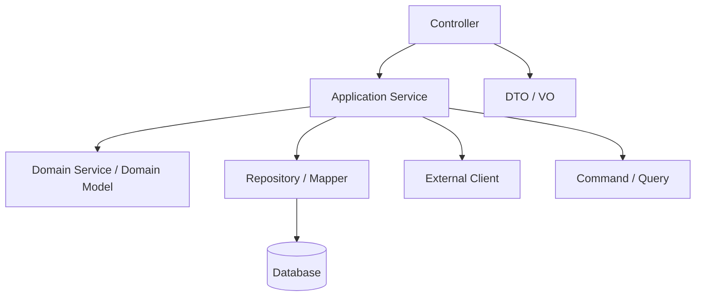
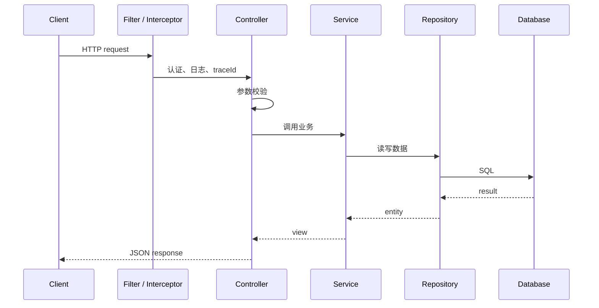

# Spring Boot API 开发

## 这个页面解决什么

Spring Boot 是 Java 后端开发最常见的入口。学习它时，不要只会写 `@RestController`，还要理解分层、配置、依赖注入、参数校验、统一响应和运行时管理。

## 分层结构



| 层 | 职责 |
| --- | --- |
| Controller | 接收 HTTP 请求、参数校验、返回响应 |
| Service | 编排业务流程、事务边界、调用仓储和外部系统 |
| Domain | 表达核心业务规则 |
| Repository/Mapper | 数据访问 |
| Client | 调用外部服务 |

## 最小 Controller

```java
@RestController
@RequestMapping("/api/users")
public class UserController {
    private final UserService userService;

    public UserController(UserService userService) {
        this.userService = userService;
    }

    @GetMapping("/{id}")
    public UserView getUser(@PathVariable Long id) {
        return userService.getUser(id);
    }
}
```

## 配置管理

`application.yml` 示例：

```yaml
server:
  port: 8080

spring:
  datasource:
    url: jdbc:postgresql://localhost:5432/app
    username: app
    password: ${DB_PASSWORD}
```

敏感配置不要写死在仓库里。使用环境变量、配置中心或密钥管理服务。

## 参数校验

```java
public record CreateUserRequest(
    @NotBlank String name,
    @Email String email
) {
}
```

Controller：

```java
@PostMapping
public UserView create(@Valid @RequestBody CreateUserRequest request) {
    return userService.create(request);
}
```

参数校验属于边界层，业务规则仍要在 Service 或领域层保证。

## 请求处理链路



## 实际项目问题

### 1. Controller 里写业务逻辑

Controller 变得很长，测试困难，权限、事务、日志都混在一起。

解决：

- Controller 只做协议层事情。
- Service 编排业务。
- Repository 负责数据。
- 外部接口封装成 Client。

### 2. 配置在本地和线上不一致

本地写死配置，线上环境变量缺失，启动时才发现。

解决：

- README 写清必需环境变量。
- 启动时校验关键配置。
- 不同环境配置分层管理。

### 3. 接口返回结构不统一

前端处理困难，错误提示不一致。

解决：

- 成功响应结构统一。
- 错误响应包含 code、message、traceId。
- 分页结构统一。

## 最佳实践

- 构造器注入优先于字段注入。
- Controller 不写复杂业务。
- 配置要区分默认值和敏感值。
- DTO 不直接复用数据库 Entity。
- 所有外部调用设置超时。
- API 变更要同步更新前端文档和联调说明。

## 参考资料

- [Spring Boot Documentation](https://docs.spring.io/spring-boot/documentation.html)
- [Spring Boot Project](https://spring.io/projects/spring-boot)

## 下一步学习

如果你还没有做过完整后端项目，继续进入 [Spring Boot 从零到项目落地](/java/spring-boot-project-from-zero)，把 Controller、Service、Repository、数据库、事务、测试和部署串成一个可运行 API。已经有项目经验后，再学习 [数据库、事务与 ORM](/java/persistence-transaction)。
