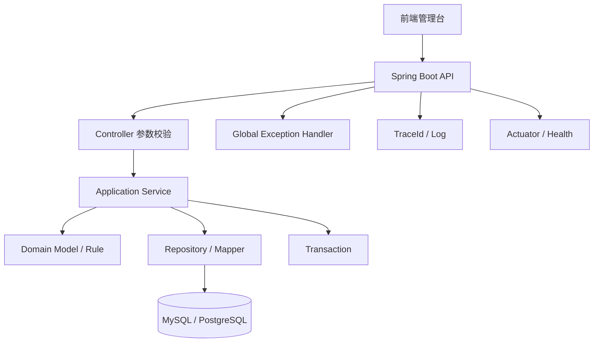
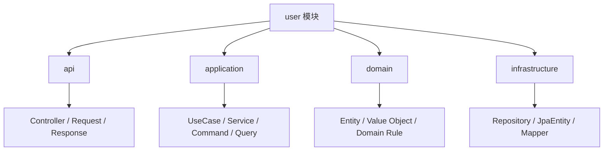
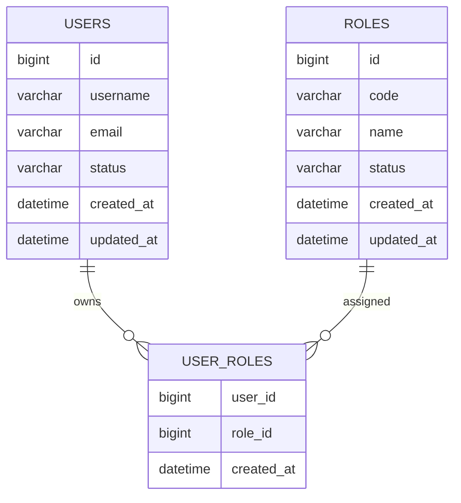
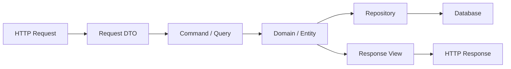
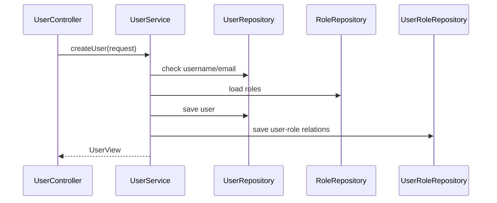
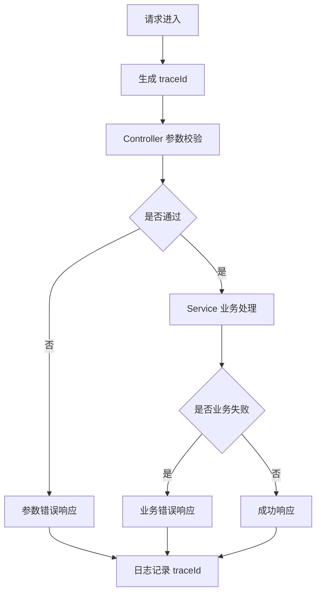
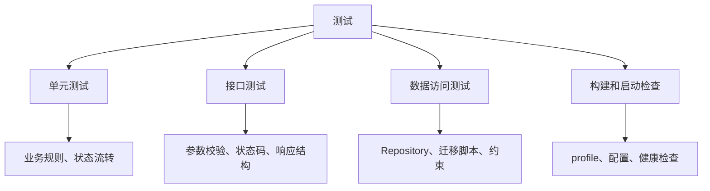
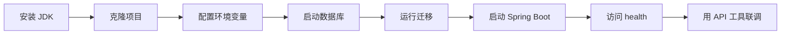

# Spring Boot 从零到项目落地

## 这个页面解决什么

学 Java 后端最容易卡在两个极端：只学语法不知道项目怎么组织，或者直接复制一个 Spring Boot 项目但不知道每层为什么这样写。

这篇用一个“用户与角色 API”项目，把 Spring Boot 后端从创建、分层、数据库、接口、异常、测试到部署串成完整闭环。读完后，你应该能回答：

- 一个 Spring Boot 后端项目应该怎么分目录。
- Controller、Service、Repository、DTO、Entity 分别负责什么。
- 为什么不能把数据库 Entity 直接返回给前端。
- 如何设计列表分页、新增、编辑、启停和角色绑定接口。
- 事务、参数校验、统一错误、日志和测试应该放在哪里。
- 项目出问题时应该从启动、请求、SQL、事务还是部署层排查。

这不是 Spring Boot API 速查，而是项目落地手册。你可以把它当作 Java 后端第一个可交付项目的实施路线。

## 适合谁看

- 已经学过 Java 基础语法，准备进入 Spring Boot 项目的人。
- 前端或 Node.js 开发者想补一个企业后端 API 项目的人。
- 会写 `@RestController`，但 Controller、Service、Repository 经常混在一起的人。
- 想做一个能给 Vue Admin 或 React 管理台对接的后端 API 的人。
- 想理解 Java 后端项目如何测试、打包、配置和排错的人。

## 最终项目

项目建议命名为 `java-admin-api`。它不是完整权限系统，但要覆盖后台管理系统的核心后端能力。

```text
java-admin-api/
  README.md
  TROUBLESHOOTING.md
  API_CONTRACT.md
  src/
    main/
      java/com/example/admin/
        AdminApiApplication.java
        common/
          error/
          response/
          trace/
        config/
        user/
          api/
          application/
          domain/
          infrastructure/
        role/
          api/
          application/
          domain/
          infrastructure/
      resources/
        application.yml
        application-dev.yml
        db/migration/
    test/
      java/com/example/admin/
```

最终至少交付：

| 模块 | 必须完成 |
| --- | --- |
| 用户管理 | 用户列表、详情、新增、编辑、启停、绑定角色 |
| 角色管理 | 角色列表、新增、编辑、启停、权限码示例 |
| 参数校验 | 必填、邮箱、长度、枚举、分页参数 |
| 统一响应 | 成功响应、错误响应、traceId、分页结构 |
| 异常处理 | 参数错误、业务错误、资源不存在、系统错误 |
| 数据库 | 用户表、角色表、用户角色关系表、迁移脚本 |
| 事务 | 创建用户并绑定角色、启停用户、批量绑定 |
| 测试 | Service 单元测试、Controller 接口测试、Repository 基础测试 |
| 运行配置 | dev/test/prod 配置分层，敏感值走环境变量 |
| 交付文档 | README、API_CONTRACT、TROUBLESHOOTING |

## 项目总图



这张图说明三件事：

1. Controller 是 HTTP 边界，不是业务规则集中地。
2. Service 是业务流程和事务边界，不能只做简单转发。
3. Repository 只负责数据访问，不应该决定业务是否允许执行。

## 技术选择

Spring Boot 官方文档把 Spring Boot 定位为创建可独立运行、生产级 Spring 应用的工具；官方入门指南也推荐通过 Spring Initializr 创建项目，并要求 Java 17 或更高版本。实际团队里可以根据长期维护策略选择 Java 17、21 或更高版本，但项目结构和分层原则不依赖具体小版本。

| 项目 | 推荐选择 | 原因 |
| --- | --- | --- |
| JDK | Java 17+，企业项目优先按团队基线 | Spring Boot 新版本要求至少 Java 17 |
| 构建工具 | Maven 或 Gradle，初学优先 Maven | 依赖树、插件和企业项目示例更多 |
| Web | Spring Web | 提供 REST API、嵌入式 Servlet 容器 |
| Validation | Spring Validation | 处理请求参数基础校验 |
| 数据访问 | Spring Data JPA 或 MyBatis | JPA 适合领域模型，MyBatis 适合 SQL 可控 |
| 数据库迁移 | Flyway 或 Liquibase | 让表结构变更可追踪、可回滚 |
| 测试 | JUnit 5、Spring Boot Test | 覆盖业务、接口和数据访问 |
| 运行监控 | Actuator | 健康检查、指标和运行状态 |

初学建议先选 Maven + Spring Web + Validation + JPA + Flyway + Actuator。等你理解分层后，再切换 MyBatis、Redis、Spring Security、消息队列和微服务治理。

## 创建项目

可以用 Spring Initializr 创建项目，也可以在 IDE 里创建。推荐依赖：

```text
Spring Web
Validation
Spring Data JPA
Flyway Migration
PostgreSQL Driver 或 MySQL Driver
Spring Boot Actuator
Spring Boot Test
```

Maven 项目核心结构：

```text
src/main/java        Java 源码
src/main/resources   配置、迁移、静态资源
src/test/java        测试源码
pom.xml              依赖和插件
```

启动类：

```java
@SpringBootApplication
public class AdminApiApplication {
    public static void main(String[] args) {
        SpringApplication.run(AdminApiApplication.class, args);
    }
}
```

第一次运行只要确认三件事：

1. 应用能启动。
2. `/actuator/health` 能返回 UP。
3. 日志里能看到当前环境、端口和数据库连接状态。

## 分层设计

推荐从业务模块切包，而不是按技术类型把所有 Controller、Service、Repository 分开放。



### 每层职责

| 层 | 放什么 | 不放什么 |
| --- | --- | --- |
| `api` | Controller、请求 DTO、响应 VO | 复杂业务、事务、SQL |
| `application` | 用例服务、事务、业务编排 | HTTP 注解、数据库细节 |
| `domain` | 业务实体、业务规则、值对象 | Spring MVC、Repository 细节 |
| `infrastructure` | JPA/MyBatis、外部接口、技术适配 | 业务决策 |
| `common` | 统一响应、异常、trace、基础工具 | 具体业务逻辑 |

分层的目的不是增加目录，而是让你知道代码该放哪里。一个函数如果同时处理 HTTP、业务判断、SQL 和错误响应，后续一定难维护。

## 数据模型

先用最小权限后台建模：



### 迁移脚本示例

下面以 PostgreSQL 为例。MySQL 可以把 `bigserial` 换成 `bigint auto_increment`，并使用字段 `comment` 或单独的数据字典文档记录说明。

```sql
create table users (
  id bigserial primary key,
  username varchar(64) not null,
  email varchar(128) not null,
  status varchar(20) not null,
  created_at timestamp not null,
  updated_at timestamp not null,
  constraint uk_users_username unique (username),
  constraint uk_users_email unique (email)
);

create table roles (
  id bigserial primary key,
  code varchar(64) not null,
  name varchar(64) not null,
  status varchar(20) not null,
  created_at timestamp not null,
  updated_at timestamp not null,
  constraint uk_roles_code unique (code)
);

create table user_roles (
  user_id bigint not null,
  role_id bigint not null,
  created_at timestamp not null,
  primary key (user_id, role_id),
  constraint fk_user_roles_user foreign key (user_id) references users(id),
  constraint fk_user_roles_role foreign key (role_id) references roles(id)
);

comment on table users is '后台用户主表。保存可以登录或被授权访问后台系统的用户基础资料。';
comment on column users.id is '用户主键。由数据库生成，不承载业务含义。';
comment on column users.username is '登录名或后台显示用户名。全局唯一，避免同名账号导致审计和权限归属混乱。';
comment on column users.email is '用户邮箱。全局唯一，可用于登录、通知和找回账号。';
comment on column users.status is '用户状态。建议取值 ACTIVE、DISABLED；停用用户不能继续登录或执行后台操作。';
comment on column users.created_at is '用户创建时间。用于审计、排序和问题追踪。';
comment on column users.updated_at is '用户最后更新时间。用于判断数据是否被修改以及排查缓存旧值。';

comment on table roles is '后台角色主表。角色是一组菜单、按钮、接口或数据权限的业务集合。';
comment on column roles.code is '角色编码。全局唯一，供程序判断和权限配置引用，创建后不要随意改名。';
comment on column roles.name is '角色名称。给管理员阅读的展示文本，可以随业务调整。';
comment on column roles.status is '角色状态。建议取值 ACTIVE、DISABLED；停用角色不应再参与授权判断。';

comment on table user_roles is '用户和角色的多对多关系表。用于表达一个用户拥有多个角色、一个角色分配给多个用户。';
comment on column user_roles.user_id is '用户主键，引用 users.id。';
comment on column user_roles.role_id is '角色主键，引用 roles.id。';
comment on column user_roles.created_at is '绑定创建时间。用于审计授权来源和排查权限残留问题。';
```

真实项目中，迁移脚本必须写清楚字段含义、约束原因和变更背景。比如 `status` 应说明取值范围，唯一索引应说明业务唯一性，关系表应说明是否允许重复绑定。上面的唯一约束是为了防止账号、邮箱和角色编码重复；关系表复合主键是为了防止同一用户重复绑定同一角色；外键是为了避免孤儿授权记录。

## API 设计

不要一开始设计几十个接口。先完成用户管理闭环。

| 方法 | 路径 | 用途 |
| --- | --- | --- |
| `GET` | `/api/users` | 用户分页列表 |
| `GET` | `/api/users/{id}` | 用户详情 |
| `POST` | `/api/users` | 新增用户 |
| `PUT` | `/api/users/{id}` | 编辑用户 |
| `PATCH` | `/api/users/{id}/status` | 启用或停用 |
| `PUT` | `/api/users/{id}/roles` | 绑定角色 |

统一分页响应：

```json
{
  "code": "OK",
  "message": "success",
  "traceId": "8c2f3b9d",
  "data": {
    "items": [],
    "page": 1,
    "pageSize": 20,
    "total": 0
  }
}
```

错误响应：

```json
{
  "code": "USER_EMAIL_EXISTS",
  "message": "邮箱已存在",
  "traceId": "8c2f3b9d"
}
```

前后端联调时最怕响应结构漂移。建议把请求、响应、错误码和分页格式写入 `API_CONTRACT.md`。

## DTO、Entity 和 ViewModel

不要把数据库 Entity 直接返回给前端。



### 请求 DTO

```java
public record CreateUserRequest(
    @NotBlank(message = "用户名不能为空")
    @Size(max = 64, message = "用户名不能超过 64 个字符")
    String username,

    @NotBlank(message = "邮箱不能为空")
    @Email(message = "邮箱格式不正确")
    String email,

    List<Long> roleIds
) {
}
```

### 响应 VO

```java
public record UserView(
    Long id,
    String username,
    String email,
    String status,
    List<String> roleCodes
) {
}
```

DTO 和 VO 的作用是保护边界。数据库字段可以变，前端展示字段也可以变，但不要让两边直接互相牵连。

## Service 和事务边界

创建用户并绑定角色是一个典型事务场景：用户创建成功但角色绑定失败时，不能留下半成品。



Service 示例：

```java
@Service
public class UserService {
    private final UserRepository userRepository;
    private final RoleRepository roleRepository;

    public UserService(UserRepository userRepository, RoleRepository roleRepository) {
        this.userRepository = userRepository;
        this.roleRepository = roleRepository;
    }

    @Transactional
    public UserView create(CreateUserCommand command) {
        if (userRepository.existsByEmail(command.email())) {
            throw new BusinessException("USER_EMAIL_EXISTS", "邮箱已存在");
        }

        User user = User.create(command.username(), command.email());
        List<Role> roles = roleRepository.findAllById(command.roleIds());
        user.bindRoles(roles);
        userRepository.save(user);

        return UserViewMapper.toView(user);
    }
}
```

事务建议：

- 事务放在应用服务层，不放在 Controller。
- 同一个业务闭环只有一个主要事务入口。
- 不要在事务里做慢外部 HTTP 调用。
- 业务失败抛异常，不要 catch 后继续提交。
- 只读查询使用只读事务或明确查询边界。

## 统一异常和 traceId

接口错误不能只返回 500。前端需要知道错误类型，后端需要能从响应定位日志。



统一异常处理：

```java
@RestControllerAdvice
public class GlobalExceptionHandler {
    @ExceptionHandler(BusinessException.class)
    public ApiResponse<Void> handleBusiness(BusinessException exception) {
        return ApiResponse.error(exception.code(), exception.getMessage());
    }

    @ExceptionHandler(MethodArgumentNotValidException.class)
    public ApiResponse<Void> handleValidation(MethodArgumentNotValidException exception) {
        return ApiResponse.error("VALIDATION_ERROR", "请求参数不正确");
    }
}
```

日志建议：

- 每个请求都有 traceId。
- 业务错误记录 warn，系统错误记录 error。
- 日志里不要打印密码、token、身份证、银行卡等敏感值。
- 慢接口记录耗时、用户、路径和关键业务参数。

## 测试策略

不要等整个项目写完才测试。每一层都有自己的测试重点。



| 测试类型 | 重点 | 示例 |
| --- | --- | --- |
| Service 单元测试 | 业务规则和异常分支 | 邮箱重复时抛业务异常 |
| Controller 测试 | 参数校验和响应结构 | 缺少 email 返回 `VALIDATION_ERROR` |
| Repository 测试 | 查询、唯一索引、关系表 | username 唯一约束生效 |
| 启动测试 | 配置和 Bean 是否完整 | test profile 能启动 |

最小验收命令：

```bash
./mvnw test
./mvnw package
java -jar target/java-admin-api.jar --spring.profiles.active=dev
```

## 配置和环境

配置要分层：默认配置、环境配置、敏感配置不能混在一起。

```yaml
server:
  port: 8080

spring:
  application:
    name: java-admin-api
  datasource:
    url: ${DB_URL}
    username: ${DB_USERNAME}
    password: ${DB_PASSWORD}
  jpa:
    open-in-view: false
  flyway:
    enabled: true

management:
  endpoints:
    web:
      exposure:
        include: health,info,metrics
```

配置检查清单：

- `DB_URL`、`DB_USERNAME`、`DB_PASSWORD` 不写死在仓库。
- README 写清本地开发需要哪些环境变量。
- `dev`、`test`、`prod` 配置差异明确。
- 生产环境不要暴露过多 actuator 端点。
- 日志级别和 SQL 日志按环境区分。

## 本地运行流程



建议 README 写成这样：

```md
# java-admin-api

## 环境要求

- Java 17+
- Maven Wrapper
- PostgreSQL 或 MySQL

## 本地启动

1. 创建数据库
2. 设置 DB_URL、DB_USERNAME、DB_PASSWORD
3. 执行 ./mvnw spring-boot:run
4. 访问 /actuator/health

## 常用命令

## 接口文档

## 常见问题
```

## 交付验收

| 项目 | 验收标准 |
| --- | --- |
| 项目能启动 | 本地和 test profile 都能启动 |
| 迁移能执行 | 空库启动后自动创建表 |
| 用户 CRUD | 新增、编辑、查询、启停能闭环 |
| 角色绑定 | 创建用户时能绑定角色，失败能回滚 |
| 参数校验 | 必填、格式、长度错误返回统一响应 |
| 错误处理 | 业务错误和系统错误能区分 |
| traceId | 响应和日志能对齐 |
| 测试 | 核心 Service、Controller、Repository 有测试 |
| 文档 | README、API_CONTRACT、TROUBLESHOOTING 完整 |
| 部署 | 能打包成 jar，能通过环境变量运行 |

## 常见问题和排查

| 问题 | 先查什么 | 对应章节 |
| --- | --- | --- |
| 启动失败 | 最底层 `Caused by`、端口、数据源、Bean | [Java 常见问题](/java/troubleshooting) |
| 接口 400 | DTO 校验、请求 JSON、字段类型 | 参数校验 |
| 接口 500 | 异常栈、traceId、Service 日志 | 统一异常和 traceId |
| 新增用户后角色没绑定 | 事务、关系表、角色 ID 是否存在 | Service 和事务边界 |
| 事务不回滚 | 异常是否被 catch、是否同类内部调用 | [数据库、事务与 ORM](/java/persistence-transaction) |
| 本地能跑线上失败 | 环境变量、profile、数据库迁移、端口 | 配置和环境 |
| 查询很慢 | SQL、索引、分页、N+1 查询 | [数据库与缓存问题](/projects/issues-database) |

## 练习任务

按下面顺序做，不要一开始就堆复杂功能。

1. 创建项目并让 health 接口可访问。
2. 建 users、roles、user_roles 三张表和迁移脚本。
3. 写用户分页列表接口。
4. 写新增用户接口和参数校验。
5. 加邮箱唯一性业务校验。
6. 加角色绑定和事务。
7. 加统一错误响应和 traceId。
8. 写 Service 和 Controller 测试。
9. 写 README、API_CONTRACT、TROUBLESHOOTING。
10. 打包 jar，用环境变量启动一次。

完成后，把这个后端接给一个 Vue Admin 用户管理页面。前端如果出现 401、403、分页字段、错误响应或旧数据问题，回到 [前端项目排障图谱](/projects/frontend-debugging-map) 和 [前后端联调排查](/projects/integration-debugging)。

## 参考资料

- [Spring Boot Documentation](https://docs.spring.io/spring-boot/documentation.html)
- [Spring Boot Getting Started Guide](https://spring.io/guides/gs/spring-boot)
- [Spring Initializr](https://start.spring.io/)
- [Spring Boot System Requirements](https://docs.spring.io/spring-boot/system-requirements.html)

## 下一步学习

继续学习 [数据库、事务与 ORM](/java/persistence-transaction)，再进入 [测试、打包与部署](/java/testing-deployment)。如果你正在做全栈项目，把本页接口接到 [Vue 从零到项目落地](/vue/project-from-zero) 或 [前端综合实战练习](/roadmap/frontend-capstone-lab) 中。
