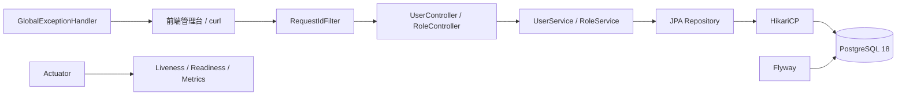
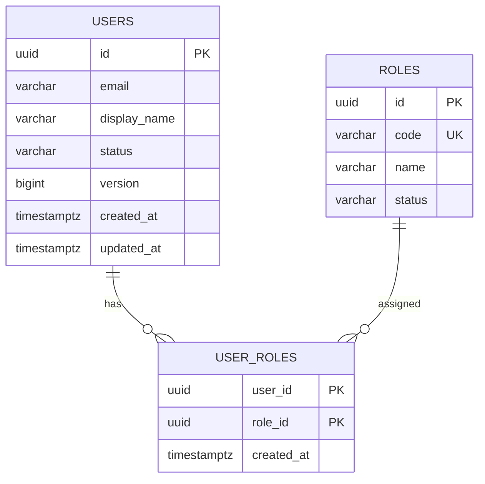
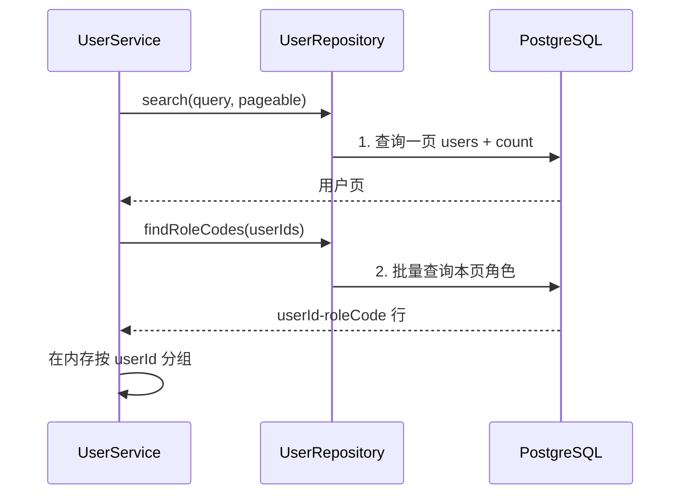
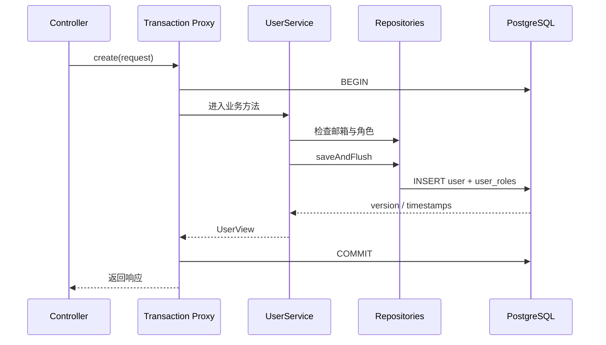
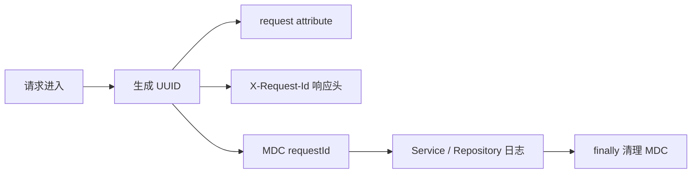
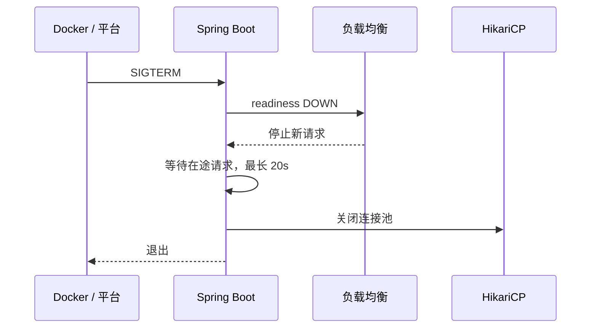

# Spring Boot 从零到项目落地

## 这个页面解决什么

本章不是再写一遍“Hello World”或只展示 Controller 的 CRUD。我们会完成一个可运行的用户角色管理 API，并把真实项目最容易遗漏的环节一起做完：

- Java、Spring Boot、Maven 和 PostgreSQL 版本固定。
- Controller、Service、Repository、DTO、Entity 的职责分离。
- Flyway 从空数据库创建表、约束、索引和种子角色。
- 统一成功/失败响应、字段校验和 request id。
- 邮箱业务唯一性、角色有效性和乐观锁并发保护。
- 列表查询避免 N+1，详情查询显式加载角色。
- 单元测试与真实 PostgreSQL 集成测试。
- Docker 多阶段构建、健康检查、readiness 和优雅停机。

完整源码位于仓库的 `examples/java-admin-api`，本页展示的代码直接从该目录导入。这样正文、测试和可运行示例不会各自维护一份。

## 完成后能交付什么

| 能力 | 接口或证据 |
| --- | --- |
| 查询角色 | `GET /api/roles` |
| 创建用户 | `POST /api/users` |
| 搜索分页 | `GET /api/users?q=ada&page=0&pageSize=20` |
| 查看详情 | `GET /api/users/{id}` |
| 修改资料 | `PUT /api/users/{id}` |
| 修改状态 | `PATCH /api/users/{id}/status` |
| 替换角色 | `PUT /api/users/{id}/roles` |
| 并发保护 | 旧 `expectedVersion` 返回 409 |
| 错误追踪 | 响应头、响应体和日志使用同一个 request id |
| 数据验证 | Testcontainers 启动 PostgreSQL 18 并执行 Flyway |
| 生产探针 | `/actuator/health/liveness` 与 `readiness` |
| 容器交付 | `docker compose up --build` |

本项目只管理用户资料和角色，不包含密码与登录。完成后再进入 [Spring Security 权限认证项目](/java/spring-security-permission)，不要把密码明文或临时 Token 塞进本章。

## 技术基线

| 组件 | 本项目版本 | 为什么这样选 |
| --- | --- | --- |
| Java | 25 LTS | 当前 LTS，适合长期项目基线 |
| Spring Boot | 4.1.0 | 当前稳定版本，要求 Java 17+，兼容到 Java 26 |
| 构建 | Maven 3.9.11 | 依赖管理、测试、打包和插件生命周期明确 |
| 数据库 | PostgreSQL 18 | 使用 UUID、约束、表达式唯一索引和事务 |
| ORM | Spring Data JPA / Hibernate | 演示实体状态、脏检查、懒加载和乐观锁 |
| 迁移 | Flyway | 数据结构跟随代码版本演进 |
| 测试 | JUnit 5、MockMvc、Testcontainers 2 | 同时覆盖业务分支、HTTP 和真实数据库 |
| 运行 | Docker Compose | 一条命令启动 API 与数据库 |

## 项目总图



一次写请求的关键路径是：协议校验进入 Controller，Service 开启事务并验证业务规则，Repository 在同一连接上执行 SQL，`flush` 提前暴露约束或版本冲突，事务提交后连接归还池。

## 第一阶段：创建可复现工程

### 1. 目录结构

```text
examples/java-admin-api
├── pom.xml
├── Dockerfile
├── compose.yaml
├── src
│   ├── main
│   │   ├── java/com/example/admin
│   │   │   ├── JavaAdminApiApplication.java
│   │   │   ├── common
│   │   │   │   ├── api
│   │   │   │   ├── error
│   │   │   │   └── web
│   │   │   ├── role
│   │   │   └── user
│   │   └── resources
│   │       ├── application.yml
│   │       └── db/migration
│   └── test/java/com/example/admin
└── target
```

按业务模块组织 `user` 和 `role`，共享响应、异常和 Web 横切能力放在 `common`。没有建立“所有 Controller 一个目录、所有 Service 一个目录”的横向大杂烩。

### 2. Maven 依赖

完整 `pom.xml`：

<<< ../../examples/java-admin-api/pom.xml{xml}

重点理解：

- Boot 4 使用更细分的 `spring-boot-starter-webmvc` 等 starter。
- `spring-boot-starter-data-jpa` 提供 JPA、Hibernate 和 HikariCP 集成。
- `spring-boot-starter-flyway` 加 `flyway-database-postgresql` 让迁移支持 PostgreSQL。
- PostgreSQL 驱动只在运行时需要。
- `spring-boot-testcontainers` 提供 `@ServiceConnection`。
- Testcontainers 2 的 PostgreSQL 模块和类包名与旧教程不同，不要混用 1.x 示例。

### 3. 入口类

<<< ../../examples/java-admin-api/src/main/java/com/example/admin/JavaAdminApiApplication.java{java}

`@SpringBootApplication` 所在包是 `com.example.admin`，因此其子包会被组件扫描。入口类不要放到 `com.example.bootstrap` 后又期待平级业务包自动被扫描。

### 4. 先验证环境

```bash
java -version
mvn -version
docker version
docker compose version
```

验收标准：

- Java 主版本是 25。
- Maven 实际使用的 Java 也是 25。
- Docker daemon 可连接。
- 不依赖 IDE 内置 JDK 或全局隐藏配置。

## 第二阶段：先设计契约，不从 Entity 开始

### API 契约

| 方法 | 路径 | 成功 | 典型失败 |
| --- | --- | --- | --- |
| GET | `/api/roles` | 200 + 有效角色 | 500 |
| GET | `/api/users` | 200 + 分页数据 | 400 查询参数错误 |
| GET | `/api/users/{id}` | 200 + 用户详情 | 404 用户不存在 |
| POST | `/api/users` | 201 + Location | 400 校验/角色无效，409 邮箱重复 |
| PUT | `/api/users/{id}` | 200 + 新版本 | 404，409 邮箱/版本冲突 |
| PATCH | `/api/users/{id}/status` | 200 + 新状态 | 404，409 版本冲突 |
| PUT | `/api/users/{id}/roles` | 200 + 新角色 | 400 角色无效，409 版本冲突 |

### 成功响应

```json
{
  "success": true,
  "data": {
    "id": "9fa6...",
    "email": "ada@example.com",
    "displayName": "Ada",
    "status": "ACTIVE",
    "roleCodes": ["ADMIN"],
    "version": 1
  },
  "error": null,
  "requestId": "2ad1..."
}
```

### 失败响应

```json
{
  "success": false,
  "data": null,
  "error": {
    "code": "VALIDATION_ERROR",
    "message": "请求参数不正确",
    "fields": {
      "email": "must be a well-formed email address"
    }
  },
  "requestId": "2ad1..."
}
```

协议层提供稳定结构，前端不需要解析异常类名或数据库错误文本。

## 第三阶段：用迁移定义数据事实

### 数据模型



### 第一版迁移

<<< ../../examples/java-admin-api/src/main/resources/db/migration/V1__create_user_role_schema.sql{sql}

这份迁移明确了：

- UUID 主键没有业务含义，接口可以安全暴露。
- `lower(email)` 唯一索引表达“不区分大小写的邮箱唯一性”。
- check constraint 让非法状态无法绕过应用写入。
- `user_roles` 复合主键阻止重复授权。
- 删除用户级联删除授权；删除仍被使用的角色被限制。
- `version` 服务于乐观锁，不是展示字段。
- 数据库注释记录字段业务语义、索引原因和删除行为。

### 种子角色

<<< ../../examples/java-admin-api/src/main/resources/db/migration/V2__seed_roles.sql{sql}

种子数据使用固定 UUID，方便测试和本地联调。生产中角色编码 `ADMIN`、`VIEWER` 是稳定程序引用，展示名称可以国际化或修改。

### 为什么不使用 ddl-auto=create

`ddl-auto=create` 只能让当前实体“生成一份表”，不能可靠表达：

- 已有生产数据如何迁移。
- 表达式唯一索引和数据库注释。
- 约束为什么存在。
- 多版本应用如何兼容。
- 失败后如何回滚。

项目使用 `ddl-auto=validate`：Flyway 负责改变结构，Hibernate 只验证映射。

## 第四阶段：配置运行边界

<<< ../../examples/java-admin-api/src/main/resources/application.yml{yaml}

### 配置逐项解释

| 配置 | 作用 | 错误做法 |
| --- | --- | --- |
| `server.shutdown=graceful` | 收到终止信号后排空请求 | 直接 kill 进程 |
| `maximum-pool-size=10` | 限制每实例数据库连接 | 按 HTTP 并发设置几百个连接 |
| `connection-timeout=3000` | 池耗尽时快速暴露 | 无限等待造成请求堆积 |
| `open-in-view=false` | 事务外禁止隐式懒查询 | 在 JSON 序列化时偷偷查库 |
| `ddl-auto=validate` | 验证实体与迁移一致 | 生产自动 update 表 |
| UTC | 数据库存储统一时区 | 不同容器用本地时区 |
| readiness 包含 db | 数据库不可用时摘流量 | liveness 也依赖数据库导致重启风暴 |
| 日志 requestId | 串联响应和日志 | 只打印一段自然语言 |

环境变量覆盖默认值，默认密码仅用于本地示例。生产密钥必须由部署平台注入，不能提交真实密码。

## 第五阶段：Entity 只维护持久化状态

### 用户状态

<<< ../../examples/java-admin-api/src/main/java/com/example/admin/user/UserStatus.java{java}

### 用户实体

<<< ../../examples/java-admin-api/src/main/java/com/example/admin/user/UserEntity.java{java}

重点：

- `@Version` 让 Hibernate 在更新 SQL 中检查旧版本。
- 角色使用懒加载，查询策略由用例决定，而不是每次都把角色全部加载。
- 修改方法集中维护对象状态，不把字段 setter 暴露给所有调用方。
- `@PrePersist`、`@PreUpdate` 统一维护时间。
- `getRoles()` 返回只读副本，外部不能绕过 `replaceRoles` 修改集合。

### 角色实体

<<< ../../examples/java-admin-api/src/main/java/com/example/admin/role/RoleEntity.java{java}

JPA Entity 的 `equals/hashCode` 要谨慎。这里 UUID 在创建时就稳定，因此按 id 判断。不要把可修改的 `name`、`status` 放进哈希计算，否则对象加入 Set 后再修改会破坏集合行为。

## 第六阶段：DTO 和 View 隔离外部契约

### 请求 DTO

<<< ../../examples/java-admin-api/src/main/java/com/example/admin/user/UserRequests.java{java}

校验分两层：

1. Bean Validation 检查格式：非空、邮箱、长度、集合大小和非负版本。
2. Service 检查业务：邮箱是否已存在、角色是否有效、版本是否仍然新鲜。

只做第一层无法发现重复邮箱；只做第二层会让 Service 充斥基础格式判断。

### 响应 View

<<< ../../examples/java-admin-api/src/main/java/com/example/admin/user/UserView.java{java}

View 只返回前端需要的数据，不序列化 Entity。这样可以：

- 避免懒加载在序列化阶段触发。
- 不意外暴露未来添加的密码哈希或内部字段。
- 自由排序角色编码。
- 让接口契约与表结构独立演进。

### 通用响应和分页

<<< ../../examples/java-admin-api/src/main/java/com/example/admin/common/api/ApiError.java{java}

<<< ../../examples/java-admin-api/src/main/java/com/example/admin/common/api/ApiResponse.java{java}

<<< ../../examples/java-admin-api/src/main/java/com/example/admin/common/api/PageData.java{java}

Record 适合不可变传输对象。紧凑构造器对集合执行 `copyOf`，避免调用方随后修改列表或错误字段。

## 第七阶段：Repository 明确查询意图

### 用户仓储

<<< ../../examples/java-admin-api/src/main/java/com/example/admin/user/UserRepository.java{java}

列表查询没有直接 fetch join 角色，而是分两步：



这避免了“每个用户再查一次角色”的 N+1，也避免集合 fetch join 与分页组合产生行膨胀。详情用 `@EntityGraph` 显式加载角色，因为详情只有一个用户。

### 角色仓储和服务

<<< ../../examples/java-admin-api/src/main/java/com/example/admin/role/RoleRepository.java{java}

<<< ../../examples/java-admin-api/src/main/java/com/example/admin/role/RoleService.java{java}

只读事务仍然放在 Service，不放在 Controller。Controller 不应该知道 Repository，也不应该决定事务。

## 第八阶段：Service 承载业务与事务

<<< ../../examples/java-admin-api/src/main/java/com/example/admin/user/UserService.java{java}

### 创建用户的执行顺序



### 一个真实的 merge 陷阱

项目使用应用生成 UUID。Spring Data 看到 id 非空时可能调用 EntityManager `merge`。JPA 的规则是：

- 传入 `merge` 的对象不自动变成 Managed。
- `merge` 返回的对象才是 Managed 实例。
- flush 后的 `@Version`、创建时间等最终值写在 Managed 实例上。

因此必须写：

```java
user = userRepository.saveAndFlush(user);
return UserView.from(user, roleCodes);
```

如果忽略返回值，接口可能返回 `version=0`，数据库提交后却已经是 `version=1`。客户端拿刚收到的 0 立即更新，就会被错误地判定为旧版本。本项目的集成测试曾真实捕获这个问题。

### 为什么主动 flush

JPA 通常在提交前自动 flush，但接口需要在离开 Service 前知道：

- 唯一约束是否冲突。
- 乐观锁是否失败。
- 返回给客户端的版本和时间戳是什么。

`flush` 不等于 commit；之后抛异常仍会回滚。

### 预检查不能替代数据库约束

两个请求可能同时执行：

```text
请求 A：邮箱不存在
请求 B：邮箱不存在
请求 A：INSERT 成功
请求 B：INSERT 触发唯一约束
```

`existsByEmailIgnoreCase` 用于给大多数请求更清晰的业务错误，数据库唯一索引负责最终一致性，`DataIntegrityViolationException` 负责处理竞态。

## 第九阶段：Controller 只做协议适配

### 用户接口

<<< ../../examples/java-admin-api/src/main/java/com/example/admin/user/UserController.java{java}

Controller 的职责只有：

- 把路径、查询和 JSON 绑定为 Java 类型。
- 触发 Bean Validation。
- 调用一个明确 Service 用例。
- 设置 201、Location 等 HTTP 语义。
- 包装统一响应和 request id。

它不写事务、不访问 Repository、不拼业务错误。

### 角色接口

<<< ../../examples/java-admin-api/src/main/java/com/example/admin/role/RoleController.java{java}

<<< ../../examples/java-admin-api/src/main/java/com/example/admin/role/RoleView.java{java}

## 第十阶段：统一错误和 request id

### 业务异常

<<< ../../examples/java-admin-api/src/main/java/com/example/admin/common/error/AppException.java{java}

### 全局异常映射

<<< ../../examples/java-admin-api/src/main/java/com/example/admin/common/error/GlobalExceptionHandler.java{java}

异常映射保留四条原则：

1. 可预期错误返回稳定状态码和业务 code。
2. 字段错误返回 `fields`，便于前端定位表单项。
3. 未预期异常完整记录服务端堆栈，但客户端只看到安全文本。
4. 不存在的 API 路由也使用同一错误契约。

### 请求 ID 过滤器

<<< ../../examples/java-admin-api/src/main/java/com/example/admin/common/web/RequestIdFilter.java{java}



`finally` 清理非常重要。Servlet 平台线程会复用；若 MDC 不清理，后续请求可能继承前一条 request id。

## 第十一阶段：运行和手工联调

### 1. 只启动数据库

```bash
cd examples/java-admin-api
docker compose up -d postgres
```

### 2. 在 Java 25 环境启动 API

```bash
mvn spring-boot:run
```

也可以一次启动完整容器：

```bash
docker compose up --build
```

下面是 2026-07-21 使用 Java 25.0.1 容器实际执行后的状态。先看启动链：PostgreSQL 通过健康检查，Flyway 从 V1 执行到 V2，API 以 uid 10001 运行，最后 readiness 返回 `UP`。

<DocFigure
  src="/images/java/java-admin-api-ready.webp"
  alt="Java Admin API 容器依次完成 PostgreSQL 健康检查、Flyway V2 迁移、非 root 启动并返回 readiness UP"
  caption="Readiness 是数据库、迁移和 Spring Context 都可服务的证据，不等同于 Java 进程还活着。"
  :width="1440"
  :height="900"
/>

对应文本证据：测试使用 Java 25.0.1、Spring Boot 4.1.0 与 PostgreSQL 18.4；`mvn -B -ntp test` 共运行 9 个测试且无失败；`docker inspect` 显示运行用户为 `10001`；readiness 响应为 `{"status":"UP"}`。

### 3. 检查角色

```bash
curl -i http://127.0.0.1:8080/api/roles
```

记录 ADMIN 角色 id，示例种子值是 `00000000-0000-0000-0000-000000000001`。

### 4. 创建用户

```bash
curl -i -X POST http://127.0.0.1:8080/api/users \
  -H 'Content-Type: application/json' \
  -d '{
    "email": "Ada@Example.com",
    "displayName": "Ada",
    "roleIds": ["00000000-0000-0000-0000-000000000001"]
  }'
```

检查四件事：

- 状态码是 201。
- Location 指向新用户。
- 邮箱被规范化为小写。
- 响应中的 `version`、`createdAt` 不为空。

### 5. 搜索用户

```bash
curl 'http://127.0.0.1:8080/api/users?q=ada&page=0&pageSize=20'
```

### 6. 乐观锁实验

先从创建响应记录 `id` 和 `version`：

```bash
curl -i -X PATCH http://127.0.0.1:8080/api/users/USER_ID/status \
  -H 'Content-Type: application/json' \
  -d '{"status":"DISABLED","expectedVersion":CURRENT_VERSION}'
```

再次使用旧版本发送修改，应得到：

```json
{
  "success": false,
  "error": {
    "code": "STALE_VERSION",
    "message": "数据已被其他请求修改，请刷新后重试"
  }
}
```

实际冒烟流程中，创建用户返回 `version=1`，第一次状态更新成功并返回 `version=2`；再次携带旧 `expectedVersion=1` 时，服务稳定返回 `409 STALE_VERSION`。

<DocFigure
  src="/images/java/java-admin-version-conflict.webp"
  alt="Java Admin API 两个客户端同时持有 version 1，第一个更新到 version 2，第二个收到 409 STALE_VERSION"
  caption="乐观锁保护的是“不要用旧页面覆盖新数据”；收到 409 后要重新读取并让用户决定，而不是自动重放旧请求。"
  :width="1440"
  :height="900"
/>

## 第十二阶段：测试真实边界

### Testcontainers 配置

<<< ../../examples/java-admin-api/src/test/java/com/example/admin/TestcontainersConfiguration.java{java}

`@ServiceConnection` 会把容器生成的 JDBC 连接信息注入 DataSource，优先于普通连接配置。测试不需要硬编码随机端口。

### Service 单元测试

<<< ../../examples/java-admin-api/src/test/java/com/example/admin/user/UserServiceTest.java{java}

单元测试快速证明重复邮箱会在访问角色和写库前停止，以及无效角色会返回明确业务错误。Mock 只验证分支，不用它证明数据库约束。

### API 集成测试

<<< ../../examples/java-admin-api/src/test/java/com/example/admin/UserApiIntegrationTest.java{java}

集成测试启动完整 Spring Context 和 PostgreSQL 18，真实执行两条 Flyway 迁移，并覆盖：

- 角色种子。
- 创建、搜索、状态修改完整链路。
- 创建响应中的最终版本和时间戳。
- 旧版本冲突。
- 邮箱重复。
- 字段校验。
- 缺失 `expectedVersion` 的更新被字段校验拒绝。
- 非法 UUID、查询参数类型、HTTP 方法和 Content-Type 返回稳定 4xx 错误码。
- 未知路由统一 404 契约。

### 数据库并发与约束测试

<<< ../../examples/java-admin-api/src/test/java/com/example/admin/UserPersistenceIntegrationTest.java{java}

这组测试绕过业务层的预检查，直接证明两条最终防线：PostgreSQL 的 `lower(email)` 唯一索引拒绝大小写不同的重复邮箱，JPA `@Version` 拒绝第二个基于旧快照提交的更新。只有业务预检查测试通过，不能证明并发请求下数据库仍然安全。

运行：

```bash
mvn test
```

在没有 Java 25 的机器上，可以使用与项目一致的构建镜像：

```bash
docker run --rm \
  -v "$PWD":/workspace \
  -w /workspace \
  -v "$HOME/.m2":/root/.m2 \
  -v /var/run/docker.sock:/var/run/docker.sock \
  maven:3.9.11-eclipse-temurin-25 \
  mvn -B -ntp test
```

Docker Desktop 上从容器内部运行 Testcontainers 时，可能还需要设置 `TESTCONTAINERS_HOST_OVERRIDE=host.docker.internal`。这是测试执行环境的 Docker 网络问题，不应改写应用数据库配置来绕过。

## 第十三阶段：容器和部署

### Dockerfile

<<< ../../examples/java-admin-api/Dockerfile{dockerfile}

设计要点：

- build stage 使用 JDK 25 和 Maven。
- 先复制 pom 下载依赖，提高源码变更后的缓存命中率。
- runtime stage 使用 JRE 25，不携带 Maven 和源码。
- UID 10001 非 root 运行。
- `MaxRAMPercentage` 让 JVM 依据容器内存预算设置堆上限。

### Compose

<<< ../../examples/java-admin-api/compose.yaml{yaml}

PostgreSQL 18 的持久化目录是 `/var/lib/postgresql`。本地端口只绑定 `127.0.0.1`，避免示例凭据和未认证 API 暴露到局域网；部署到真实环境时应交给平台网络、密钥和认证策略。API 等数据库健康后才启动，但这不替代应用自身的连接重试、readiness 和发布策略。`stop_grace_period: 25s` 比应用 20 秒排空预算更长，确保普通 Compose 停止流程不会提前强杀进程。

### 构建与启动

```bash
docker compose build --no-cache
docker compose up -d
docker compose ps
docker compose logs -f api
```

### 健康检查

```bash
curl -i http://127.0.0.1:8080/actuator/health/liveness
curl -i http://127.0.0.1:8080/actuator/health/readiness
```

正常时两者都返回 200。停止 PostgreSQL 后，预期：

- liveness 仍是 200：Java 进程没有死，不应被重启风暴放大故障。
- readiness 变为 503：当前实例不能正常服务，应停止接收新流量。

### 优雅停机时间线



```bash
docker compose stop -t 25 api
docker compose logs api
```

日志中应出现 Web Server 和 HikariPool 的关闭过程，不应直接以 137 被强制终止。

## 第十四阶段：必须亲手做的故障注入

### 故障 1：重复邮箱

并发发送两个相同邮箱的创建请求。一个成功，另一个必须返回 409。证明数据库唯一索引是最终防线。

### 故障 2：无效角色

传入随机 UUID，必须返回 400 `INVALID_ROLE`，且用户表没有新增记录。

### 故障 3：旧页面覆盖

两个客户端读取同一个版本，先后提交。第二个必须收到 409，而不是静默覆盖第一个人的修改。

### 故障 4：N+1

临时把列表角色组装改为逐个调用 `getRoles()`，打开 SQL 日志观察查询数量随用户数增长；恢复批量 projection 后，查询数量应保持固定级别。

### 故障 5：连接池耗尽

在事务内加入短暂等待并并发压测，观察 active/pending 和 connection timeout。删除等待后回归。不要通过无限放大池来掩盖长事务。

### 故障 6：数据库中断

服务运行时停止 PostgreSQL，验证业务请求失败、readiness 503、liveness 200；恢复数据库后 readiness 应恢复。

## 第十五阶段：上线前验收

### 功能

- [ ] 角色列表只返回 ACTIVE 角色。
- [ ] 邮箱入库前统一小写和去空格。
- [ ] 重复邮箱稳定返回 409。
- [ ] 无效或停用角色稳定返回 400。
- [ ] 搜索、分页和稳定排序正确。
- [ ] 更新资料、状态和角色都要求 `expectedVersion`。

### 数据

- [ ] 空数据库可按 V1、V2 成功迁移。
- [ ] 实体映射通过 `ddl-auto=validate`。
- [ ] 唯一、check、外键和删除行为有测试或手工证据。
- [ ] 列表没有 N+1。
- [ ] 事务内不执行长时间远程调用。

### API 与安全

- [ ] Entity 不直接作为响应。
- [ ] 字段校验错误可以定位到字段。
- [ ] 未知路由也使用统一错误结构。
- [ ] 500 不向客户端暴露堆栈、SQL 或配置。
- [ ] request id 同时存在于响应头、响应体和日志。

### 测试与部署

- [ ] `mvn test` 在 Java 25 上通过。
- [ ] Testcontainers 使用真实 PostgreSQL 18。
- [ ] Docker 镜像从干净源码构建。
- [ ] 运行容器不是 root。
- [ ] liveness 和 readiness 语义不同。
- [ ] SIGTERM 能在超时内排空并退出。
- [ ] 数据库备份、迁移回滚和应用回滚顺序已写入发布单。

## 常见疑问

### 为什么没有 Lombok

本项目重点是理解实体、构造器和边界，手写的代码量仍可控。引入 Lombok 会增加编译期处理器和 IDE 配置，不是完成目标所必需。

### 为什么不用 H2 测试

H2 无法等价证明 PostgreSQL 的表达式索引、类型、约束、事务和 SQL 行为。Testcontainers 让测试与生产数据库家族一致。

### 为什么 Service 返回 View，而不是 Entity

事务结束后 Entity 的懒关联不可再随意访问；View 在事务内组装好公开字段，协议稳定且不会泄露内部状态。

### 为什么不把事务放在 Controller

Controller 是 HTTP 边界，业务用例可能还会被任务、消息消费者或其他服务调用。事务属于应用服务用例，放在 Controller 会让非 HTTP 调用失去一致性。

### 为什么创建后版本可能不是 0

用户与角色集合在首次持久化时也可能触发实体版本推进。客户端不应假设初始值，只应使用服务端实际返回的版本。项目显式 flush 并保留 merge 返回实例，就是为了保证响应与数据库一致。

## 参考资料

- [Spring Boot Documentation](https://docs.spring.io/spring-boot/documentation.html)
- [Spring Boot System Requirements](https://docs.spring.io/spring-boot/system-requirements.html)
- [Spring Data JPA Reference](https://docs.spring.io/spring-data/jpa/reference/)
- [Spring Transaction Management](https://docs.spring.io/spring-framework/reference/data-access/transaction.html)
- [Spring Boot Testcontainers](https://docs.spring.io/spring-boot/reference/testing/testcontainers.html)
- [PostgreSQL 18 Documentation](https://www.postgresql.org/docs/18/)

## 下一步

先运行本章完整示例并完成六个故障注入，再进入 [Java 专项练习](/roadmap/java-practice) 和 [Java 真实项目问题库](/projects/issues-java)。需要加入登录和接口权限时，继续 [Spring Security 权限认证项目](/java/spring-security-permission)。
