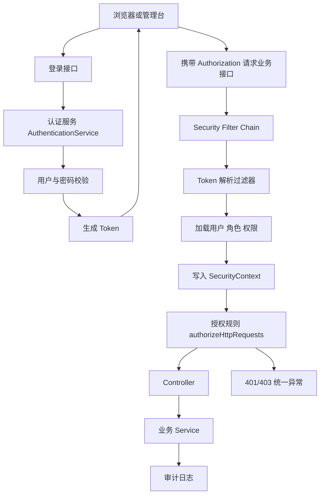
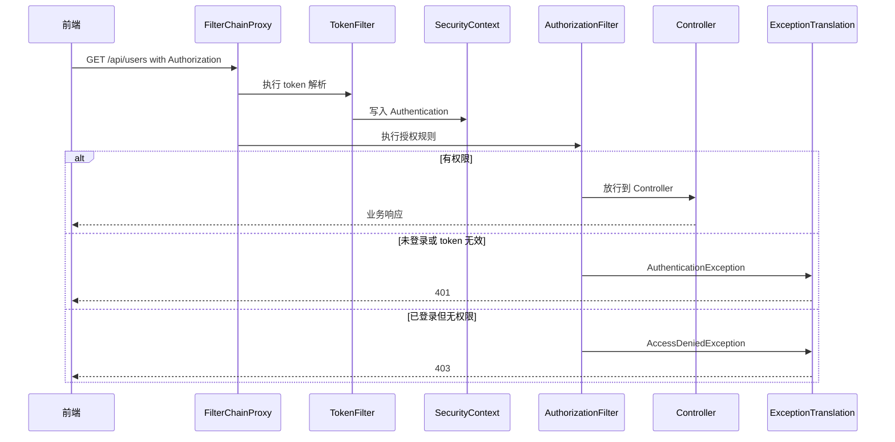
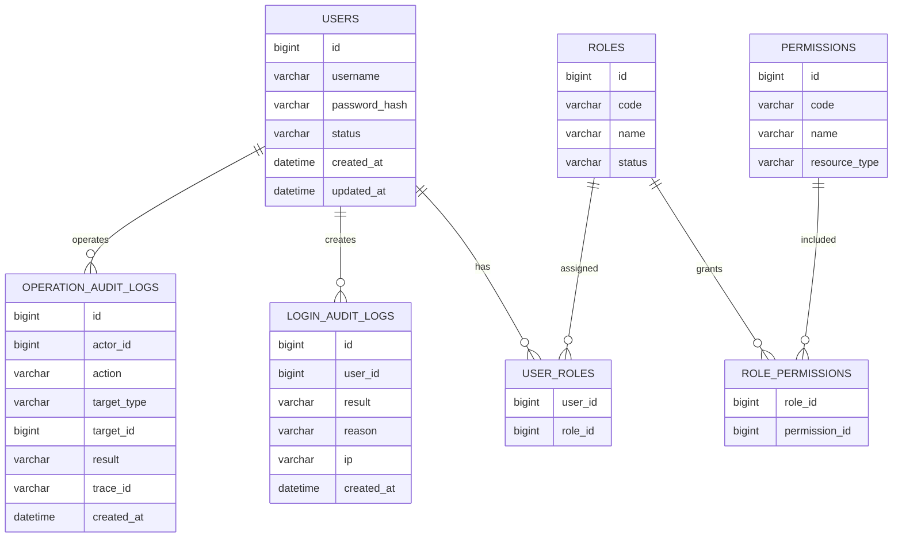
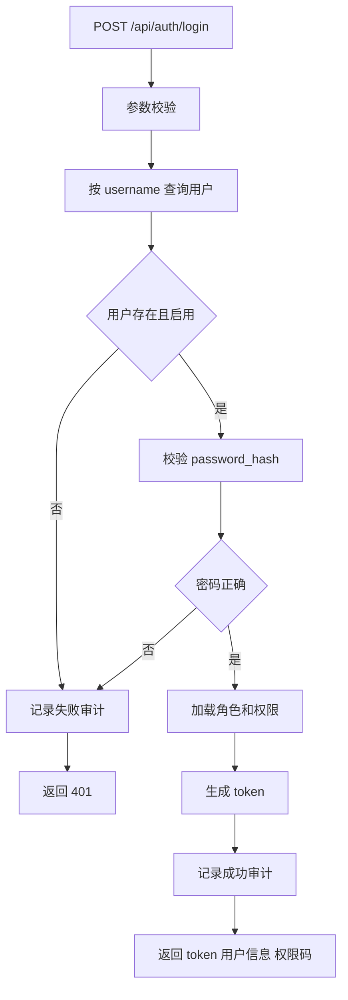
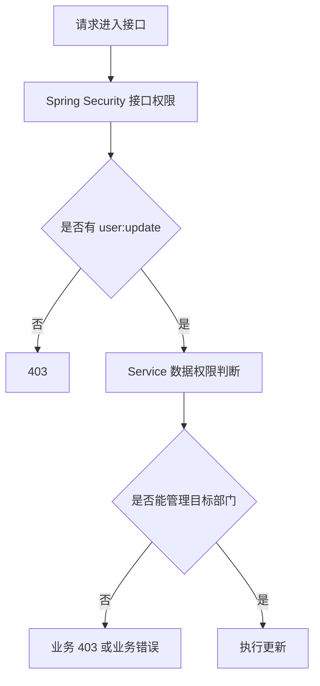

# Spring Security 权限认证项目

## 这个页面解决什么

很多 Java 后端项目从 Spring Boot API 进入真实企业系统时，第一道坎就是权限认证：

- 登录接口能写出来，但不知道 token、用户信息、角色和权限码应该放在哪里。
- `401`、`403`、跨域、CSRF、匿名访问混在一起，前后端联调靠猜。
- 只会在配置里写 `permitAll` 和 `authenticated`，但不知道过滤器链如何执行。
- 角色权限只存在前端菜单里，后端接口没有真正保护。
- 审计日志、数据权限、按钮权限和接口权限边界不清楚。

这篇用一个后台管理系统的“登录 + 用户角色权限 + 接口保护 + 前端联调”场景，把 Spring Security 放到真实项目里讲清楚。读完后，你应该能独立设计一个可联调、可排错、可扩展的认证授权模块。

## 适合谁看

- 已经能写 Spring Boot Controller、Service、Repository 的人。
- 正在做 Vue Admin、React 管理台或企业后台 API 的人。
- 遇到过登录成功但接口仍然 `401`、有 token 但按钮无权限、管理员也 `403` 的人。
- 想理解 Spring Security 过滤器链、认证、授权、异常处理和审计日志的人。

如果你还没有写过完整 Spring Boot API，建议先完成 [Spring Boot 从零到项目落地](/java/spring-boot-project-from-zero)，再回来看这一篇。

## 先区分几个概念

权限系统最容易混乱，是因为很多词被混用。先把概念分清：

| 概念 | 解决的问题 | 项目里的例子 |
| --- | --- | --- |
| Authentication 认证 | 你是谁 | 用户名密码登录、token 解析、用户是否有效 |
| Authorization 授权 | 你能做什么 | 是否能访问 `/api/users`、是否能删除角色 |
| Principal 主体 | 当前登录用户的身份对象 | userId、username、tenantId、status |
| Authority 权限 | 细粒度能力 | `user:list`、`user:create`、`role:assign` |
| Role 角色 | 权限集合 | `ADMIN`、`OPS`、`AUDITOR` |
| SecurityContext | 当前请求中的安全上下文 | 当前用户和认证状态 |
| FilterChain | 请求进入 Controller 前经过的一组过滤器 | token 解析、异常转换、授权检查 |

项目里最推荐的规则是：后端以权限码保护接口，角色只是权限码的集合。前端菜单和按钮可以根据权限码展示，但不能替代后端接口校验。

## 总体架构

一个后台 API 的权限链路可以拆成 8 层：



这张图要注意三点：

1. 登录接口本身通常是匿名可访问的，但登录成功后的业务接口必须经过 token 校验。
2. 认证只说明用户身份可信，授权才决定这个用户能不能访问某个接口。
3. 安全异常最好在 Spring Security 层统一处理，不要让每个 Controller 自己判断登录态。

## Spring Security 请求链路

Spring Security 的 Servlet 支持建立在过滤器链之上。官方文档说明，`SecurityFilterChain` 会由 `FilterChainProxy` 用来判断当前请求应该执行哪些安全过滤器；授权过滤器会根据 `authorizeHttpRequests` 里的规则决定是否放行请求。

你可以把一次请求理解成这样：



排查权限问题时，不要先改 Controller。先确认请求有没有经过过滤器、过滤器有没有写入 `SecurityContext`、授权规则是否匹配到了正确路径。

## 最终项目目标

在现有 `java-admin-api` 的基础上，补出一个权限认证模块：

```text
java-admin-api/
  README.md
  API_CONTRACT.md
  SECURITY_NOTES.md
  TROUBLESHOOTING.md
  src/main/java/com/example/admin/
    common/
      error/
      response/
      trace/
      audit/
    security/
      SecurityConfig.java
      TokenAuthenticationFilter.java
      CurrentUser.java
      CurrentUserProvider.java
      PasswordService.java
      TokenService.java
      SecurityErrorHandler.java
    auth/
      api/
      application/
    user/
    role/
    permission/
    audit/
  src/main/resources/
    db/migration/
```

最终至少完成：

| 能力 | 必须交付 |
| --- | --- |
| 登录 | 用户名密码登录、密码校验、返回 token 和用户信息 |
| 登出 | 前端清理 token；如果服务端维护黑名单，要记录 token 失效 |
| 当前用户 | `/api/me` 返回用户、角色、权限码和菜单所需信息 |
| 接口保护 | 未登录返回 `401`，无权限返回 `403` |
| 权限模型 | 用户、角色、权限码、角色权限、用户角色关系 |
| 密码安全 | 密码哈希存储，不保存明文，不在日志打印密码 |
| 审计日志 | 登录成功、登录失败、权限拒绝、关键操作记录 |
| 联调文档 | 说明 token 格式、请求头、错误码和权限码 |
| 排障文档 | 记录 401、403、跨域、路径匹配和 token 过期处理 |

## 数据模型

后台权限系统至少需要 6 张表：



### 表设计说明

| 表 | 业务含义 | 关键约束 |
| --- | --- | --- |
| `users` | 后台账号主体 | `username` 唯一，`password_hash` 非空，`status` 限定启用/停用 |
| `roles` | 角色定义 | `code` 唯一，角色停用后不应继续授予新用户 |
| `permissions` | 权限码字典 | `code` 唯一，建议按资源和动作命名 |
| `user_roles` | 用户和角色关系 | 联合主键 `user_id + role_id`，避免重复绑定 |
| `role_permissions` | 角色和权限关系 | 联合主键 `role_id + permission_id` |
| `login_audit_logs` | 登录审计 | 记录成功、失败、失败原因、IP 和时间 |
| `operation_audit_logs` | 操作审计 | 记录关键业务操作、traceId、操作者和结果 |

### 权限码命名

权限码要稳定、可读、可搜索：

| 模块 | 权限码 | 含义 |
| --- | --- | --- |
| 用户 | `user:list` | 查看用户列表 |
| 用户 | `user:create` | 新增用户 |
| 用户 | `user:update` | 编辑用户 |
| 用户 | `user:disable` | 停用用户 |
| 角色 | `role:list` | 查看角色列表 |
| 角色 | `role:assign` | 给用户分配角色 |
| 审计 | `audit:read` | 查看审计日志 |

不建议把权限码写成 `admin`、`normal` 这种角色名。角色会变化，权限码应该描述具体能力。

## 安全配置

下面是一个适合前后端分离 API 的配置骨架。它表达的是结构，不是可以直接复制到所有项目的最终代码：

```java
@Configuration
@EnableWebSecurity
public class SecurityConfig {

    @Bean
    SecurityFilterChain apiSecurityFilterChain(
            HttpSecurity http,
            TokenAuthenticationFilter tokenAuthenticationFilter,
            SecurityErrorHandler securityErrorHandler
    ) throws Exception {
        http
            .csrf(csrf -> csrf.disable())
            .cors(Customizer.withDefaults())
            .sessionManagement(session -> session
                .sessionCreationPolicy(SessionCreationPolicy.STATELESS)
            )
            .exceptionHandling(exception -> exception
                .authenticationEntryPoint(securityErrorHandler)
                .accessDeniedHandler(securityErrorHandler)
            )
            .authorizeHttpRequests(auth -> auth
                .requestMatchers("/api/auth/login", "/actuator/health").permitAll()
                .requestMatchers(HttpMethod.GET, "/api/users/**").hasAuthority("user:list")
                .requestMatchers(HttpMethod.POST, "/api/users").hasAuthority("user:create")
                .requestMatchers(HttpMethod.PUT, "/api/users/**").hasAuthority("user:update")
                .requestMatchers(HttpMethod.POST, "/api/users/*/roles").hasAuthority("role:assign")
                .anyRequest().authenticated()
            )
            .addFilterBefore(tokenAuthenticationFilter, UsernamePasswordAuthenticationFilter.class);

        return http.build();
    }
}
```

### 为什么这样配

| 配置 | 作用 | 常见误区 |
| --- | --- | --- |
| `csrf.disable()` | 前后端分离 token API 通常不依赖服务端 session 表单提交 | 如果使用 cookie session，要重新评估 CSRF |
| `STATELESS` | 不在服务端 session 保存登录态 | 不能再依赖 session 获取用户 |
| `exceptionHandling` | 统一输出 401 和 403 | 否则前端可能收到 HTML 错误页 |
| `permitAll` | 放行登录和健康检查 | 不要把业务接口误放行 |
| `hasAuthority` | 用权限码保护接口 | 不要只用角色名判断接口权限 |
| `addFilterBefore` | 在用户名密码过滤器前解析 token | 过滤器位置错误会导致授权时没有用户 |

## 登录流程

登录不是简单返回一个 token。它至少包含校验、状态判断、审计和响应字段设计：



响应建议：

```json
{
  "token": "eyJ...",
  "expiresAt": "2026-07-05T18:00:00+08:00",
  "user": {
    "id": 1,
    "username": "admin",
    "displayName": "系统管理员"
  },
  "roles": ["ADMIN"],
  "permissions": ["user:list", "user:create", "role:assign"]
}
```

注意：不要把 `password_hash`、盐值、内部安全字段、数据库 Entity 原样返回给前端。

## Token 解析过滤器

token 过滤器只做认证，不做复杂业务：

```java
public class TokenAuthenticationFilter extends OncePerRequestFilter {

    private final TokenService tokenService;
    private final CurrentUserProvider currentUserProvider;

    public TokenAuthenticationFilter(TokenService tokenService, CurrentUserProvider currentUserProvider) {
        this.tokenService = tokenService;
        this.currentUserProvider = currentUserProvider;
    }

    @Override
    protected void doFilterInternal(
            HttpServletRequest request,
            HttpServletResponse response,
            FilterChain filterChain
    ) throws ServletException, IOException {
        String token = resolveBearerToken(request);

        if (token != null && SecurityContextHolder.getContext().getAuthentication() == null) {
            Long userId = tokenService.verifyAndGetUserId(token);
            CurrentUser currentUser = currentUserProvider.loadById(userId);

            UsernamePasswordAuthenticationToken authentication =
                new UsernamePasswordAuthenticationToken(
                    currentUser,
                    null,
                    currentUser.authorities()
                );

            SecurityContextHolder.getContext().setAuthentication(authentication);
        }

        filterChain.doFilter(request, response);
    }

    private String resolveBearerToken(HttpServletRequest request) {
        String authorization = request.getHeader("Authorization");
        if (authorization == null || !authorization.startsWith("Bearer ")) {
            return null;
        }
        return authorization.substring(7);
    }
}
```

### 过滤器边界

| 应该做 | 不应该做 |
| --- | --- |
| 读取 `Authorization` 请求头 | 处理 Controller 的业务参数 |
| 校验 token 是否可信 | 写用户、角色、菜单业务 |
| 加载当前用户权限 | 返回具体业务响应 |
| 写入 `SecurityContext` | 吞掉所有异常导致请求继续执行 |

如果 token 过期或签名错误，要返回明确的 `401`，不要让请求继续走到 Controller。

## 当前用户模型

建议创建一个独立的 `CurrentUser`，不要把数据库 `UserEntity` 直接放进 `SecurityContext`：

```java
public record CurrentUser(
    Long id,
    String username,
    String status,
    Set<String> roles,
    Set<String> permissions
) {
    public Collection<GrantedAuthority> authorities() {
        return permissions.stream()
            .map(SimpleGrantedAuthority::new)
            .toList();
    }
}
```

这样做有几个好处：

- 安全上下文只保存授权需要的信息。
- 不会把数据库懒加载对象带入 Web 层。
- 权限码和角色结构清楚。
- 单元测试更容易构造当前用户。

## 接口权限设计

推荐按“资源 + 动作”保护接口：

| 接口 | 权限码 | 说明 |
| --- | --- | --- |
| `GET /api/users` | `user:list` | 查看用户列表 |
| `POST /api/users` | `user:create` | 新增用户 |
| `PUT /api/users/{id}` | `user:update` | 编辑用户 |
| `PATCH /api/users/{id}/status` | `user:disable` 或 `user:update` | 启停用户 |
| `POST /api/users/{id}/roles` | `role:assign` | 绑定角色 |
| `GET /api/audit/logs` | `audit:read` | 查看审计日志 |

如果一个接口需要更细的业务判断，例如“只能编辑自己部门的用户”，不要只靠 `hasAuthority`。可以在 Service 层继续做数据权限判断。



## 401 和 403 的区别

前后端联调时必须把这两个状态码分清：

| 状态 | 含义 | 前端动作 | 后端常见原因 |
| --- | --- | --- | --- |
| `401 Unauthorized` | 没有可信身份 | 跳登录或刷新 token | 未带 token、token 过期、签名错误、用户停用 |
| `403 Forbidden` | 已登录但没有权限 | 展示无权限页或隐藏按钮 | 缺少权限码、角色未绑定、数据权限不允许 |

错误响应建议保持统一：

```json
{
  "code": "AUTH_REQUIRED",
  "message": "登录状态已失效，请重新登录",
  "traceId": "9d38a1f2c1a4",
  "path": "/api/users"
}
```

常见错误码：

| code | HTTP | 触发场景 |
| --- | ---: | --- |
| `AUTH_REQUIRED` | 401 | 未登录、token 缺失 |
| `TOKEN_EXPIRED` | 401 | token 过期 |
| `TOKEN_INVALID` | 401 | token 签名错误或格式错误 |
| `USER_DISABLED` | 401 | 用户被停用 |
| `ACCESS_DENIED` | 403 | 缺少接口权限 |
| `DATA_SCOPE_DENIED` | 403 | 数据权限不允许 |

## 前端联调约定

后端权限模块必须给前端明确约定，不要只口头说“带 token 就行”。

### 请求头

```text
Authorization: Bearer <token>
X-Trace-Id: <可选，前端生成或后端生成>
```

### 前端需要缓存的信息

| 信息 | 用途 | 注意 |
| --- | --- | --- |
| token | 调用后端接口 | 过期后清理并跳登录 |
| user | 展示当前用户 | 不作为安全依据 |
| permissions | 控制菜单和按钮显示 | 只做体验优化，不替代后端校验 |
| expiresAt | 提前提示登录过期 | 以后端真实校验为准 |

### 联调检查

| 场景 | 预期 |
| --- | --- |
| 不带 token 调业务接口 | `401 AUTH_REQUIRED` |
| 带过期 token | `401 TOKEN_EXPIRED` |
| 普通用户访问管理员接口 | `403 ACCESS_DENIED` |
| 停用用户继续访问 | `401 USER_DISABLED` |
| 有权限用户访问列表 | `200` 并返回数据 |
| 前端隐藏按钮后手动调接口 | 后端仍然必须校验权限 |

## 审计日志

权限系统必须能回答“谁在什么时候做了什么”。至少记录两类日志：

| 日志 | 记录时机 | 关键字段 |
| --- | --- | --- |
| 登录审计 | 登录成功、登录失败、登出、token 失效 | userId、username、result、reason、ip、userAgent、traceId |
| 操作审计 | 新增用户、绑定角色、停用账号、修改权限 | actorId、action、targetType、targetId、before、after、result、traceId |

操作审计不要只记录“修改成功”。权限相关操作要尽量记录变更前后的角色和权限差异，方便事故复盘。

## 常见问题

### 登录成功后业务接口仍然 401

排查顺序：

1. Network 里是否真的带了 `Authorization: Bearer ...`。
2. token 前缀是否大小写和空格正确。
3. token 是否过期、签名密钥是否和服务端一致。
4. `TokenAuthenticationFilter` 是否被加入正确的过滤器链。
5. 过滤器是否写入了 `SecurityContext`。
6. 用户是否被停用或删除。

### 有权限但接口返回 403

排查顺序：

1. 当前用户实际加载了哪些权限码。
2. 接口配置需要的权限码是什么。
3. 权限码是否存在大小写、冒号、前缀差异。
4. 角色权限关系是否更新后仍被缓存。
5. 是否还有 Service 层的数据权限判断。

### `permitAll` 以后接口还是要登录

排查顺序：

1. 路径是否完全匹配，包括 `/api` 前缀。
2. 是否存在多个 `SecurityFilterChain`，当前请求匹配到了另一条链。
3. 规则顺序是否被更早的 matcher 捕获。
4. 是否是 `ERROR` 或 `FORWARD` dispatch 又触发了一次授权。

### 前端显示按钮但点击后 403

这通常说明前端权限和后端权限不同步：

- 登录响应里的权限码缺少最新值。
- 前端缓存了旧权限。
- 后端接口要求的权限码和前端按钮判断不同。
- 角色权限变更后没有通知用户重新登录或刷新权限。

解决方式不是把后端放宽，而是统一权限码字典，并在联调文档里维护按钮、菜单、接口三者关系。

## 测试清单

| 测试类型 | 要覆盖什么 |
| --- | --- |
| 登录 Service 测试 | 用户不存在、密码错误、用户停用、登录成功 |
| Token 测试 | 正常 token、过期 token、签名错误、格式错误 |
| Controller 测试 | 未登录 401、无权限 403、有权限 200 |
| 权限关系测试 | 角色绑定、权限变更、重复绑定、角色停用 |
| 审计测试 | 登录失败和关键操作是否写日志 |
| 联调测试 | 前端带 token、刷新 token、跳登录、无权限页 |

示例验收：

```text
不带 token 调 GET /api/users -> 401 AUTH_REQUIRED
用普通用户 token 调 POST /api/users -> 403 ACCESS_DENIED
用管理员 token 调 POST /api/users -> 200 或 201
停用管理员后继续调接口 -> 401 USER_DISABLED
修改角色权限后重新登录 -> permissions 返回新权限码
```

## 交付文档模板

在项目里新增 `SECURITY_NOTES.md`，至少写清：

```md
# 权限认证说明

## 登录接口

## Token 格式和过期策略

## 请求头约定

## 用户状态说明

## 角色和权限码字典

## 菜单、按钮、接口权限关系

## 401 / 403 错误码

## 审计日志字段

## 联调样例

## 常见问题
```

权限模块如果没有文档，后续每次新增菜单、按钮和接口都会返工。

## 学习顺序

建议按下面顺序学习和实现：

1. 读 [图解 Java 核心概念](/java/visual-guide)，理解 Spring 请求链路。
2. 完成 [Spring Boot 从零到项目落地](/java/spring-boot-project-from-zero)，先做出用户角色 API。
3. 用本页补登录、token、权限码、接口保护和审计日志。
4. 回到 [前后端联调排查](/projects/integration-debugging)，保存成功和失败样例。
5. 用 [Vue Admin 权限路由闭环实战](/vue/admin-permission-route-flow) 验证前端菜单、按钮和接口权限是否一致。

## 参考资料

- [Spring Security Servlet Architecture](https://docs.spring.io/spring-security/reference/servlet/architecture.html)
- [Spring Security Authorize HttpServletRequests](https://docs.spring.io/spring-security/reference/servlet/authorization/authorize-http-requests.html)
