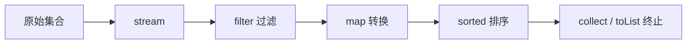

# Stream、Lambda 与数据处理

## 这个页面解决什么

Java 8 之后，业务代码里大量出现 Lambda、Stream、方法引用。它们能让数据转换更清晰，但滥用后也会变得难调试、难读、性能不可控。

## Lambda 是什么

Lambda 是把函数作为值传递：

```java
List<String> names = users.stream()
    .map(user -> user.name())
    .toList();
```

`user -> user.name()` 表示“输入 user，返回 name”。

方法引用可以进一步简化：

```java
List<String> names = users.stream()
    .map(User::name)
    .toList();
```

## Stream 流程



中间操作是惰性的，只有遇到终止操作才真正执行。

## 常用操作

```java
List<OrderView> views = orders.stream()
    .filter(order -> order.status() == OrderStatus.PAID)
    .map(order -> new OrderView(order.id(), order.amount()))
    .toList();
```

分组：

```java
Map<Long, List<Order>> ordersByUser = orders.stream()
    .collect(Collectors.groupingBy(Order::userId));
```

求和：

```java
BigDecimal total = orders.stream()
    .map(Order::amount)
    .reduce(BigDecimal.ZERO, BigDecimal::add);
```

## 什么时候不用 Stream

以下情况普通循环更清晰：

- 逻辑包含多步状态修改。
- 需要复杂异常处理。
- 需要提前返回多个分支。
- 数据量很大且性能敏感。
- 代码读起来像谜语。

```java
for (Order order : orders) {
    if (!order.isPaid()) {
        continue;
    }
    // 多步业务处理
}
```

## parallelStream 谨慎使用

`parallelStream` 使用公共线程池，不适合直接用于 Web 请求里的复杂业务。它可能和其他任务抢线程，还可能让数据库、外部接口瞬间被打爆。

如果确实要并行，优先明确线程池、限流和超时策略。

## 实际项目问题

### 1. Stream 里直接查数据库

问题：

```java
orders.stream()
    .map(order -> userRepository.findById(order.userId()))
    .toList();
```

这会产生 N 次查询。

解决：

- 先收集 userId。
- 一次批量查询用户。
- 转成 Map。
- 再组装结果。

### 2. 复杂链式调用不可读

超过 5 到 6 个连续操作时，考虑拆变量或提取方法。

### 3. Optional 链隐藏业务错误

不要用 `orElse(null)` 把 Optional 又变回 null。业务必需数据不存在时，应该抛业务异常或返回明确错误。

## 最佳实践

- Stream 适合纯数据转换。
- 复杂业务流程用普通循环。
- 不在 Stream 中做数据库和外部 HTTP 调用。
- 分组、去重、映射前先明确重复 key 策略。
- `parallelStream` 要经过压测和资源评估。

## 下一步学习

继续学习 [并发、线程池与虚拟线程](/java/concurrency-virtual-threads)。
