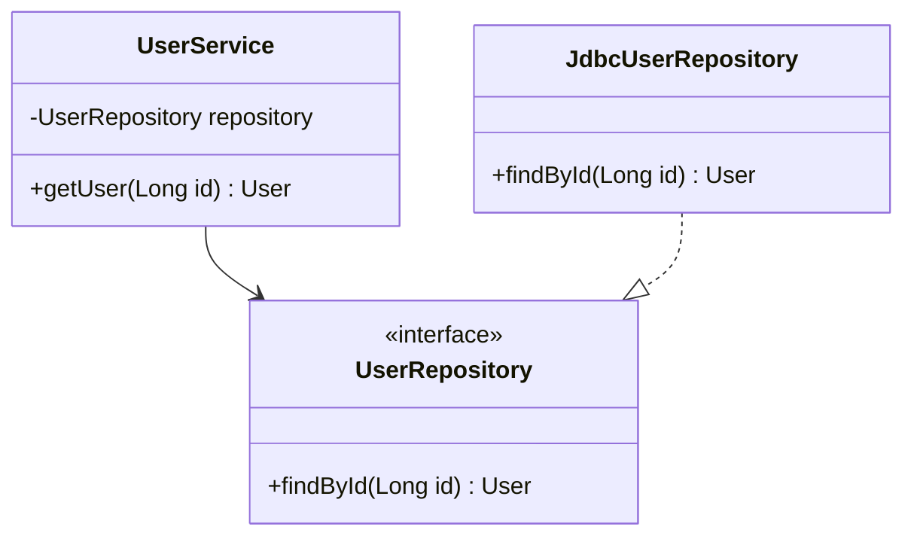

# 语法与面向对象

## 这个页面解决什么

Java 是静态类型语言。变量、方法参数、返回值和类成员都有明确类型。学习 Java 语法时，重点不是背关键字，而是理解类型如何约束代码结构。

## 一个类是什么

```java
public class User {
    private Long id;
    private String name;

    public User(Long id, String name) {
        this.id = id;
        this.name = name;
    }

    public String displayName() {
        return name == null ? "未命名用户" : name;
    }
}
```

类通常包含：

- 字段：对象保存的数据。
- 构造器：创建对象时初始化字段。
- 方法：对象能执行的行为。
- 访问修饰符：控制外部能不能访问。

## 访问修饰符

| 修饰符 | 可见范围 | 常见用途 |
| --- | --- | --- |
| `public` | 所有地方 | API、Controller、Service 方法 |
| `protected` | 同包和子类 | 框架扩展点较常见 |
| 默认 | 同包 | 包内协作 |
| `private` | 当前类 | 字段、内部辅助方法 |

实际项目里字段通常设为 `private`，通过构造器或方法控制修改，避免任何地方都能随意改状态。

## 接口和实现

```java
public interface UserRepository {
    User findById(Long id);
}

public class JdbcUserRepository implements UserRepository {
    @Override
    public User findById(Long id) {
        // 查询数据库
        return null;
    }
}
```

接口表达“能力契约”，实现表达“具体做法”。这样 Service 可以依赖接口，而不是依赖某个数据库实现。



## record

`record` 适合表达不可变数据载体：

```java
public record UserProfile(Long id, String name, String email) {
}
```

它会自动生成构造器、访问方法、`equals`、`hashCode`、`toString`。适合 DTO、查询结果、事件消息。

不要把大量业务行为塞进 record。业务行为应优先放在领域对象或服务里。

## sealed class

`sealed` 用来限制继承层级：

```java
public sealed interface PaymentResult
        permits PaymentSuccess, PaymentFailed {
}

public record PaymentSuccess(String orderNo) implements PaymentResult {
}

public record PaymentFailed(String reason) implements PaymentResult {
}
```

它适合表达“结果只能是这几种”的业务模型，例如支付结果、审批状态、导入结果。

## 面向对象不是到处继承

项目里更常用的是组合：

```java
public class OrderService {
    private final OrderRepository orderRepository;
    private final PaymentClient paymentClient;
}
```

组合比继承更容易测试、替换和维护。继承适合明确的“is-a”关系，不适合为了复用几行代码而强行抽父类。

## 实际项目问题

### 1. 字段全部 public，状态被随意修改

问题：

```java
user.status = "admin";
```

任何地方都能改，权限、日志、校验都绕开了。

解决：

- 字段设为 `private`。
- 通过方法表达业务动作。
- 在方法里做校验和日志。

### 2. DTO 和 Entity 混用

Entity 面向数据库，DTO 面向接口。直接把 Entity 返回给前端会暴露不该暴露的字段，还容易因为数据库结构变化影响接口。

建议：

```text
Controller DTO
↓
Service Command / Query
↓
Domain / Entity
↓
Repository
```

### 3. 过度抽象

只有一个实现时，不一定马上抽接口。接口应该服务于替换、测试、隔离边界，而不是为了看起来“更面向对象”。

## 最佳实践

- 用清晰方法名表达业务动作。
- 构造器保证对象创建后处于有效状态。
- DTO、Command、Entity 分清职责。
- 优先组合，谨慎继承。
- `record` 用于简单不可变数据。
- `sealed` 用于有限状态或有限结果。

## 下一步学习

继续学习 [集合、泛型与常用类库](/java/collections-generics)。
