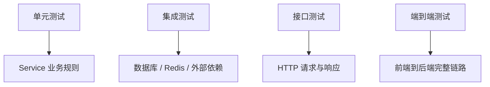

# 测试、打包与部署

## 这个页面解决什么

Java 项目不是本地能启动就算完成。需要测试验证行为、构建生成产物、配置运行环境、部署后监控健康状态。

## 测试分层



| 类型 | 关注点 |
| --- | --- |
| 单元测试 | 业务规则、边界条件 |
| 集成测试 | 数据库、事务、配置 |
| 接口测试 | 参数校验、状态码、响应结构 |
| 契约测试 | 前后端或服务间接口约定 |

## JUnit 示例

```java
class PriceServiceTest {
    @Test
    void shouldCalculateDiscountPrice() {
        PriceService service = new PriceService();

        BigDecimal price = service.discount(new BigDecimal("100"), 0.8);

        assertEquals(new BigDecimal("80.0"), price);
    }
}
```

测试名称应该表达行为，而不是叫 `test1`。

## Spring Boot 接口测试

```java
@SpringBootTest
@AutoConfigureMockMvc
class UserApiTest {
    @Autowired
    MockMvc mockMvc;

    @Test
    void shouldReturnUser() throws Exception {
        mockMvc.perform(get("/api/users/1"))
            .andExpect(status().isOk())
            .andExpect(jsonPath("$.id").value(1));
    }
}
```

## 打包

Maven：

```bash
mvn clean package
java -jar target/app.jar
```

Gradle：

```bash
./gradlew clean build
java -jar build/libs/app.jar
```

## 部署链路


## 健康检查

生产服务至少需要：

- 启动状态。
- 数据库连接状态。
- Redis 或消息队列状态。
- 版本号。
- 构建时间。
- Git commit。

## 实际项目问题

### 1. 测试依赖真实数据库

测试数据互相污染，CI 不稳定。建议：

- 使用测试容器或独立测试库。
- 每个测试准备自己的数据。
- 测试后清理数据。

### 2. 打包成功但启动失败

常见原因：

- 环境变量缺失。
- 配置文件没有打进去。
- Java 版本不一致。
- 数据库迁移未执行。

### 3. 上线后无法确认版本

接口没有版本信息，日志也没有 commit。排查时不知道当前运行的是哪次构建。

解决：

- `/actuator/info` 或自定义版本接口。
- 日志启动时打印版本。
- 镜像标签包含 commit。

## 最佳实践

- CI 至少运行单元测试、文档检查和构建。
- 测试数据要可重复。
- 配置通过环境变量或配置中心注入。
- 生产运行参数要文档化。
- 部署前检查数据库迁移。
- 部署后检查健康、日志、指标和错误率。

## 下一步学习

继续学习 [常见问题](/java/troubleshooting)。
