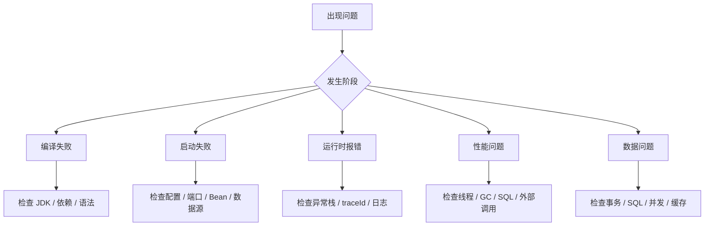

# Java 常见问题

## 这个页面解决什么

这里整理 Java 和 Spring Boot 项目里高频真实问题。排查时先看现象，再定位层次，不要一上来就改代码。

## 快速定位图



## 启动失败

### 现象

- `APPLICATION FAILED TO START`
- Bean 创建失败。
- 端口占用。
- 数据源连接失败。

### 排查

1. 看最下面的 `Caused by`。
2. 确认端口是否被占用。
3. 确认环境变量是否存在。
4. 确认数据库地址、账号、密码。
5. 确认依赖版本是否冲突。

## 依赖冲突

### 现象

- `NoSuchMethodError`
- `ClassNotFoundException`
- `NoClassDefFoundError`

### 排查

```bash
mvn dependency:tree
```

处理方式：

- 统一依赖版本。
- 排除传递依赖。
- 使用 BOM 管理版本。
- 不要混用不兼容的 Spring Boot 和 Spring Cloud 版本。

## 事务不回滚

### 常见原因

- 异常被 catch 掉。
- 同类内部方法调用。
- 方法不是 public。
- 事务注解放错层。
- 只读事务里写数据。

### 建议

事务放在 Service 层，业务失败时抛出明确异常，不要吞掉异常。

## 接口很慢

### 排查顺序

1. 看接口总耗时。
2. 看数据库 SQL 耗时。
3. 看外部接口耗时。
4. 看 Redis 命中率。
5. 看 GC 和线程池。
6. 看是否 N+1 查询。

## 内存升高

### 可能原因

- 大查询。
- 大文件一次性读入内存。
- 本地缓存无限增长。
- ThreadLocal 未清理。
- 日志对象或上下文长期持有引用。

### 处理

- 导出 heap dump。
- 分析对象引用链。
- 检查缓存容量。
- 检查批处理和导出逻辑。

## 线程池耗尽

### 现象

- CPU 不高但接口超时。
- 大量请求排队。
- 线程 dump 中卡在 HTTP、SQL 或锁等待。

### 处理

- 外部调用加超时。
- 线程池加队列上限。
- 下游调用限流。
- 数据库连接池容量匹配。

## 线上问题处理顺序

```text
保留现场
↓
确认影响范围
↓
止血或回滚
↓
收集日志、指标、dump
↓
定位根因
↓
修复和补测试
↓
复盘和文档更新
```

## 最佳实践

- 错误响应返回 traceId。
- 每个外部依赖都要有超时和降级策略。
- 核心接口保留慢日志。
- 上线前确认迁移、配置、版本和回滚方案。
- 事故后把问题补进项目问题库。

## 下一步学习

需要快速查命令时进入 [Java 速查](/cheatsheets/java)；需要系统处理 classpath、事务代理、JPA、连接池、线程和 GC 故障时进入 [Java 真实项目问题库](/projects/issues-java)，并用 [Java 专项练习](/roadmap/java-practice) 完成故障注入和回归。
