# 图解 Java 核心概念

## 这个页面解决什么

Java 初学者常见的问题不是某个关键字不会写，而是脑中没有一张完整地图：源码为什么能跨平台、对象到底放在哪里、Spring 为什么会创建代理、事务何时提交、JPA 为什么多查几十条 SQL、服务为什么“活着却不能接流量”。

本页用 29 张图把语法、集合、Stream、JVM、并发、Spring、数据库、测试和部署连成一条链。阅读时按三步进行：

1. 先只看节点名称，用自己的话解释箭头。
2. 再读“怎么理解”，确认每个组件的职责。
3. 最后完成“项目检查”，把图落实到代码或命令。

## 1. 源码如何变成运行中的程序

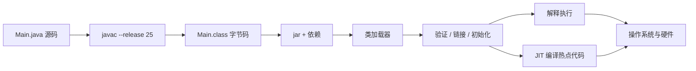

### 怎么理解

- `javac` 把源码编译为 JVM 指令，不直接生成某一种 CPU 的机器码。
- JVM 先加载和验证类，再解释执行；热点路径可能被 JIT 编译为本机机器码。
- “一次编译，到处运行”依赖目标机器有兼容 JVM，并不代表 native library、文件路径和系统配置也自动跨平台。
- `--release 25` 同时约束字节码版本和可使用的标准库 API，比只设置 source/target 更完整。

### 项目检查

```bash
javac --release 25 Main.java
javap -c -p Main.class
jar tf target/app.jar | head
java -version
```

## 2. 最新版、LTS 和项目基线是什么关系

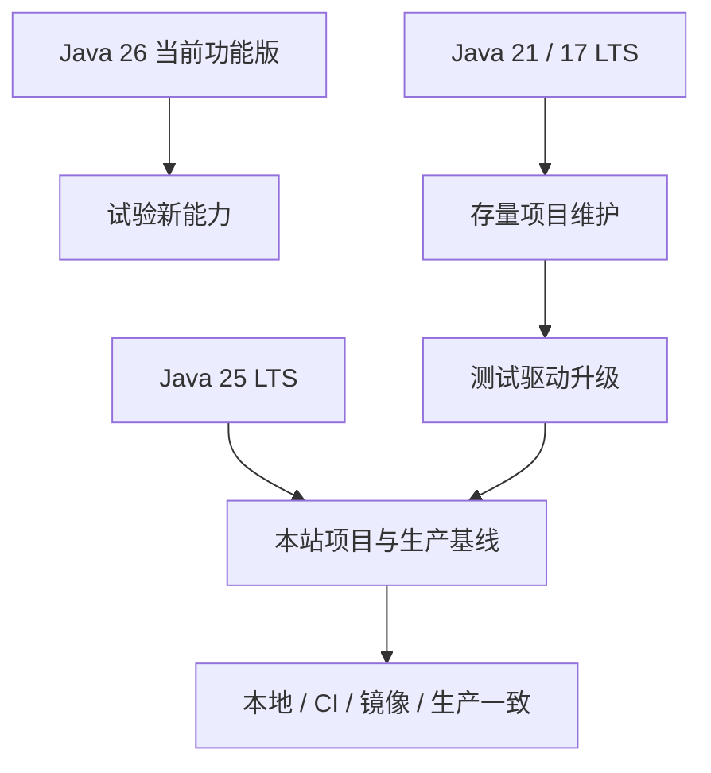

### 怎么理解

最新版回答“现在发布到了哪里”，LTS 回答“哪个版本适合长期维护”。项目必须再做一次更具体的决定：编译、测试和运行分别使用哪个版本。

如果本地用 25 编译，服务器却用 21 运行，可能出现 `UnsupportedClassVersionError`。如果编译目标是 21，却调用了只在 25 存在的 API，编译阶段就应该失败。

### 项目检查

- Maven `java.version`、CI 镜像、Docker build stage 和 runtime stage 使用同一主版本。
- README 明确版本，不用“安装较新 JDK”这种模糊描述。
- 升级前先跑依赖树、单元测试、集成测试和启动 smoke test。

## 3. 栈、堆、引用和对象

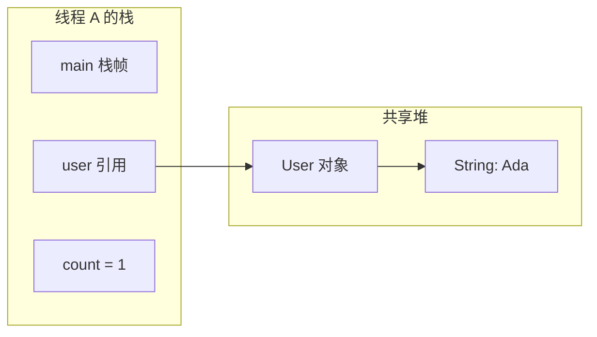

### 怎么理解

- 每个线程有自己的调用栈；每次方法调用创建栈帧，保存局部变量和返回位置。
- 对象通常在堆上；局部变量 `user` 保存的是引用，不是完整对象。
- `user = null` 只是清除一个引用。只有对象不再从 GC Roots 可达时，才具备回收条件。
- 多个线程可以引用同一个堆对象，所以可变对象会带来并发问题。

### 易错示例

```java
User a = new User("Ada");
User b = a;
b.rename("Grace");
// a 和 b 指向同一个对象，a.name() 也是 Grace
```

## 4. 类加载器如何找到一个类

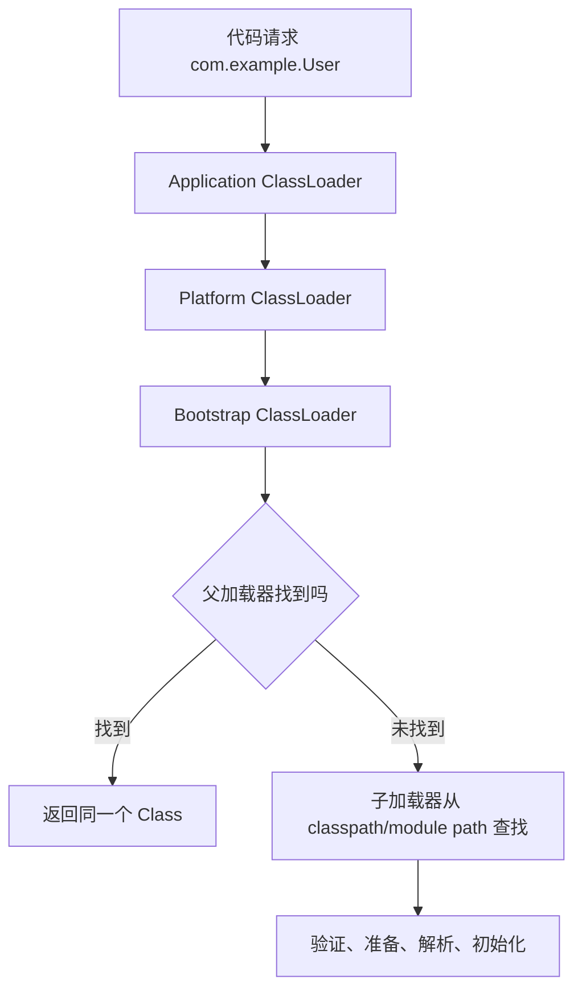

### 怎么理解

类的身份不只由全限定名决定，还包含加载它的 ClassLoader。同名类由两个不同加载器加载，JVM 会把它们视为不同类型。

启动时的 `ClassNotFoundException` 表示主动加载时找不到类；`NoClassDefFoundError` 常表示编译时存在、运行时缺失，或类初始化曾失败；`NoSuchMethodError` 常表示运行时加载了与编译时不兼容的版本。

### 项目检查

```bash
mvn dependency:tree
jar tf target/app.jar | rg 'SomeClass'
java -Xlog:class+load=info -jar target/app.jar
```

## 5. GC 为什么看“可达性”而不是引用计数

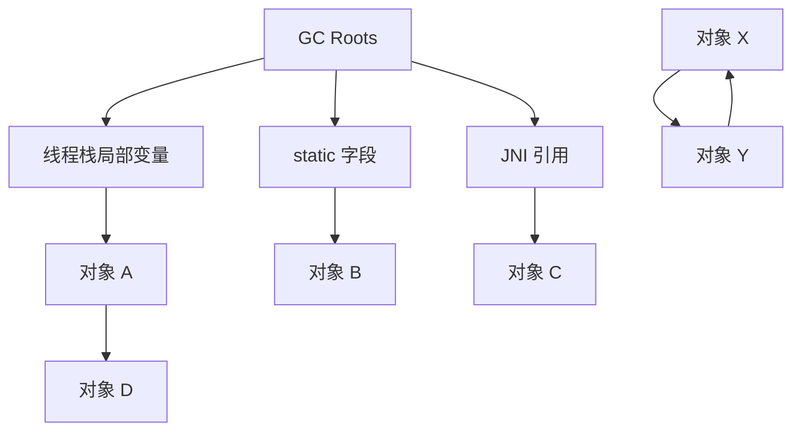

### 怎么理解

A、B、C、D 从 GC Roots 可达，不能回收。X 和 Y 即使互相引用，只要整组对象都不可达，就可以回收。

“发生 OOM”不一定等于“GC 没工作”。可能是：

- 仍被缓存、监听器、ThreadLocal 或静态集合持有。
- 分配速度超过回收速度。
- 堆外 Buffer、线程栈或 native memory 增长，heap dump 看起来却正常。

## 6. Java 参数传递为什么永远是值传递

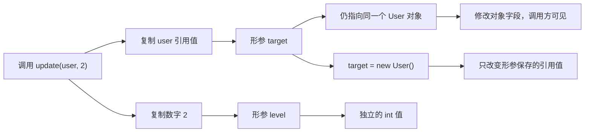

### 怎么理解

Java 只有值传递。基本类型复制具体数值；引用类型复制“指向对象的地址值”。因此方法可以通过复制后的引用修改同一个对象，却不能靠给形参重新赋值来替换调用方变量。

```java
void rename(User target) {
    target.rename("Grace"); // 修改同一个对象，调用方可见
    target = new User("Lin"); // 只改变局部形参
}
```

还要区分字段和局部变量：实例字段有默认值，局部变量必须先明确赋值才能读取。看到 `null` 时，先问“哪个引用没有指向对象”，不要把 `null` 当成一种对象。

### 项目检查

- DTO、Entity 和缓存对象是否在多个位置共享并被原地修改。
- 方法名是否能说明会修改传入对象，例如 `updateStatus`，而不是含糊的 `handle`。
- 可变参数传入异步任务前是否需要复制，避免调用方继续修改。

## 7. List、Set 和 Map 应该怎么选

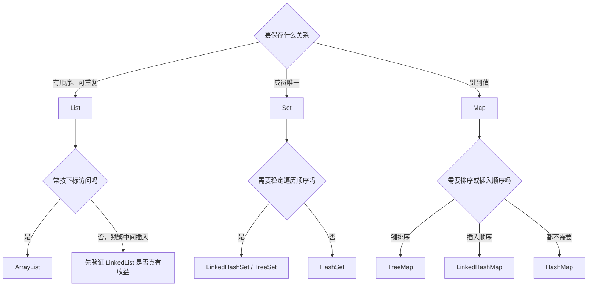

### 怎么理解

集合选型先看业务语义，再看复杂度。`List` 表示有位置的序列，`Set` 表示不重复成员，`Map` 表示键值索引。不要只因为“查找快”就把所有数据放进 `Map`，也不要期待普通 `HashMap`、`HashSet` 提供稳定遍历顺序。

常见项目问题：

- 放入 `HashSet` 或作为 `HashMap` 键的对象修改了参与 `equals/hashCode` 的字段，之后再也查不到。
- JPA Entity 的主键在持久化前后变化，直接用于集合相等性导致成员丢失或重复。
- 多线程同时修改 `ArrayList` 或 `HashMap`，即使偶尔没有异常，也不代表结果正确。

### 项目检查

- 接口返回顺序是否由查询 `ORDER BY` 和集合类型共同保证。
- 去重规则是否与 `equals/hashCode` 一致。
- 共享可变集合是否有清晰的线程所有权或同步策略。

## 8. Stream 为什么是惰性流水线

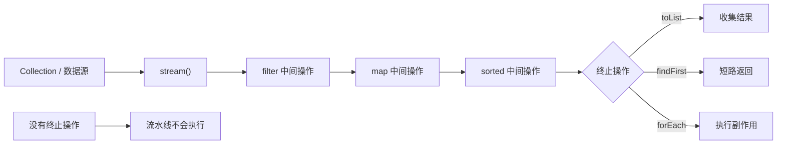

### 怎么理解

`filter`、`map` 等中间操作只描述流水线，遇到 `toList`、`findFirst`、`reduce` 等终止操作才开始拉取元素。多个中间操作通常会融合为一次遍历，而不是每一步都创建完整集合。

```java
List<String> activeEmails = users.stream()
    .filter(User::isActive)
    .map(User::email)
    .map(String::toLowerCase)
    .toList();
```

Stream 适合“从输入转换到输出”的数据处理。不要在 `map` 中修改数据库、累加共享变量或依赖执行顺序；`parallelStream()` 也不是免费加速，它会使用共享线程池，并受任务粒度、阻塞 I/O、顺序要求和线程安全限制。

### 项目检查

- 流水线是否有明确终止操作，是否能用方法名读懂每一步。
- 是否在 Stream 中产生难以回滚的副作用。
- 大数据量是否应该在 SQL 中筛选和分页，而不是全部加载后再 Stream。

## 9. 泛型为什么运行时看不到完整类型参数

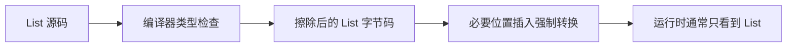

### 怎么理解

Java 泛型主要在编译期提供类型安全，很多类型参数在字节码中被擦除。因此不能直接 `new T()`，也不能用 `value instanceof List<String>` 判断元素类型。

框架反序列化嵌套泛型时需要保留额外类型信息，例如 Jackson 的参数化类型描述。不要用裸类型 `List` 绕过编译器，否则问题会延迟到运行时。

## 10. 异常如何传播并保留根因

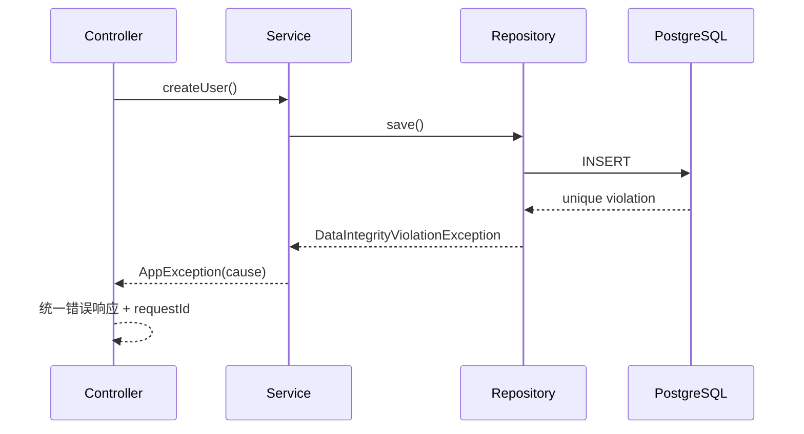

### 怎么理解

异常应该在“有能力增加业务语义”的边界转换，而不是每层 catch 后重新写一条失去 cause 的异常。最终用户看到稳定错误码，日志保留异常链和 request id。

```java
throw new AppException(
    "USER_EMAIL_EXISTS",
    "邮箱已存在",
    exception
);
```

不要把 SQL、堆栈或密钥直接返回给客户端。

## 11. happens-before 如何保证可见性

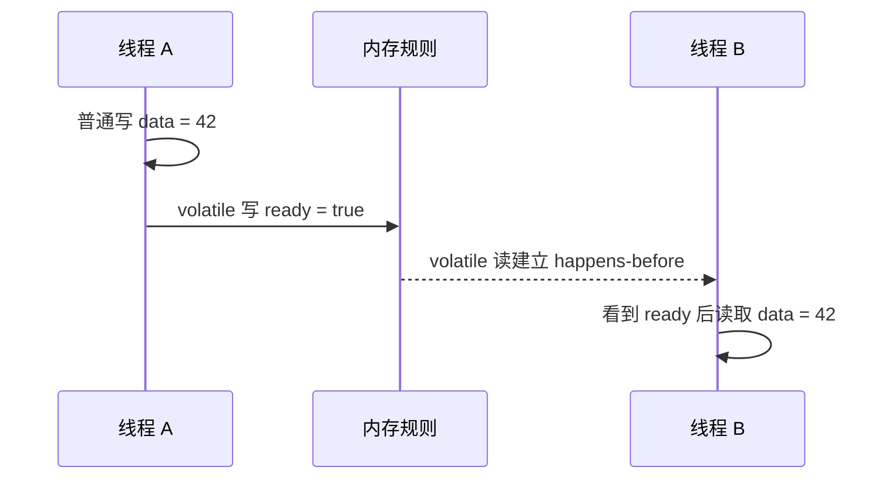

### 怎么理解

并发正确性至少包含三件事：

- 原子性：操作不会被中途交错。
- 可见性：一个线程的写何时能被另一个线程看到。
- 有序性：编译器和 CPU 重排不能破坏约定。

`volatile` 能建立特定可见性和顺序关系，但不能让 `count++` 变成原子操作。复合更新要使用锁、原子类或更高层并发结构。

## 12. 平台线程、线程池和虚拟线程

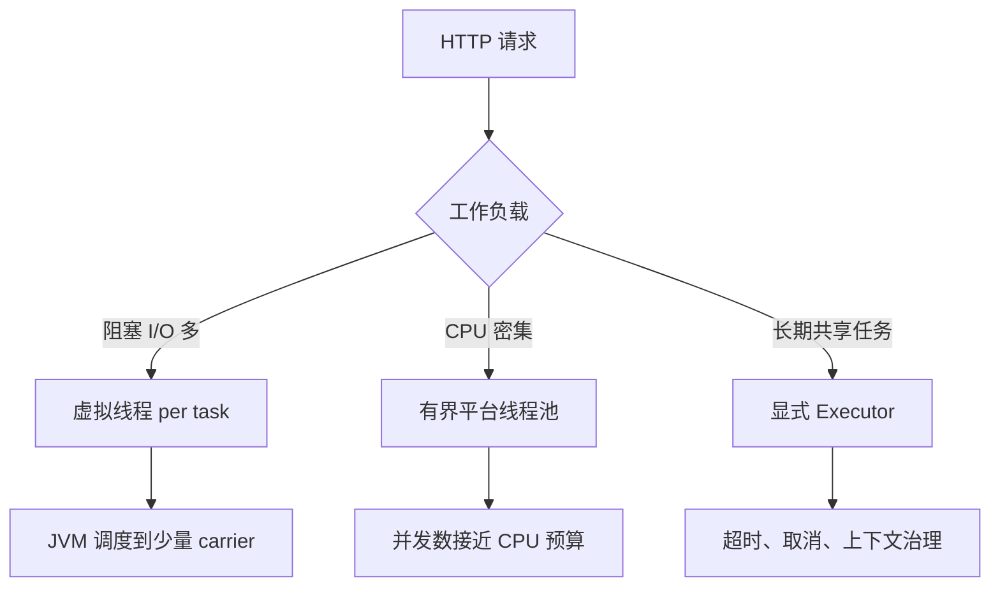

### 怎么理解

虚拟线程降低“等待期间占用平台线程”的成本，适合大量阻塞式 I/O。它不会：

- 让 CPU 计算变快。
- 自动扩大数据库连接池。
- 修复无限并发、锁竞争或下游限流。
- 让可变 ThreadLocal 上下文自动安全。

并发预算仍受数据库连接、下游 QPS、内存和 CPU 限制。

## 13. Spring Boot 启动时发生了什么

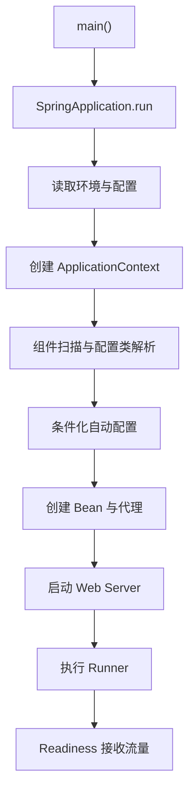

### 怎么理解

`@SpringBootApplication` 组合了配置、自动配置和组件扫描。自动配置不是“魔法创建一切”，而是依据 classpath、配置、现有 Bean 和运行环境做条件判断。

启动失败先找异常链最底部第一条具体原因，再查看 condition evaluation report。不要看到最外层 `ApplicationContextException` 就开始随机删依赖。

## 14. Bean 依赖图为什么应该保持单向

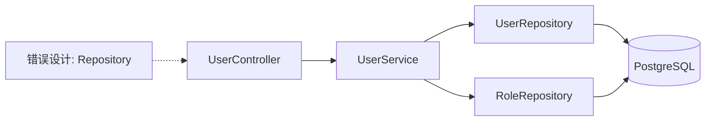

### 怎么理解

构造器注入让依赖关系在类型上可见，也便于测试。Controller 只处理 HTTP；Service 组织业务和事务；Repository 负责持久化。

如果 A 依赖 B、B 又依赖 A，通常说明职责边界混乱。不要用 field injection 或允许循环依赖来隐藏问题，应提取共同职责或用事件解耦。

## 15. 一个 HTTP 请求经过哪些组件

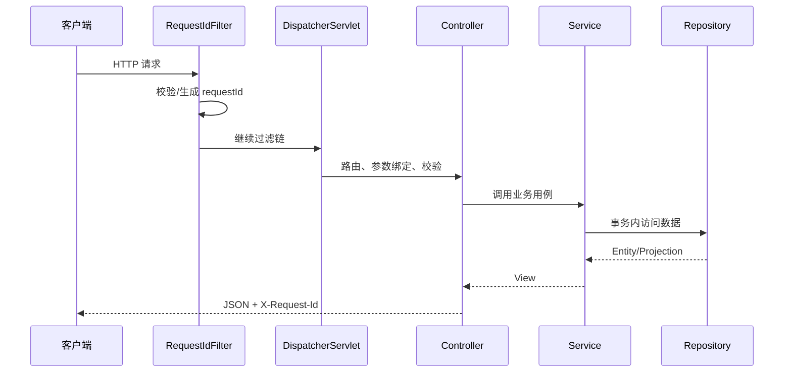

### 怎么理解

Filter 适合处理请求级横切逻辑；Controller 负责协议适配；Service 承载业务；全局异常处理器把异常转为稳定契约。

不要在 Filter 中写业务查询，也不要让 Controller 直接拼 SQL。否则测试、事务和错误语义会混在一起。

## 16. 分层不是目录装饰

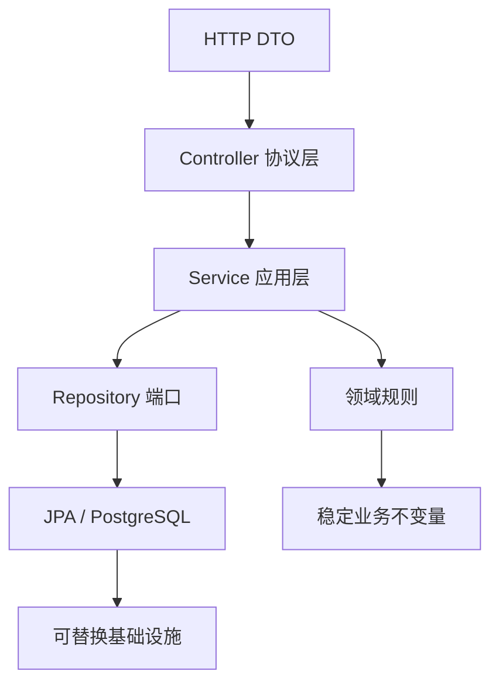

### 怎么理解

边界应该按变化原因划分：

- HTTP 字段变化不应迫使数据库实体成为公开契约。
- 数据库查询优化不应改变业务错误码。
- 事务只包住一致性所需步骤，不包远程调用和大文件处理。
- View/DTO 显式表达可返回字段，避免 Entity 直接序列化引发懒加载和敏感字段泄漏。

## 17. 成功和失败为什么需要同一响应契约

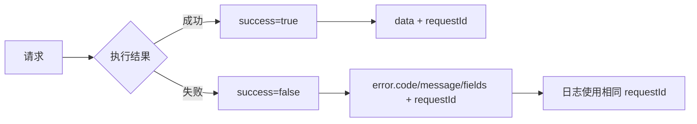

### 怎么理解

HTTP 状态码表达协议层结果，`error.code` 表达稳定业务分类，`fields` 表达字段校验错误，`requestId` 连接客户端反馈和服务端日志。

推荐区分：

- 400：输入格式或参数错误。
- 404：目标资源不存在。
- 409：唯一约束、状态冲突或旧版本更新。
- 500：未预期的服务端错误。

## 18. JPA 实体的四种典型状态

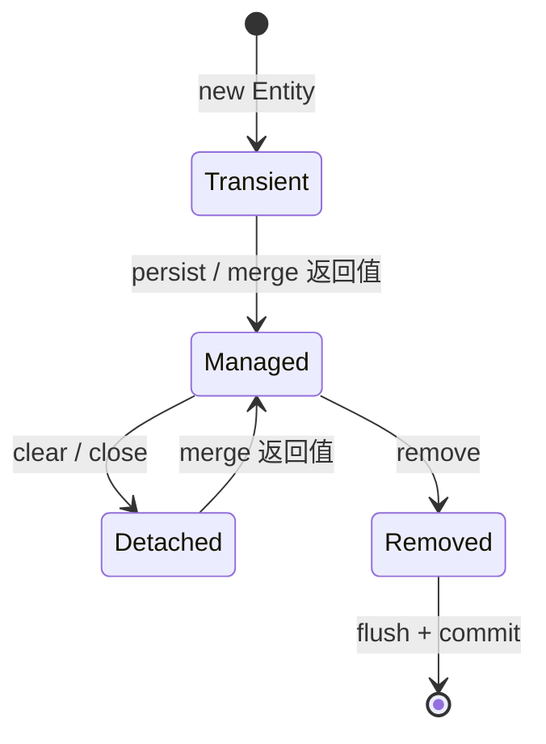

### 怎么理解

Managed 实体在事务中被脏检查，字段改变后可能无需显式 `save`。Detached 对象的修改不会自动持久化。

使用手工 UUID 时，Spring Data 可能走 `merge`；`merge` 返回的是新的 Managed 实例，传入对象仍可能是 Detached。接口若需要返回数据库最终版本和时间戳，应保留 `saveAndFlush` 的返回值。

## 19. 为什么同类内部调用会绕过事务代理

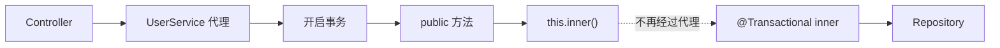

### 怎么理解

Spring 常通过代理拦截外部方法调用。对象内部的 `this.inner()` 是普通 Java 调用，不经过代理，因此 inner 上的新事务、只读或传播设置可能不生效。

解决方式不是“再加一个注解”，而是：

- 把独立事务用例移动到另一个 Bean。
- 从外部经过代理调用。
- 或重新评估是否真的需要嵌套事务边界。

## 20. 同一个事务里连接和 SQL 如何流动

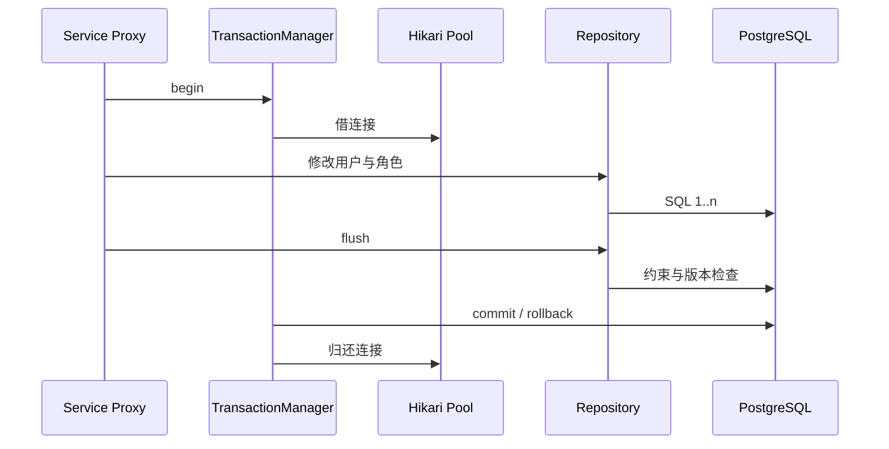

### 怎么理解

事务必须在同一线程和同一数据库连接上下文中完成。不要在事务里发长时间远程请求，否则连接会被占着等待。

`flush` 把变更同步到数据库，但不等于提交。它适合在返回响应前暴露约束失败和最终 `@Version`，事务仍可能随后回滚。

## 21. 懒加载和 N+1 为什么常一起出现

```mermaid
sequenceDiagram
  participant C as Controller
  participant S as Service
  participant DB as PostgreSQL
  C->>S: listUsers()
  S->>DB: SELECT users
  loop 每个用户
    S->>DB: SELECT roles WHERE user_id=?
  end
  S-->>C: N 个用户 + 1 次主查询
```

### 怎么理解

懒加载把关联查询推迟到真正访问时。如果列表遍历每个用户的角色，就可能触发 N 条附加 SQL。关闭 Open Session in View 后，事务外访问懒关联还会抛 `LazyInitializationException`。

解决方案按场景选择：

- 列表使用 projection 或批量查询角色编码。
- 明确的详情查询使用 fetch join 或 EntityGraph。
- 分页时谨慎对集合 fetch join，避免行膨胀和错误分页。
- 用 SQL 数量测试防止回归。

## 22. 数据库连接池是有界资源

```mermaid
flowchart TD
  A["100 个并发请求"] --> B["Hikari 等待队列"]
  B --> C["最多 10 个连接"]
  C --> D[("PostgreSQL")]
  D --> C
  C --> E["事务结束归还"]
  B --> F{"超过 connectionTimeout"}
  F -- "是" --> G["请求失败 + 池指标告警"]
```

### 怎么理解

虚拟线程可以很多，但连接不能无限多。连接池大小要依据数据库容量、实例数和查询耗时计算，而不是依据 HTTP 并发直接放大。

排查池耗尽要同时看：

- active、idle、pending、acquire time。
- 事务耗时和慢 SQL。
- 是否有未关闭 JDBC 资源。
- 是否在事务里等待外部服务。
- 应用实例数乘以每实例最大连接是否超过数据库预算。

## 23. 乐观锁如何阻止旧页面覆盖新数据

```mermaid
sequenceDiagram
  participant A as 管理员 A
  participant B as 管理员 B
  participant API as API
  participant DB as PostgreSQL
  A->>API: 读取用户 version=4
  B->>API: 读取用户 version=4
  A->>API: 更新 expectedVersion=4
  API->>DB: UPDATE ... WHERE version=4
  DB-->>A: 成功，version=5
  B->>API: 更新 expectedVersion=4
  API->>DB: UPDATE ... WHERE version=4
  DB-->>B: 0 rows / 409 STALE_VERSION
```

### 怎么理解

乐观锁不阻止同时读取，而是在写入时检查版本。适合冲突不频繁、希望避免长时间持锁的后台管理场景。

客户端收到 409 后应重新加载并让用户确认，不要自动用旧数据重试覆盖。高冲突、必须串行的场景才考虑悲观锁或业务队列。

## 24. 认证和授权是两道不同的门

```mermaid
flowchart LR
  A["请求凭证"] --> B{"认证 Authentication"}
  B -- "无效" --> C["401"]
  B -- "有效" --> D["当前用户 Principal"]
  D --> E{"授权 Authorization"}
  E -- "无权限" --> F["403"]
  E -- "允许" --> G["执行具体业务动作"]
  G --> H["审计 actor / action / target"]
```

### 怎么理解

认证回答“你是谁”，授权回答“你能做什么”。前端隐藏按钮只是体验优化，后端必须在方法或业务边界再次校验。

角色通常聚合权限，但具体动作应按业务资源判断。密码使用自适应哈希；Token、会话和权限变更要考虑失效策略。

## 25. 配置覆盖顺序为什么会制造环境差异

```mermaid
flowchart TD
  A["application.yml 默认值"] --> B["profile 配置"]
  B --> C["环境变量"]
  C --> D["系统属性 / 命令行"]
  D --> E["最终 Environment"]
  E --> F["DataSource / Server / Actuator"]
  G["Secret 管理系统"] --> C
```

### 怎么理解

同一个键可能来自多个来源，后面的高优先级值覆盖前面的值。排查“本地正常、容器错误”时，应查看最终生效值的来源，不只是仓库中的 YAML。

敏感值不要打印原文。配置启动校验应尽早失败，例如数据库地址为空或环境枚举非法时直接阻止 readiness。

## 26. 测试金字塔如何覆盖真实风险

```mermaid
flowchart TD
  A["少量端到端测试"] --> B["API + PostgreSQL 集成测试"]
  B --> C["Service 单元测试"]
  C --> D["纯函数与领域规则测试"]
  T["Testcontainers"] --> B
  M["Flyway migrations"] --> B
```

### 怎么理解

- 单元测试快速验证业务分支，但 Mock 不能证明 SQL、映射、约束和迁移正确。
- MockMvc + Testcontainers 可以验证 HTTP 契约、Spring 配置、Flyway、JPA 和真实 PostgreSQL。
- 端到端测试验证最关键用户流程，不必把每个字段组合都放进浏览器。

数据库集成测试至少覆盖：空库迁移、唯一约束、分页、乐观锁、事务回滚和错误响应。

## 27. 从源码到运行镜像

```mermaid
flowchart LR
  A["Git 源码"] --> B["Maven test"]
  B --> C["package 可执行 jar"]
  C --> D["JDK 25 build stage"]
  D --> E["JRE 25 runtime stage"]
  E --> F["非 root 容器"]
  F --> G["配置注入"]
  G --> H["健康检查与日志"]
```

### 怎么理解

多阶段镜像把编译工具留在 build stage，运行镜像只携带 JRE 和 jar。镜像构建应从干净源码安装依赖，不能复制宿主机 `target` 冒充可复现构建。

生产镜像要固定基础镜像版本、使用非 root 用户、限制资源，并让日志写到标准输出。

## 28. Liveness、Readiness 和优雅停机

```mermaid
sequenceDiagram
  participant P as 平台
  participant A as 应用
  participant LB as 负载均衡
  participant DB as PostgreSQL
  P->>A: SIGTERM
  A->>LB: readiness = DOWN
  LB-->>A: 停止新流量
  A->>A: 等待在途请求
  A->>DB: 提交/回滚并关闭连接池
  A-->>P: 进程退出 0
```

### 怎么理解

Liveness 只回答“进程是否需要重启”，不应因为数据库短暂不可用就让平台反复重启应用。Readiness 回答“现在能否接收流量”，可以包含数据库等关键依赖。

优雅停机顺序是：先摘流量，再排空请求，最后释放线程池、连接池和其他资源。超时后平台才强制终止。

## 29. Java 故障的证据链

```mermaid
flowchart TD
  A["用户现象 / 告警"] --> B["固定版本、时间、请求与发布点"]
  B --> C{"故障阶段"}
  C -- "启动" --> D["异常链 / classpath / condition report"]
  C -- "请求" --> E["requestId / 状态码 / trace"]
  C -- "数据" --> F["SQL / 事务 / 锁 / 连接池"]
  C -- "性能" --> G["JFR / thread dump / GC / heap"]
  C -- "发布" --> H["readiness / SIGTERM / 容器事件"]
  D --> I["最小复现"]
  E --> I
  F --> I
  G --> I
  H --> I
  I --> J["根因修复"]
  J --> K["同条件回归 + 预防规则"]
```

### 怎么理解

排障不是从“可能是缓存”“可能是 JVM”开始猜，而是先确定第一条异常证据。推荐记录：

```text
Java / Spring Boot / OS / 镜像版本：
故障开始时间与最近发布：
请求 ID、用户影响和比例：
第一条异常日志或指标：
线程、堆、GC、连接池和 SQL 证据：
排除过的假设：
根因：
修复与取舍：
回归命令和结果：
预防规则：
```

## 把 29 张图连起来

| 学习阶段 | 重点图 | 能解决的问题 |
| --- | --- | --- |
| 语言与 JVM | 1–10 | 编译、内存、类加载、值传递、集合、Stream、泛型、异常 |
| 并发 | 11–12 | 可见性、竞态、线程池、虚拟线程 |
| Spring | 13–17 | 启动、Bean、请求链、分层、错误契约 |
| 数据与事务 | 18–23 | 实体状态、代理、事务、N+1、连接池、并发写 |
| 安全与配置 | 24–25 | 认证授权、配置来源和环境差异 |
| 测试与交付 | 26–28 | 真实数据库测试、镜像、健康检查和停机 |
| 排障 | 29 | 从现象到证据、根因、回归和预防 |

## 阅读验收

- [ ] 不看正文也能解释 29 张图中的主要箭头。
- [ ] 能从源码一直讲到 JVM、HTTP、事务、数据库和容器退出。
- [ ] 能解释“虚拟线程很多，但数据库连接仍然只有 10 个”。
- [ ] 能解释 JPA merge 返回值、事务代理和 N+1 三个常见陷阱。
- [ ] 能把启动、请求、数据、性能和发布问题映射到不同证据。

## 下一步

第一次学习继续进入 [环境、JDK 与构建工具](/java/setup-tooling)。已经掌握 Java 基础的读者直接进入 [Spring Boot 从零到项目](/java/spring-boot-project-from-zero)，并在编码时反复回看第 13–28 张图。
