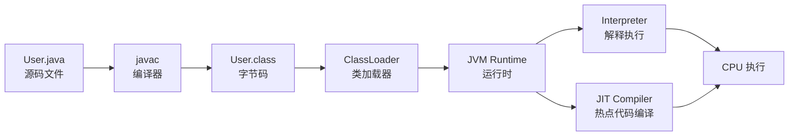
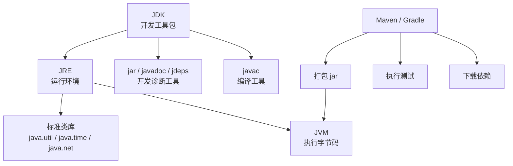
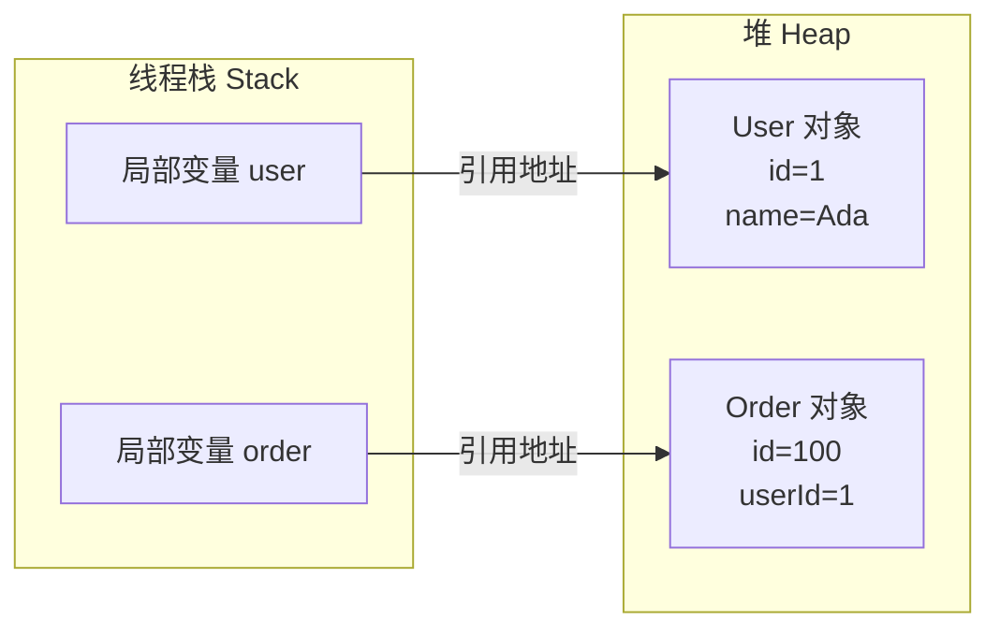
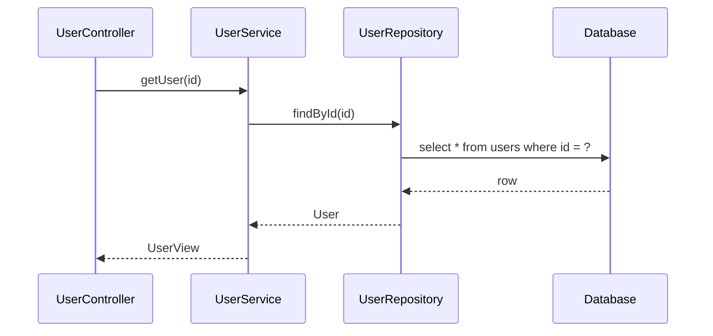
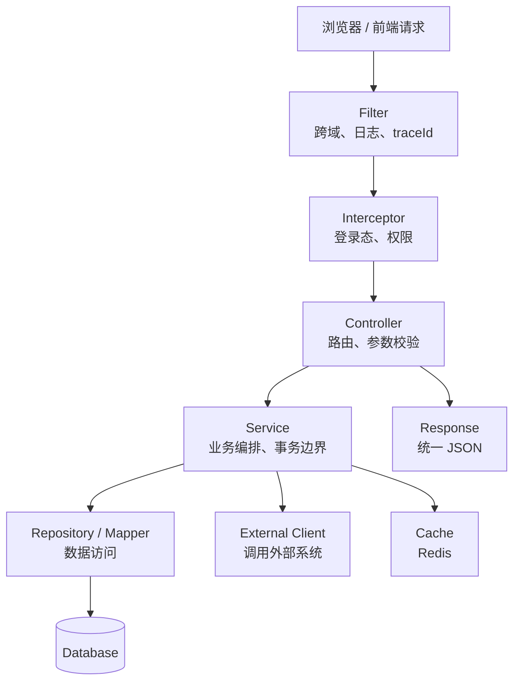
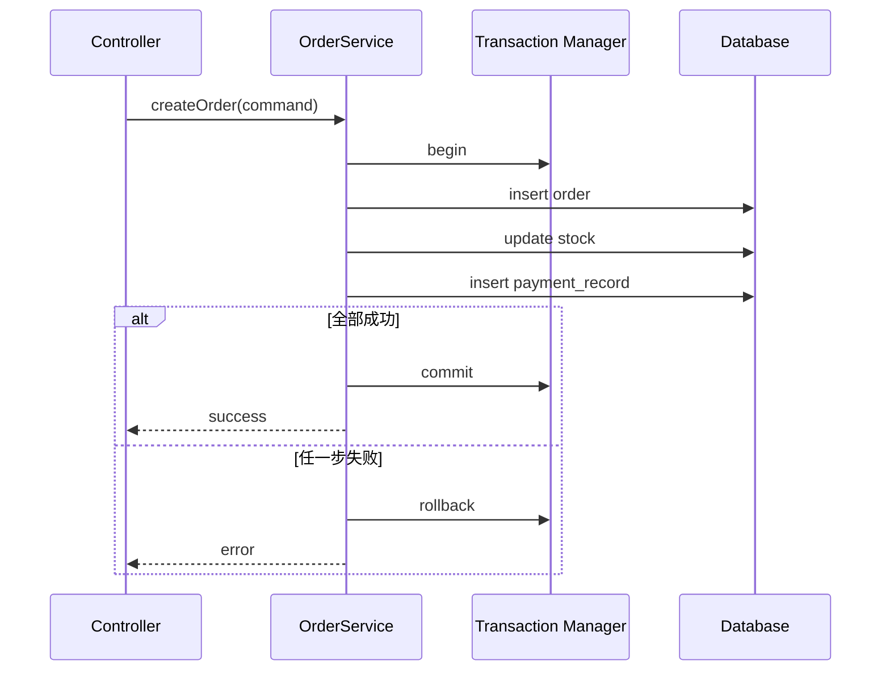
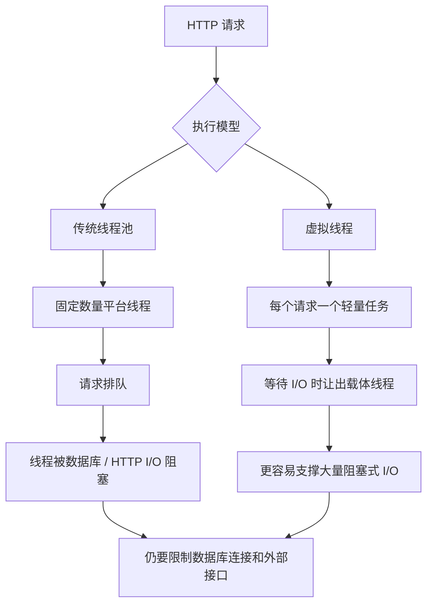
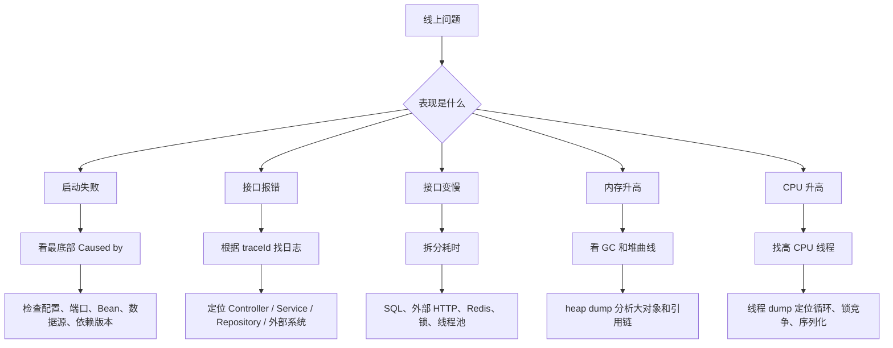

# 图解 Java 核心概念

## 这个页面解决什么

如果你刚开始学 Java，很容易被 JDK、JVM、类、对象、堆、栈、线程、事务、Spring Bean 这些概念分散注意力。

这一页先用图把 Java 后端项目的核心模型串起来。读完后再进入具体章节，会更容易理解每个知识点在项目里的位置。

## 一张图理解 Java 程序从哪里来到哪里去



这张图要记住三件事：

1. Java 代码不是直接运行源码，而是先编译成 `.class` 字节码。
2. JVM 负责加载字节码、管理内存、执行代码和做 GC。
3. 热点代码会被 JIT 编译优化，所以 Java 不是简单的“解释型语言”。

实际项目中，`java --version`、`javac --version`、Maven 编译版本和服务器 JDK 版本必须一致或兼容，否则就会出现本地能跑、服务器不能跑的问题。

## 一张图理解 JDK、JRE、JVM、Maven 的关系



初学者可以这样理解：

- 写代码、编译、测试、打包，需要 JDK。
- 运行 Java 程序，核心依赖 JVM。
- Maven 和 Gradle 不替代 JDK，它们是构建工具，会调用 JDK 完成编译和打包。

## 一张图理解对象、引用、堆和栈



关键理解：

- 局部变量通常在线程栈里。
- `new User()` 创建出来的对象在堆里。
- 变量里保存的不是整个对象，而是指向对象的引用。
- 如果没有任何地方还能引用某个对象，它才可能被 GC 回收。

这也是为什么缓存、静态集合、ThreadLocal 使用不当会造成内存泄漏：业务已经不需要对象了，但某个引用还一直保留着它。

## 一张图理解方法调用栈



当异常发生时，堆栈通常会从最底层一路打印到入口层。排查时不要只看第一行，要找最关键的 `Caused by`：

```text
Controller
  -> Service
     -> Repository
        -> JDBC Driver
           -> Database error
```

如果错误是 SQL 字段不存在，真正原因通常在 Repository 或数据库迁移，而不是 Controller。

## 一张图理解 Spring Boot 请求链路



这张图能帮助你判断代码应该放在哪里：

| 代码 | 应该放哪里 |
| --- | --- |
| 参数格式校验 | Controller / Request DTO |
| 登录态解析 | Filter / Interceptor |
| 是否允许操作某个订单 | Service |
| SQL 查询 | Repository / Mapper |
| 调用支付系统 | External Client |
| 事务控制 | Service |
| 统一错误格式 | Exception Handler |

最常见的新手问题是 Controller 里写满业务逻辑，最后权限、事务、日志、参数校验全混在一起。

## 一张图理解事务为什么要放在 Service



事务不是为了包住一条 SQL，而是为了包住一个完整业务动作。

例如“创建订单”通常包括：

- 写订单表。
- 扣库存。
- 写支付记录。
- 写操作日志或事件。

这些动作要么一起成功，要么一起失败，所以事务边界应该放在 Service 层，而不是 Controller 或 Repository 里随意开启。

## 一张图理解线程池和虚拟线程



虚拟线程解决的是“阻塞等待时线程成本高”的问题，不解决所有并发问题。

仍然必须控制：

- 数据库连接池。
- 外部接口并发。
- Redis 连接。
- 业务锁竞争。
- 限流和超时。

否则虚拟线程可能让请求更容易并发出去，反而更快打满下游资源。

## 一张图理解 Java 后端排错顺序



真实项目里不要凭感觉修改。正确顺序是：

1. 先确认现象。
2. 再收集日志、指标、dump。
3. 再定位层次。
4. 最后修改代码和补测试。

## 建议阅读顺序

如果你是第一次学 Java，建议按这个顺序：

1. 先读本页，建立整体图像。
2. 再读 [环境、JDK 与构建工具](/java/setup-tooling)。
3. 再读 [语法与面向对象](/java/syntax-oop)。
4. 学到 Spring Boot 前，回来看“请求链路”和“事务边界”两张图。
5. 遇到线上问题时，回来看“排错顺序”。

## 下一步学习

继续学习 [环境、JDK 与构建工具](/java/setup-tooling)。
