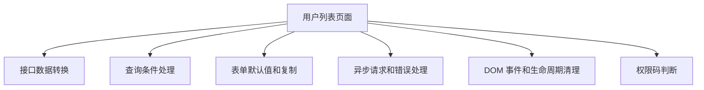
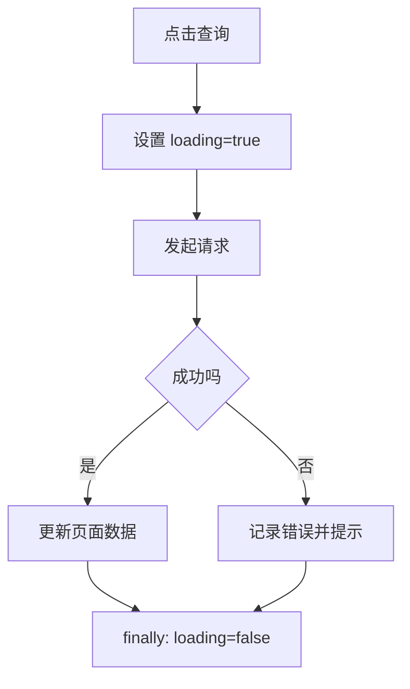

# JavaScript 项目落地实践

## 这个页面解决什么

JavaScript 学习不能停在语法。真实项目里更常见的问题是：接口数据怎么转换、列表怎么筛选、表单怎么复制、异步请求怎么处理、事件监听怎么清理。

## 适合谁看

适合已经学过 JavaScript 基础语法，但想知道这些语法在 Vue、React、Node 或后台管理项目中怎么真正使用的人。

## 一个后台页面需要哪些 JavaScript 能力



## 接口数据转换

后端返回的数据通常不完全适合页面直接使用。

后端返回：

```js
const response = {
  id: 1,
  user_name: 'Ada',
  role_codes: ['admin'],
  status: 1
}
```

页面 ViewModel：

```js
function toUserView(item) {
  return {
    id: item.id,
    name: item.user_name,
    roles: item.role_codes,
    enabled: item.status === 1
  }
}
```

原则：

- 接口字段转换集中处理。
- 页面模板只使用 ViewModel。
- 不在模板里到处写 `status === 1`。

## 列表筛选

简单筛选可以拆成命名函数：

```js
function matchKeyword(user, keyword) {
  if (!keyword) return true
  return user.name.includes(keyword)
}

function matchStatus(user, status) {
  if (status === 'all') return true
  return user.enabled === (status === 'enabled')
}
```

组合：

```js
const result = users.filter((user) => {
  return matchKeyword(user, keyword) && matchStatus(user, status)
})
```

这样比把所有判断堆在一个 `filter` 里更容易调试。

## 表单复制

不要直接把列表行对象塞进表单：

```js
form = row
```

这样编辑表单时可能直接改到列表。

推荐：

```js
function copyUserToForm(row) {
  return {
    id: row.id,
    name: row.name,
    roleIds: [...row.roleIds],
    enabled: row.enabled
  }
}
```

## 异步请求流程



代码结构：

```js
async function loadUsers() {
  loading.value = true
  error.value = null

  try {
    const data = await getUsers(query)
    users.value = data.items.map(toUserView)
    total.value = data.total
  } catch (err) {
    error.value = normalizeError(err)
  } finally {
    loading.value = false
  }
}
```

## 事件监听清理

弹窗外点击、快捷键、滚动监听都要清理：

```js
function onKeydown(event) {
  if (event.key === 'Escape') {
    closeDialog()
  }
}

window.addEventListener('keydown', onKeydown)

function cleanup() {
  window.removeEventListener('keydown', onKeydown)
}
```

在 Vue 中通常放到 `onMounted` 和 `onUnmounted`。

## 权限判断

不要在页面里散落权限字符串：

```js
const permissions = {
  userCreate: 'user:create',
  userUpdate: 'user:update',
  userDelete: 'user:delete'
}
```

封装判断：

```js
function hasPermission(code) {
  return currentUser.permissions.includes(code)
}
```

## 常见问题

### 1. loading 一直不消失

原因通常是请求失败时没有进入清理逻辑。使用 `finally`。

### 2. 搜索条件变化后页码没重置

新筛选条件应该从第一页开始，否则容易出现“明明有数据却显示空”。

### 3. 删除后列表不刷新

删除成功后重新拉取列表，或者本地同步删除对应行。复杂场景优先重新拉取。

## 下一步学习

继续学习 [数组与对象处理](/javascript/array-object)，再进入 [异步编程](/javascript/async)。
