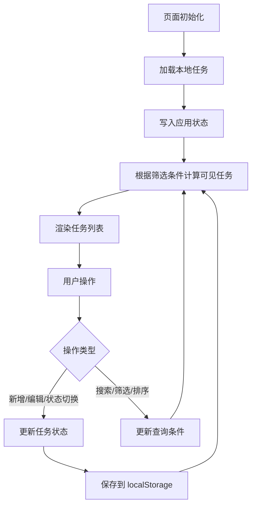
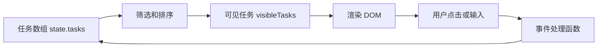
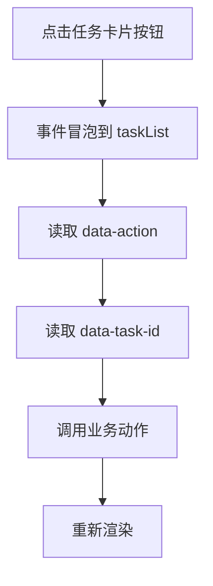
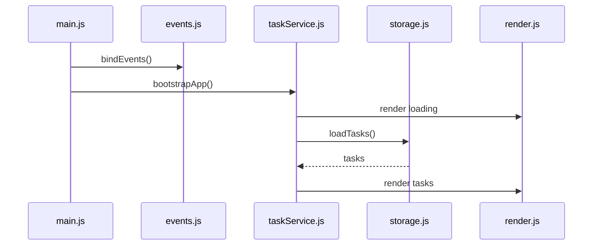

# JavaScript 任务看板从零到项目

## 适合谁看

适合已经学过 JavaScript 基础、数组对象、DOM 事件和异步编程，但还没有独立完成过一个“小而完整”的前端项目的人。

这个项目不使用 Vue、React 或组件库，只用原生 HTML、CSS 和 JavaScript 做一个任务看板。目的不是为了证明“原生 JS 更好”，而是让你在进入 Vue 之前先看清楚：数据状态、事件、渲染、持久化、错误处理和模块拆分到底如何协作。

## 项目目标

任务看板首先要设计状态，而不是先写列表 DOM。下面四种界面状态必须能被明确区分，并为用户提供对应的下一步。

<DocFigure
  src="/images/javascript/task-board-states.webp"
  alt="JavaScript 任务看板展示加载中、正常列表、空列表和离线失败四种状态"
  caption="不要让空数组同时代表 loading、empty 和 error；状态机应明确决定页面展示与恢复动作。"
  :width="1440"
  :height="900"
/>

后面的数据模型会把 `status`、任务集合和错误信息分开保存，避免一次异步失败清空用户仍可继续使用的本地草稿。

做一个可本地运行的任务看板，支持：

- 新增任务。
- 编辑任务标题和描述。
- 切换任务状态。
- 按关键字、状态、优先级筛选。
- 按更新时间排序。
- 把任务保存到 localStorage。
- 模拟异步加载和保存。
- 处理 loading、empty、error 状态。
- 拆分数据处理、渲染、事件和存储模块。

最终你要能解释：

| 能力 | 要能说清楚什么 |
| --- | --- |
| 状态模型 | 页面需要哪些数据，哪些是原始状态，哪些是派生结果 |
| 渲染流程 | 状态变化后如何重新计算列表并更新 DOM |
| 事件处理 | 为什么用事件委托，如何避免重复绑定 |
| 持久化 | localStorage 保存什么，不保存什么 |
| 异步处理 | loading、error、finally 和旧请求覆盖新请求怎么处理 |
| 模块边界 | api、store、render、events、utils 分别负责什么 |

## 项目全貌

先看整体流向：



这个项目只有一条核心规则：**不要直接把 DOM 当作数据源**。

DOM 只是状态的展示结果。真正的数据源应该是 JavaScript 对象：



## 目录结构

建议从下面这个结构开始：

```text
task-board/
├─ index.html
├─ styles.css
└─ src/
   ├─ main.js
   ├─ state.js
   ├─ storage.js
   ├─ taskService.js
   ├─ render.js
   ├─ events.js
   └─ utils.js
```

每个文件只做一类事：

| 文件 | 职责 | 不应该做什么 |
| --- | --- | --- |
| main.js | 初始化应用、串起模块 | 写大量业务判断 |
| state.js | 保存当前状态、提供更新方法 | 直接操作 DOM |
| storage.js | 读写 localStorage | 处理页面事件 |
| taskService.js | 新增、编辑、切换状态等业务动作 | 拼接 HTML |
| render.js | 根据状态生成页面 | 直接保存 localStorage |
| events.js | 绑定事件、读取用户输入 | 保存全局业务数据 |
| utils.js | 通用工具函数 | 放业务流程 |

## 第一步：设计数据模型

任务对象建议这样设计：

```js
const task = {
  id: 'task_001',
  title: '完成 JavaScript 任务看板',
  description: '拆分状态、事件、渲染和持久化',
  status: 'todo',
  priority: 'high',
  createdAt: 1783030000000,
  updatedAt: 1783030000000
}
```

字段说明：

| 字段 | 含义 | 约束 |
| --- | --- | --- |
| id | 任务唯一标识 | 创建后不变，不用标题当 id |
| title | 任务标题 | 必填，提交前 trim |
| description | 任务描述 | 可选，限制最大长度 |
| status | 任务状态 | todo、doing、done |
| priority | 优先级 | low、medium、high |
| createdAt | 创建时间 | 创建时写入 |
| updatedAt | 更新时间 | 每次业务变更更新 |

应用状态不要只保存任务数组，还要保存筛选条件和界面状态：

```js
export const state = {
  tasks: [],
  query: {
    keyword: '',
    status: 'all',
    priority: 'all',
    sortBy: 'updatedAtDesc'
  },
  ui: {
    loading: false,
    errorMessage: ''
  }
}
```

状态可以分三类：

| 状态类型 | 示例 | 是否需要持久化 |
| --- | --- | --- |
| 业务数据 | tasks | 需要 |
| 查询条件 | keyword、status、priority、sortBy | 可以保存，也可以不保存 |
| 临时界面状态 | loading、errorMessage | 不建议保存 |

## 第二步：写 HTML 骨架

先写稳定结构，不急着写交互：

```html
<main class="task-board">
  <section class="task-board__toolbar">
    <input id="keywordInput" type="search" placeholder="搜索任务" />
    <select id="statusFilter">
      <option value="all">全部状态</option>
      <option value="todo">待处理</option>
      <option value="doing">进行中</option>
      <option value="done">已完成</option>
    </select>
    <select id="priorityFilter">
      <option value="all">全部优先级</option>
      <option value="high">高</option>
      <option value="medium">中</option>
      <option value="low">低</option>
    </select>
  </section>

  <form id="taskForm" class="task-board__form">
    <input name="title" placeholder="任务标题" />
    <textarea name="description" placeholder="任务描述"></textarea>
    <select name="priority">
      <option value="high">高优先级</option>
      <option value="medium">中优先级</option>
      <option value="low">低优先级</option>
    </select>
    <button type="submit">新增任务</button>
  </form>

  <p id="statusText" class="task-board__status"></p>
  <ul id="taskList" class="task-board__list"></ul>
</main>
```

注意 class 命名要稳定，不要写宽泛选择器：

```css
.task-board__toolbar {
  display: grid;
  gap: 12px;
}

.task-card {
  border: 1px solid #dde7e2;
  border-radius: 8px;
  padding: 14px;
}

.task-card__actions {
  display: flex;
  gap: 8px;
  flex-wrap: wrap;
}
```

不要写这种样式：

```css
.task-board div { ... }
.task-board * { ... }
ul li button { ... }
```

这些选择器后续很容易污染新的组件和控件。

## 第三步：实现存储层

localStorage 只接收字符串，所以要做 JSON 序列化和异常处理：

```js
const STORAGE_KEY = 'task-board:tasks'

export function loadTasks() {
  try {
    const raw = localStorage.getItem(STORAGE_KEY)
    if (!raw) return []
    const parsed = JSON.parse(raw)
    return Array.isArray(parsed) ? parsed : []
  } catch (error) {
    console.error('Load tasks failed', error)
    return []
  }
}

export function saveTasks(tasks) {
  try {
    localStorage.setItem(STORAGE_KEY, JSON.stringify(tasks))
  } catch (error) {
    console.error('Save tasks failed', error)
    throw new Error('任务保存失败，请稍后再试')
  }
}
```

这里有两个实际项目思维：

| 处理 | 为什么 |
| --- | --- |
| 读取失败返回空数组 | 防止坏数据让页面完全崩溃 |
| 保存失败抛业务错误 | 让页面能提示用户保存失败 |

## 第四步：实现状态更新

状态更新要集中，避免多个文件随便改 `state.tasks`：

```js
import { state } from './state.js'
import { saveTasks } from './storage.js'

export function createTask(input) {
  const now = Date.now()
  const task = {
    id: `task_${now}`,
    title: input.title.trim(),
    description: input.description.trim(),
    status: 'todo',
    priority: input.priority,
    createdAt: now,
    updatedAt: now
  }

  state.tasks = [task, ...state.tasks]
  saveTasks(state.tasks)
  return task
}

export function updateTaskStatus(taskId, nextStatus) {
  state.tasks = state.tasks.map((task) => {
    if (task.id !== taskId) return task
    return {
      ...task,
      status: nextStatus,
      updatedAt: Date.now()
    }
  })

  saveTasks(state.tasks)
}
```

为什么不直接改原对象？

```js
task.status = nextStatus
```

小项目里这样也能跑，但在真实项目中，复制更新更容易追踪变化，也更接近 Vue、React 里的状态更新习惯。

## 第五步：计算可见任务

筛选、排序、分页都属于“派生数据”，不要写进 DOM 渲染函数里：

```js
export function getVisibleTasks(tasks, query) {
  const keyword = query.keyword.trim().toLowerCase()

  return tasks
    .filter((task) => {
      if (!keyword) return true
      return `${task.title} ${task.description}`.toLowerCase().includes(keyword)
    })
    .filter((task) => {
      return query.status === 'all' || task.status === query.status
    })
    .filter((task) => {
      return query.priority === 'all' || task.priority === query.priority
    })
    .toSorted((a, b) => {
      if (query.sortBy === 'createdAtAsc') return a.createdAt - b.createdAt
      return b.updatedAt - a.updatedAt
    })
}
```

如果要兼容旧浏览器，没有 `toSorted` 时可以这样写：

```js
return [...tasks].sort((a, b) => b.updatedAt - a.updatedAt)
```

关键点：

| 做法 | 原因 |
| --- | --- |
| 先 filter 再 sort | 逻辑更清楚 |
| sort 前复制数组 | 避免改变原始任务顺序 |
| 搜索前统一小写 | 避免大小写影响搜索 |
| 把筛选函数独立出来 | 后续容易测试 |

## 第六步：渲染列表

渲染函数只做一件事：根据状态更新页面。

```js
import { state } from './state.js'
import { getVisibleTasks } from './taskService.js'

const taskList = document.querySelector('#taskList')
const statusText = document.querySelector('#statusText')

export function renderApp() {
  if (state.ui.loading) {
    statusText.textContent = '加载中...'
    taskList.innerHTML = ''
    return
  }

  if (state.ui.errorMessage) {
    statusText.textContent = state.ui.errorMessage
    taskList.innerHTML = ''
    return
  }

  const visibleTasks = getVisibleTasks(state.tasks, state.query)
  statusText.textContent = `共 ${visibleTasks.length} 个任务`

  if (visibleTasks.length === 0) {
    taskList.innerHTML = '<li class="task-empty">暂无任务</li>'
    return
  }

  taskList.innerHTML = visibleTasks.map(renderTaskCard).join('')
}

function renderTaskCard(task) {
  return `
    <li class="task-card" data-task-id="${task.id}">
      <h3 class="task-card__title">${escapeHtml(task.title)}</h3>
      <p class="task-card__desc">${escapeHtml(task.description || '暂无描述')}</p>
      <p class="task-card__meta">${task.status} / ${task.priority}</p>
      <div class="task-card__actions">
        <button type="button" data-action="todo">待处理</button>
        <button type="button" data-action="doing">进行中</button>
        <button type="button" data-action="done">已完成</button>
        <button type="button" data-action="delete">删除</button>
      </div>
    </li>
  `
}
```

注意 `escapeHtml` 很重要，因为任务标题来自用户输入：

```js
export function escapeHtml(value) {
  return String(value)
    .replaceAll('&', '&amp;')
    .replaceAll('<', '&lt;')
    .replaceAll('>', '&gt;')
    .replaceAll('"', '&quot;')
    .replaceAll("'", '&#039;')
}
```

如果不做转义，用户输入 `` 之类内容时可能造成 XSS 风险。真实项目中更推荐用框架模板绑定或安全的 DOM API，但理解风险本身很重要。

## 第七步：绑定事件

事件绑定建议集中在 `events.js`：

```js
import { state } from './state.js'
import { createTask, updateTaskStatus, deleteTask } from './taskService.js'
import { renderApp } from './render.js'

export function bindEvents() {
  const form = document.querySelector('#taskForm')
  const list = document.querySelector('#taskList')
  const keywordInput = document.querySelector('#keywordInput')
  const statusFilter = document.querySelector('#statusFilter')
  const priorityFilter = document.querySelector('#priorityFilter')

  form.addEventListener('submit', (event) => {
    event.preventDefault()
    const formData = new FormData(form)
    const title = String(formData.get('title') || '').trim()

    if (!title) {
      state.ui.errorMessage = '请输入任务标题'
      renderApp()
      return
    }

    createTask({
      title,
      description: String(formData.get('description') || ''),
      priority: String(formData.get('priority') || 'medium')
    })

    form.reset()
    state.ui.errorMessage = ''
    renderApp()
  })

  list.addEventListener('click', (event) => {
    const button = event.target.closest('button[data-action]')
    if (!button) return

    const item = button.closest('[data-task-id]')
    if (!item) return

    const taskId = item.dataset.taskId
    const action = button.dataset.action

    if (action === 'delete') {
      deleteTask(taskId)
    } else {
      updateTaskStatus(taskId, action)
    }

    renderApp()
  })

  keywordInput.addEventListener('input', () => {
    state.query.keyword = keywordInput.value
    renderApp()
  })

  statusFilter.addEventListener('change', () => {
    state.query.status = statusFilter.value
    renderApp()
  })

  priorityFilter.addEventListener('change', () => {
    state.query.priority = priorityFilter.value
    renderApp()
  })
}
```

这里用了事件委托：



事件委托的好处：

| 好处 | 说明 |
| --- | --- |
| 不怕列表重新渲染 | 新按钮也能被统一监听 |
| 避免重复绑定 | 不用每次 render 后给每个按钮绑定事件 |
| 逻辑集中 | 所有列表操作都在一个入口处理 |

## 第八步：处理异步加载

虽然 localStorage 是同步的，但可以模拟真实接口，训练 loading 和 error：

```js
import { state } from './state.js'
import { loadTasks } from './storage.js'
import { renderApp } from './render.js'

export async function bootstrapApp() {
  state.ui.loading = true
  state.ui.errorMessage = ''
  renderApp()

  try {
    const tasks = await mockRequest(loadTasks())
    state.tasks = tasks
  } catch (error) {
    state.ui.errorMessage = error.message || '任务加载失败'
  } finally {
    state.ui.loading = false
    renderApp()
  }
}

function mockRequest(data) {
  return new Promise((resolve) => {
    window.setTimeout(() => resolve(data), 500)
  })
}
```

如果后续加入远程搜索，要防止旧请求覆盖新请求：

```js
let requestId = 0

async function searchTasks(keyword) {
  const currentId = ++requestId
  state.ui.loading = true
  renderApp()

  try {
    const result = await requestSearch(keyword)
    if (currentId !== requestId) return
    state.tasks = result
  } finally {
    if (currentId === requestId) {
      state.ui.loading = false
      renderApp()
    }
  }
}
```

这和真实项目中的搜索框、远程表格、下拉联想非常接近。

## 第九步：初始化应用

`main.js` 只负责启动流程：

```js
import { bootstrapApp } from './taskService.js'
import { bindEvents } from './events.js'

bindEvents()
bootstrapApp()
```

启动流程图：



如果你发现 `main.js` 里越来越长，通常说明模块职责开始混乱。

## 常见问题和解决方案

| 问题 | 现象 | 根因 | 解决方案 |
| --- | --- | --- | --- |
| 点击一次触发多次 | 新增或切换状态重复执行 | 每次渲染后重复绑定事件 | 初始化时绑定一次，列表操作用事件委托 |
| 搜索后列表顺序乱了 | 清空搜索后顺序恢复不了 | sort 直接修改了原数组 | 排序前复制数组 |
| 页面刷新后任务丢失 | localStorage 没写入或 key 不一致 | 保存和读取使用了不同 key | 抽出 STORAGE_KEY 常量 |
| 输入 HTML 后页面异常 | 标题被当成 HTML 插入 | innerHTML 直接拼用户输入 | 输出前 escapeHtml |
| 保存失败没有提示 | 用户以为已经保存成功 | localStorage 异常被吞掉 | catch 后设置 errorMessage |
| 搜索结果闪回 | 慢请求覆盖快请求 | 没有请求序号或取消机制 | 使用 requestId 或 AbortController |
| 代码全在一个文件 | 后续改不动 | 状态、事件、渲染、存储混在一起 | 按职责拆模块 |

## 和 Vue 项目的关系

这个原生项目里的很多概念会直接迁移到 Vue：

| 原生 JS 项目 | Vue 项目里的对应物 |
| --- | --- |
| state.tasks | ref、reactive 或 Pinia state |
| getVisibleTasks | computed |
| renderApp | Vue 模板渲染 |
| addEventListener | v-on / @click / @input |
| data-task-id | props 或列表项数据 |
| taskService.js | service、composable、store action |
| localStorage 读写 | useStorage、Pinia 持久化或缓存层 |

所以不要把这个项目看成“学完就丢”。它是在帮你理解框架替你做了哪些事，以及哪些业务边界仍然要你自己设计。

## 验收清单

完成后逐项检查：

- 页面刷新后任务仍然存在。
- 新增任务时会校验空标题。
- 切换状态后更新时间变化。
- 搜索、状态、优先级筛选可以组合使用。
- 无任务和无搜索结果时有空状态。
- localStorage 损坏时页面不会白屏。
- 用户输入的 HTML 不会被当成真实 DOM 执行。
- 列表操作不会重复触发。
- 数据处理函数可以脱离 DOM 单独测试。
- 目录职责清晰，`main.js` 不超过初始化职责。

## 进阶挑战

如果基础版本已经完成，可以继续加：

| 挑战 | 训练能力 |
| --- | --- |
| 拖拽排序 | DOM 事件、状态同步、可访问性 |
| 批量操作 | 选中状态、批量更新、确认弹窗 |
| 任务标签 | 多选筛选、数组关系处理 |
| 导入导出 JSON | 文件 API、错误处理、数据校验 |
| IndexedDB 版本 | 浏览器存储和异步数据层 |
| 单元测试 | 纯函数测试、边界用例 |
| 改造成 Vue | 组件拆分、响应式状态、computed |

## 下一步学习

完成这个项目后，建议继续看：

- [DOM 事件](/javascript/dom-events)
- [异步编程](/javascript/async)
- [事件循环](/javascript/event-loop)
- [JavaScript 项目落地实践](/javascript/project-practice)
- [Vue 从零到项目落地](/vue/project-from-zero)
- [学习路径练习包](/roadmap/practice-labs)
