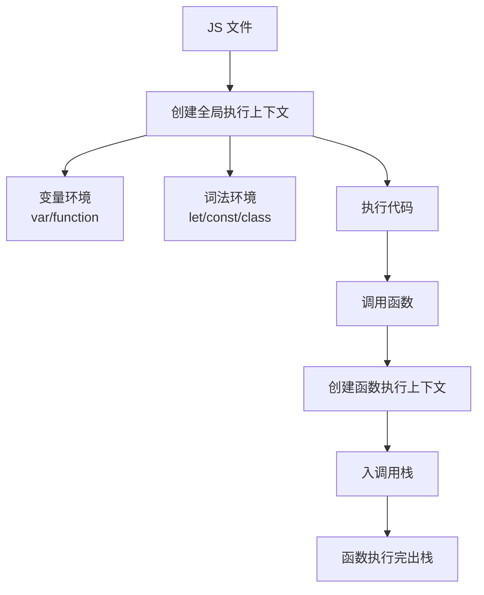
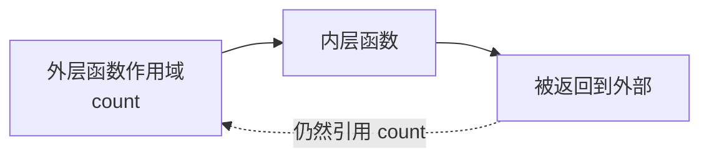
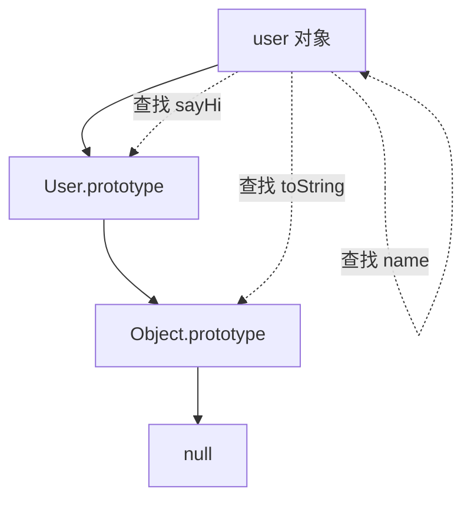
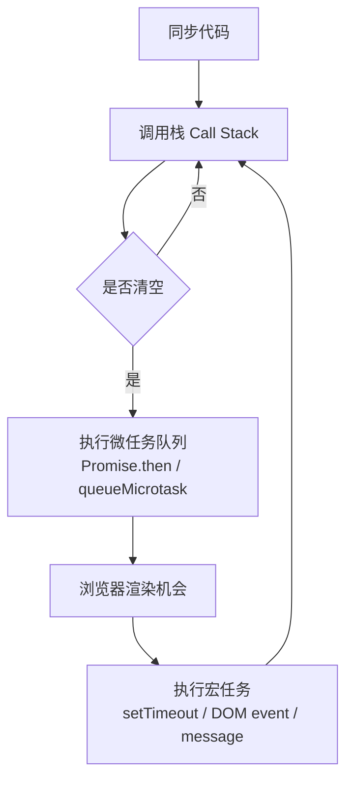
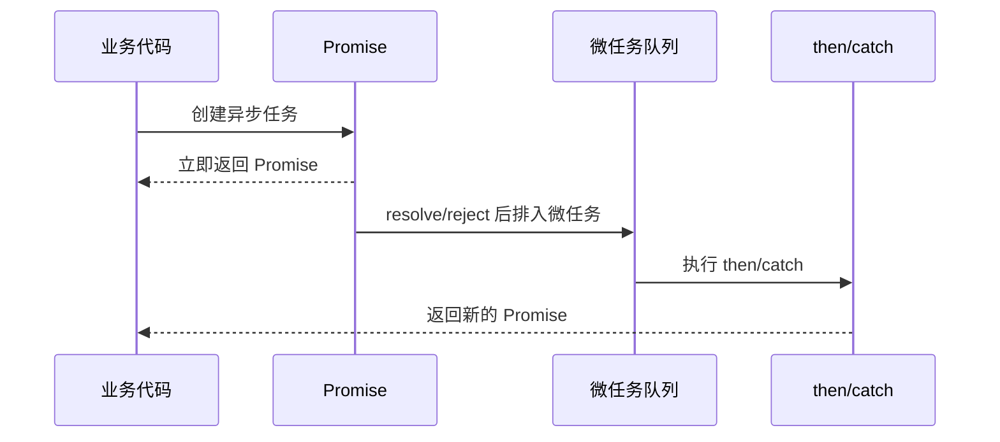
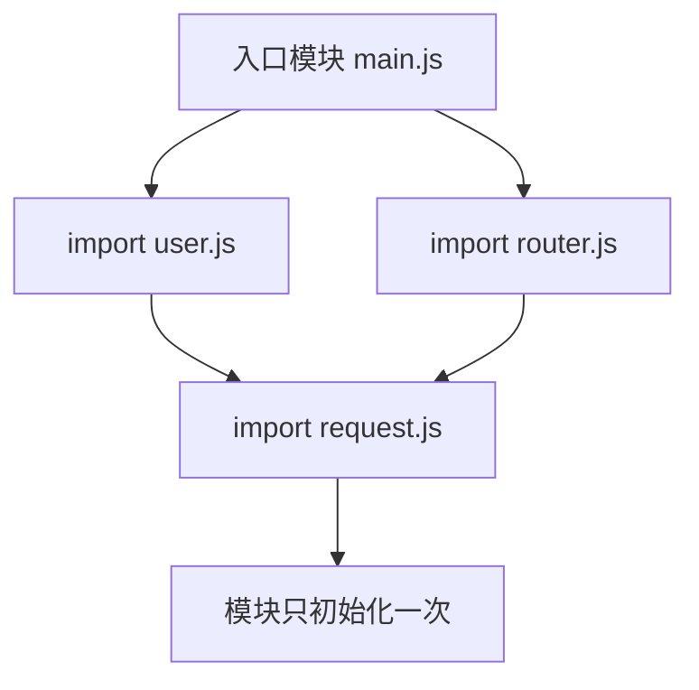
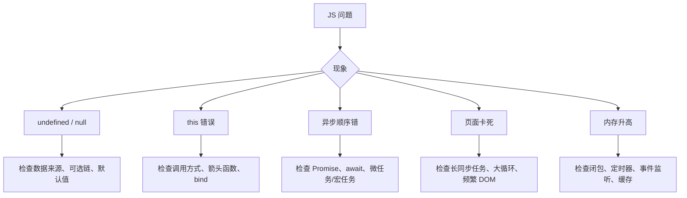

# 图解 JavaScript 核心概念

## 这个页面解决什么

JavaScript 看起来容易上手，但真正写项目时，很多问题来自作用域、闭包、原型链、事件循环、异步和模块加载。这里用图先建立运行模型。

## 适合谁看

适合已经会写基础 JavaScript，但对代码执行顺序、闭包、原型链、Promise、事件循环和模块化还不够清楚的人。

## 一张图理解代码执行上下文

这解释了：

- 为什么函数调用会形成调用栈。
- 为什么 `let` 和 `const` 有暂时性死区。
- 为什么递归太深会栈溢出。

## 一张图理解作用域和闭包

闭包不是特殊语法，而是函数记住了它创建时能访问的外层变量。

常见用途：

- 封装私有状态。
- 防抖、节流。
- 创建带配置的函数。
- React/Vue 组合函数里的状态保存。

常见风险：

- 长期持有大对象。
- 循环中变量引用错误。
- 异步回调使用了过期状态。

## 一张图理解原型链

属性查找规则：

1. 先找对象自己有没有。
2. 没有就找它的原型。
3. 继续沿原型链向上找。
4. 到 `null` 还没有就是 `undefined`。

理解原型链后，`class`、继承、实例方法、`this` 都会更容易理解。

## 一张图理解事件循环

重要规则：

- 同步代码先执行。
- 微任务通常比下一个宏任务更早执行。
- Promise 回调是微任务。
- `setTimeout` 是宏任务。
- 长时间同步任务会阻塞页面渲染。

## 一张图理解 Promise 链

每个 `then` 都会返回一个新的 Promise。错误会沿链传递，直到被 `catch` 捕获。

## 一张图理解模块加载

ESM 的关键特性：

- 静态 `import` 在模块顶层声明。
- 模块有自己的作用域。
- 同一个模块被多处导入时，只初始化一次。
- 导出的是 live binding，不是简单值拷贝。

## 一张图理解项目排错

## 下一步学习

继续学习 [JavaScript 基础](/javascript/fundamentals)，或进入 [事件循环](/javascript/event-loop)。
