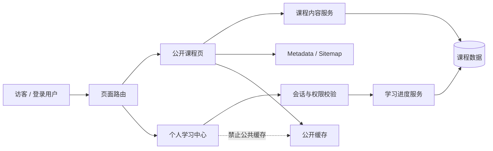
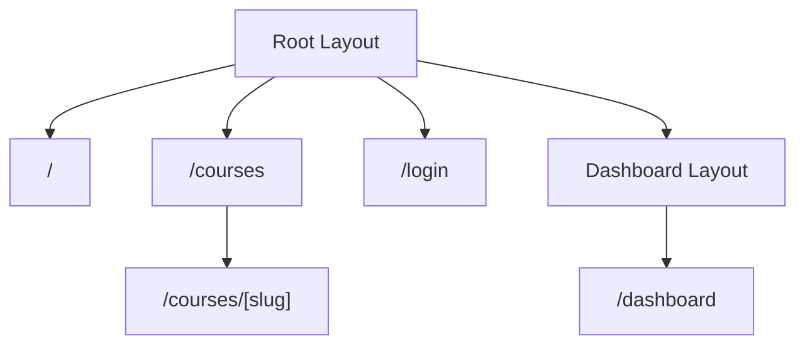
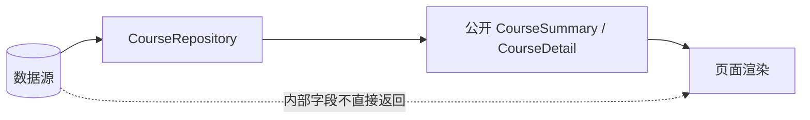
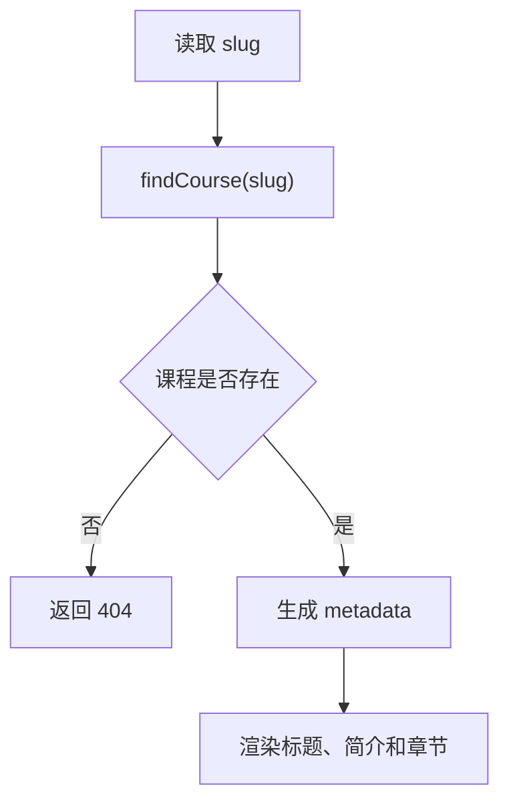
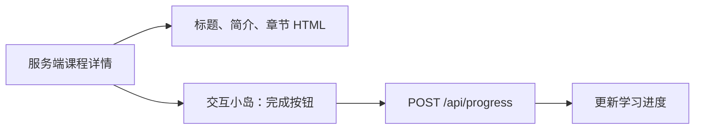
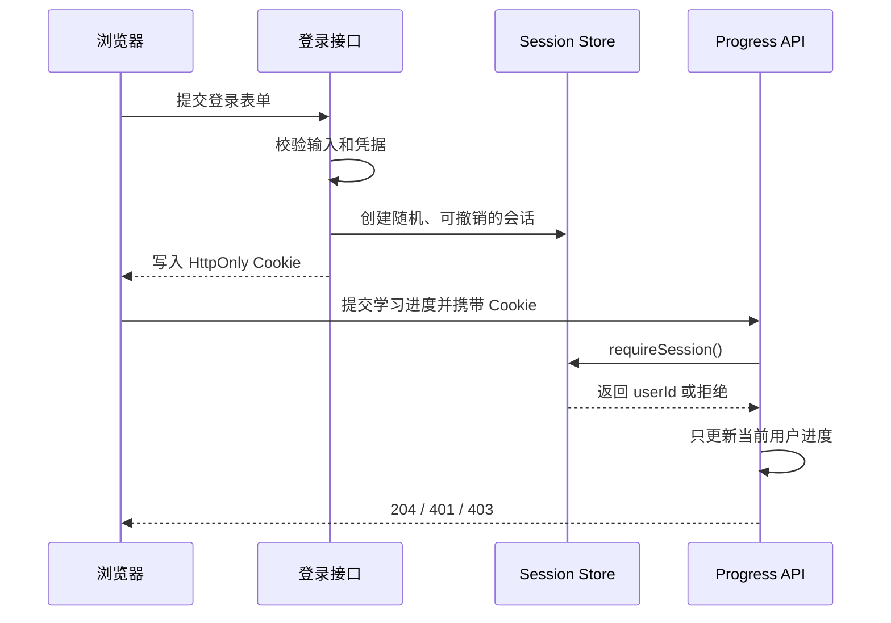
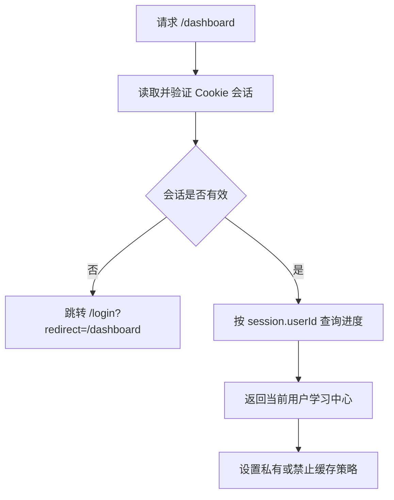
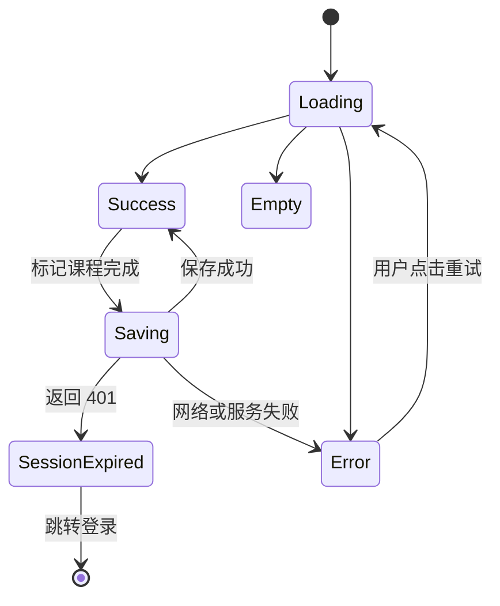
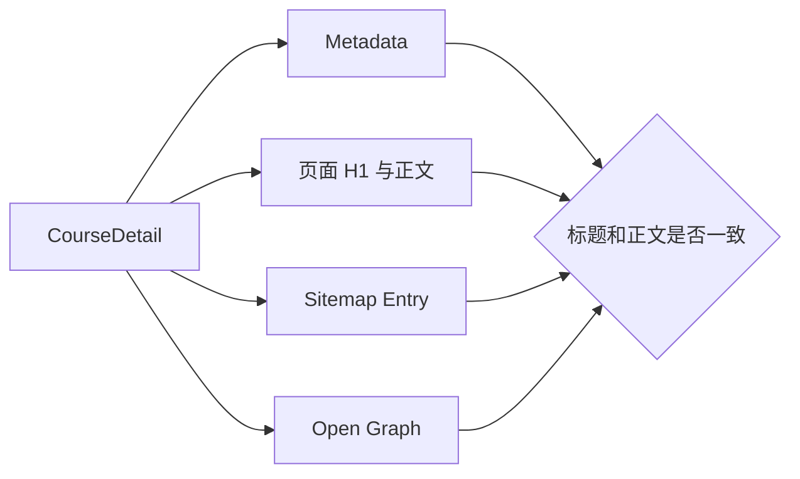
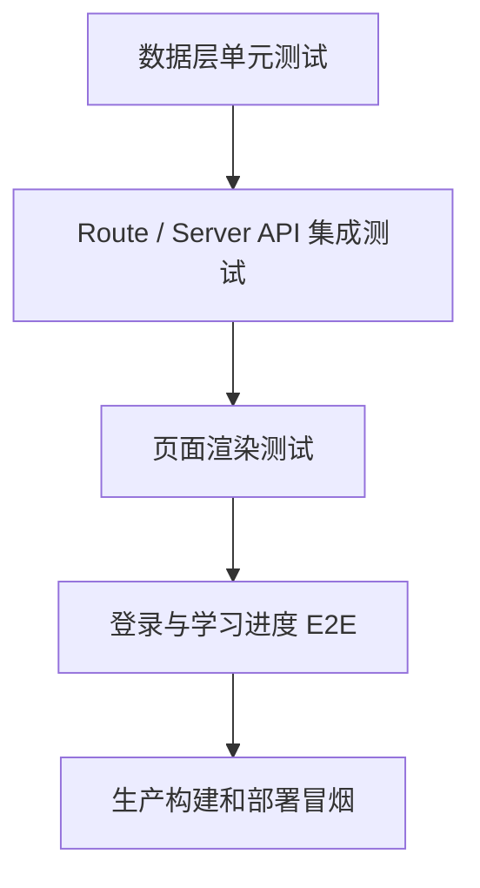

# Nuxt / Next 从零到项目：课程内容平台

## 这个项目要做什么

本章从一个空目录开始，搭建“课程内容平台 Course Hub”。它同时包含公开内容和登录后内容，适合用来理解元框架真正解决的问题。

最终页面：

| 路由 | 页面 | 数据特点 | 推荐策略 |
| --- | --- | --- | --- |
| `/` | 首页 | 公开、变化较慢 | 预渲染或缓存 |
| `/courses` | 课程列表 | 公开、定期更新 | 服务端渲染，可重新验证 |
| `/courses/[slug]` | 课程详情 | 公开、需要 SEO | 预渲染、ISR 或 SWR |
| `/login` | 登录页 | 公开、提交敏感 | 静态外壳 + 服务端登录接口 |
| `/dashboard` | 学习中心 | 用户私有、实时 | 动态渲染，禁止公共缓存 |
| `/api/progress` | 学习进度接口 | 用户私有、可写 | 服务端鉴权 |

你可以选择 Nuxt 或 Next 完成，不需要同时写两套。正文先讲共同设计，再在关键步骤给出两套实现入口。

## 适合谁看

适合满足以下条件的学习者：

- 已经能使用 Vue 3 或 React 写组件。
- 理解基本路由、表单、HTTP 和 TypeScript。
- 看过 [图解 Nuxt / Next 元框架核心概念](/meta-frameworks/visual-guide)。
- 希望真正理解 SSR、静态生成、服务端接口、登录态、缓存和部署。

如果你只想快速看 API，可以先读 [Nuxt 项目实践](/meta-frameworks/nuxt) 或 [Next.js 项目实践](/meta-frameworks/next)。本章更像一份项目施工手册。

## 本章版本基线

本章以 2026 年 7 月的稳定主线为基准：

| 技术 | 本章基线 | 旧项目需要注意 |
| --- | --- | --- |
| Nuxt | Nuxt 4.x、Vue 3、Nitro | Nuxt 3 常把 `pages/`、`layouts/` 放在项目根目录；迁移前先看当前目录结构 |
| Next | Next 16.x、React 19、App Router | 较早版本的动态 `params`、Middleware、缓存默认值和文件约定可能不同 |
| TypeScript | 脚手架默认严格配置 | 不要关闭类型检查掩盖框架升级问题 |

因此，本章使用 Nuxt 4 的 `app/pages` 目录、Next 新版异步 `params`，并把 Next 16 的 Proxy 与 `cacheComponents` 视为版本相关能力。复制示例前先检查项目 `package.json` 中的真实版本；维护旧项目时，以该版本官方文档和类型提示为准，不要直接套用最新写法。

## 完成后的能力

课程平台由公开内容、用户进度、播放器交互和练习写入组成。观察这四块的执行位置和缓存边界，再进入后面的逐阶段实现。

<DocFigure
  src="/images/meta-frameworks/course-platform.webp"
  alt="课程平台将课程概要、用户学习进度、客户端视频播放和练习提交拆成独立数据边界"
  caption="独立区块允许并行加载、失败隔离和不同缓存策略，不需要一个巨大 loader 承担全部职责。"
  :width="1440"
  :height="900"
/>

服务端输出课程与权限，客户端维护播放器等临时交互，写请求单独处理幂等与反馈；这些边界决定了目录、路由和测试的拆分方式。

完成项目后，你应该能够：

- 从业务页面判断渲染策略。
- 设计文件路由和嵌套布局。
- 区分公开数据、用户数据和服务端私密数据。
- 实现服务端数据获取、加载、空状态和错误状态。
- 使用 HttpOnly Cookie 维护会话边界。
- 防止用户态页面进入公共缓存。
- 为公开详情页生成 metadata。
- 完成构建、预览、上线检查和故障演练。

## 项目全景



这张图里最重要的是边界：课程信息是公开内容，可以缓存；个人进度与用户身份绑定，不能放进公共缓存。

## 第 0 阶段：先写项目决策

创建代码前，先在项目 `README.md` 记录：

```md
# Course Hub

## 页面策略

- `/`：公开首页，可预渲染。
- `/courses`：公开列表，允许短时间缓存。
- `/courses/[slug]`：公开详情，需要 SEO，发布课程后主动刷新。
- `/dashboard`：用户私有页面，禁止公共缓存。

## 数据边界

- 课程标题、简介、章节：公开。
- 用户邮箱、学习进度：登录后可见。
- 数据库连接、会话密钥：仅服务端可见。

## 验证命令

- 开发：见 package.json
- 构建：见 package.json
- 生产预览：见 package.json
```

这个文件不是形式工作。后续遇到“详情页为什么还是旧内容”“学习中心为什么不能静态化”时，应回到这里检查最初策略。

## 第 1 阶段：创建项目

### Nuxt 路线

```bash
npm create nuxt@latest course-hub-nuxt
cd course-hub-nuxt
npm install
npm run dev
```

### Next 路线

```bash
npx create-next-app@latest course-hub-next
cd course-hub-next
npm run dev
```

创建 Next 项目时建议启用 TypeScript、ESLint、App Router，并使用 `src/` 或根目录 `app/` 中的一种结构。选择后保持一致，不要在同一项目混用两套目录风格。

### 第一阶段验收

- 首页能打开。
- 修改页面文字后开发服务器能热更新。
- 停止开发服务器再启动，项目仍能正常运行。
- `npm run build` 能完成生产构建。
- README 记录实际 Node.js、框架和包管理器版本。

不要跳过生产构建。元框架里很多服务端边界和静态生成错误只会在构建时出现。

## 第 2 阶段：设计目录和路由

### Nuxt 目录参考

```text
course-hub-nuxt/
├─ app/
│  ├─ app.vue
│  ├─ layouts/
│  │  ├─ default.vue
│  │  └─ dashboard.vue
│  ├─ pages/
│  │  ├─ index.vue
│  │  ├─ courses/
│  │  │  ├─ index.vue
│  │  │  └─ [slug].vue
│  │  ├─ login.vue
│  │  └─ dashboard.vue
│  └─ components/
│     ├─ CourseCard.vue
│     └─ ProgressPanel.vue
├─ server/
│  ├─ api/
│  └─ utils/
├─ shared/
│  └─ types/
└─ nuxt.config.ts
```

如果当前 Nuxt 版本或项目模板使用根目录 `pages/`，以当前官方模板为准。关键不是有没有 `app/` 前缀，而是页面、服务端和共享类型的职责分开。

### Next 目录参考

```text
course-hub-next/
├─ app/
│  ├─ layout.tsx
│  ├─ page.tsx
│  ├─ courses/
│  │  ├─ page.tsx
│  │  └─ [slug]/
│  │     └─ page.tsx
│  ├─ login/
│  │  └─ page.tsx
│  ├─ dashboard/
│  │  ├─ layout.tsx
│  │  └─ page.tsx
│  ├─ api/
│  │  └─ progress/
│  │     └─ route.ts
│  └─ lib/
│     ├─ courses.ts
│     └─ session.ts
├─ components/
│  ├─ course-card.tsx
│  └─ progress-panel.tsx
└─ next.config.ts
```

### 路由关系



### 目录职责检查

| 内容 | 放置位置 | 不应该放哪里 |
| --- | --- | --- |
| 页面组件 | `pages/` 或 `app/**/page.tsx` | 通用工具目录 |
| 共享布局 | `layouts/` 或 `layout.tsx` | 每个页面复制一份 |
| 数据访问 | `server/utils`、`app/lib` 等服务端模块 | 客户端交互组件 |
| 共享类型 | `shared/types` 或独立 types 文件 | 数据库查询实现里私藏 |
| 点击和输入 | Vue 客户端交互或 React Client Component | 纯服务端数据层 |
| 权限校验 | 服务端接口、数据访问层 | 只在按钮显示逻辑里 |

## 第 3 阶段：定义数据模型

先从页面真正需要的数据出发：

```ts
export interface CourseSummary {
  slug: string
  title: string
  summary: string
  level: 'beginner' | 'intermediate' | 'advanced'
  lessonCount: number
  updatedAt: string
}

export interface CourseDetail extends CourseSummary {
  description: string
  lessons: Array<{
    id: string
    title: string
    durationMinutes: number
  }>
}

export interface LearningProgress {
  courseSlug: string
  completedLessonIds: string[]
  updatedAt: string
}
```

### 为什么列表和详情要分开

列表只需要摘要。如果每次列表请求都返回全部章节正文，会造成：

- 服务端查询更多字段。
- HTML 或数据载荷变大。
- 浏览器收到不需要的数据。
- 后续权限字段更容易意外泄漏。

### 数据流



### 先用内存数据，不急着接数据库

```ts
const courses: CourseDetail[] = [
  {
    slug: 'vue-foundations',
    title: 'Vue 3 项目基础',
    summary: '从组件、响应式到可维护项目结构。',
    description: '通过一个用户管理模块理解 Vue 项目核心能力。',
    level: 'beginner',
    lessonCount: 2,
    updatedAt: '2026-07-01T08:00:00.000Z',
    lessons: [
      { id: 'reactivity', title: '响应式数据流', durationMinutes: 25 },
      { id: 'components', title: '组件边界', durationMinutes: 35 }
    ]
  }
]

export async function listCourses(): Promise<CourseSummary[]> {
  return courses.map(({ description, lessons, ...summary }) => summary)
}

export async function findCourse(slug: string): Promise<CourseDetail | null> {
  return courses.find(course => course.slug === slug) ?? null
}
```

这样先验证页面和数据边界。等项目闭环稳定后，再把 repository 内部替换成数据库或 CMS。

## 第 4 阶段：实现公开课程列表

### Nuxt 实现入口

服务端 API：

```ts
// server/api/courses/index.get.ts
import { listCourses } from '../../utils/course-repository'

export default defineEventHandler(async () => {
  return {
    items: await listCourses()
  }
})
```

页面取数：

```vue
<!-- app/pages/courses/index.vue -->
<script setup lang="ts">
const { data, status, error, refresh } = await useLazyFetch('/api/courses', {
  key: 'course-list'
})
</script>

<template>
  <main>
    <h1>课程列表</h1>

    <p v-if="status === 'pending'">正在加载课程...</p>

    <section v-else-if="error" aria-live="polite">
      <p>课程暂时加载失败。</p>
      <button type="button" @click="refresh">重新加载</button>
    </section>

    <p v-else-if="!data?.items.length">暂时没有可学习的课程。</p>

    <ul v-else>
      <li v-for="course in data.items" :key="course.slug">
        <NuxtLink :to="`/courses/${course.slug}`">
          {{ course.title }}
        </NuxtLink>
        <p>{{ course.summary }}</p>
      </li>
    </ul>
  </main>
</template>
```

这里使用 `useLazyFetch`，让客户端导航可以先完成，再由 `status === 'pending'` 展示页面级加载状态。如果页面必须等待数据完成后才允许导航，可以改回 `await useFetch`，并把主要加载体验放到全局导航进度或页面骨架中。

### Next 实现入口

服务端页面直接调用数据层：

```tsx
// app/courses/page.tsx
import Link from 'next/link'
import { listCourses } from '@/app/lib/courses'

export default async function CoursesPage() {
  const courses = await listCourses()

  return (
    <main>
      <h1>课程列表</h1>

      {courses.length === 0 ? (
        <p>暂时没有可学习的课程。</p>
      ) : (
        <ul>
          {courses.map((course) => (
            <li key={course.slug}>
              <Link href={`/courses/${course.slug}`}>{course.title}</Link>
              <p>{course.summary}</p>
            </li>
          ))}
        </ul>
      )}
    </main>
  )
}
```

Next 页面默认错误和加载体验可以通过同一路由段下的 `loading.tsx`、`error.tsx` 实现。不要只处理成功状态。

### 列表验收

- 查看页面源代码时能找到课程标题。
- 列表为空时有明确空状态。
- 数据层抛错时不是整页无提示白屏。
- 每个链接都有真实 URL，可在新标签页打开。
- 列表只返回摘要字段。

## 第 5 阶段：实现课程详情和 404



### Nuxt 页面

```vue
<!-- app/pages/courses/[slug].vue -->
<script setup lang="ts">
const route = useRoute()
const slug = computed(() => String(route.params.slug))

const { data: course, error } = await useFetch(
  () => `/api/courses/${slug.value}`,
  { key: () => `course:${slug.value}` }
)

if (error.value?.statusCode === 404) {
  throw createError({ statusCode: 404, statusMessage: '课程不存在' })
}

useSeoMeta({
  title: () => course.value?.title ?? '课程详情',
  description: () => course.value?.summary ?? '查看课程详情'
})
</script>

<template>
  <main v-if="course">
    <h1>{{ course.title }}</h1>
    <p>{{ course.description }}</p>
    <ol>
      <li v-for="lesson in course.lessons" :key="lesson.id">
        {{ lesson.title }} · {{ lesson.durationMinutes }} 分钟
      </li>
    </ol>
  </main>
</template>
```

对应 API 在查不到课程时返回 404：

```ts
// server/api/courses/[slug].get.ts
import { findCourse } from '../../utils/course-repository'

export default defineEventHandler(async (event) => {
  const slug = getRouterParam(event, 'slug')
  const course = slug ? await findCourse(slug) : null

  if (!course) {
    throw createError({ statusCode: 404, statusMessage: '课程不存在' })
  }

  return course
})
```

### Next 页面

```tsx
// app/courses/[slug]/page.tsx
import type { Metadata } from 'next'
import { cache } from 'react'
import { notFound } from 'next/navigation'
import { findCourse } from '@/app/lib/courses'

const getCourse = cache(findCourse)

interface CoursePageProps {
  params: Promise<{ slug: string }>
}

export async function generateMetadata({ params }: CoursePageProps): Promise<Metadata> {
  const { slug } = await params
  const course = await getCourse(slug)

  if (!course) {
    return { title: '课程不存在' }
  }

  return {
    title: course.title,
    description: course.summary
  }
}

export default async function CoursePage({ params }: CoursePageProps) {
  const { slug } = await params
  const course = await getCourse(slug)

  if (!course) notFound()

  return (
    <main>
      <h1>{course.title}</h1>
      <p>{course.description}</p>
      <ol>
        {course.lessons.map((lesson) => (
          <li key={lesson.id}>
            {lesson.title} · {lesson.durationMinutes} 分钟
          </li>
        ))}
      </ol>
    </main>
  )
}
```

`generateMetadata` 和页面都会读取同一门课程。这里用 React `cache` 做一次请求渲染范围内的去重，避免接入数据库后执行两次相同查询。Next 的路由参数、缓存和 metadata API 会随版本演进，实际项目仍以当前版本类型提示和官方文档为准。

### 详情页验收

- 正常 slug 返回 200 和课程正文。
- 不存在的 slug 返回真正的 404，而不是状态 200 的“课程不存在”文字。
- 页面 title 和 description 来自课程数据。
- 直接刷新详情页和从列表点击进入都正常。
- 分享 URL 不依赖上一页状态。

## 第 6 阶段：只把交互区域放到客户端

详情页增加“标记本节完成”按钮。页面主体仍可在服务端渲染，按钮和即时状态属于客户端交互。



### Vue 组件边界

```vue
<script setup lang="ts">
const props = defineProps<{
  courseSlug: string
  lessonId: string
  completed: boolean
}>()

const isCompleted = ref(props.completed)
const isSaving = ref(false)
const message = ref('')

async function markCompleted() {
  isSaving.value = true
  message.value = ''

  try {
    await $fetch('/api/progress', {
      method: 'POST',
      body: {
        courseSlug: props.courseSlug,
        lessonId: props.lessonId
      }
    })
    isCompleted.value = true
    message.value = '学习进度已保存。'
  } catch {
    message.value = '保存失败，请稍后重试。'
  } finally {
    isSaving.value = false
  }
}
</script>

<template>
  <div>
    <button type="button" :disabled="isSaving || isCompleted" @click="markCompleted">
      {{ isCompleted ? '已完成' : isSaving ? '保存中...' : '标记完成' }}
    </button>
    <p aria-live="polite">{{ message }}</p>
  </div>
</template>
```

### React Client Component 边界

```tsx
'use client'

import { useState } from 'react'

interface CompleteLessonButtonProps {
  courseSlug: string
  lessonId: string
  completed: boolean
}

export function CompleteLessonButton(props: CompleteLessonButtonProps) {
  const [completed, setCompleted] = useState(props.completed)
  const [isSaving, setIsSaving] = useState(false)
  const [message, setMessage] = useState('')

  async function markCompleted() {
    setIsSaving(true)
    setMessage('')

    try {
      const response = await fetch('/api/progress', {
        method: 'POST',
        headers: { 'Content-Type': 'application/json' },
        body: JSON.stringify({
          courseSlug: props.courseSlug,
          lessonId: props.lessonId
        })
      })

      if (!response.ok) throw new Error('保存失败')

      setCompleted(true)
      setMessage('学习进度已保存。')
    } catch {
      setMessage('保存失败，请稍后重试。')
    } finally {
      setIsSaving(false)
    }
  }

  return (
    <div>
      <button disabled={isSaving || completed} onClick={markCompleted}>
        {completed ? '已完成' : isSaving ? '保存中...' : '标记完成'}
      </button>
      <p aria-live="polite">{message}</p>
    </div>
  )
}
```

这个组件必须处理重复点击、保存中、成功和失败状态。真实项目里不要让按钮点击后没有任何反馈。

## 第 7 阶段：建立 Cookie 会话和服务端授权

本章不手写密码加密和完整认证协议。生产项目应优先使用维护活跃、与当前框架兼容的认证方案。这里重点建立边界。



### 会话接口应该表达什么

```ts
export interface SessionUser {
  id: string
  email: string
  permissions: string[]
}

interface StoredSession {
  user: SessionUser
  expiresAt: Date
  revokedAt: Date | null
}

interface SessionRepository {
  findById(sessionId: string): Promise<StoredSession | null>
}

interface SessionRequestContext {
  readCookie(name: string): string | undefined
}

export class AuthenticationError extends Error {}

export async function requireSession(
  context: SessionRequestContext,
  repository: SessionRepository
): Promise<SessionUser> {
  const sessionId = context.readCookie('session')

  if (!sessionId) {
    throw new AuthenticationError('UNAUTHENTICATED')
  }

  const session = await repository.findById(sessionId)

  if (!session || session.expiresAt.getTime() <= Date.now() || session.revokedAt) {
    throw new AuthenticationError('UNAUTHENTICATED')
  }

  return session.user
}
```

Nuxt 适配器使用当前 `H3Event` 读取 Cookie，Next 适配器使用服务端 `cookies()` 读取 Cookie，再把 `readCookie` 传给这段共同校验逻辑。生产实现仍要使用当前认证库提供的随机会话标识、安全 Cookie、会话轮换与 CSRF 防护能力；仓储不应明文保存可被直接复用的会话令牌。

### 先补齐认证和进度的数据层契约

下面的 Route 文件不能依赖页面里的临时变量。先在服务端数据层提供明确契约：

```ts
interface AuthService {
  verifyCredentials(email: string, password: string): Promise<SessionUser | null>
}

interface CreatedSession {
  token: string
  expiresAt: Date
}

interface SessionService extends SessionRepository {
  create(userId: string): Promise<CreatedSession>
  revoke(token: string): Promise<void>
}

interface UpdateProgressInput {
  courseSlug: string
  lessonId: string
}

interface ProgressRepository {
  listByUserId(userId: string): Promise<LearningProgress[]>
  markCompleted(input: {
    userId: string
    courseSlug: string
    lessonId: string
  }): Promise<void>
}

export function parseProgressInput(value: unknown): UpdateProgressInput {
  if (!value || typeof value !== 'object') {
    throw new Error('INVALID_INPUT')
  }

  const input = value as Record<string, unknown>

  if (
    typeof input.courseSlug !== 'string' ||
    typeof input.lessonId !== 'string' ||
    input.courseSlug.trim() === '' ||
    input.lessonId.trim() === ''
  ) {
    throw new Error('INVALID_INPUT')
  }

  return {
    courseSlug: input.courseSlug.trim(),
    lessonId: input.lessonId.trim()
  }
}
```

`AuthService` 应由选定的认证库实现密码哈希校验、限速和账户状态检查；`SessionService` 与 `ProgressRepository` 应由数据库或共享存储实现。它们是必须完成的项目适配器，不是可以留到上线后的空接口。

### Nuxt：接入登录、进度接口和学习中心

Nuxt 服务端先适配当前请求：

```ts
// server/utils/current-session.ts
import type { H3Event } from 'h3'
import { sessionService } from './services'
import { requireSession } from './session'

export function requireNuxtSession(event: H3Event) {
  return requireSession(
    {
      readCookie: name => getCookie(event, name)
    },
    sessionService
  )
}

export function assertTrustedOrigin(event: H3Event) {
  const origin = getRequestHeader(event, 'origin')
  const requestOrigin = getRequestURL(event).origin

  if (!origin || origin !== requestOrigin) {
    throw createError({ statusCode: 403, statusMessage: '请求来源不可信' })
  }
}
```

登录接口负责校验凭据、创建服务端会话和写安全 Cookie：

```ts
// server/api/session.post.ts
import { authService, sessionService } from '../utils/services'
import { assertTrustedOrigin } from '../utils/current-session'

export default defineEventHandler(async (event) => {
  assertTrustedOrigin(event)

  const body = await readBody<unknown>(event)

  if (!body || typeof body !== 'object') {
    throw createError({ statusCode: 400, statusMessage: '登录参数不完整' })
  }

  const input = body as Record<string, unknown>

  if (typeof input.email !== 'string' || typeof input.password !== 'string') {
    throw createError({ statusCode: 400, statusMessage: '登录参数不完整' })
  }

  const user = await authService.verifyCredentials(input.email, input.password)

  if (!user) {
    throw createError({ statusCode: 401, statusMessage: '账号或密码错误' })
  }

  const session = await sessionService.create(user.id)

  setCookie(event, 'session', session.token, {
    httpOnly: true,
    secure: process.env.NODE_ENV === 'production',
    sameSite: 'lax',
    path: '/',
    expires: session.expiresAt
  })

  return {
    user: {
      id: user.id,
      email: user.email
    }
  }
})
```

进度读取和写入都从服务端会话确定用户：

```ts
// server/api/progress.get.ts
import { progressRepository } from '../utils/services'
import { requireNuxtSession } from '../utils/current-session'

export default defineEventHandler(async (event) => {
  const user = await requireNuxtSession(event)
  setResponseHeader(event, 'cache-control', 'private, no-store')

  return {
    items: await progressRepository.listByUserId(user.id)
  }
})
```

```ts
// server/api/progress.post.ts
import { progressRepository } from '../utils/services'
import { parseProgressInput, type UpdateProgressInput } from '../utils/progress'
import { assertTrustedOrigin, requireNuxtSession } from '../utils/current-session'

export default defineEventHandler(async (event) => {
  assertTrustedOrigin(event)
  const user = await requireNuxtSession(event)

  if (!user.permissions.includes('progress:write')) {
    throw createError({ statusCode: 403, statusMessage: '无权修改学习进度' })
  }

  let input: UpdateProgressInput

  try {
    input = parseProgressInput(await readBody(event))
  } catch {
    throw createError({ statusCode: 400, statusMessage: '进度参数不正确' })
  }

  await progressRepository.markCompleted({
    userId: user.id,
    ...input
  })

  setResponseStatus(event, 204)
  return null
})
```

学习中心消费受保护接口，并处理 SSR 刷新时的 401：

```vue
<!-- app/pages/dashboard.vue -->
<script setup lang="ts">
definePageMeta({ layout: 'dashboard' })

const { data, error, refresh } = await useFetch('/api/progress')

if (error.value?.statusCode === 401) {
  await navigateTo('/login?redirect=/dashboard')
}
</script>

<template>
  <main>
    <h1>学习中心</h1>

    <section v-if="error" aria-live="polite">
      <p>学习进度暂时加载失败。</p>
      <button type="button" @click="refresh">重新加载</button>
    </section>

    <p v-else-if="!data?.items.length">还没有学习记录，先选择一门课程。</p>

    <ProgressPanel v-else :items="data.items" />
  </main>
</template>
```

退出登录时，服务端先撤销会话，再删除 Cookie；不能只清空 Pinia 或页面状态。

### Next：接入登录、进度 Route Handler 和学习中心

Next 的服务端适配器只在 server 环境使用：

```ts
// app/lib/current-session.ts
import 'server-only'
import { cookies } from 'next/headers'
import { requireSession } from '@/app/lib/session'
import { sessionService } from '@/app/lib/services'

export async function requireNextSession() {
  const cookieStore = await cookies()

  return requireSession(
    {
      readCookie: name => cookieStore.get(name)?.value
    },
    sessionService
  )
}

export function assertTrustedOrigin(request: Request) {
  const origin = request.headers.get('origin')

  if (!origin || origin !== new URL(request.url).origin) {
    throw new Error('FORBIDDEN_ORIGIN')
  }
}
```

登录 Route Handler 写入 HttpOnly Cookie：

```ts
// app/api/session/route.ts
import { cookies } from 'next/headers'
import { NextResponse } from 'next/server'
import { assertTrustedOrigin } from '@/app/lib/current-session'
import { authService, sessionService } from '@/app/lib/services'

export async function POST(request: Request) {
  try {
    assertTrustedOrigin(request)
  } catch {
    return NextResponse.json({ message: '请求来源不可信' }, { status: 403 })
  }

  let input: unknown

  try {
    input = await request.json()
  } catch {
    return NextResponse.json({ message: '请求体不是有效 JSON' }, { status: 400 })
  }

  if (
    !input ||
    typeof input !== 'object' ||
    typeof (input as Record<string, unknown>).email !== 'string' ||
    typeof (input as Record<string, unknown>).password !== 'string'
  ) {
    return NextResponse.json({ message: '登录参数不完整' }, { status: 400 })
  }

  const credentials = input as { email: string; password: string }
  const user = await authService.verifyCredentials(credentials.email, credentials.password)

  if (!user) {
    return NextResponse.json({ message: '账号或密码错误' }, { status: 401 })
  }

  const session = await sessionService.create(user.id)
  const cookieStore = await cookies()

  cookieStore.set('session', session.token, {
    httpOnly: true,
    secure: process.env.NODE_ENV === 'production',
    sameSite: 'lax',
    path: '/',
    expires: session.expiresAt
  })

  return NextResponse.json({
    user: { id: user.id, email: user.email }
  })
}
```

Progress Route Handler 统一返回 400、401、403 和成功响应：

```ts
// app/api/progress/route.ts
import { NextResponse } from 'next/server'
import { AuthenticationError } from '@/app/lib/session'
import { assertTrustedOrigin, requireNextSession } from '@/app/lib/current-session'
import { parseProgressInput } from '@/app/lib/progress'
import { progressRepository } from '@/app/lib/services'

export async function GET() {
  try {
    const user = await requireNextSession()
    const items = await progressRepository.listByUserId(user.id)

    return NextResponse.json(
      { items },
      { headers: { 'cache-control': 'private, no-store' } }
    )
  } catch (error) {
    if (error instanceof AuthenticationError) {
      return NextResponse.json({ message: '未登录' }, { status: 401 })
    }
    throw error
  }
}

export async function POST(request: Request) {
  try {
    assertTrustedOrigin(request)
    const user = await requireNextSession()

    if (!user.permissions.includes('progress:write')) {
      return NextResponse.json({ message: '无权限' }, { status: 403 })
    }

    let payload: unknown

    try {
      payload = await request.json()
    } catch {
      return NextResponse.json({ message: '请求体不是有效 JSON' }, { status: 400 })
    }

    const input = parseProgressInput(payload)

    await progressRepository.markCompleted({
      userId: user.id,
      ...input
    })

    return new Response(null, { status: 204 })
  } catch (error) {
    if (error instanceof AuthenticationError) {
      return NextResponse.json({ message: '未登录' }, { status: 401 })
    }
    if (error instanceof Error && error.message === 'FORBIDDEN_ORIGIN') {
      return NextResponse.json({ message: '请求来源不可信' }, { status: 403 })
    }
    if (error instanceof Error && error.message === 'INVALID_INPUT') {
      return NextResponse.json({ message: '进度参数不正确' }, { status: 400 })
    }
    throw error
  }
}
```

学习中心直接在 Server Component 中验证会话和读取当前用户数据：

```tsx
// app/dashboard/page.tsx
import { redirect } from 'next/navigation'
import { ProgressPanel } from '@/components/progress-panel'
import { requireNextSession } from '@/app/lib/current-session'
import { AuthenticationError } from '@/app/lib/session'
import { progressRepository } from '@/app/lib/services'

export default async function DashboardPage() {
  const user = await requireNextSession().catch((error: unknown) => {
    if (error instanceof AuthenticationError) {
      redirect('/login?redirect=/dashboard')
    }
    throw error
  })

  const progress = await progressRepository.listByUserId(user.id)

  return (
    <main>
      <h1>学习中心</h1>
      {progress.length === 0 ? (
        <p>还没有学习记录，先选择一门课程。</p>
      ) : (
        <ProgressPanel items={progress} />
      )}
    </main>
  )
}
```

Next 退出接口同样需要调用 `sessionService.revoke(token)`，再使用 `cookies().delete('session')`。登录和退出接口都必须经过可信 Origin 或项目认证库提供的 CSRF 防护。

### 这一阶段怎样才算闭环

```text
[ ] 登录成功后服务端创建可撤销会话并写安全 Cookie
[ ] 刷新 /dashboard 时服务器能识别当前用户
[ ] GET /api/progress 只返回当前用户数据
[ ] POST /api/progress 忽略客户端 userId，并检查 progress:write
[ ] 写接口拒绝不可信 Origin 或无效 CSRF token
[ ] 退出登录后服务端会话被撤销，旧 Cookie 不能继续使用
[ ] 两个测试账号交替访问时不会读取对方数据
```

### Progress API 必须再次鉴权

```ts
async function updateProgress(
  session: SessionUser,
  input: UpdateProgressInput,
  progressRepository: ProgressRepository
): Promise<void> {
  if (!session.permissions.includes('progress:write')) {
    throw new Error('FORBIDDEN')
  }

  await progressRepository.markCompleted({
    userId: session.id,
    courseSlug: input.courseSlug,
    lessonId: input.lessonId
  })
}
```

不能接收浏览器传来的 `userId` 决定修改谁的数据。`userId` 必须来自已经验证的服务端会话。

### 401 和 403

| 状态 | 何时返回 | 页面处理 |
| --- | --- | --- |
| 401 | 没有有效会话 | 跳登录页，保留安全的站内返回地址 |
| 403 | 已登录但没有权限 | 显示无权限，不要循环跳转 |
| 404 | 资源不存在或无权知道其存在 | 展示不存在页面 |

## 第 8 阶段：实现学习中心

学习中心需要根据当前会话读取数据：



### 页面必须覆盖的状态

- 正在检查会话。
- 未登录。
- 已登录但没有学习记录。
- 正常显示进度。
- 进度服务失败。
- 会话在页面打开期间失效。

### 不要这样做

```ts
// 错误：把用户 ID 写在 URL 或客户端状态里，并直接相信它。
const progress = await fetch(`/api/progress?userId=${route.query.userId}`)
```

### 推荐数据边界

```ts
// 浏览器不传 userId；服务端从会话确定当前用户。
const progress = await fetch('/api/progress')
```

## 第 9 阶段：为每类路由写缓存策略

不要用“项目开启缓存”这种模糊描述。按路由写表：

| 路由 | 是否公共缓存 | 新鲜度目标 | 主动失效时机 |
| --- | --- | --- | --- |
| `/` | 可以 | 10 分钟内 | 发布首页配置 |
| `/courses` | 可以 | 5 分钟内 | 发布或下架课程 |
| `/courses/[slug]` | 可以 | 5 分钟内 | 更新该课程 |
| `/login` | 页面外壳可以 | 随部署 | 登录提交不缓存 |
| `/dashboard` | 不可以 | 实时 | 不适用 |
| `/api/progress` | 不可以 | 实时 | 写入后立即读取新值 |

### Nuxt 的实现方向

Nuxt 可以通过 route rules 为不同路径定义预渲染、SWR、ISR 或关闭 SSR 等策略。示意配置：

```ts
export default defineNuxtConfig({
  routeRules: {
    '/': { prerender: true },
    '/courses': { swr: 300 },
    '/courses/**': { swr: 300 },
    '/dashboard': { headers: { 'cache-control': 'private, no-store' } },
    '/api/progress': { headers: { 'cache-control': 'private, no-store' } }
  }
})
```

平台对 `swr`、`isr` 和响应头的支持可能不同，部署前要验证真实响应头和内容更新时间。

### Next 的实现方向

Next 的缓存模型会随版本和 `cacheComponents` 等配置变化。不要复制旧项目的默认假设。项目应明确：

- 哪些数据函数显式缓存。
- 缓存使用什么标签或生命周期。
- 课程发布后如何按路径或标签刷新。
- 用户页面为什么保持动态并读取 Cookie。

无论使用哪套 API，都要通过生产构建和实际响应验证策略，而不是只看代码“像是配置了缓存”。

## 第 10 阶段：补齐错误、加载和空状态



### 错误分层

| 层级 | 示例 | 用户界面 | 记录内容 |
| --- | --- | --- | --- |
| 输入错误 | slug 格式不合法 | 404 或字段提示 | 路由参数 |
| 业务错误 | 课程已下架 | 明确说明不可学习 | courseSlug、业务码 |
| 权限错误 | 会话过期 | 登录提示 | userId、route，不记 Cookie |
| 系统错误 | 数据库超时 | 稍后重试 | traceId、耗时、依赖服务 |
| 前端错误 | hydration 失败 | 尽量保留可读内容 | 浏览器错误、路由、版本 |

日志不能记录密码、完整 Cookie、访问令牌和数据库连接串。

## 第 11 阶段：SEO 和可分享页面

公开课程详情至少包含：

- 唯一 title。
- 清楚的 description。
- canonical URL。
- Open Graph 标题、简介和图片。
- 课程不存在时真正返回 404。
- sitemap 中只包含已发布课程。



不要让 metadata、页面标题和 sitemap 分别读取不同数据源。它们应共享同一份公开课程模型。

## 第 12 阶段：测试关键边界

### 最小测试矩阵

| 场景 | 预期结果 |
| --- | --- |
| 访问课程列表 | 返回课程摘要并包含真实链接 |
| 访问存在的课程 | 返回 200、正文和 metadata |
| 访问不存在的课程 | 返回 404 |
| 未登录访问学习中心 | 跳转登录或返回 401 语义 |
| 用户 A 查询进度 | 只返回 A 的数据 |
| 无权限写进度 | 返回 403 |
| 更新课程后刷新详情 | 在约定新鲜度内看到新内容 |
| 直接刷新二级路由 | 页面正常，不 404 |
| 禁用客户端 JavaScript 查看公开详情 | 仍能看到主要正文 |
| 构造浏览器传入的其他 userId | 服务端忽略，不越权 |

### 测试层次



不要只测试组件按钮。这个项目风险最高的地方是服务端权限、缓存和部署形态。

## 第 13 阶段：生产构建与部署

本地开发通过后，执行当前项目脚本：

```bash
npm run build
```

再使用框架提供的生产启动或预览脚本验证。不要把开发服务器结果当作生产结果。

### 部署前能力清单

```text
[ ] 部署目标支持当前 SSR / Server API 能力
[ ] 私密环境变量只配置在服务端
[ ] 公开环境变量不包含密钥
[ ] 动态路由可以直接刷新
[ ] /dashboard 不进入公共缓存
[ ] 课程更新有明确缓存失效路径
[ ] 404、500 和登录失效页面可用
[ ] 服务端日志能通过 traceId 定位请求
[ ] 有健康检查和回滚方式
```

### 上线后的五分钟检查

1. 在无痕窗口打开首页和课程详情。
2. 查看页面源代码，确认公开正文存在。
3. 登录后打开学习中心，保存一条进度。
4. 退出登录，再次打开学习中心，确认不会看到旧用户数据。
5. 更新一门测试课程，验证缓存按约定失效。
6. 复制二级路由到新标签页，确认刷新不 404。
7. 检查服务端日志中没有 Cookie、密码或密钥。

## 故障演练

项目能正常运行后，主动制造问题比继续复制功能更有价值。

### 演练 1：制造 hydration mismatch

在首屏模板直接渲染当前时间，再观察控制台：

```ts
const renderedAt = new Date().toLocaleString()
```

记录：

- 服务端 HTML 中的值。
- 客户端接管时的值。
- 修复后怎样保证首屏输入稳定。

### 演练 2：制造错误公共缓存

临时给 `/dashboard` 加公共缓存，使用两个测试账号访问。确认风险后立即还原，并为这个边界补自动化检查。

不要在共享或生产环境做此演练，只能使用本地假数据。

### 演练 3：模拟课程接口超时

让 repository 延迟或抛错，确认：

- 用户能看到错误状态。
- 页面不会无限 loading。
- 日志带 traceId 和耗时。
- 重试不会重复提交写操作。

### 演练 4：部署成不支持服务端的形态

阅读构建产物和平台配置，解释为什么 `/api/progress` 在纯静态托管中不可用。不要只记“静态不行”，要能指出缺少哪个运行时。

## 常见项目问题

### 1. 服务端已经取数，浏览器又请求一次

**症状**

首屏 Network 中同一个接口出现重复请求。

**原因**

页面使用了不参与服务端数据载荷复用的普通请求，或者客户端组件挂载后又无条件请求。

**解决**

- Nuxt 页面优先使用适合 SSR 的 `useFetch` 或 `useAsyncData`。
- Next 把首屏公开数据留在 Server Component，并把结果作为 props 传给小型 Client Component。
- 明确哪些请求属于用户交互后的刷新。

**预防**

在浏览器 Network 和服务端日志中同时检查一次首屏请求数量。

### 2. 课程更新后详情页还是旧内容

**症状**

数据库已更新，本地接口也返回新数据，线上详情页仍是旧内容。

**原因**

页面、框架数据、CDN 或 API 中某层缓存没有失效。

**解决**

按“CDN → 页面 → 框架数据 → API → 应用缓存 → 数据库”顺序检查，并使用课程 slug 或内容版本精确失效。

**预防**

把“发布课程”和“刷新列表、详情、sitemap”设计成一个可观测流程。

### 3. 登录后刷新又变成未登录

**症状**

客户端跳转正常，刷新 `/dashboard` 时服务端认为未登录。

**原因**

登录态只存在 localStorage 或客户端 store，服务端请求无法读取。

**解决**

使用可由服务端验证的 Cookie 会话，客户端 store 只保存展示状态。

**预防**

鉴权测试同时覆盖“站内跳转”和“复制 URL 后直接刷新”。

### 4. 页面保护了，但 Progress API 可以越权

**症状**

页面按钮隐藏了，但攻击者可以手动请求接口修改别人的进度。

**原因**

接口相信客户端传入的 `userId`，或者只在路由中间件检查权限。

**解决**

服务端从会话获得 `userId`，接口和数据层再次执行授权检查。

**预防**

增加“用户 A 不能修改用户 B 数据”的集成测试。

更多现象见 [Nuxt / Next 真实项目问题库](/projects/issues-meta-frameworks)。

## 项目验收清单

### 功能

- [ ] 首页、课程列表、详情、登录和学习中心路由可访问。
- [ ] 公开详情包含服务端生成的正文和 metadata。
- [ ] 不存在的课程返回 404。
- [ ] 登录后可以读取并保存自己的进度。
- [ ] 未登录和无权限有明确反馈。

### 数据与安全

- [ ] 浏览器代码不包含服务端密钥。
- [ ] API 不信任客户端 `userId`。
- [ ] 用户态页面没有公共缓存。
- [ ] 日志不记录密码、Cookie 和访问令牌。
- [ ] 页面只获得渲染所需字段。

### 体验

- [ ] 加载、空、错误、保存中和成功状态完整。
- [ ] 键盘可以操作链接、表单和按钮。
- [ ] 直接刷新动态路由正常。
- [ ] 移动端没有页面级横向滚动。
- [ ] 禁用 JavaScript 后公开内容仍可阅读。

### 交付

- [ ] 生产构建通过。
- [ ] README 记录版本、命令、环境变量和渲染策略。
- [ ] 缓存表与实际响应一致。
- [ ] 有健康检查、日志定位和回滚步骤。
- [ ] 至少完成两次故障演练并写复盘。

## 练习交付物

建议保留：

```text
README.md                 项目目标、版本、命令和页面策略
docs/rendering.md         每条路由的渲染与缓存决策
docs/security.md          会话、授权和敏感数据边界
docs/deployment.md        环境变量、部署、检查和回滚
docs/incidents/           故障演练复盘
tests/                    数据层、接口和关键 E2E
```

只提交能运行的代码还不够。别人应该能根据这些文档判断项目为什么这样设计，以及出了问题从哪里查。

## 参考资料

- [Nuxt Rendering Modes](https://nuxt.com/docs/4.x/guide/concepts/rendering)
- [Nuxt Data Fetching](https://nuxt.com/docs/4.x/getting-started/data-fetching)
- [Next.js Server and Client Components](https://nextjs.org/docs/app/getting-started/server-and-client-components)
- [Next.js Authentication Guide](https://nextjs.org/docs/app/guides/authentication)
- [Next.js Deploying](https://nextjs.org/docs/app/getting-started/deploying)

## 下一步学习

进入 [Nuxt / Next 专项练习](/roadmap/meta-framework-practice)，把本项目拆成可以逐项验收的训练任务。遇到 hydration、缓存、登录态、部署和动态路由问题时，按 [Nuxt / Next 真实项目问题库](/projects/issues-meta-frameworks) 收集证据和排查。
