# 图解 Nuxt / Next 元框架核心概念

## 这个页面解决什么

第一次从 Vue 或 React SPA 进入 Nuxt、Next，最容易混乱的不是语法，而是同一段项目代码可能在不同时间、不同机器上运行：

- 构建时运行一次。
- 用户请求时在服务器运行。
- 页面到达浏览器后再运行。
- 部分内容被缓存，部分内容每次重新计算。
- 服务端组件和客户端组件组合成同一个页面。

这篇先用图建立完整心智模型。读完后，你应该能判断“代码在哪里运行、数据在哪里获取、页面怎样生成、缓存放在哪里、为什么会出现 hydration 问题”。

## 适合谁看

适合已经会写 Vue 或 React 页面，但对下面这些概念还容易混淆的人：

- SPA、SSR、SSG、ISR、CSR 有什么区别。
- 首屏 HTML、hydration 和客户端导航是什么关系。
- Server Component、Client Component 和普通组件有什么区别。
- `useFetch`、`useAsyncData`、服务端 `fetch` 应该放在哪里。
- 为什么服务端能读密钥，浏览器不能。
- 为什么本地数据正常，部署后却一直是旧数据。

如果你还没有学过组件、路由和 HTTP，请先看 [Vue 学习导览](/vue/introduction)、[React 学习导览](/react/introduction) 和 [浏览器学习导览](/browser/introduction)。

## 图解采用的版本基线

本文以 2026 年 7 月的 Nuxt 4.x 与 Next 16.x App Router 为主要参考。Nuxt 3 的目录位置、较早 Next 版本的同步 `params`、Middleware 命名和缓存默认值可能不同。共同运行模型仍然成立，但具体 API 必须以项目锁定版本的官方文档和类型提示为准。

## 先记住一条主线

元框架的核心不是“替你生成路由”，而是根据页面目标协调五件事：

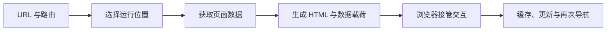

每次设计页面时，按顺序回答：

1. URL 对应哪个页面和布局？
2. 页面内容在构建时、请求时还是浏览器里生成？
3. 数据由服务器取还是浏览器取？
4. HTML 到达后，哪些区域需要交互？
5. 页面和数据能缓存多久，更新后怎样失效？

## 一张图理解 SPA 和元框架首屏

普通客户端 SPA 的典型首屏链路：

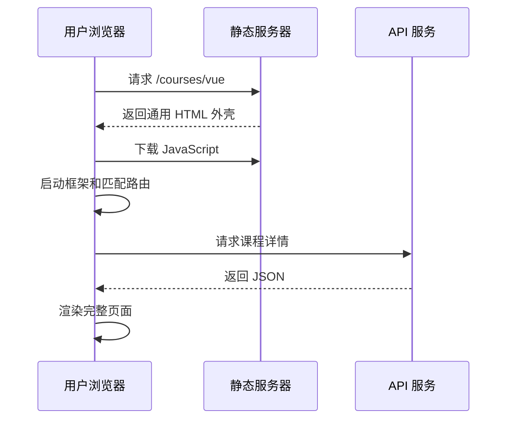

SSR 元框架的典型首屏链路：

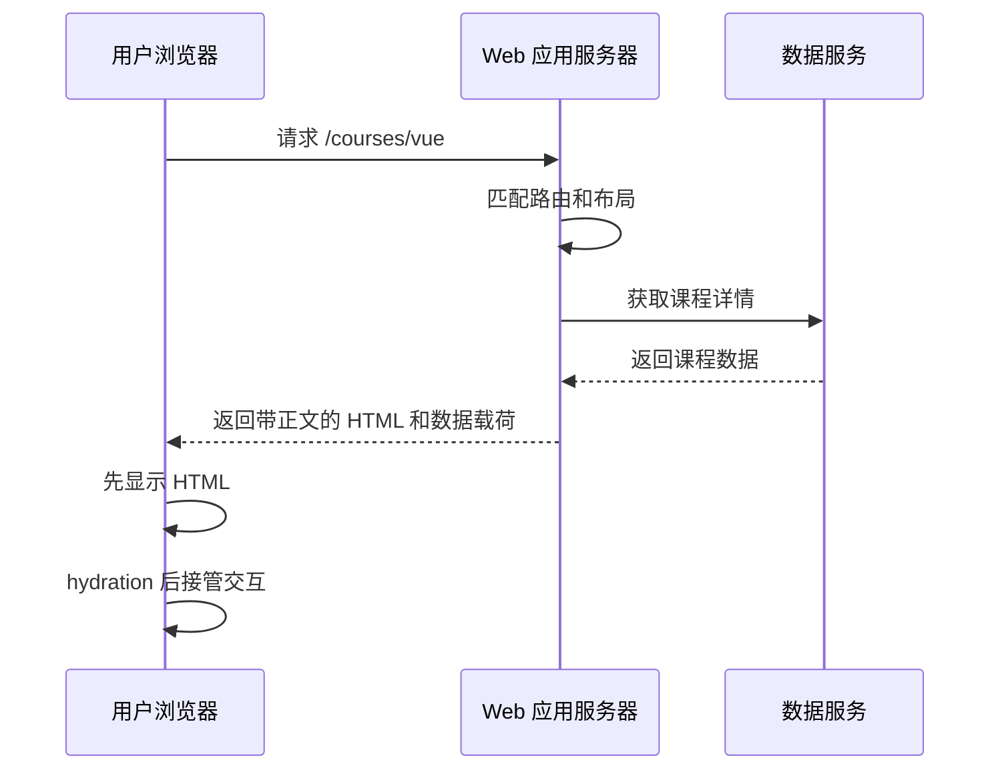

两者不是“一个有 JavaScript，一个没有 JavaScript”。大多数 SSR 页面同样会下载客户端 JavaScript。主要区别是服务器能否先产出可阅读的 HTML。

### 对用户有什么影响

| 维度 | 客户端 SPA | 服务端或预渲染页面 |
| --- | --- | --- |
| 首次响应 | 常先拿到应用外壳 | 可直接拿到正文 HTML |
| SEO | 依赖爬虫执行 JavaScript | 公开内容通常更容易被读取 |
| 服务器成本 | 静态资源压力为主 | 动态 SSR 需要服务器计算 |
| 浏览器交互 | JavaScript 启动后可用 | hydration 后完整可用 |
| 开发约束 | 主要面对浏览器环境 | 同时面对服务端和浏览器环境 |

## 一张图理解代码会在哪里运行

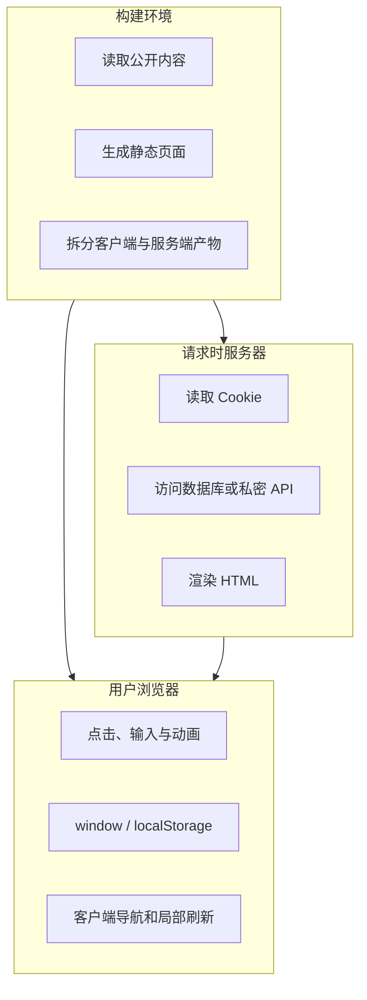

判断一段代码能不能运行，不要只看它写在哪个文件，还要看它最终属于哪个执行边界。

| 能力 | 构建时 | 请求时服务器 | 浏览器 |
| --- | ---: | ---: | ---: |
| 读取仓库里的 Markdown | 可以 | 取决于部署产物 | 通常不直接读取 |
| 读取数据库密码 | 可以，但不应写入产物 | 可以 | 不可以 |
| 读取请求 Cookie | 没有用户请求 | 可以 | 受 Cookie 属性限制 |
| 使用 `window` | 不可以 | 不可以 | 可以 |
| 处理点击事件 | 不可以 | 不可以 | 可以 |
| 生成 SEO HTML | 可以 | 可以 | 太晚，且依赖爬虫能力 |

### 一个实用判断法

看到代码时连续问三次：

```text
这段代码是否依赖某个具体用户的请求？
这段代码是否包含不能公开的能力或密钥？
这段代码是否必须操作浏览器或响应用户交互？
```

- 依赖具体请求：通常放请求时服务器或浏览器。
- 包含密钥、数据库：只能放服务端边界。
- 依赖点击、DOM、浏览器 API：放客户端边界。

## 一张图选择 SSR、SSG、ISR 和 CSR

这些缩写不是互斥的技术阵营。一个项目甚至一个页面里，都可能组合多种策略。

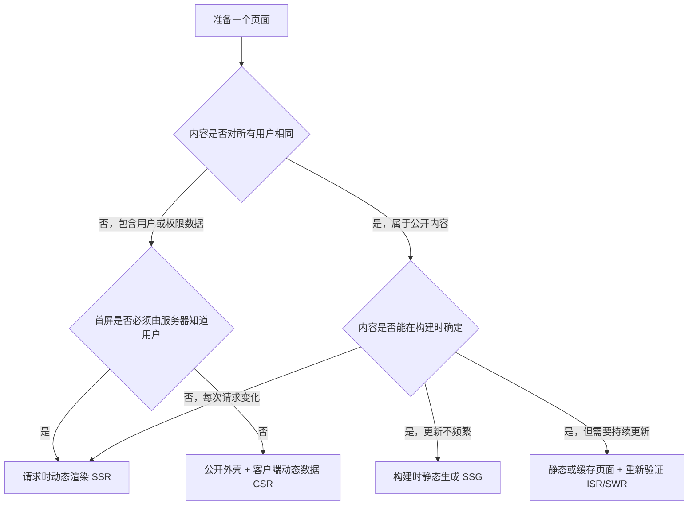

### 用业务页面理解

| 页面 | 推荐起点 | 原因 |
| --- | --- | --- |
| 官网首页 | SSG 或可重新验证的静态页面 | 公开、变化较慢、需要 SEO |
| 课程详情 | SSG / ISR / SWR | 公开内容可缓存，发布后需更新 |
| 搜索结果 | SSR 或客户端请求 | 查询组合多，结果变化快 |
| 个人学习中心 | 动态 SSR 或客户端请求 | 与用户身份有关，不能公共缓存 |
| 后台编辑器 | CSR 为主 | SEO 不重要，交互复杂 |
| 登录页 | 静态外壳 + 服务端动作 | 页面公开，提交必须安全处理 |

先决定数据新鲜度和用户边界，再选择框架 API。不要先看到某个缓存 API，再倒推业务应该怎样工作。

## 一张图理解 hydration

服务端返回的 HTML 只是首屏结果。浏览器还要让组件拥有点击、输入和状态更新能力，这个接管过程通常称为 hydration。

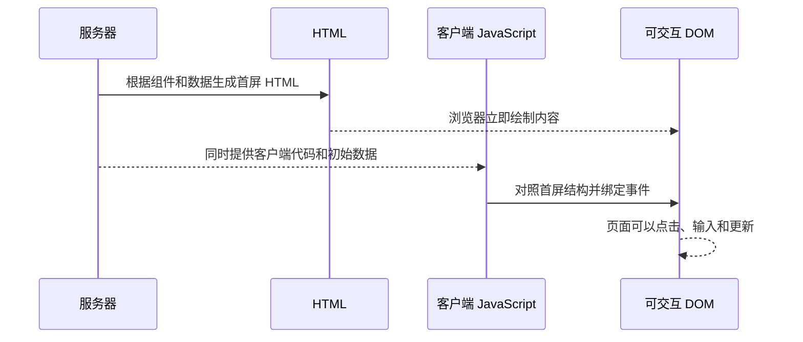

### 为什么会 hydration mismatch

服务端结果和客户端第一次计算结果不相同：

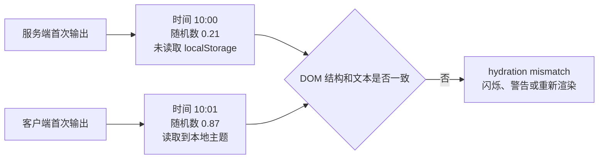

首屏渲染时应避免直接依赖：

- `Math.random()`。
- 当前时间和未统一的时区。
- `window.innerWidth`。
- `localStorage` 中的用户偏好。
- 只在浏览器存在的第三方组件状态。

解决方法不是一律关闭 SSR，而是让首屏使用稳定输入，或把真正只属于浏览器的部分隔离到客户端边界。

## 一张图对照 Nuxt 和 Next 的核心位置

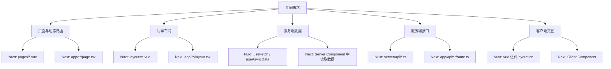

这张图只用于建立对应关系，不表示两套 API 的行为完全一样。学习时应先理解共同问题，再回到当前框架的官方文档确认具体版本行为。

## 一张图理解文件路由和嵌套布局

以课程页面为例：

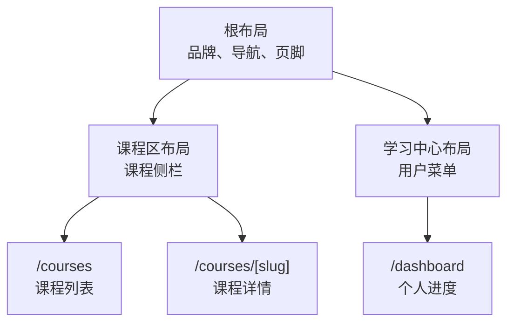

对应目录可以是：

```text
Nuxt
pages/
├─ courses/
│  ├─ index.vue
│  └─ [slug].vue
└─ dashboard.vue
layouts/
├─ default.vue
└─ dashboard.vue

Next
app/
├─ layout.tsx
├─ courses/
│  ├─ layout.tsx
│  ├─ page.tsx
│  └─ [slug]/page.tsx
└─ dashboard/
   ├─ layout.tsx
   └─ page.tsx
```

布局负责稳定外壳，页面负责当前 URL 的业务内容。不要把详情请求、编辑表单状态等页面专属逻辑塞进全局布局。

## 一张图理解服务端取数和数据载荷

元框架要避免“服务器已经取过一次，hydration 时浏览器又取一次”的重复请求。

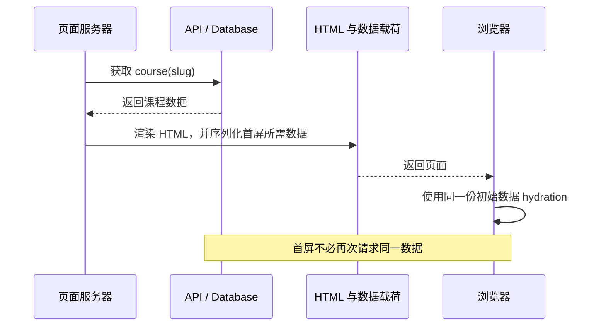

Nuxt 的 `useFetch`、`useAsyncData` 会参与服务端到客户端的数据传递；Next 的 Server Component 结果会通过 React Server Component 数据载荷参与页面组合。它们的具体实现不同，但目标相近：让服务端工作能被客户端首屏复用。

### 数据载荷不是数据库备份

只有客户端渲染所需的数据才应该被序列化。以下内容不能传给浏览器：

- 数据库连接串。
- 私密 API key。
- 完整用户记录中的密码摘要、内部备注。
- 只用于服务端授权判断的敏感字段。

服务端返回 ViewModel 或 DTO，而不是把数据库对象原样交给页面。

## 一张图理解服务端与客户端边界

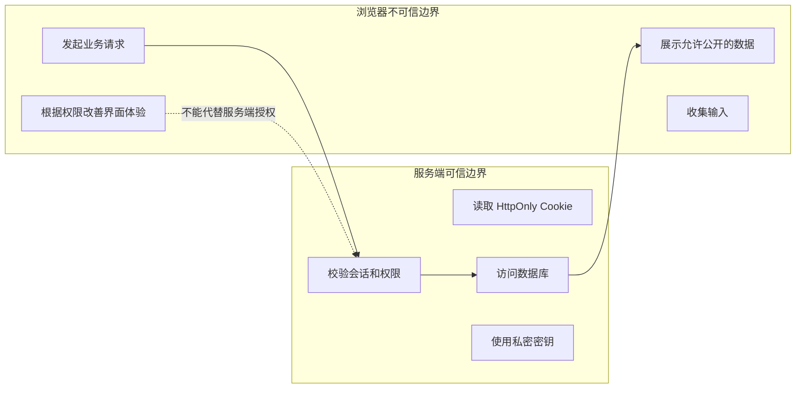

前端隐藏“删除课程”按钮，只是用户体验；真正的删除接口仍要在服务端验证：

1. 是否登录。
2. 是否拥有 `course:delete` 权限。
3. 是否能操作当前租户或当前课程。
4. 操作是否需要审计。

## 一张图理解缓存不是一个开关

页面显示旧数据时，缓存可能来自多层：

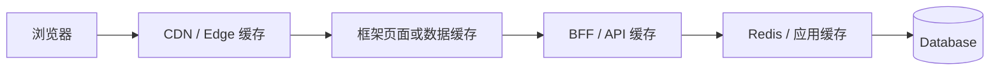

每层都要回答四个问题：

| 问题 | 示例 |
| --- | --- |
| 缓存对象是什么 | HTML、RSC 数据、API JSON、课程详情 |
| 缓存 key 是什么 | URL、语言、用户、租户、查询参数 |
| 多久过期 | 60 秒、1 小时、直到下一次发布 |
| 怎样主动失效 | 按路径、标签、内容版本或部署刷新 |

### 最危险的错误

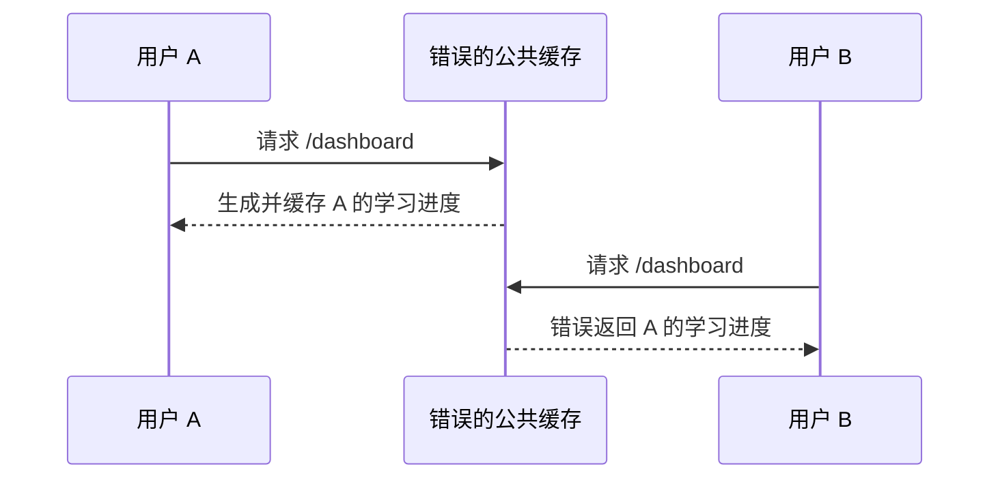

只要响应与用户、租户或权限有关，就不能使用不区分身份的公共缓存。

## 一张图理解认证、会话和授权

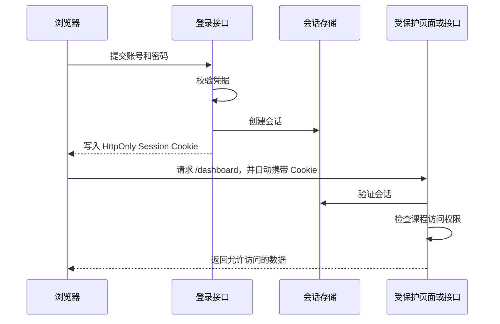

要区分：

- 认证：确认用户是谁。
- 会话：跨请求保持登录状态。
- 授权：判断用户能做什么。

路由中间件可以做快速跳转，但敏感数据和写操作仍需在数据访问层、Route Handler 或 Server API 中做安全校验。

## 一张图理解一次客户端导航

首屏完成后，用户点击站内链接通常不需要整页刷新：

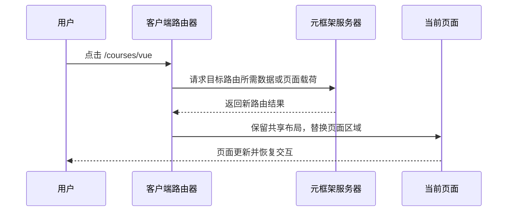

这解释了为什么：

- 首屏和后续导航的网络请求可能不同。
- 全局布局可以保持不卸载。
- 错误只在“刷新页面”或只在“客户端跳转”时出现。
- 排错时两种进入方式都要测试。

## 一张图选择部署形态

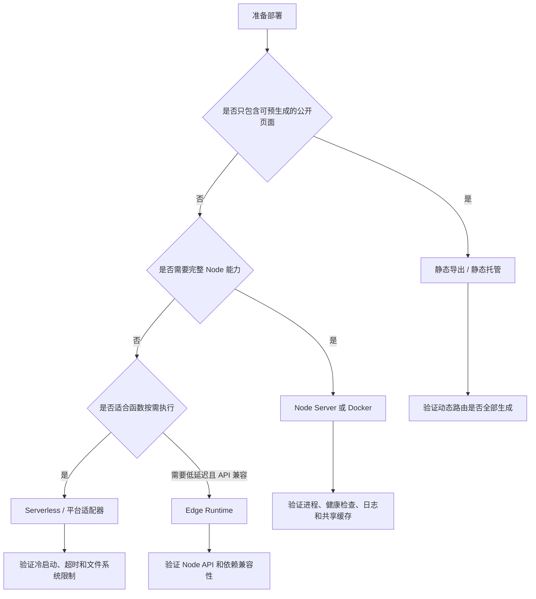

部署方式必须覆盖项目实际使用的能力。需要服务端接口、Cookie 会话和动态 SSR 的项目，不能在不改架构的情况下直接当纯静态站发布。

## 一张图理解完整请求链路

把前面的概念串起来：

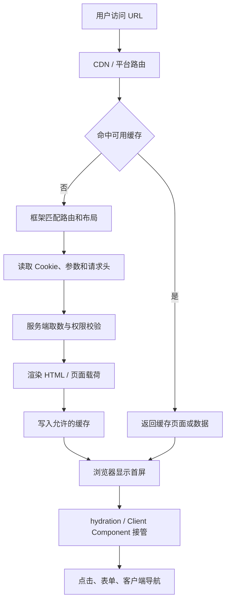

排查问题时沿链路找证据，不要直接猜组件：

- CDN 是否命中旧页面？
- 路由是否匹配了预期文件？
- 服务端是否收到 Cookie？
- 数据请求是否返回正确结果？
- 页面是否被错误缓存？
- 浏览器 hydration 是否失败？

## 一张图理解问题分流

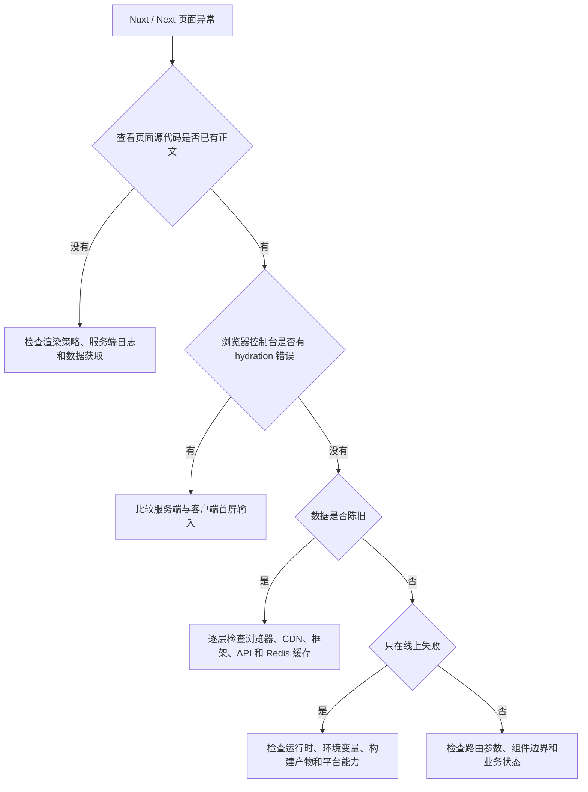

建议至少收集这些证据：

```text
复现 URL 和进入方式（刷新 / 站内跳转）
浏览器 Console 和 Network
页面源代码中是否有正文
服务端请求日志与 traceId
响应头中的 Cache-Control、Age、CDN 命中信息
当前部署模式与运行时
最近一次内容发布、配置变更和部署时间
```

## Nuxt 和 Next 学习时不要机械类比

| 共同问题 | Nuxt 的主要入口 | Next 的主要入口 |
| --- | --- | --- |
| 文件路由 | `pages/` | `app/**/page.tsx` |
| 嵌套布局 | `layouts/`、页面元信息 | 嵌套 `layout.tsx` |
| 服务端取数 | `useFetch`、`useAsyncData` | Server Component 中的数据层 |
| 浏览器交互 | hydration 后的 Vue 组件、客户端限定组件 | Client Component |
| 服务端接口 | `server/api/` | Route Handler |
| 路由保护 | route middleware + server 校验 | Proxy/页面检查 + 数据层校验 |
| 混合渲染 | route rules | 静态、动态和缓存组件组合 |

框架版本会调整 API 和默认缓存行为。例如 Next 16 将旧 Middleware 约定迁移为 Proxy，并通过 `cacheComponents` 统一一组缓存能力；旧版本项目不能机械照搬。项目中应记录当前版本，并以对应版本官方文档、类型提示和生产构建结果为准。

## 最小自测

读完后，尝试不看正文回答：

1. SSR 页面为什么仍可能需要客户端 JavaScript？
2. hydration mismatch 的根因是什么？
3. 为什么用户中心不能直接使用公共页面缓存？
4. 哪些代码必须留在服务端边界？
5. 静态导出为什么可能让 Route Handler 或 Server API 失效？
6. 页面显示旧数据时，应该检查哪些缓存层？

如果其中三个问题回答不清楚，建议回到对应图重新顺着箭头讲一遍。

## 参考资料

- [Nuxt Rendering Modes](https://nuxt.com/docs/4.x/guide/concepts/rendering)
- [Nuxt Data Fetching](https://nuxt.com/docs/4.x/getting-started/data-fetching)
- [Next.js App Router](https://nextjs.org/docs/app)
- [Next.js Dynamic Routes](https://nextjs.org/docs/app/api-reference/file-conventions/dynamic-routes)
- [Next.js Proxy](https://nextjs.org/docs/app/getting-started/proxy)
- [Next.js cacheComponents](https://nextjs.org/docs/app/api-reference/config/next-config-js/cacheComponents)
- [Next.js Server and Client Components](https://nextjs.org/docs/app/getting-started/server-and-client-components)
- [Next.js Authentication Guide](https://nextjs.org/docs/app/guides/authentication)
- [Next.js Deploying](https://nextjs.org/docs/app/getting-started/deploying)

## 下一步学习

继续进入 [Nuxt / Next 从零到项目：课程内容平台](/meta-frameworks/project-from-zero)，把路由、渲染、数据、登录态、缓存、SEO 和部署串成一个可运行项目。遇到异常时，按 [Nuxt / Next 真实项目问题库](/projects/issues-meta-frameworks) 的现象索引查找根因。
