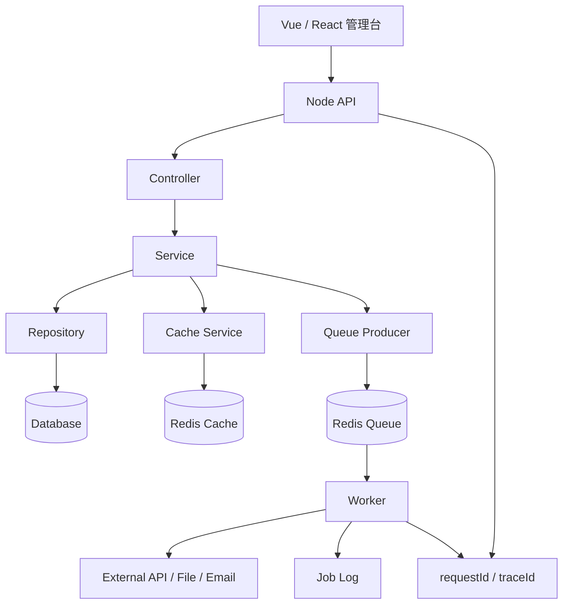
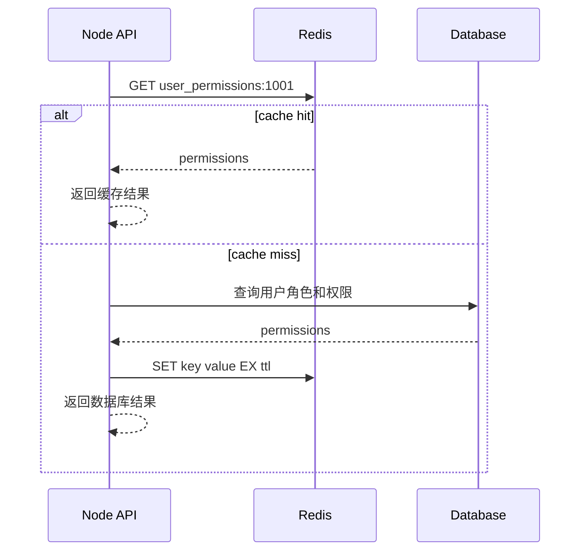
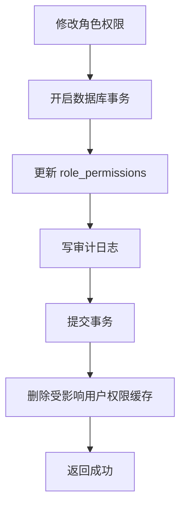
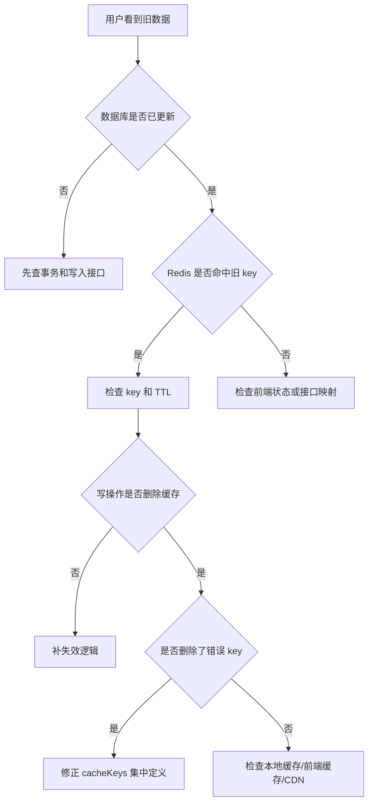
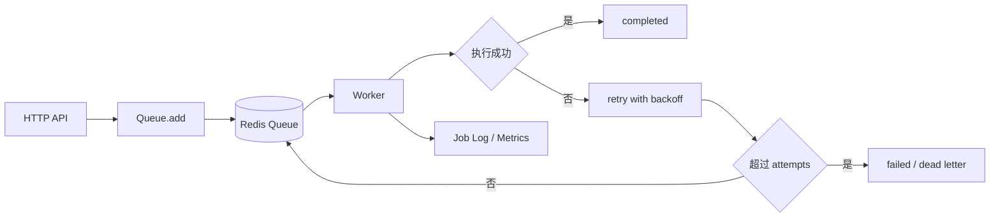
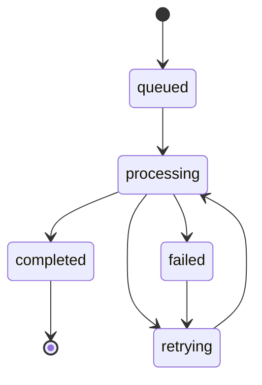
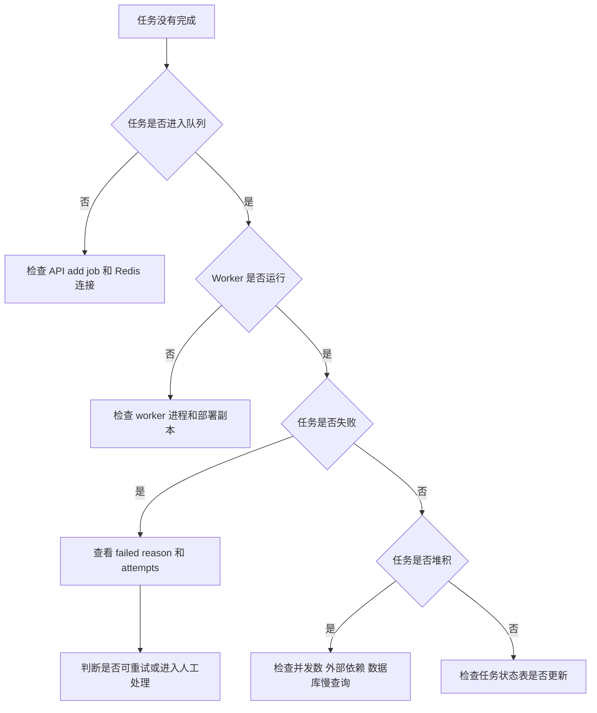

# Node.js Redis 缓存与队列项目

## 这个页面解决什么

Node.js API 服务做到登录、权限和数据库以后，真实项目很快会遇到两类问题：

- 接口越来越慢，用户、权限、字典、看板指标每次都查数据库。
- 导出、通知、同步第三方、生成报表这类慢任务不能放在 HTTP 请求里同步等待。

这篇用一个“后台管理 API + Redis 缓存 + BullMQ 队列”的项目，把缓存、队列、任务重试、失败处理、日志、监控和排障串成闭环。读完后，你应该能回答：

- 哪些数据适合缓存，哪些数据不能缓存。
- 缓存 key、TTL、失效策略怎么设计。
- 更新数据库后为什么通常删除缓存，而不是只更新缓存。
- 慢任务为什么要进入队列，HTTP 接口应该返回什么。
- 队列任务如何重试、退避、幂等和记录失败原因。
- 缓存旧数据、队列堆积、任务重复执行时从哪里查。

## 适合谁看

- 已经完成 [Node 权限 API 从零到项目](/node/permission-api-project)，想补性能和异步任务的人。
- 正在做后台系统的权限缓存、字典缓存、看板缓存、导入导出、消息通知或第三方同步的人。
- 遇到过“角色权限改了但前端还是旧权限”“导出接口超时”“队列任务重复执行”的人。
- 想把 Redis 和 BullMQ 放进真实项目，而不是只跑通 demo 的人。

## 先区分缓存和队列

缓存和队列都可能用 Redis，但解决的问题完全不同：

| 能力 | 解决什么 | 典型场景 | 关键风险 |
| --- | --- | --- | --- |
| 缓存 | 让读请求更快、更少打数据库 | 权限、字典、看板指标、热门配置 | 脏数据、穿透、击穿、雪崩 |
| 队列 | 把慢任务从请求链路挪出去 | 导出、通知、同步、报表、重试 | 重复执行、堆积、失败无人处理 |

Redis 官方文档里 `TTL` 用于查看 key 的剩余过期时间；BullMQ 官方文档把 BullMQ 定位为基于 Redis 的 Node.js 队列系统，并支持失败任务重试和 backoff。项目设计时不要只记 API，要把“缓存一致性”和“任务可靠性”作为核心目标。

## 总体架构

一个后台 API 的缓存与队列链路可以这样组织：



这张图说明：

1. 缓存属于读写路径的一部分，要有明确的数据来源和失效策略。
2. 队列属于异步任务系统，要有生产者、消费者、重试、失败记录和可观测性。
3. HTTP 请求和 Worker 都要带 requestId 或 traceId，方便串起问题。

## 最终项目结构

在现有 Node API 项目基础上扩展：

```text
node-admin-api/
  README.md
  CACHE_NOTES.md
  QUEUE_NOTES.md
  TROUBLESHOOTING.md
  src/
    app.ts
    config/
      env.ts
      redis.ts
    shared/
      cache/
        cacheKeys.ts
        cacheService.ts
        cachePolicy.ts
      queue/
        queueNames.ts
        queueClient.ts
        jobTypes.ts
      logger/
      errors/
    modules/
      auth/
      user/
      role/
      report/
        report.controller.ts
        report.service.ts
        report.queue.ts
    workers/
      reportExport.worker.ts
      notification.worker.ts
```

新增交付物：

| 文件 | 必须写清 |
| --- | --- |
| `CACHE_NOTES.md` | 缓存对象、key 规则、TTL、失效时机、排障方法 |
| `QUEUE_NOTES.md` | 队列名称、任务类型、重试策略、幂等规则、失败处理 |
| `cacheKeys.ts` | 所有缓存 key 集中定义 |
| `queueNames.ts` | 所有队列名集中定义 |
| `jobTypes.ts` | 任务 payload 类型、版本和幂等字段 |

## 缓存适用场景

不是所有数据都应该缓存。先按数据类型判断：

| 数据 | 是否适合缓存 | 原因 |
| --- | --- | --- |
| 权限码、菜单、角色能力 | 适合 | 读多写少，但变更后必须失效 |
| 字典、枚举、系统配置 | 适合 | 变化少，很多页面复用 |
| 看板统计 | 适合 | 查询重，可接受短时间延迟 |
| 用户详情 | 谨慎 | 变更频率中等，需要明确失效 |
| 订单支付状态 | 不建议普通缓存 | 强一致要求高，容易误导用户 |
| 临时验证码 | 适合 Redis，但不是普通缓存 | 需要过期和一次性消费 |

缓存前先写一句话：这个缓存是为了降低数据库压力、降低响应时间，还是保存临时状态。目标不同，策略也不同。

## 旁路缓存流程

后台系统最常见的是 Cache Aside，也就是读时查缓存，未命中再查数据库：



写操作一般这样处理：



不要在事务未提交前删除缓存，否则并发读请求可能把旧数据重新写入缓存。

## 缓存 key 设计

缓存 key 要集中管理，避免每个模块手写字符串：

```ts
export const cacheKeys = {
  userPermissions: (userId: string) => `auth:user:${userId}:permissions`,
  userMenus: (userId: string) => `auth:user:${userId}:menus`,
  dict: (dictCode: string) => `dict:${dictCode}`,
  dashboardMetric: (tenantId: string, range: string) => `dashboard:${tenantId}:${range}`
}
```

key 设计规则：

| 规则 | 原因 |
| --- | --- |
| 包含业务域 | 方便按模块排查 |
| 包含用户、租户或筛选条件 | 防止不同用户读到同一份数据 |
| 包含版本或策略信息 | 权限结构升级时能整体切换 |
| 避免无限制拼接大对象 | 防止 key 过长、不可控 |
| 不把敏感信息放进 key | Redis key 也可能出现在日志和监控里 |

## TTL 与失效策略

每个缓存都要写清 TTL：

| 缓存 | TTL 建议 | 失效方式 |
| --- | --- | --- |
| 权限缓存 | 5 到 30 分钟 | 角色/菜单/权限变更后主动删除 |
| 字典缓存 | 30 分钟到数小时 | 字典变更后删除 |
| 看板指标 | 30 秒到 5 分钟 | 按时间范围自然过期 |
| 验证码 | 1 到 10 分钟 | 使用后删除 |
| 导出进度 | 10 分钟到 24 小时 | 任务完成后保留一段时间 |

Redis 的 `TTL` 可以查看 key 剩余过期时间。排查缓存问题时，至少要看：

```bash
TTL auth:user:1001:permissions
GET auth:user:1001:permissions
```

如果 `TTL` 返回没有过期时间，说明这个 key 可能会长期存在，容易变成脏数据或内存风险。

## 缓存常见问题图



缓存排障不要只清 Redis。要先确认权威数据源、命中的 key、TTL、写操作是否删除了正确 key。

## 队列适用场景

队列适合把慢任务移出 HTTP 请求：

| 场景 | 为什么进队列 |
| --- | --- |
| 导出 Excel | 可能耗时很长，用户不应一直等待 |
| 批量发通知 | 外部通道慢且容易失败 |
| 同步第三方系统 | 需要重试和失败记录 |
| 生成报表 | CPU/IO 重，适合后台执行 |
| 图片、文件处理 | 可能依赖对象存储和转换服务 |

不适合进队列的场景：

- 用户必须立即知道结果的强一致操作。
- 没有幂等设计的扣款、发货、库存扣减。
- 失败后没有补偿和人工处理方式的任务。

## BullMQ 队列模型

一个队列任务系统至少包含生产者、Redis、Worker 和任务日志：



BullMQ 官方文档说明它基于 Redis 实现队列；失败任务可以配置 attempts 和 backoff 做自动重试。项目里要把这些策略写进文档，而不是散落在代码里。

## 队列定义

集中定义队列名：

```ts
export const queueNames = {
  reportExport: 'report-export',
  notification: 'notification',
  thirdPartySync: 'third-party-sync'
} as const
```

定义任务 payload：

```ts
export type ReportExportJob = {
  jobVersion: 1
  requestId: string
  actorId: string
  tenantId: string
  reportType: 'sales' | 'inventory'
  filters: Record<string, string | number | boolean>
}
```

payload 设计规则：

| 规则 | 原因 |
| --- | --- |
| 带 `jobVersion` | 任务结构升级时能兼容旧任务 |
| 带 `requestId` | 能从 HTTP 请求追到 worker |
| 带 `actorId` 和 `tenantId` | 权限、审计和数据范围需要 |
| 不放大对象 | 大对象放数据库或对象存储，队列里只放 ID |
| 放幂等键 | 避免重复执行造成重复通知或重复导出 |

## 生产任务

HTTP 接口只负责创建任务，不同步等待任务完成：

```ts
await reportExportQueue.add(
  'export-sales-report',
  {
    jobVersion: 1,
    requestId,
    actorId: currentUser.id,
    tenantId: currentUser.tenantId,
    reportType: 'sales',
    filters
  },
  {
    jobId: `sales:${currentUser.tenantId}:${requestId}`,
    attempts: 3,
    backoff: {
      type: 'exponential',
      delay: 5000
    },
    removeOnComplete: true
  }
)
```

接口响应：

```json
{
  "taskId": "sales:t1:req-001",
  "status": "queued",
  "message": "导出任务已提交，请稍后在任务中心下载"
}
```

不要让用户在导出接口里等几十秒。前端应该轮询任务状态、订阅通知或进入任务中心查看结果。

## Worker 执行

Worker 要独立启动，和 API 进程分开部署更清晰：

```ts
new Worker<ReportExportJob>(
  queueNames.reportExport,
  async (job) => {
    const { requestId, actorId, tenantId, filters } = job.data

    logger.info({ requestId, actorId, tenantId, jobId: job.id }, 'start report export')

    await reportService.ensureIdempotent(job.id!)
    const file = await reportService.generateSalesReport({ tenantId, filters })
    await reportService.markExportCompleted(job.id!, file.url)
  },
  { connection: redisConnection, concurrency: 3 }
)
```

Worker 规则：

- 每个任务都要有幂等判断。
- 外部请求要有 timeout。
- 失败要抛出错误，让队列进入重试或失败状态。
- 不要吞掉错误后返回成功。
- 任务结果要落库，前端才能查询。

## 任务状态表

队列状态不一定适合直接给业务页面用。建议业务侧维护任务表：



任务表字段建议：

| 字段 | 含义 |
| --- | --- |
| `id` | 业务任务 ID |
| `queue_job_id` | BullMQ job id |
| `type` | 任务类型 |
| `status` | queued、processing、completed、failed |
| `actor_id` | 发起人 |
| `tenant_id` | 租户 |
| `params_json` | 任务参数摘要 |
| `result_json` | 输出文件、统计结果 |
| `error_message` | 失败原因 |
| `created_at` / `updated_at` | 创建和更新时间 |

## 队列常见问题图



队列排障要同时看 BullMQ 状态、Worker 日志、业务任务表和外部依赖日志。

## 缓存和队列如何配合

真实项目里缓存和队列经常一起出现：

| 场景 | 组合方式 |
| --- | --- |
| 报表导出 | 查询结果可缓存，生成文件走队列 |
| 消息通知 | 未读数可缓存，发送通知走队列 |
| 权限变更 | 数据库事务后删缓存，必要时队列通知在线用户刷新 |
| 第三方同步 | 同步任务走队列，最新同步状态可短缓存 |
| 数据看板 | 指标预计算走队列，页面读缓存 |

关键规则：缓存不能成为唯一真相，队列不能替代事务。数据库仍然是业务事实的主要来源。

## 测试清单

| 测试 | 验证内容 |
| --- | --- |
| cache key 测试 | 同一输入生成同一 key，不同用户/租户不会冲突 |
| cache miss 测试 | 未命中时查数据库并写缓存 |
| cache invalidation 测试 | 更新角色权限后删除正确 key |
| TTL 测试 | key 有过期时间，不会永久存在 |
| queue producer 测试 | API 能创建任务并返回 taskId |
| worker 成功测试 | 任务执行成功后状态变 completed |
| worker 失败测试 | 失败会重试，超过次数后记录 failed |
| 幂等测试 | 同一个 job 重复执行不会生成重复结果 |

## 常见问题

### 权限改了但用户还是旧权限

排查顺序：

1. 角色权限事务是否提交成功。
2. 删除的是不是受影响用户的权限 key。
3. key 是否包含租户、用户、权限版本。
4. 后端是否还有本地内存缓存。
5. 前端是否缓存了旧用户上下文。

### 缓存突然打满 Redis 内存

常见原因：

- key 没有 TTL。
- 把大列表、大对象长期缓存。
- key 包含随机值，导致无法复用。
- 队列和缓存共用 Redis，但没有容量隔离。

处理方式：

- 给所有缓存设置 TTL。
- 大对象放对象存储或数据库，缓存只放摘要。
- 按业务域统计 key 数量。
- 生产环境监控内存、key 数、淘汰次数和慢命令。

### 导出任务一直 pending

排查顺序：

1. API 是否成功 `add` 任务。
2. Worker 进程是否启动。
3. Worker 是否连接同一个 Redis。
4. 队列名是否一致。
5. concurrency 是否太低。
6. 外部依赖是否卡住。

### 任务重复执行

队列重试、Worker 重启、网络抖动都可能导致重复执行。解决方式不是假设任务只执行一次，而是做幂等：

- 使用稳定 `jobId`。
- 业务表记录任务状态。
- 写文件、发通知、同步外部系统前检查是否已处理。
- 外部接口如果支持幂等键，必须传递。

## 交付文档模板

`CACHE_NOTES.md`：

```md
# 缓存说明

## 缓存对象

## key 规则

## TTL 策略

## 写操作失效规则

## 排障命令

## 风险和限制
```

`QUEUE_NOTES.md`：

```md
# 队列说明

## 队列列表

## 任务类型

## payload 结构

## retry 和 backoff

## 幂等规则

## 失败处理

## 监控指标

## 联调样例
```

## 下一步学习

建议按这个顺序推进：

1. 完成 [Node 权限 API 从零到项目](/node/permission-api-project)，先有用户、角色、权限和审计日志。
2. 用本页给权限、字典和看板补 Redis 缓存。
3. 给导出、通知或第三方同步补 BullMQ 队列。
4. 回到 [数据库与缓存问题](/projects/issues-database)，补缓存旧数据和 Redis 内存排障。
5. 回到 [消息队列项目案例](/projects/message-queue-case)，补真实业务里的任务治理。

## 参考资料

- [Redis TTL command](https://redis.io/docs/latest/commands/ttl/)
- [Redis client-side caching reference](https://redis.io/docs/latest/develop/reference/client-side-caching/)
- [BullMQ documentation](https://docs.bullmq.io/)
- [BullMQ retrying failing jobs](https://docs.bullmq.io/guide/retrying-failing-jobs)
