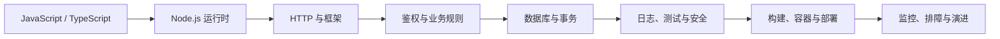

# Node.js 学习导览

## 适合谁看

适合已经掌握 JavaScript 基础，准备进入后端 API、BFF、命令行工具、后台任务或全栈开发的人。你不需要先会某个框架，但应该理解变量、函数、对象、Promise、`async/await` 和 ES Module。

Node.js 不是一套新语法，而是 JavaScript 在服务端的运行时。真正需要补的是运行环境、HTTP、进程、数据库、并发、错误、安全、测试和部署边界。

## 当前学习基线

本站以 **Node.js 24 LTS** 作为生产学习基线，以 Fastify 5 和 TypeScript 演示工程实践。Node.js 26 当前处于 Current 阶段，适合观察新能力，不作为本教程部署基线。生产项目应使用仍受支持的 LTS 版本，并在本地、CI、镜像和生产环境固定同一主版本。

Node.js 已能直接执行只包含可擦除类型语法的 TypeScript，但运行时不会替你做类型检查，也不会读取 `tsconfig.json`。本模块的完整项目仍使用 `tsc` 做静态检查和构建，开发阶段使用 `tsx` 运行源码。

## 先建立完整链路

只会写一个返回 JSON 的路由，还不等于会交付后端服务。你最终要能解释一次请求如何进入进程、如何校验输入、如何识别用户、如何执行事务、如何记录证据，以及失败后如何恢复。

## 你会学到什么

- Node.js 进程、V8、事件循环、异步 I/O、线程池和 Worker Threads 的职责。
- npm、`package.json`、ESM、依赖边界和版本一致性。
- Fastify 请求生命周期、插件封装、Schema 校验和统一错误响应。
- 认证、授权、会话失效、401/403 和后端权限校验。
- PostgreSQL 连接池、参数化查询、事务、锁和迁移。
- 结构化日志、request id、优雅停机、健康检查和观测指标。
- 单元测试、API 集成测试、数据库测试和故障注入。
- 文件上传、缓存、队列、流、背压、CPU 密集任务和性能排查边界。

## 推荐学习顺序

<LearningPath :steps="[
  { title: '图解 Node.js 核心概念', description: '先用图理解进程、事件循环、请求生命周期、数据库、鉴权、流、部署和排障。', link: '/node/visual-guide', badge: '图解' },
  { title: '运行时与事件循环', description: '理解异步 I/O、微任务、CPU 阻塞和 Worker Threads 的边界。', link: '/node/runtime-event-loop', badge: '基础' },
  { title: '包管理与模块化', description: '掌握 package.json、npm scripts、ESM/CommonJS、锁文件和依赖治理。', link: '/node/package-modules', badge: '工程' },
  { title: 'HTTP API 开发', description: '学习路由、请求生命周期、Schema 校验、响应序列化和分层。', link: '/node/http-api', badge: '接口' },
  { title: '鉴权与会话', description: '区分认证、授权、Cookie、Token、刷新机制、401 和 403。', link: '/node/auth-session', badge: '权限' },
  { title: '数据库集成', description: '学习连接池、参数化查询、Repository、事务和配置边界。', link: '/node/database-integration', badge: '数据' },
  { title: '错误处理与日志', description: '建立错误分类、统一响应、日志脱敏和 request id 证据链。', link: '/node/error-logging', badge: '质量' },
  { title: '测试策略', description: '用单元、接口和数据库测试覆盖成功、边界与失败路径。', link: '/node/testing', badge: '测试' },
  { title: 'Node.js 安全基础', description: '处理输入、注入、鉴权、上传、依赖、密钥和限流风险。', link: '/node/security', badge: '安全' },
  { title: '项目结构与部署', description: '组织配置、启动、健康检查、优雅停机、容器和反向代理。', link: '/node/project-deployment', badge: '交付' },
  { title: 'Node 权限 API 从零到项目', description: '用 Fastify、TypeScript 和 PostgreSQL 完成可运行的用户角色权限 API。', link: '/node/permission-api-project', badge: '实战' },
  { title: 'Redis 缓存与 BullMQ 队列项目', description: '继续处理缓存一致性、队列重试、幂等和失败任务。', link: '/node/cache-queue-project', badge: '异步' },
  { title: 'Node.js 真实项目问题库', description: '按现象、证据、根因、修复和回归处理真实线上问题。', link: '/projects/issues-node', badge: '排障' },
  { title: 'Node.js 专项练习', description: '通过 12 个练习、故障注入和交付清单验证能力。', link: '/roadmap/node-practice', badge: '练习' },
  { title: '常见问题', description: '快速排查端口、环境变量、跨域、请求体、异步错误和进程异常。', link: '/node/troubleshooting', badge: '速查' }
]" />

## 三种阅读方式

### 第一次学习

按导览顺序阅读。每章至少完成一个最小实验，不要只复制最终代码。看到图时先用自己的话解释箭头，再看文字说明。

### 正在做项目

直接进入 [Node 权限 API 从零到项目](/node/permission-api-project)，遇到概念缺口时回到对应专题。每完成一个阶段就运行测试和手工请求，不要等到最后一起调试。

### 正在排查故障

先进入 [Node.js 真实项目问题库](/projects/issues-node)，按模块加载、事件循环、线程池、Stream、异步上下文、进程生命周期和多实例分流。先收集日志、状态码、耗时和资源指标，再修改代码。

## 每个阶段如何验收

| 阶段 | 不足以证明掌握 | 可验收结果 |
| --- | --- | --- |
| 运行时 | 背出“单线程、非阻塞” | 能解释 I/O 与 CPU 任务走不同路径，并复现事件循环延迟 |
| HTTP | 能写一个 GET 路由 | 能处理输入校验、错误码、超时、取消和统一响应 |
| 鉴权 | 能签发 Token | 能稳定区分 401/403，并证明后端做动作级授权 |
| 数据库 | 能执行 SQL | 能正确使用连接池、参数化查询和同一连接事务 |
| 质量 | 有日志和测试文件 | 能用 request id 复盘失败请求，并覆盖关键失败路径 |
| 部署 | 本地能启动 | 能构建镜像、通过健康检查、优雅停机并完成回滚演练 |

## Node.js 适合做什么

| 场景 | 典型项目 | 重点能力 |
| --- | --- | --- |
| API 服务 | 登录、用户、订单、内容接口 | HTTP、鉴权、事务、日志 |
| BFF | 聚合多个后端接口 | 超时、并发、降级、缓存 |
| 实时服务 | WebSocket、协作和通知 | 连接管理、多实例广播、背压 |
| 后台任务 | 导出、邮件、图片处理 | 队列、幂等、重试、死信 |
| CLI 与自动化 | 代码生成、迁移、发布脚本 | 文件系统、进程、错误码 |
| 构建工具 | Vite、ESLint、文档生成 | 模块、插件、性能和缓存 |

Node.js 不会自动解决 CPU 密集计算、跨实例一致性和数据库竞争。图片编码、大型压缩、复杂解析等 CPU 任务要评估 Worker Threads、独立任务服务或其他运行时；多实例状态必须放到共享系统中。

## 推荐项目顺序

1. 先做一个只有健康检查和任务列表的最小 API。
2. 完成 [Node 权限 API 从零到项目](/node/permission-api-project)，建立分层、数据库、鉴权和测试闭环。
3. 完成 [Redis 缓存与 BullMQ 队列项目](/node/cache-queue-project)，处理跨请求和后台任务问题。
4. 在 [Node.js 专项练习](/roadmap/node-practice) 中注入 ESM 入口、事件循环阻塞、Stream 背压、open handles、SIGTERM 和多实例故障。
5. 用 [Node.js 真实项目问题库](/projects/issues-node) 写至少五份完整排障记录。

## 学习检查

- [ ] 能说明 Node.js、V8、libuv、操作系统和应用代码各自负责什么。
- [ ] 能区分 Promise 微任务、`process.nextTick`、计时器和 I/O 回调。
- [ ] 能解释为什么异步函数里仍然可能阻塞全部请求。
- [ ] 能画出 Fastify 从接收请求到序列化响应的生命周期。
- [ ] 能使用同一数据库连接执行 `BEGIN / COMMIT / ROLLBACK`。
- [ ] 能区分认证、授权、401 和 403。
- [ ] 能让错误响应、结构化日志和 request id 对得上。
- [ ] 能在收到终止信号后停止接收新请求并释放资源。

## 参考资料

- [Node.js Releases](https://nodejs.org/en/about/previous-releases)
- [Node.js TypeScript](https://nodejs.org/api/typescript.html)
- [Node.js Test Runner](https://nodejs.org/api/test.html)
- [Fastify Documentation](https://fastify.dev/docs/latest/)

## 下一步

从 [图解 Node.js 核心概念](/node/visual-guide) 开始。如果你还不熟悉 Promise、错误传播和 ESM，先回到 [JavaScript 学习导览](/javascript/introduction)。
