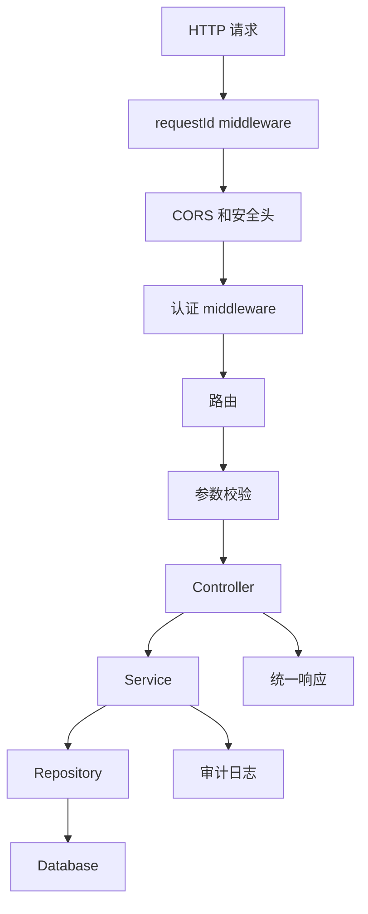
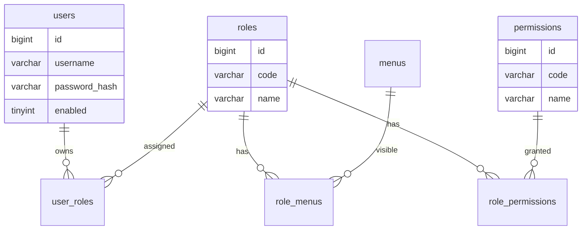
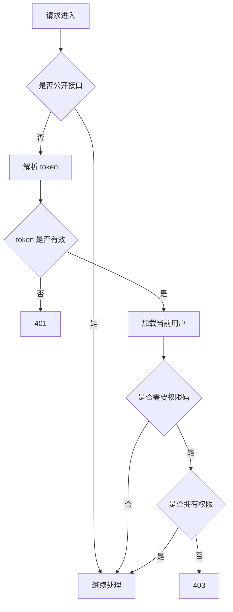
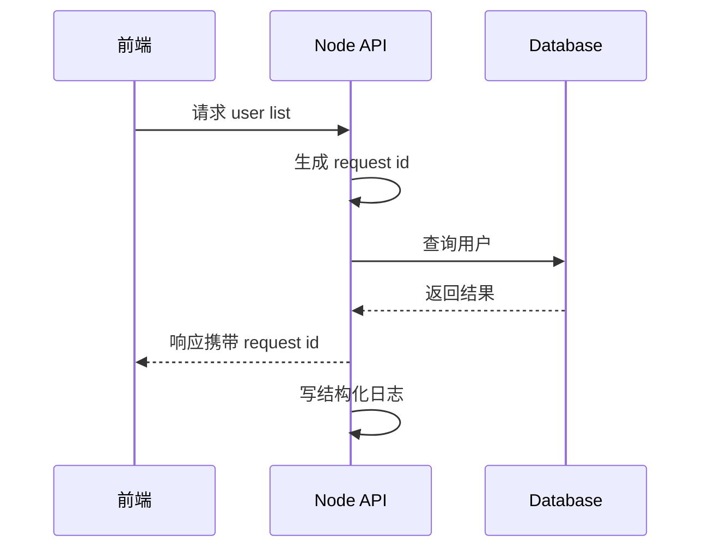
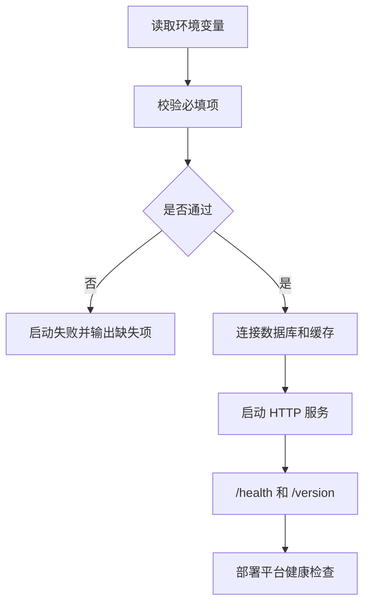

# Node 权限 API 从零到项目

## 适合谁看

适合已经学过 Node.js、HTTP API、鉴权、数据库和错误处理，但还没有完整写过后台权限 API 的人。

这篇用“用户、角色、菜单、按钮权限”作为案例，讲清楚一个 Node API 项目应该如何分层、建模、鉴权、授权、写事务、记录日志和准备部署。

## 项目目标

第一版 API 包含：

- `/health` 健康检查。
- 登录、退出、当前用户。
- 用户列表、新增、编辑、启用禁用。
- 角色列表、角色授权。
- 菜单树。
- 按钮权限码。
- 统一错误响应。
- 结构化日志和 request id。
- 数据库迁移说明。

## 请求链路



从一开始就把链路分清楚，后续问题会容易排查。

## 推荐目录结构

```text
src/
├─ app.ts
├─ server.ts
├─ config/
│  └─ env.ts
├─ middlewares/
│  ├─ request-id.ts
│  ├─ auth.ts
│  └─ error-handler.ts
├─ modules/
│  ├─ auth/
│  │  ├─ auth.controller.ts
│  │  ├─ auth.service.ts
│  │  └─ auth.repository.ts
│  ├─ users/
│  ├─ roles/
│  └─ permissions/
├─ db/
│  ├─ client.ts
│  └─ migrations/
├─ shared/
│  ├─ errors.ts
│  ├─ logger.ts
│  └─ response.ts
└─ tests/
```

## 分层职责

| 层 | 负责 | 不应该做 |
| --- | --- | --- |
| Controller | 接收请求、调用 service、返回响应 | 写 SQL、写复杂业务 |
| Service | 业务规则、事务、权限、审计 | 直接处理 HTTP 细节 |
| Repository | 数据库读写 | 判断业务权限 |
| Middleware | request id、认证、错误处理 | 写具体业务流程 |
| Config | 读取和校验环境变量 | 在业务里散落 `process.env` |

## 数据模型



数据库结构要和 [数据库项目落地实践](/database/project-practice) 保持一致：字段、约束、索引、注释和迁移说明都要写清楚。

## 统一响应格式

建议响应保持稳定：

```ts
interface ApiSuccess<T> {
  success: true
  data: T
  requestId: string
}

interface ApiFailure {
  success: false
  error: {
    code: string
    message: string
  }
  requestId: string
}
```

这样前端可以统一处理错误和 request id。

## 认证和授权



401 和 403 的语义必须稳定：

- 401：未登录或登录失效。
- 403：已登录但没有操作权限。

## 角色授权事务

角色授权通常包含多张关系表，必须使用事务。

```ts
await db.transaction(async (tx) => {
  await roleRepository.ensureRoleExists(tx, roleId)

  await roleRepository.replaceRoleMenus(tx, roleId, menuIds)
  await roleRepository.replaceRolePermissions(tx, roleId, permissionIds)

  await auditRepository.create(tx, {
    actorId: currentUser.id,
    action: 'role.assign-permissions',
    targetId: roleId,
    detail: { menuIds, permissionIds }
  })
})
```

事务注意事项：

- 事务内只放必要数据库操作。
- 先校验角色、菜单、权限是否存在。
- 保存审计日志。
- 提交后删除权限缓存。

## 日志和 request id



日志至少记录：

- request id。
- method 和 path。
- 当前用户 ID。
- 状态码。
- 耗时。
- 错误码。

不要记录明文密码、完整 token、身份证、银行卡等敏感信息。

## 环境变量

启动时校验环境变量，不要等请求进来才报错。



这条链路能避免“服务启动了，但一进请求才发现配置缺失”的问题。

```ts
const requiredEnv = ['DATABASE_URL', 'JWT_SECRET', 'NODE_ENV'] as const

for (const key of requiredEnv) {
  if (!process.env[key]) {
    throw new Error(`Missing env: ${key}`)
  }
}
```

README 要说明：

```text
DATABASE_URL=...
REDIS_URL=...
JWT_SECRET=...
PORT=3000
```

## 测试策略

优先写这些测试：

| 测试 | 目的 |
| --- | --- |
| 登录成功和失败 | 验证认证边界 |
| 未登录访问用户列表 | 应返回 401 |
| 无权限删除用户 | 应返回 403 |
| 角色授权事务 | 防止半更新 |
| 参数校验 | 防止脏数据进入 service |
| 统一错误响应 | 防止前端无法识别错误 |

## 验收清单

- `/health` 可以不依赖数据库快速返回应用存活状态。
- 认证和授权分开。
- 401、403、业务错误码语义稳定。
- controller、service、repository 分层清晰。
- 关键写操作有事务和审计日志。
- 数据库迁移有字段注释和变更说明。
- 日志能通过 request id 串起一次请求。
- README 写清启动、环境变量、迁移、测试和部署。

## 实际项目常见问题

### 问题 1：异步错误导致进程崩溃

统一 async handler 或框架级错误处理中间件，避免 Promise rejection 漏掉。

### 问题 2：角色授权后前端权限不更新

事务提交后删除相关用户权限缓存，并让前端重新获取用户上下文。

### 问题 3：接口偶发慢

先看 request id 对应的接口耗时，再看数据库慢查询、连接池等待、外部服务耗时和同步 CPU 计算。

## 下一步学习

继续学习 [HTTP API 开发](/node/http-api)、[鉴权与会话](/node/auth-session)、[数据库集成](/node/database-integration) 和 [数据库项目落地实践](/database/project-practice)。
