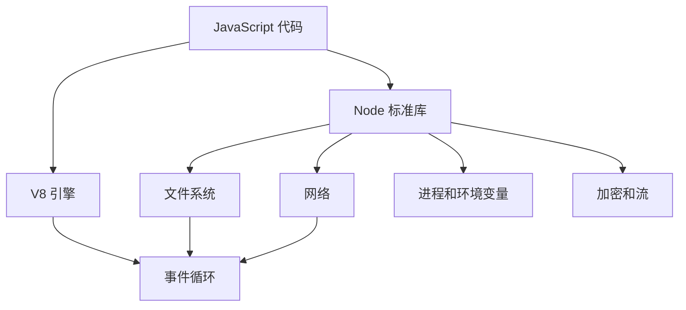
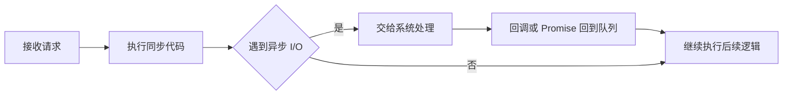
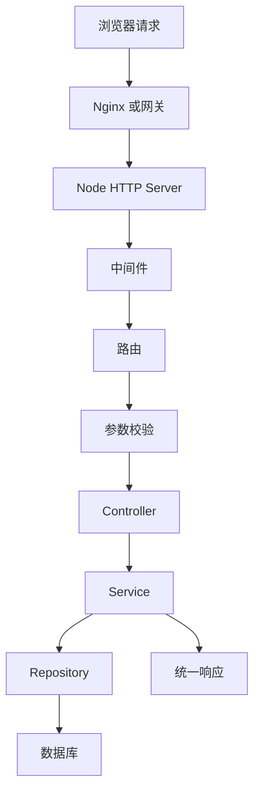
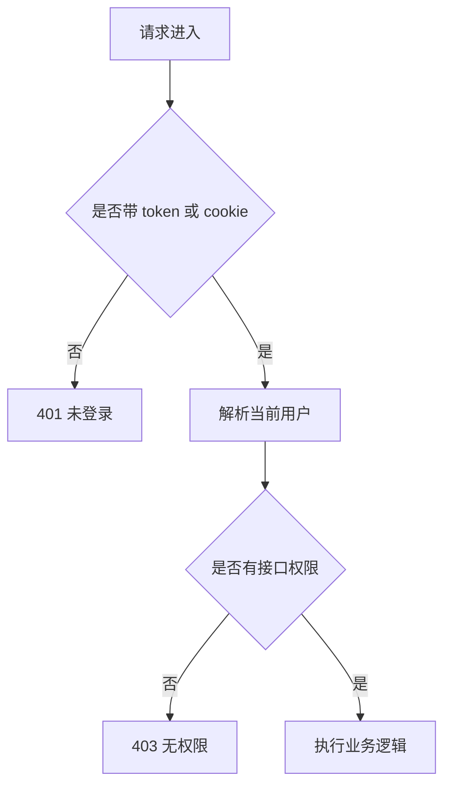
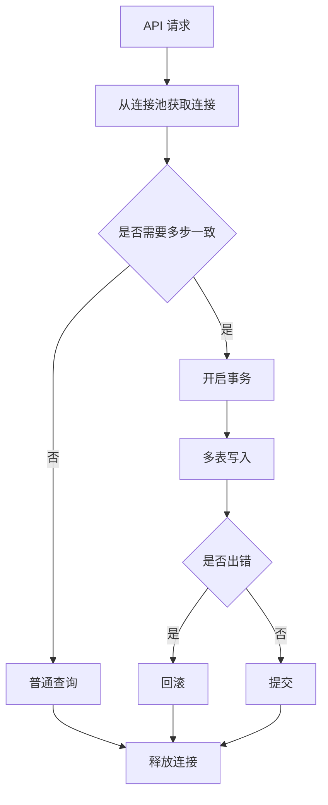
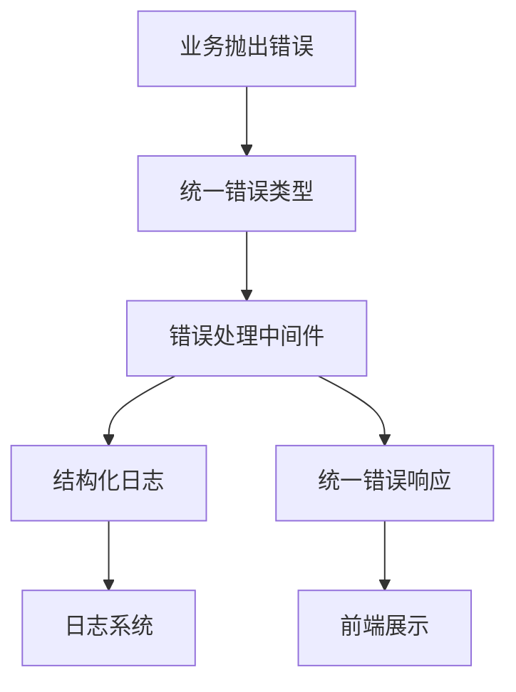
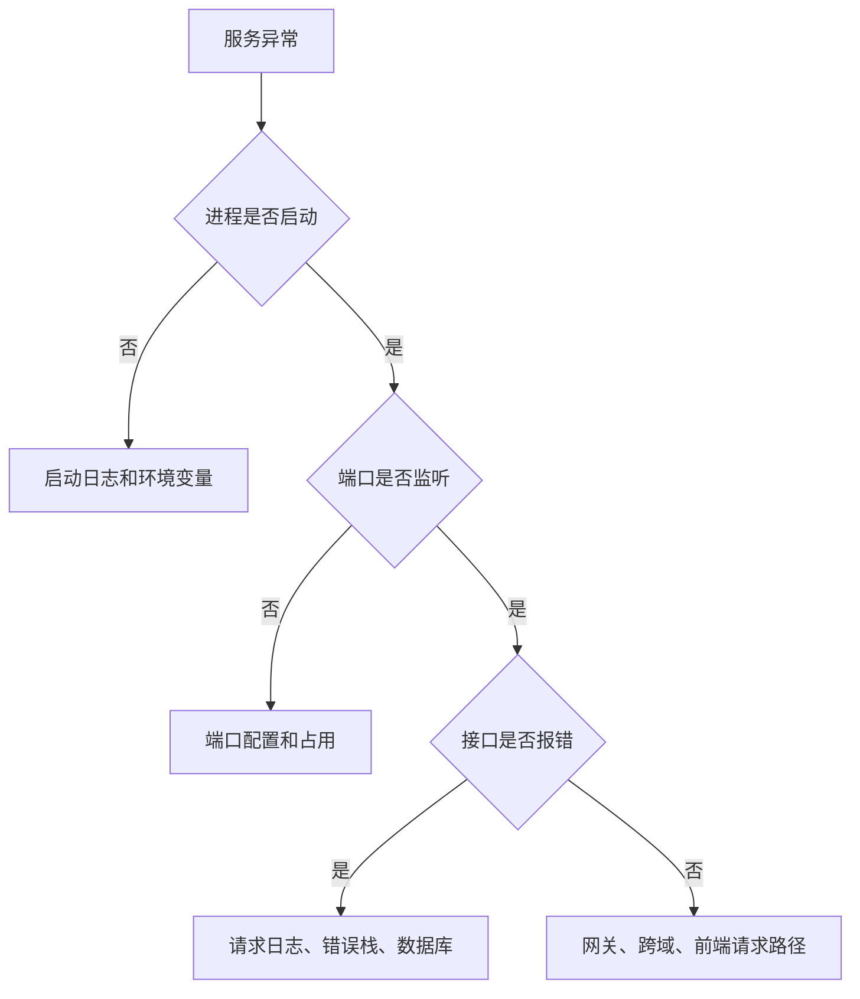

# 图解 Node.js 核心概念

## 适合谁看

适合已经会 JavaScript，准备用 Node.js 写 API、脚本、BFF 或后端服务，但对运行时、事件循环、请求链路、数据库连接和部署还没有整体认识的人。

Node.js 不是“浏览器外的 JavaScript”这么简单。它要处理网络、文件、进程、环境变量、数据库连接、日志、错误和部署边界。

## 你会学到什么

- Node.js 运行时由哪些能力组成。
- 事件循环和异步 I/O 的基本模型。
- 一个 HTTP 请求如何经过中间件、路由、服务层和数据库。
- 鉴权、会话和权限在后端请求链路中的位置。
- 错误处理和日志应该如何贯穿服务。
- Node 项目排错应该按什么路径进行。

## Node.js 运行时组成

浏览器里没有直接访问文件系统、启动服务器、读取环境变量的能力。Node.js 提供了这些服务端能力。

## 事件循环和异步 I/O

异步 I/O 不代表 CPU 计算会变快。如果在 Node 进程里执行大量同步计算，仍然会阻塞其他请求。

## HTTP API 请求链路

真实项目里不要把所有逻辑写在路由函数里。

| 层 | 负责什么 |
| --- | --- |
| Middleware | 鉴权、日志、请求 ID、跨域 |
| Controller | 接收参数、调用服务、返回响应 |
| Service | 业务规则、事务、权限判断 |
| Repository | 数据访问、SQL/ORM 查询 |

## 鉴权和授权位置

401 和 403 要区分：

- 401：不知道你是谁，或者登录失效。
- 403：知道你是谁，但你没有权限。

前端隐藏按钮不能替代后端授权。敏感接口必须在后端检查权限。

## 数据库连接和事务

事务只包住必须原子完成的数据库操作。不要在事务里做慢网络请求，否则会延长锁持有时间。

## 错误和日志链路

建议每个请求都有 request id。排查时可以从前端错误、后端日志、数据库慢查询串起同一条链路。

## Node.js 排错路径

常用排查点：

- 端口是否监听。
- 环境变量是否加载。
- 数据库连接是否正常。
- 错误是否被统一捕获。
- 日志里是否有 request id。
- 容器是否监听 `0.0.0.0`。

## 实际项目常见问题

### 问题 1：异步错误没有被捕获

确认框架是否支持自动捕获 async handler 错误。如果不支持，需要包装异步路由或使用统一错误处理。

### 问题 2：本地能连数据库，容器里连不上

Compose 网络里通常要使用服务名，例如 `mysql`，不是 `localhost`。

### 问题 3：接口偶发变慢

先看接口耗时，再看数据库慢查询、外部服务耗时、连接池等待和同步 CPU 计算。

## 下一步学习

继续学习 [运行时与事件循环](/node/runtime-event-loop)、[HTTP API 开发](/node/http-api)、[鉴权与会话](/node/auth-session) 和 [数据库集成](/node/database-integration)。
