# 图解 Node.js 核心概念

## 适合谁看

适合已经会 JavaScript，准备用 Node.js 写 API、BFF、命令行工具或后台任务，但还不能把运行时、事件循环、HTTP、数据库、鉴权、日志和部署串成一条完整链路的人。

本页不要求你背内部实现。目标是先建立可用于开发和排障的模型，再进入具体代码。

## 阅读方法

每张图按三个问题阅读：

1. 入口是什么？
2. 哪一步可能等待、失败或阻塞？
3. 出问题时能留下什么证据？

读完后应该能画出自己的服务链路，而不是只记住“Node 是单线程、异步、非阻塞”三个词。

## 1. Node.js 到底是什么

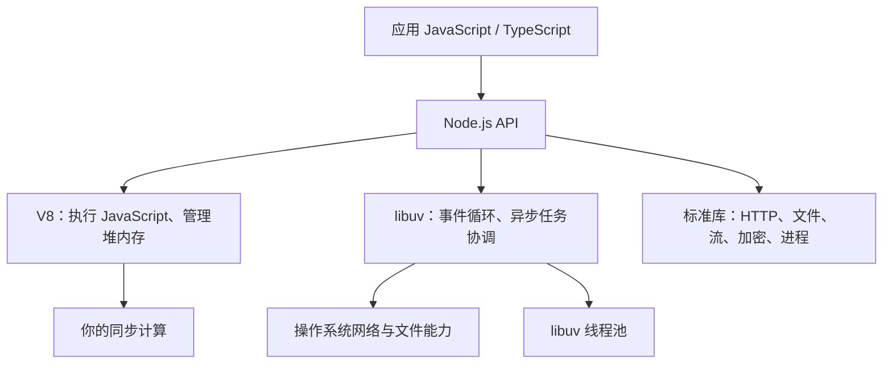

| 部分 | 主要职责 | 常见误解 |
| --- | --- | --- |
| V8 | 执行 JavaScript、垃圾回收、JIT | V8 会自动把业务代码并行执行 |
| libuv | 事件循环和跨平台异步抽象 | 所有异步任务都在线程池中 |
| 操作系统 | 网络、文件描述符、调度 | `await` 会让操作系统替你完成 CPU 计算 |
| Node 标准库 | 把运行时能力暴露给应用 | 浏览器和 Node 的全局 API 完全一样 |

Node.js 让一个进程可以高效等待大量 I/O，但不会让同步 JavaScript 自动变成并行代码。

## 2. 一个服务进程如何启动

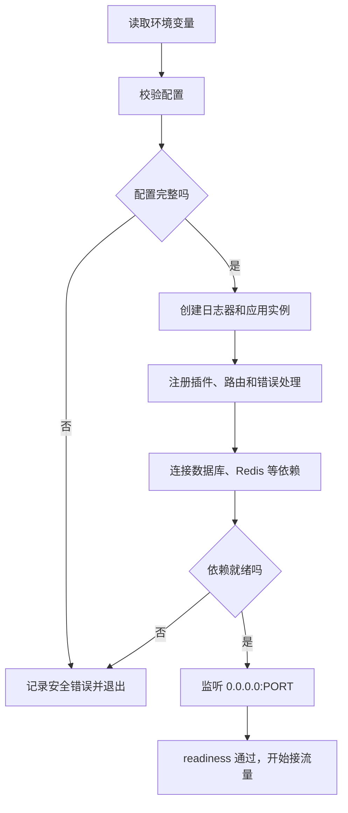

启动失败应尽早发生。比起“进程能监听端口，但第一条请求才发现 `DATABASE_URL` 缺失”，启动阶段校验失败更容易发现，也更容易被部署平台处理。

### 存活与就绪不是一回事

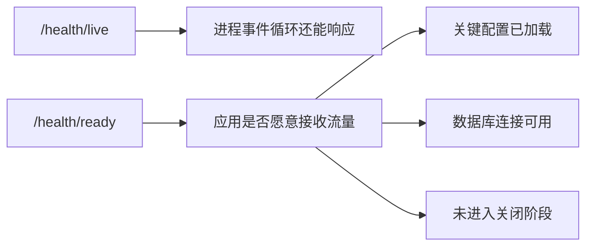

- Liveness 失败通常触发重启。
- Readiness 失败通常先摘除流量，不一定立即重启。
- 不要让 liveness 执行昂贵 SQL，否则数据库波动可能制造重启风暴。

## 3. 事件循环解决什么

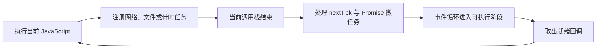

事件循环的价值是：当前 JavaScript 不必一直原地等待 I/O。等网络或文件操作完成后，对应回调再进入可执行队列。

### 简化阶段图

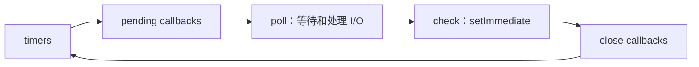

这是排障模型，不是可以依赖的精确调度协议。Node 和 libuv 版本会调整阶段细节；业务正确性不应依赖两个无明确先后保证的回调“通常谁先执行”。

## 4. `nextTick`、Promise、计时器和 I/O

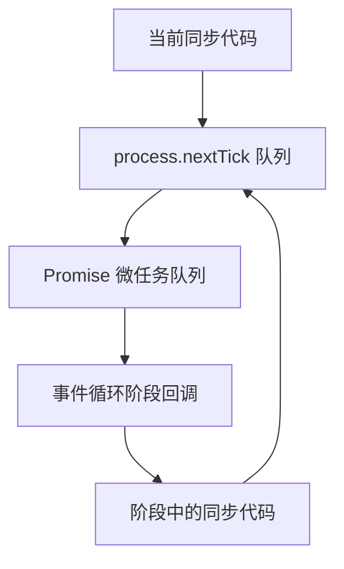

```js
console.log('A')

setTimeout(() => console.log('timer'), 0)
setImmediate(() => console.log('immediate'))
Promise.resolve().then(() => console.log('promise'))
process.nextTick(() => console.log('nextTick'))

console.log('B')
```

稳定可以说明的是：同步代码先完成，`nextTick` 和 Promise 微任务会在进入后续事件循环回调前处理。`setTimeout(0)` 与 `setImmediate()` 的相对顺序受调用位置和 I/O 上下文影响，不要把一次运行结果当成永远的规则。

连续递归安排 `process.nextTick` 或微任务可能让事件循环长期没有机会处理 I/O，这也是一种阻塞。

## 5. I/O 密集和 CPU 密集走不同路径

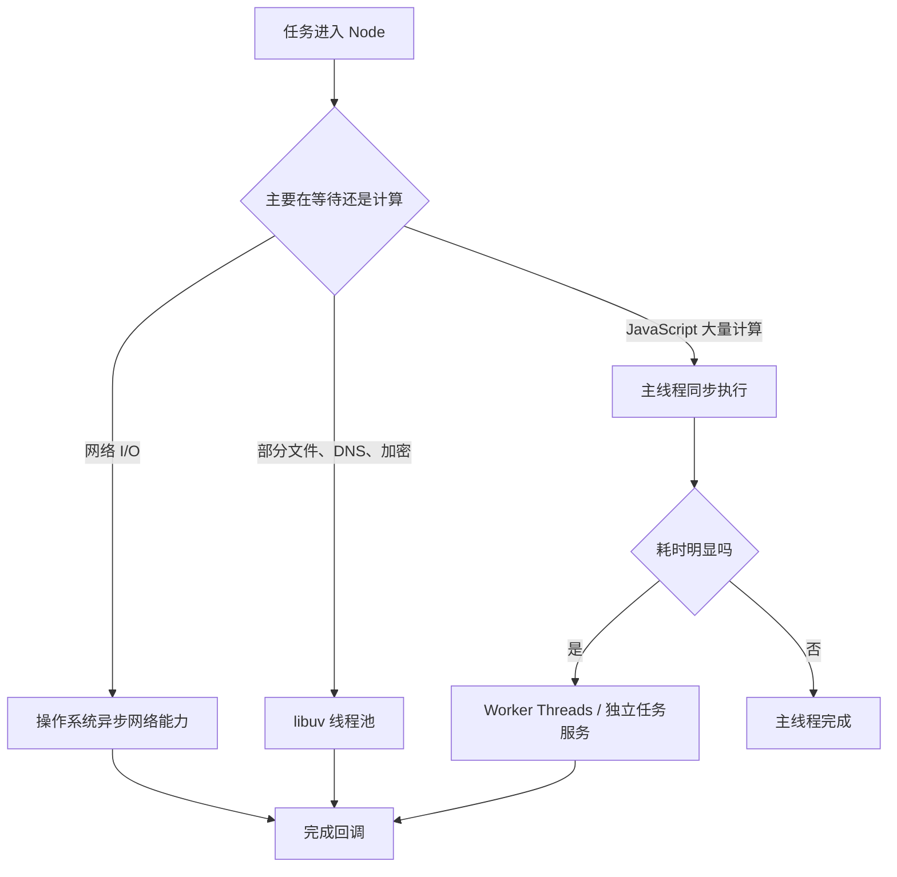

| 工作 | 首选方式 |
| --- | --- |
| 调数据库、HTTP、对象存储 | 原生异步 I/O，设置超时和取消 |
| 读取大文件并传输 | Stream + backpressure |
| 密码哈希、部分压缩 | 关注线程池排队；必要时隔离 |
| 大型图片处理、复杂解析、大量计算 | Worker Threads 或独立任务进程 |

Worker Threads 适合 CPU 密集 JavaScript，不会让普通数据库请求更快。为每个请求临时创建 Worker 的启动成本也可能得不偿失，生产项目通常使用 Worker 池或后台队列。

## 6. 为什么一个同步循环能拖慢所有接口

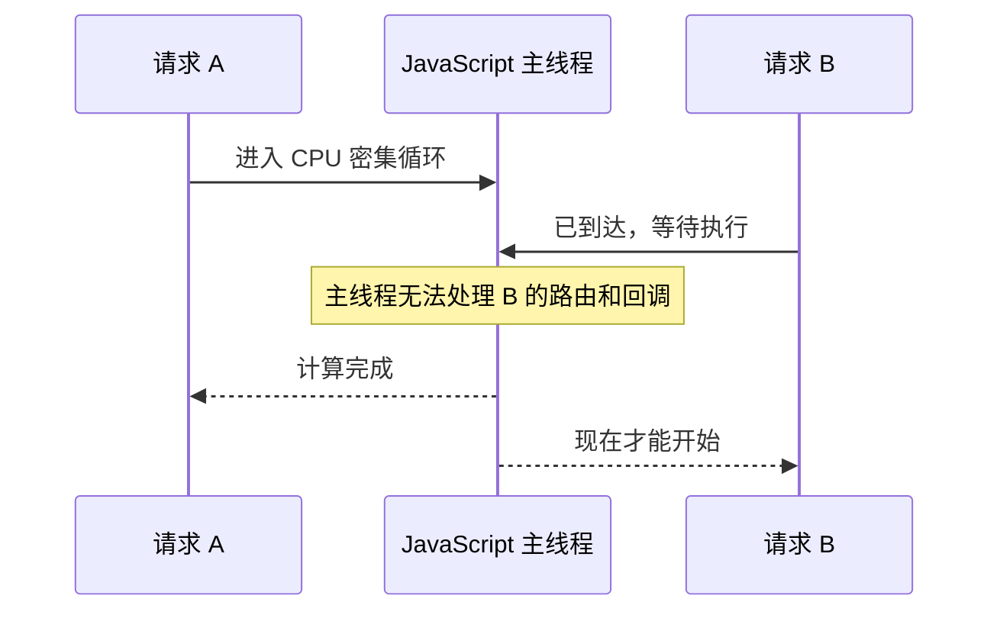

`async function` 只表示函数返回 Promise，不表示其中每一行都会异步执行。JSON 大对象序列化、正则灾难回溯、同步文件 API 和长循环都可能阻塞事件循环。

## 7. HTTP 请求的完整生命周期

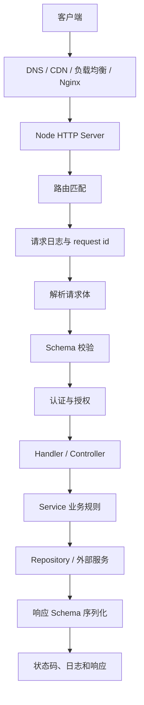

每一层只承担一种责任，才能把问题定位到“输入不合法”“用户无权限”“业务冲突”“数据库失败”或“网关配置错误”。

## 8. Fastify 生命周期放什么逻辑

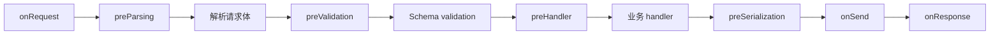

| 阶段 | 适合做什么 | 不适合做什么 |
| --- | --- | --- |
| `onRequest` | 请求上下文、早期认证、限流 | 读取尚未解析的 body |
| Schema validation | 结构、类型、长度、格式 | 查询数据库验证业务存在性 |
| `preHandler` | 授权、需要 I/O 的前置检查 | 无边界地塞入全部业务逻辑 |
| handler/service | 业务规则、事务、调用依赖 | 重复实现框架校验 |
| `onResponse` | 指标和完成日志 | 修改已经发送的响应体 |

Fastify 官方建议不要在初始 Schema 校验中访问数据库；异步业务校验应放到后续 hook 或 service，避免把输入校验变成可被放大的昂贵操作。

## 9. Fastify 插件封装不是普通全局中间件

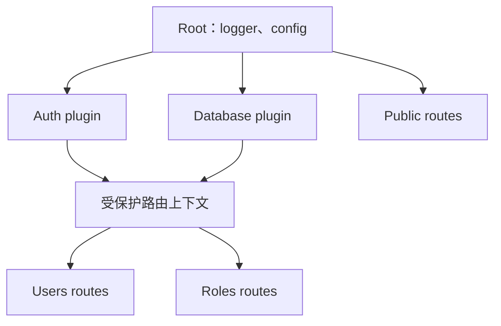

子上下文可以访问父上下文的 decorator、hook 和 plugin；父上下文默认看不到子上下文内容。注册顺序和封装边界不对时，常见现象是“某些路由有 `db`，另一些路由是 undefined”。

## 10. 输入校验和业务校验要分开

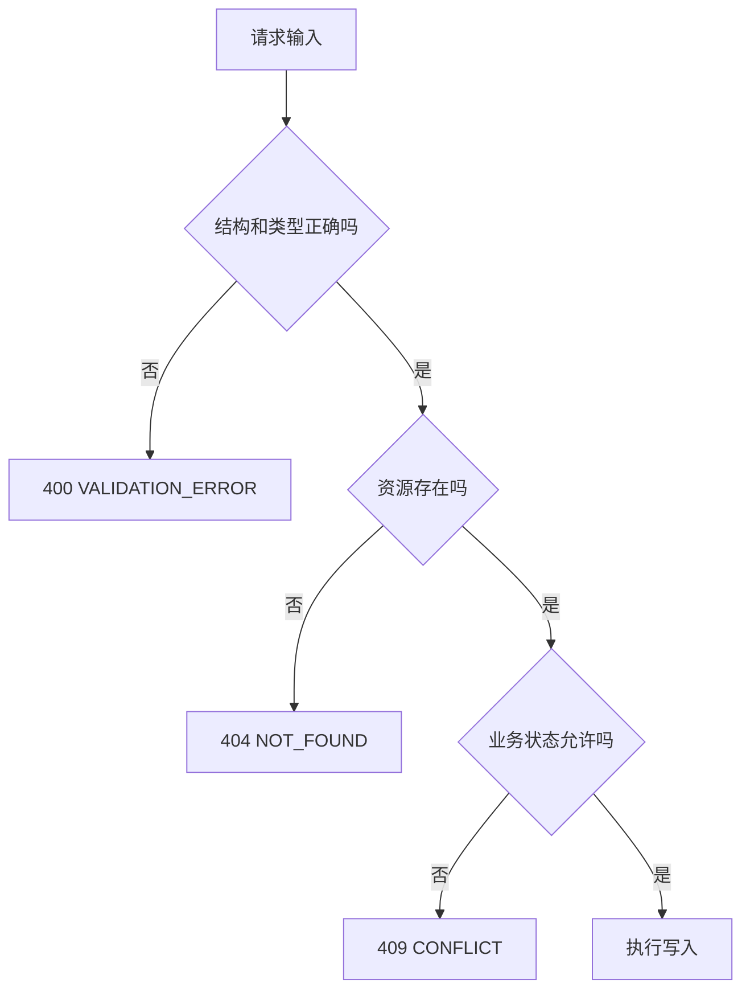

- JSON Schema 负责字段类型、必填、长度、枚举和响应形状。
- Service 负责“邮箱是否重复”“用户能否停用自己”“角色是否仍被使用”等业务事实。
- 数据库唯一约束和外键是最后一道并发安全边界，不能只依赖请求前查询。

## 11. 认证、授权和资源范围

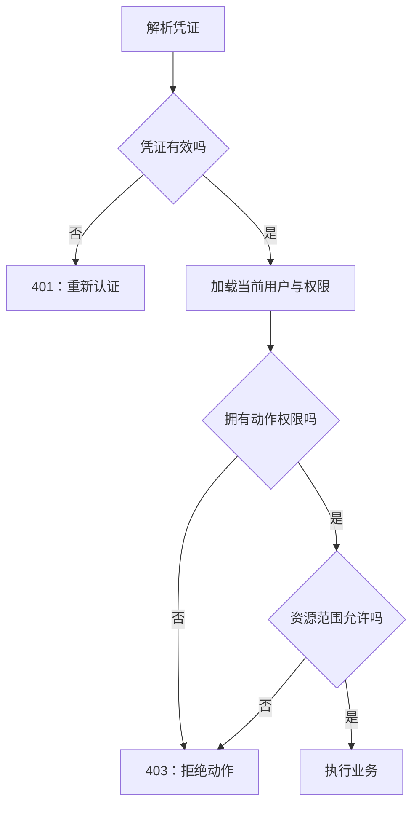

权限检查至少可能包含：

1. 身份：这个 token 对应谁？
2. 动作：是否有 `user:update`？
3. 资源：是否允许修改这个租户、部门或用户？
4. 状态：目标是否处于可修改状态？

前端隐藏按钮只改善体验。浏览器中的代码和请求都可以被用户修改，后端必须独立判断。

## 12. RBAC 数据如何组合成权限

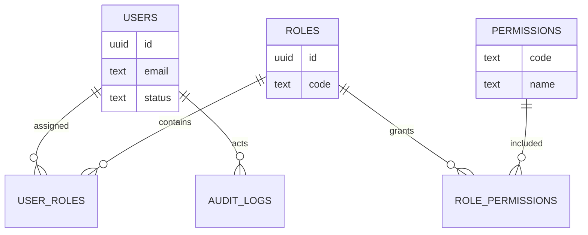

菜单不是天然安全边界。菜单可以由权限派生，但真正用于 API 授权的应该是稳定权限码，例如 `user:read`、`user:create`、`role:grant`。

## 13. 数据库连接池在保护什么

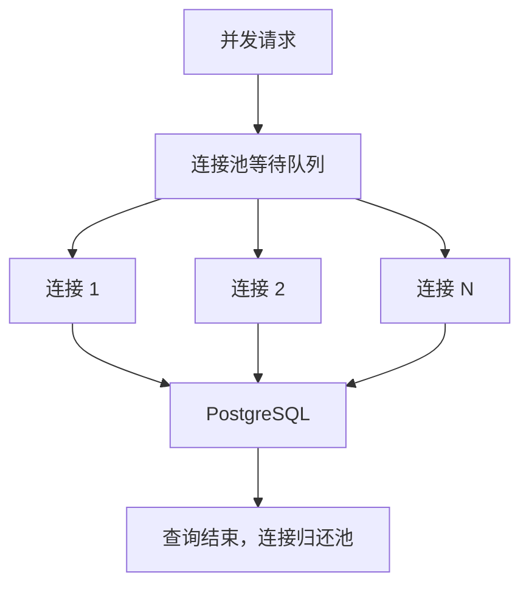

连接池不是越大越快。数据库能承受的连接数、服务实例数和每实例池大小要一起计算：

```text
数据库连接预算 >= 实例数 × 每实例最大连接 + 运维与迁移预留
```

连接未释放、事务长期不结束、慢查询或池配置过大，都会表现为接口等待时间上升。

## 14. 事务必须绑定同一个连接

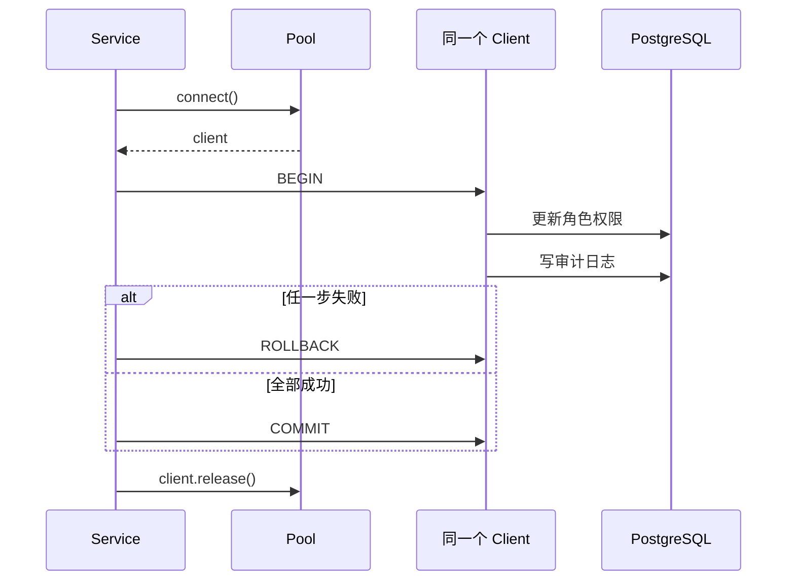

`node-postgres` 的事务必须在同一个 client 上执行。不能 `pool.query('BEGIN')` 后又用另一个 `pool.query()` 写数据，因为每次调用可能拿到不同连接。

事务中不要执行邮件、HTTP 请求或大型计算。数据库锁应该尽快释放；事务提交后再投递可重试的外部任务，并通过 outbox 等模式处理跨系统一致性。

## 15. request id 如何串起证据

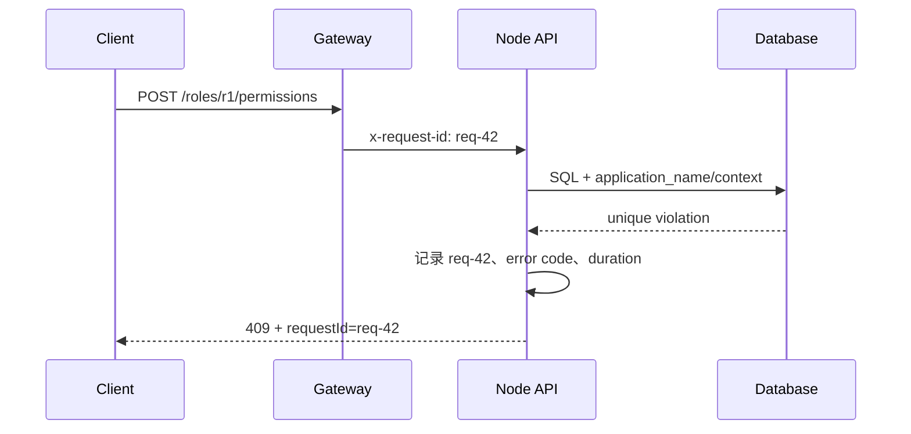

日志中记录 method、route、status、duration、actorId、errorCode 和 request id。不要记录密码、完整 token、Cookie、私钥或完整敏感请求体。

Fastify 已为请求提供 request id 和请求日志能力。允许客户端传入 request id 时必须校验长度和格式，不能盲信任任意头值。

## 16. 错误应该按边界分类

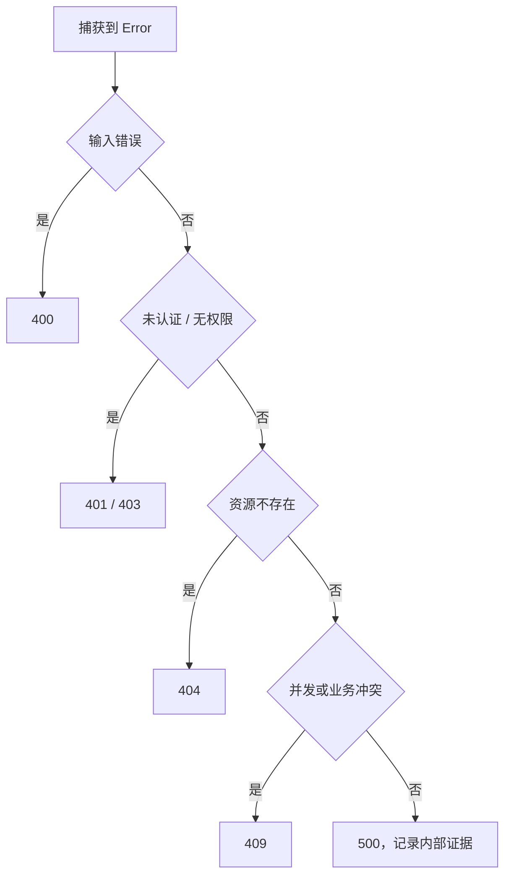

对外响应保持稳定、克制；内部日志保留可诊断上下文。不要把 PostgreSQL SQL、文件路径、堆栈和环境变量直接返回给客户端。

未捕获异常意味着进程可能处于未知状态。`uncaughtException` 不应被用来“记录后继续运行”；应让外部进程管理器重启服务，并确保写操作具备幂等或事务保护。

## 17. 流和背压为什么重要

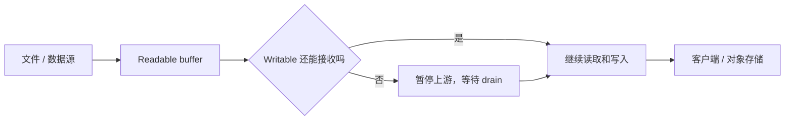

把 2 GB 文件全部读入内存再发送，会让堆内存快速增长。Stream 允许分块处理；背压让生产者不要永久快于消费者。

优先使用 `stream.pipeline()` 或 Promise 版本，它会组合错误传播和背压。文件上传还要同时限制文件数量、单文件大小、总大小、类型、存储位置和超时。

## 18. 缓存和数据库的事实边界

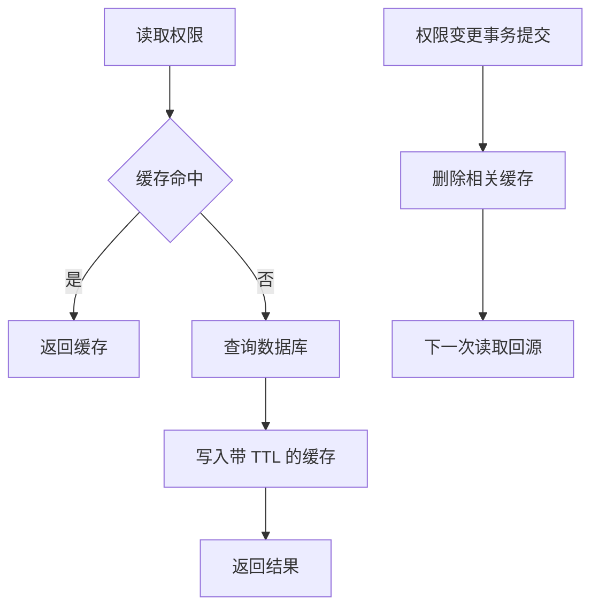

缓存是派生数据，不应成为无法恢复的唯一事实。权限变更后要明确失效哪些 key；多实例环境不能只删当前进程内存。

## 19. 队列任务为什么必须幂等

```mermaid
stateDiagram-v2
  [*] --> Waiting
  Waiting --> Active
  Active --> Completed: "成功"
  Active --> Delayed: "可重试失败"
  Delayed --> Active
  Active --> Failed: "超过重试次数"
  Active --> Active: "Worker 崩溃后重新投递"
```

队列通常提供“至少一次”处理语义，任务可能重复执行。发券、扣款、发送通知和生成文件都要使用业务幂等键、唯一约束或状态机防止重复副作用。

## 20. 超时、取消和重试要一起设计

```mermaid
flowchart TD
  A["调用外部服务"] --> B["设置 deadline / AbortSignal"]
  B --> C{"成功"}
  C -- "是" --> D["返回"]
  C -- "否" --> E{"错误可重试吗"}
  E -- "否" --> F["快速失败"]
  E -- "是" --> G{"操作幂等吗"}
  G -- "否" --> F
  G -- "是" --> H["指数退避 + 抖动 + 次数上限"]
  H --> A
```

没有超时的请求可能永久占用连接、内存和并发槽位。没有幂等判断的自动重试可能制造重复订单。重试还要受总 deadline 限制，避免每一层都重试导致流量放大。

## 21. 优雅停机的正确顺序

```mermaid
flowchart TD
  A["收到 SIGTERM"] --> B["readiness 设为失败"]
  B --> C["停止接收新请求"]
  C --> D["等待在途请求完成"]
  D --> E["停止 Worker 和定时任务"]
  E --> F["关闭数据库 / Redis 连接"]
  F --> G["在期限内退出 0"]
  D --> H{"超过关闭期限"}
  H -- "是" --> I["记录错误并强制退出"]
```

关闭顺序反过来会让在途请求突然失去数据库连接。优雅停机必须有总超时，否则一个永不结束的请求会让发布卡死。

## 22. 单实例和多实例的差别

```mermaid
flowchart TD
  A["负载均衡"] --> B1["Node 实例 A"]
  A --> B2["Node 实例 B"]
  A --> B3["Node 实例 C"]
  B1 --> D["共享 PostgreSQL"]
  B2 --> D
  B3 --> D
  B1 --> E["共享 Redis / Queue"]
  B2 --> E
  B3 --> E
```

进程内变量、定时任务锁、WebSocket 房间和内存缓存都只属于一个实例。扩容前要逐项判断状态是否必须共享：

| 状态 | 多实例处理 |
| --- | --- |
| 登录会话 | 共享存储或可验证 token |
| 权限缓存 | Redis 等共享缓存并明确失效 |
| 定时任务 | 分布式锁或专用调度器 |
| WebSocket 广播 | Pub/Sub 或消息系统 |
| 上传临时文件 | 对象存储或共享卷，避免依赖本地磁盘 |

## 23. 性能问题先找证据

```mermaid
flowchart TD
  A["P95 / P99 变慢"] --> B{"事件循环延迟高吗"}
  B -- "是" --> C["同步 CPU、GC、大对象、正则"]
  B -- "否" --> D{"连接池等待高吗"}
  D -- "是" --> E["慢 SQL、事务过长、连接泄漏"]
  D -- "否" --> F{"外部依赖慢吗"}
  F -- "是" --> G["DNS、网络、超时、重试"]
  F -- "否" --> H["网关、排队、序列化和日志"]
```

证据至少包括：

- 延迟分位数，不只看平均值。
- 吞吐、并发数和错误率。
- 事件循环延迟与利用率。
- CPU、堆内存、GC、文件描述符。
- 数据库池等待、慢查询和锁等待。
- 外部依赖耗时和重试次数。

`monitorEventLoopDelay()` 返回纳秒级直方图。采集它有成本，并且不同采样模式不可直接比较；先建立稳定基线，再设置告警。

## 24. 统一排障路径

```mermaid
flowchart TD
  A["Node 服务异常"] --> B{"进程和 readiness 正常吗"}
  B -- "否" --> C["启动日志、配置、信号、OOM"]
  B -- "是" --> D{"请求到达应用吗"}
  D -- "否" --> E["DNS、TLS、网关、端口、容器网络"]
  D -- "是" --> F{"状态码和错误码是什么"}
  F --> G{"应用处理慢吗"}
  G -- "是" --> H["事件循环、CPU、GC、外部依赖"]
  G -- "否" --> I{"数据库等待吗"}
  I -- "是" --> J["连接池、SQL、锁、事务"]
  I -- "否" --> K["响应序列化、客户端、缓存"]
```

统一记录模板：

```text
现象：
影响范围：
开始时间：
稳定复现步骤：
request id / trace id：
状态码和业务错误码：
第一条异常证据：
事件循环 / CPU / 内存：
数据库池 / 慢查询 / 锁：
外部依赖耗时：
根因：
修复：
回归测试：
预防措施：
```

## 25. 从客户端到部署的完整图

```mermaid
flowchart LR
  U["Web / App"] --> G["CDN / Gateway"]
  G --> A["Fastify API"]
  A --> V["Schema validation"]
  V --> AUTH["Authentication + Authorization"]
  AUTH --> S["Service"]
  S --> P["PostgreSQL"]
  S --> R["Redis"]
  S --> Q["Queue"]
  Q --> W["Worker"]
  A --> L["Structured logs / metrics"]
  P --> L
  W --> L
```

这个模型对应本模块的学习顺序：运行时决定服务如何执行，HTTP 和框架组织请求，鉴权和 Service 守住业务边界，数据库保存事实，缓存和队列处理派生数据与异步任务，日志和指标提供排障证据，部署负责让整个过程可启动、可关闭、可恢复。

## 常见错误模型纠正

| 错误说法 | 更准确的理解 |
| --- | --- |
| Node 是单线程，所以一次只能处理一个请求 | JavaScript 主线程一次执行一段代码，但可以同时等待大量 I/O |
| `await` 不会阻塞 | `await` 让出当前异步函数；它前后的同步计算仍会阻塞主线程 |
| Promise 一定比回调快 | 二者主要是控制流表达方式，性能要看实际任务和调度 |
| 连接池越大吞吐越高 | 池过大会压垮数据库；总连接预算要跨实例计算 |
| JWT 有签名就永远可信 | 还要校验算法、密钥、过期、签发者、用户状态和权限事实 |
| 加缓存一定更快 | 缓存增加失效、一致性、击穿和内存治理成本 |
| 捕获 `uncaughtException` 后可以继续服务 | 未捕获异常后状态可能未知，应记录并退出，由外部系统重启 |
| 本地启动成功就能部署 | 还要验证监听地址、健康检查、信号、只读文件系统和多实例状态 |

## 自测

1. 为什么 HTTP I/O 很多时 Node 仍能保持响应，而一段同步大循环会拖慢所有请求？
2. `process.nextTick`、Promise 和计时器分别位于什么调度层次？
3. 为什么 Schema 校验不应该查询数据库？
4. 为什么 `BEGIN` 和后续 SQL 必须使用同一个 client？
5. 前端已经隐藏“删除用户”按钮，后端为什么仍要检查 `user:delete`？
6. 大文件下载为什么应该使用 Stream，`write()` 返回 `false` 表示什么？
7. 收到 `SIGTERM` 后为什么不能先关闭数据库？
8. P99 变慢但平均值正常时，你先看哪些证据？

答不出来时，回到对应图，把“输入、等待点、失败点、证据”重新标一遍。

## 参考资料

- [Node.js Releases](https://nodejs.org/en/about/previous-releases)
- [Node.js Event Loop](https://nodejs.org/en/learn/asynchronous-work/event-loop-timers-and-nexttick)
- [Node.js Worker Threads](https://nodejs.org/api/worker_threads.html)
- [Node.js Streams](https://nodejs.org/api/stream.html)
- [Node.js Performance Hooks](https://nodejs.org/api/perf_hooks.html)
- [Node.js Process](https://nodejs.org/api/process.html)
- [Fastify Lifecycle](https://fastify.dev/docs/latest/Reference/Lifecycle/)
- [Fastify Encapsulation](https://fastify.dev/docs/latest/Reference/Encapsulation/)
- [Fastify Validation and Serialization](https://fastify.dev/docs/latest/Reference/Validation-and-Serialization/)
- [node-postgres Transactions](https://node-postgres.com/features/transactions)

## 下一步学习

先进入 [运行时与事件循环](/node/runtime-event-loop) 和 [HTTP API 开发](/node/http-api)。准备做完整项目时进入 [Node 权限 API 从零到项目](/node/permission-api-project)；遇到故障时使用 [Node.js 真实项目问题库](/projects/issues-node) 和 [Node.js 专项练习](/roadmap/node-practice)。
