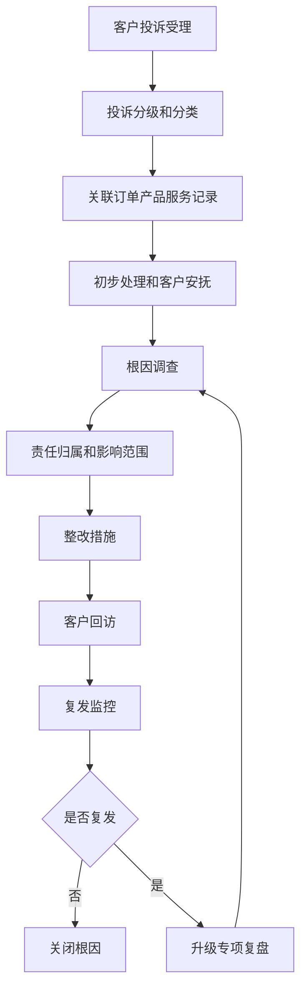
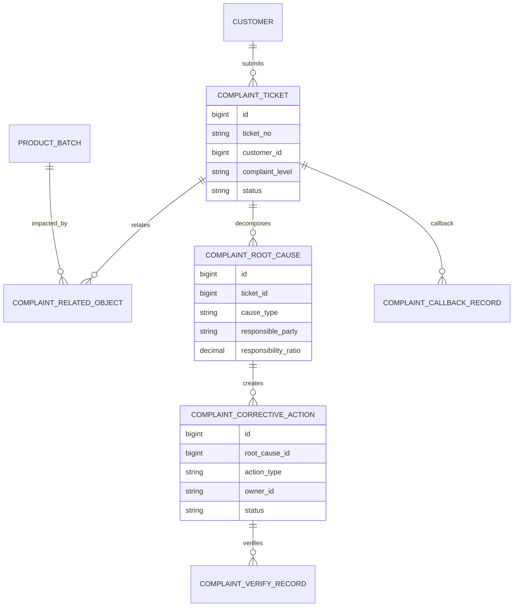
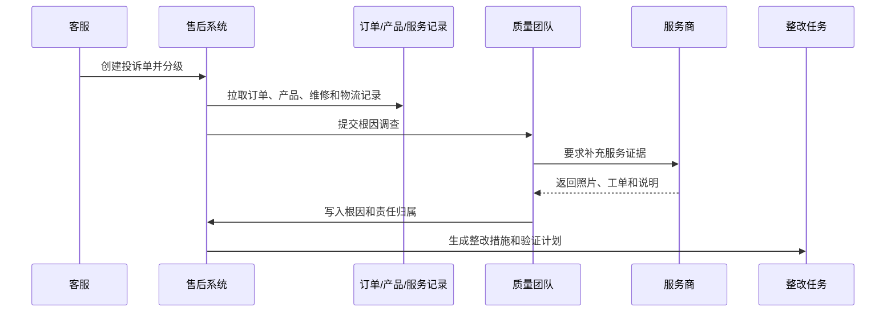
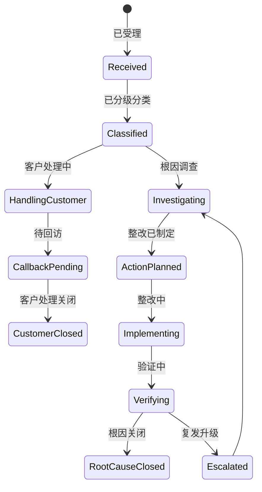
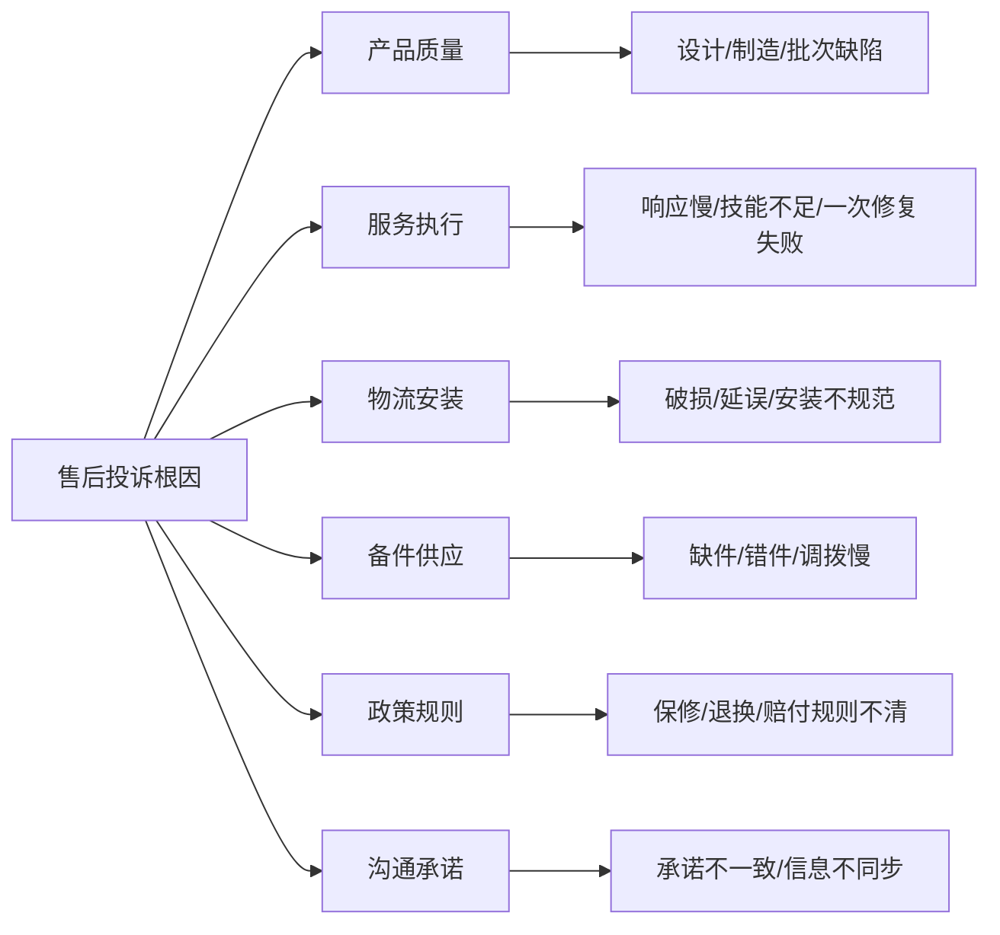

# 售后投诉根因分析项目案例

## 适合谁看

如果你做过客户投诉闭环、售后服务、客服工单或售后维修质量复盘，但还不清楚如何把投诉从“处理完”推进到“减少复发”，可以学习这个案例。

售后投诉根因分析关注的是客户投诉背后的产品、服务、物流、安装、维修、备件、政策和人员问题。它不是客服把投诉单关闭，而是把投诉问题变成根因、责任、整改、验证和产品反馈。

## 业务目标

售后投诉根因分析要回答 6 个问题：

- 客户投诉的真实问题是什么，是否已经分类准确。
- 投诉影响了哪些订单、产品、批次、服务商或区域。
- 根因来自产品质量、服务能力、物流安装、备件供应、政策规则还是沟通问题。
- 是否需要赔付、换货、召回、服务商整改或产品改进。
- 整改后同类投诉是否减少，客户满意度是否恢复。
- 投诉根因如何反馈给产品、质量、供应链和服务团队。

真实项目中，投诉处理常见失败原因是“单据关闭了，但问题还在”。根因分析要把投诉从客服动作升级为组织改进动作。

## 售后投诉根因分析链路

这条链路把客户处理和组织改进分开。客户可以先被安抚，但根因分析必须继续追踪到整改验证。

## 核心概念

| 概念 | 说明 | 项目里的典型字段 |
| --- | --- | --- |
| 投诉单 | 客户表达不满的业务单据 | complaint_ticket |
| 投诉分级 | 根据影响和风险确定优先级 | complaint_level |
| 根因项 | 导致投诉的真实原因 | root_cause_item |
| 责任归属 | 产品、服务商、物流、客服等责任 | responsible_party |
| 影响范围 | 同批次、同区域、同服务商的潜在问题 | impact_scope |
| 整改措施 | 纠正和预防动作 | corrective_action |
| 回访结果 | 客户对处理结果的反馈 | callback_result |
| 复发监控 | 同类投诉是否再次发生 | recurrence_monitor |

投诉根因分析要支持多根因。客户投诉安装慢，背后可能同时有服务商排班不足、备件缺货和客服承诺不准确。

## 数据模型

投诉单、根因、整改措施要分表。一个投诉单可能有多个根因，一个根因也可能需要多个整改动作。

## 推荐表结构

| 表 | 用途 | 关键字段 |
| --- | --- | --- |
| `complaint_ticket` | 投诉单 | ticket_no、customer_id、complaint_level、source、status |
| `complaint_related_object` | 关联对象 | ticket_id、object_type、object_id、relation_reason |
| `complaint_root_cause` | 根因项 | ticket_id、cause_type、cause_code、responsible_party、ratio |
| `complaint_corrective_action` | 整改措施 | root_cause_id、action_type、owner_id、due_date、status |
| `complaint_callback_record` | 客户回访 | ticket_id、callback_result、satisfaction_score、comment |
| `complaint_verify_record` | 验证记录 | action_id、verify_period、recurrence_count、verify_result |
| `complaint_compensation` | 赔付记录 | ticket_id、compensation_type、amount、approval_status |
| `complaint_knowledge_feedback` | 知识反馈 | ticket_id、feedback_type、target_team、status |

如果投诉会产生赔付，赔付记录要和投诉处理分开。不是每次投诉都赔付，也不是赔付完成就代表根因关闭。

## 根因调查流程

根因调查要能跨团队。客服负责受理和安抚，质量、服务商、物流、产品团队负责证据和整改。

## 投诉根因状态设计

客户处理关闭和根因关闭不是同一个状态。客户满意了，内部仍然可能要继续整改。

## 根因类型拆解

根因类型最好和整改团队绑定：产品质量给质量团队，服务执行给服务商管理，政策规则给运营或法务。

## 前端页面拆分

| 页面 | 主要功能 | 设计建议 |
| --- | --- | --- |
| 投诉总览 | 投诉量、等级、Top 原因、满意度 | 管理层先看趋势和风险 |
| 投诉详情 | 客户、订单、产品、服务记录、时间线 | 时间线是理解投诉的关键 |
| 根因分析页 | 多根因、责任方、证据、影响范围 | 支持多部门协作 |
| 整改任务页 | 措施、负责人、截止时间、验证方式 | 和任务中心打通 |
| 赔付处理页 | 赔付类型、金额、审批、发放 | 赔付不能替代整改 |
| 客户回访页 | 回访结果、满意度、备注 | 回访和根因验证分开 |
| 复发监控页 | 同类投诉、同批次、同服务商趋势 | 用于专项复盘 |

投诉页面要把客户视角和内部视角分层。客户关心处理结果，内部关心根因和复发。

## 接口拆分建议

| 接口 | 方法 | 说明 |
| --- | --- | --- |
| `/api/after-sales/complaints` | GET/POST | 查询和创建投诉单 |
| `/api/after-sales/complaints/:id/related-objects` | GET/POST | 关联订单、产品、工单和批次 |
| `/api/after-sales/complaints/:id/root-causes` | GET/POST | 查询和提交根因 |
| `/api/after-sales/complaints/:id/actions` | GET/POST | 查询和创建整改措施 |
| `/api/after-sales/complaints/:id/callbacks` | POST | 提交客户回访 |
| `/api/after-sales/complaints/:id/compensations` | POST | 创建赔付申请 |
| `/api/after-sales/complaints/root-cause-analysis` | GET | 查询根因统计和复发趋势 |

投诉接口要注意权限。客服可以看客户处理信息，但不一定能看内部责任比例和高风险质量结论。

## 实际项目常见问题

### 1. 投诉分类不准，后面分析全错

客服为了快速提交，选择了默认分类或“其他”。

解决方式：

- 投诉分类做成两级或三级，但不要过细。
- 高频“其他”定期治理。
- 详情页允许质检或主管修正分类。
- 修正分类要记录前后变化。

### 2. 客户处理关闭后，内部没人继续整改

客服回访满意后，投诉单关闭，根因任务没有责任人。

解决方式：

- 区分客户处理状态和根因整改状态。
- 高等级投诉必须生成整改任务。
- 整改任务有负责人和截止时间。
- 复发监控未达标自动升级。

### 3. 同类投诉反复出现

每次都单点处理，没有识别批量问题。

解决方式：

- 投诉关联产品型号、批次、服务商、区域。
- 按同类根因聚合趋势。
- 超阈值生成专项复盘。
- 专项结论反馈给产品、质量和服务商管理。

### 4. 赔付金额越来越高

赔付被当成主要解决手段，没有控制责任和原因。

解决方式：

- 赔付必须关联投诉原因和审批。
- 统计不同根因的赔付金额。
- 高频赔付原因进入整改。
- 服务商责任赔付支持追偿或扣减。

### 5. 服务商不认可责任归属

证据不完整，责任判定容易争议。

解决方式：

- 服务工单要求照片、签到、维修记录和客户确认。
- 根因项保存证据列表。
- 责任比例可多方确认。
- 申诉和复核流程独立记录。

## 权限与审计

| 权限点 | 控制原因 |
| --- | --- |
| 查看投诉单 | 包含客户隐私和服务问题 |
| 修改投诉分类 | 会影响统计和责任 |
| 提交根因 | 会影响内部整改和责任归属 |
| 创建赔付 | 涉及财务成本 |
| 关闭整改 | 会影响复盘结论 |
| 导出投诉明细 | 涉及客户信息和质量风险 |

审计日志要记录投诉分级、分类变更、根因提交、责任比例调整、赔付审批、整改关闭、回访结果和专项升级。

## 验收清单

- 投诉单能关联客户、订单、产品、批次、服务工单和服务商。
- 投诉支持分级、分类、处理、回访和赔付。
- 根因分析支持多根因、多责任方和证据记录。
- 整改措施能分派到责任团队并跟踪截止时间。
- 客户处理关闭和根因关闭分开。
- 能监控同类投诉复发和批量风险。
- 投诉结论能反馈到产品、质量、服务商和知识库。

## 下一步学习

建议继续阅读：

- [客户投诉闭环项目案例](/projects/customer-complaint-closed-loop-case)
- [售后维修质量复盘项目案例](/projects/after-sales-repair-quality-review-case)
- [售后服务商评级项目案例](/projects/after-sales-provider-rating-case)
- [客服工单项目案例](/projects/support-ticket-case)
