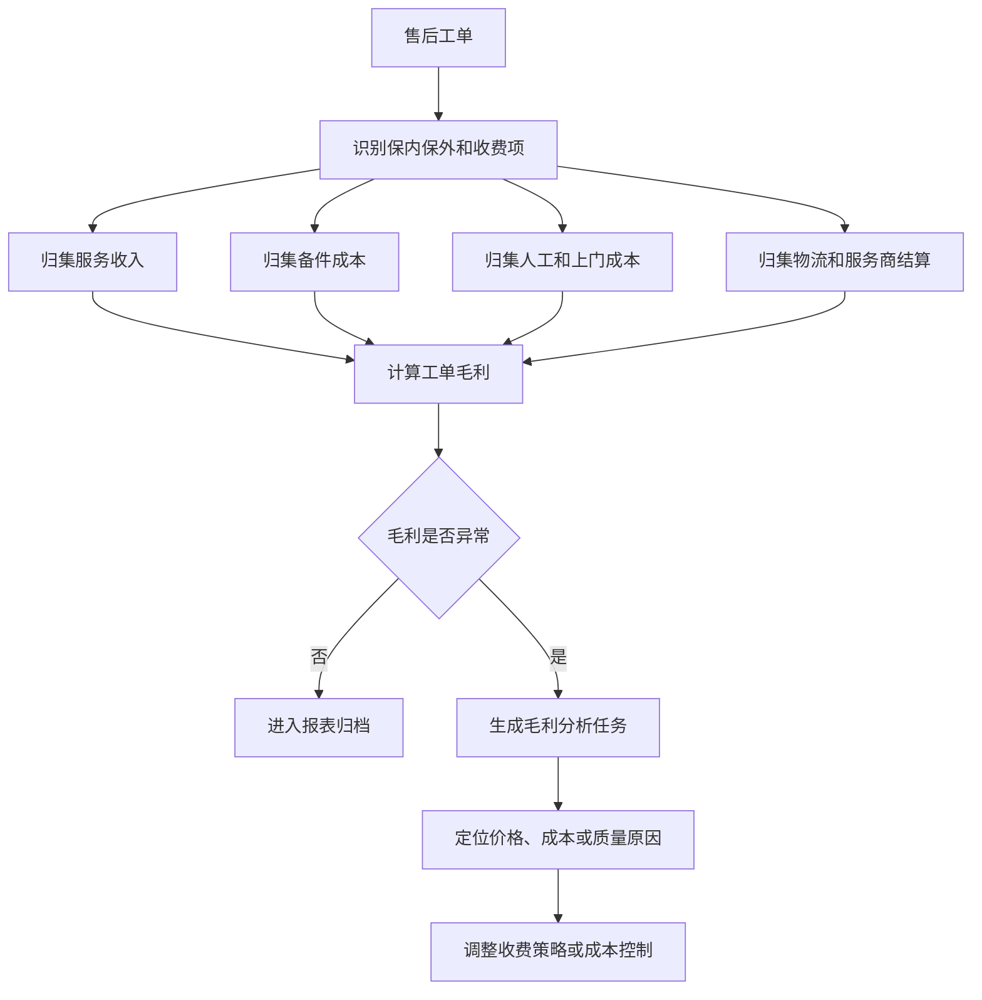
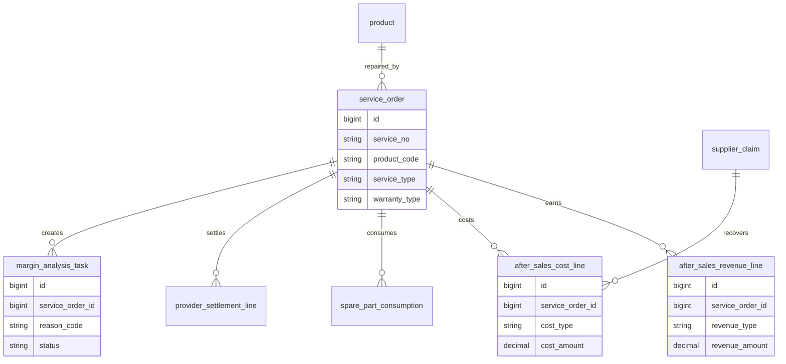
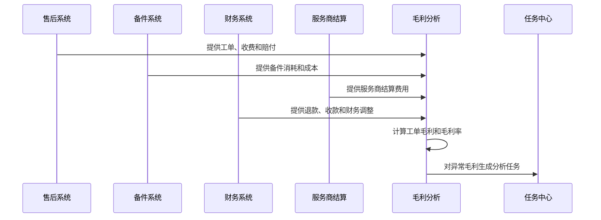
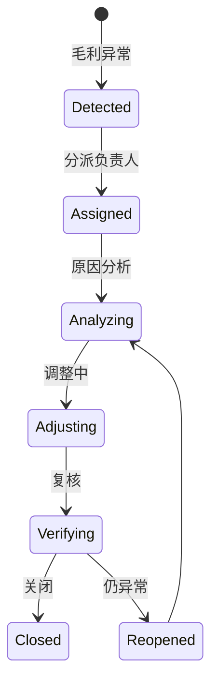
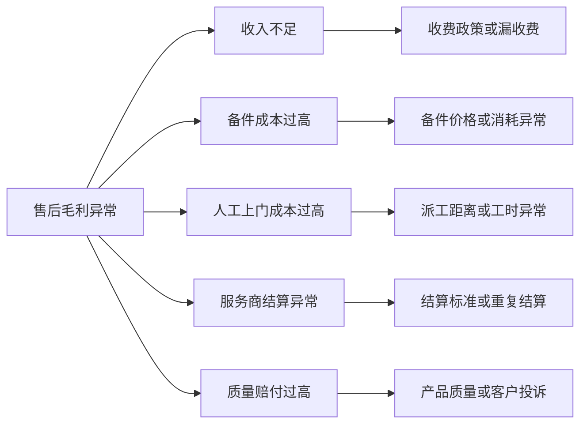

# 售后成本毛利分析项目案例

## 适合谁看

如果你做过售后服务、售后结算、备件成本或现场服务收费，但不清楚“售后到底赚不赚钱”，可以先看这一篇。

售后成本毛利分析要把售后收入、退款、服务收费、备件成本、人工工时、上门费用、服务商结算、供应商索赔和客户赔付放在一起，计算售后业务真实毛利。

## 业务目标

售后成本毛利分析要回答 6 个问题：

- 每个工单、客户、产品、服务网点的售后收入是多少。
- 备件、人工、上门、物流、服务商和赔付成本是多少。
- 哪些售后类型是亏损的。
- 退款、免费保修、保内保外、供应商索赔如何影响毛利。
- 毛利异常是价格问题、成本问题、质量问题还是结算问题。
- 售后毛利如何反向指导质保策略、备件定价和服务商考核。

售后业务容易被当成成本中心，但如果有收费维修、延保、备件销售和服务商结算，就必须看毛利。

## 售后成本毛利分析链路

这条链路的关键是“按工单归集”。如果只能看月度总成本，就无法知道亏损来自哪类服务、哪个产品或哪个网点。

## 核心概念

| 概念 | 说明 | 项目里的典型字段 |
| --- | --- | --- |
| 售后收入 | 维修费、上门费、备件费、延保收入 | service_revenue |
| 备件成本 | 工单消耗备件的成本 | spare_part_cost |
| 人工成本 | 工程师工时成本 | labor_cost |
| 上门成本 | 差旅、交通、外勤补贴 | onsite_cost |
| 服务商结算 | 外部服务网点或服务商费用 | provider_settlement |
| 客户赔付 | 退款、补偿、优惠券等 | compensation_cost |
| 供应商索赔 | 质量问题向供应商追偿 | supplier_claim_recovery |
| 售后毛利 | 收入减去成本和赔付 | after_sales_margin |

售后毛利要区分“成本”和“追回”。供应商索赔成功后可以抵减售后损失，但不能当成服务收入混在一起。

## 数据模型

收入和成本都要拆行保存。一个工单可能同时有上门费、备件费、人工成本、物流成本和服务商结算。

## 推荐表结构

| 表 | 用途 | 关键字段 |
| --- | --- | --- |
| service_order | 售后工单 | service_no、customer_id、product_code、service_type、warranty_type |
| after_sales_revenue_line | 售后收入明细 | service_order_id、revenue_type、revenue_amount、source_no |
| after_sales_cost_line | 售后成本明细 | service_order_id、cost_type、cost_amount、source_no |
| spare_part_consumption | 备件消耗 | service_order_id、part_code、qty、unit_cost |
| provider_settlement_line | 服务商结算 | service_order_id、provider_id、settlement_amount、status |
| after_sales_margin_snapshot | 毛利快照 | period、service_order_id、revenue_amount、cost_amount、margin_amount |
| margin_analysis_task | 毛利分析任务 | service_order_id、reason_code、owner_id、status |

毛利快照用于稳定报表。历史成本调整时，应生成新的快照或调整记录，而不是悄悄改旧报表。

## 毛利计算流程

毛利分析需要多系统数据。只从售后工单取收费项，会漏掉备件成本、财务退款和服务商结算。

## 毛利任务状态设计

毛利异常任务要能落到具体动作，例如修改收费规则、调整备件价格、向供应商索赔或复核服务商结算。

## 毛利拆解分析

这种拆解适合放在毛利详情页，帮助用户从亏损金额一路下钻到原因。

## 前端页面拆分

| 页面 | 主要功能 | 新手容易漏掉 |
| --- | --- | --- |
| 毛利总览 | 收入、成本、毛利、毛利率趋势 | 按保内保外分开看 |
| 工单毛利页 | 单个工单收入和成本明细 | 支持追到来源单据 |
| 产品毛利页 | 产品维度售后收入和质量成本 | 关联质量异常和索赔 |
| 服务网点毛利页 | 网点收入、结算、成本和毛利 | 网点结算规则要可见 |
| 备件成本页 | 备件消耗、成本、旧件回收 | 旧件抵减要单独展示 |
| 毛利异常页 | 异常规则、任务、处理进度 | 异常要能分派责任人 |
| 策略复盘页 | 收费策略、备件定价、质保策略 | 输出可执行调整建议 |

售后毛利页面不能只给财务看。售后运营、质量、备件、服务商管理都需要不同维度。

## 接口拆分建议

| 接口 | 方法 | 说明 |
| --- | --- | --- |
| /api/after-sales-margin/overview | GET | 查询毛利总览 |
| /api/after-sales-margin/service-orders/:id | GET | 查询工单毛利详情 |
| /api/after-sales-margin/products | GET | 查询产品毛利 |
| /api/after-sales-margin/outlets | GET | 查询网点毛利 |
| /api/after-sales-margin/calculate | POST | 执行毛利快照计算 |
| /api/after-sales-margin/tasks | GET/POST | 查询和创建异常任务 |
| /api/after-sales-margin/tasks/:id/actions | POST | 提交处理动作 |

毛利计算建议按期间异步执行。大量工单和成本明细同步计算容易超时。

## 实际项目常见问题

### 问题 1：工单显示盈利，财务报表显示亏损

工单只统计收费项，没有统计退款、赔付或服务商结算。

解决方式：

- 收入和成本统一从多系统归集。
- 毛利明细显示来源单据。
- 财务调整进入成本或收入调整行。
- 报表按期间生成快照。

### 问题 2：保内服务看起来全是亏损

保内没有客户收费，但可能存在供应商索赔或质保准备金。

解决方式：

- 保内、保外分开统计。
- 供应商索赔作为追回项展示。
- 质保成本单独分析。
- 不能用保外收费口径评价保内服务。

### 问题 3：备件成本异常但没人处理

备件成本只是进了报表，没有任务闭环。

解决方式：

- 高额备件成本触发异常任务。
- 关联旧件回收和返修。
- 分析是否可向供应商索赔。
- 任务关闭前复核成本是否调整。

### 问题 4：服务商重复结算

同一工单被多次结算或结算标准不一致。

解决方式：

- 服务商结算行关联工单和服务项。
- 同一服务项限制重复结算。
- 结算规则保存版本。
- 异常结算进入毛利任务。

## 权限与审计

| 权限 | 建议 |
| --- | --- |
| 查看毛利总览 | 售后运营、财务、管理层 |
| 查看工单明细 | 按服务区域、产品线和网点授权 |
| 查看成本金额 | 财务、售后负责人和备件负责人 |
| 执行毛利计算 | 财务或系统任务 |
| 处理异常任务 | 责任部门处理人 |
| 导出毛利报表 | 敏感导出水印和审计 |

毛利数据属于经营敏感信息，不能对所有服务人员开放完整成本。

## 验收清单

- 工单收入、备件成本、人工成本、服务商结算可追溯。
- 保内、保外、收费、免费服务能分开统计。
- 毛利快照能按期间生成。
- 负毛利或异常毛利能自动生成任务。
- 毛利异常能拆解到收入、备件、人工、结算和赔付原因。
- 供应商索赔和旧件回收能作为抵减项展示。
- 报表导出和成本查看有权限审计。

## 下一步学习

建议继续阅读：

- [售后结算项目案例](/projects/after-sales-settlement-case)
- [售后备件成本核算项目案例](/projects/after-sales-spare-part-cost-case)
- [服务网点项目案例](/projects/service-outlet-case)
- [客户退款风控项目案例](/projects/customer-refund-risk-control-case)
