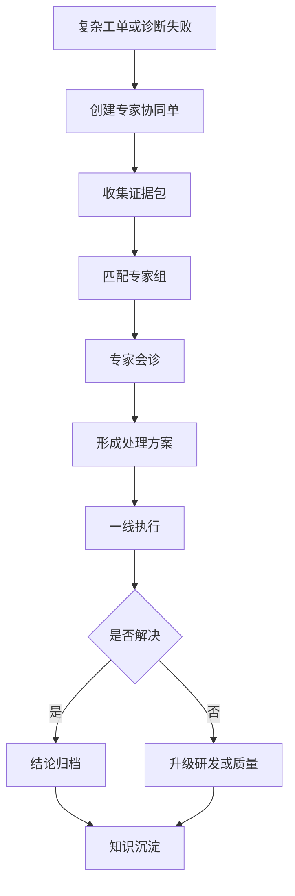
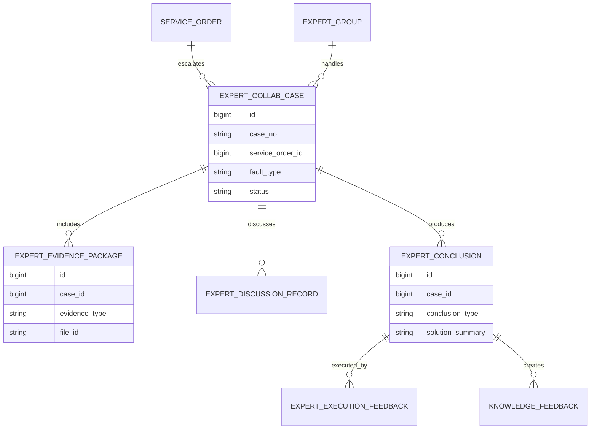
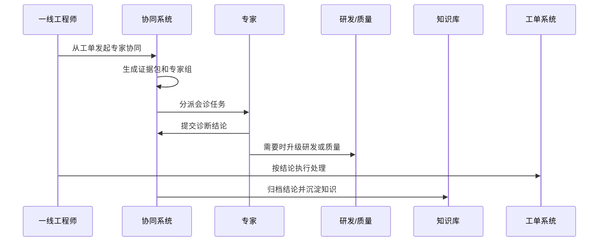
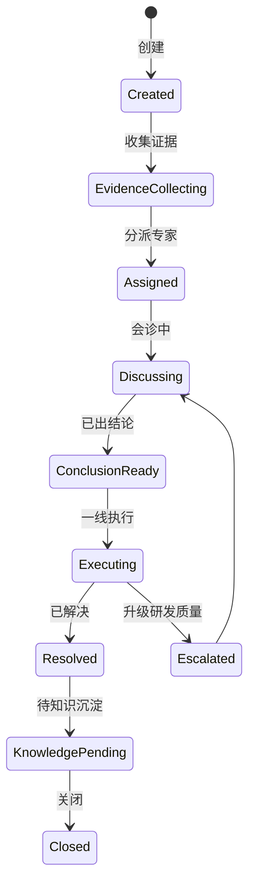
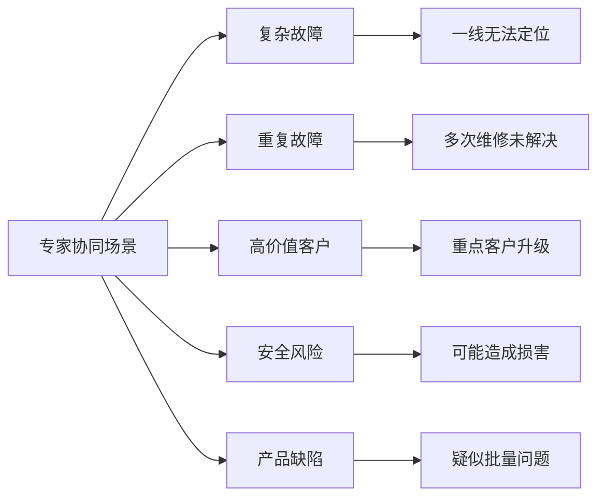

# 售后专家协同项目案例

## 适合谁看

如果你做过售后远程诊断、客服工单、售后维修质量复盘或知识库平台，但还不清楚复杂故障如何让一线工程师、专家、研发和质量团队协同处理，可以学习这个案例。

售后专家协同关注的是普通客服或工程师无法解决的复杂问题，如何升级给专家，如何共享诊断证据，如何形成会诊结论，如何沉淀知识，如何减少重复升级。

## 业务目标

售后专家协同要回答 6 个问题：

- 哪些售后问题需要升级专家。
- 专家需要哪些证据：日志、图片、视频、远程诊断、备件记录、历史维修。
- 多个专家如何会诊、分工和给出结论。
- 会诊结论如何回写工单、派单、知识库和产品质量。
- 专家响应是否及时，是否影响 SLA。
- 高频复杂问题如何沉淀为知识、诊断规则或产品改进。

真实项目中，专家协同最怕靠群聊。信息散落在聊天记录里，结论无法追溯，后续同类问题又重新问一遍。

## 售后专家协同链路

专家协同不是多一个审批流，而是把复杂问题从“找人问”变成“有证据、有结论、有沉淀”的流程。

## 核心概念

| 概念 | 说明 | 新手理解 |
| --- | --- | --- |
| 协同单 | 专家处理复杂问题的单据 | 从工单升级出来 |
| 证据包 | 专家判断所需材料 | 日志、照片、视频、历史维修 |
| 专家组 | 按产品、故障、区域配置的专家 | 谁能处理这个问题 |
| 会诊结论 | 专家给出的判断和方案 | 维修、换件、升级、召回 |
| 执行反馈 | 一线按方案处理后的结果 | 是否解决 |
| 知识沉淀 | 把结论变成知识库内容 | 下次不用再问 |
| 专家 SLA | 专家响应和结论时限 | 防止卡住工单 |

协同单要和原工单双向关联。工单看得到专家结论，专家也看得到工单上下文。

## 数据模型

证据包要结构化。不要只让用户上传附件，至少要区分日志、图片、视频、远程诊断、备件记录和历史工单。

## 推荐表结构

| 表 | 用途 | 关键字段 |
| --- | --- | --- |
| `expert_collab_case` | 专家协同单 | case_no、service_order_id、fault_type、priority、status |
| `expert_evidence_package` | 证据包 | case_id、evidence_type、file_id、source_object_id |
| `expert_group` | 专家组 | group_code、product_scope、fault_scope、sla_minutes |
| `expert_assignment` | 专家分派 | case_id、expert_id、role_type、assigned_at、status |
| `expert_discussion_record` | 会诊记录 | case_id、speaker_id、content、attachment_id |
| `expert_conclusion` | 专家结论 | case_id、conclusion_type、solution_summary、risk_level |
| `expert_execution_feedback` | 执行反馈 | conclusion_id、executor_id、result、resolved_at |
| `knowledge_feedback` | 知识沉淀 | conclusion_id、knowledge_type、target_status、owner_id |

专家结论要版本化。复杂问题可能经过多轮讨论，最终结论和中间判断都要保留。

## 协同处理流程

专家协同要有响应时限。否则工单会卡在等待专家，客户体验变差。

## 协同单状态设计

协同单关闭前应完成执行反馈。没有反馈就不知道专家结论是否有效。

## 协同场景拆解

不同场景需要不同专家组。复杂故障可能找技术专家，高价值客户可能还需要客户成功或管理层介入。

## 前端页面拆分

| 页面 | 核心内容 | 设计建议 |
| --- | --- | --- |
| 专家协同工作台 | 待分派、待会诊、超时、待反馈 | 专家快速处理 |
| 协同单详情 | 工单、设备、证据、讨论、结论 | 上下文要完整 |
| 证据包页 | 日志、图片、视频、诊断、历史记录 | 支持一键补充 |
| 专家分派页 | 专家组、技能、负载、SLA | 避免人工找人 |
| 会诊记录页 | 讨论、附件、结论版本 | 结论和讨论分开 |
| 执行反馈页 | 一线结果、客户反馈、是否解决 | 验证专家结论 |
| 知识沉淀页 | 转知识库、诊断规则、产品反馈 | 防止重复升级 |

专家页面要减少噪音，只展示和判断相关的证据。客服聊天、客户情绪可以保留，但不要淹没技术证据。

## 接口拆分建议

| 接口 | 方法 | 说明 |
| --- | --- | --- |
| `/api/expert-collab/cases` | GET/POST | 查询和创建专家协同单 |
| `/api/expert-collab/cases/:id/evidence` | GET/POST | 查询和补充证据包 |
| `/api/expert-collab/cases/:id/assign` | POST | 分派专家 |
| `/api/expert-collab/cases/:id/discussions` | GET/POST | 查询和提交会诊记录 |
| `/api/expert-collab/cases/:id/conclusions` | POST | 提交专家结论 |
| `/api/expert-collab/conclusions/:id/feedback` | POST | 提交执行反馈 |
| `/api/expert-collab/conclusions/:id/knowledge` | POST | 发起知识沉淀 |

专家协同接口要控制可见范围。外部服务商、一线工程师、内部研发看到的信息可能不同。

## 实际项目常见问题

### 1. 专家协同变成群聊

问题、证据、结论都在聊天里，无法追踪。

解决方式：

- 所有协同必须有协同单。
- 证据包结构化上传。
- 结论单独保存版本。
- 聊天内容只能作为讨论记录，不作为最终结论。

### 2. 专家缺少上下文

专家看不到历史维修、设备日志和远程诊断。

解决方式：

- 发起协同时自动生成证据包。
- 工单、设备、备件、诊断、历史问题自动关联。
- 缺少关键证据时提示补充。
- 专家可以一键要求补证。

### 3. 专家响应慢影响 SLA

协同单无人接，客户等待。

解决方式：

- 专家组配置响应 SLA。
- 按技能和负载自动分派。
- 超时自动升级组长。
- 工作台突出临期和超时协同单。

### 4. 结论没有被执行或反馈

专家给了方案，一线没有回传结果。

解决方式：

- 工单必须引用专家结论。
- 执行反馈作为协同单关闭条件。
- 未反馈自动提醒。
- 反馈失败进入二次会诊。

### 5. 同类问题反复升级

没有把专家经验沉淀到知识库。

解决方式：

- 协同关闭前选择是否沉淀知识。
- 高频结论生成知识库任务。
- 可自动生成诊断规则候选。
- 知识发布后统计重复升级率是否下降。

## 权限与审计

| 权限点 | 控制原因 |
| --- | --- |
| 创建协同单 | 会占用专家资源 |
| 查看证据包 | 涉及客户、设备和产品数据 |
| 分派专家 | 影响 SLA 和责任 |
| 提交专家结论 | 影响客户处理方案 |
| 升级研发质量 | 可能触发产品问题流程 |
| 发布知识 | 影响后续一线处理标准 |

审计日志要记录协同创建、证据补充、专家分派、会诊结论、执行反馈、升级研发和知识发布。

## 验收清单

- 能从售后工单或远程诊断发起专家协同。
- 能自动生成并补充结构化证据包。
- 能按产品、故障、区域匹配专家组。
- 能记录会诊过程和结论版本。
- 能把专家结论回写工单并收集执行反馈。
- 能将高价值结论沉淀到知识库、诊断规则或产品反馈。
- 能统计专家响应时长、解决率、重复升级率和知识转化率。

## 下一步学习

建议继续阅读：

- [售后远程诊断项目案例](/projects/after-sales-remote-diagnosis-case)
- [客服知识运营项目案例](/projects/customer-knowledge-operation-case)
- [知识库平台项目案例](/projects/knowledge-base-case)
- [售后维修质量复盘项目案例](/projects/after-sales-repair-quality-review-case)
