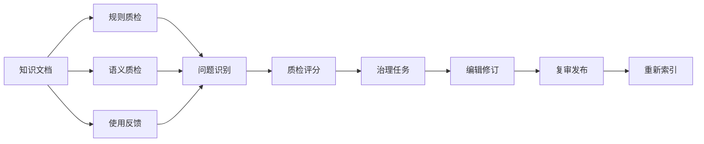
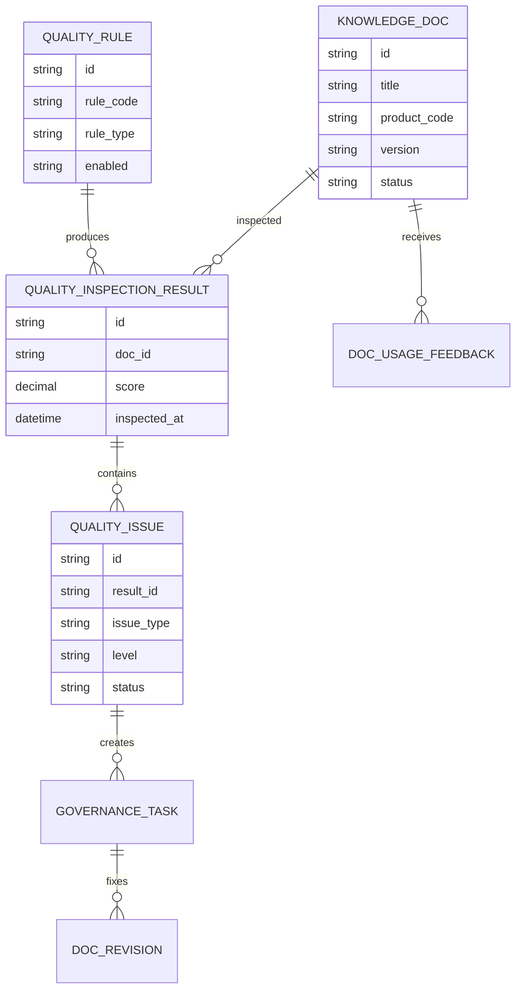
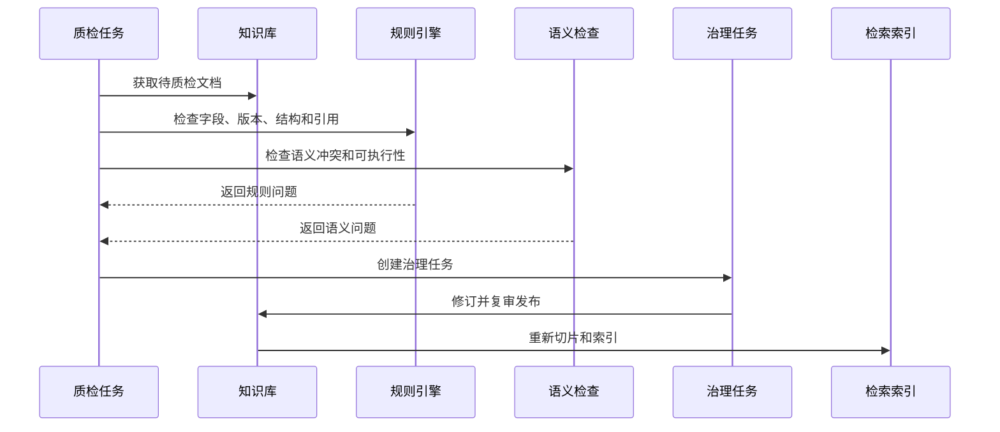
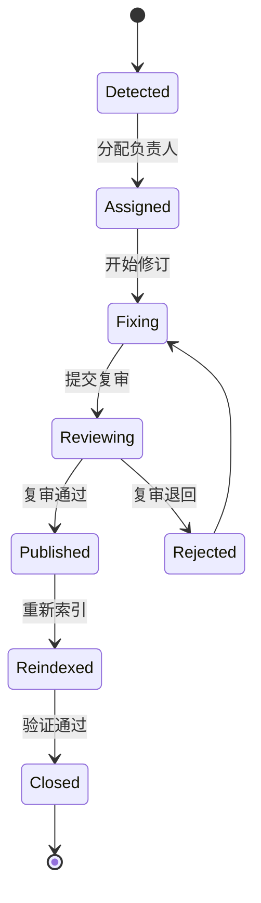
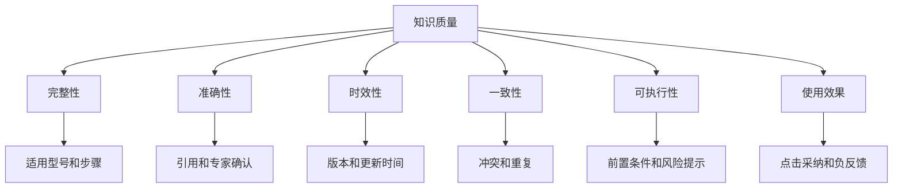

# 售后知识自动质检项目案例

## 适合谁看

- 想理解知识库质量、AI 质检、引用校验和知识运营闭环的前端开发者。
- 正在做售后知识库、客服助手、RAG、内容治理或智能质检系统的团队。
- 希望让知识内容从“有人写”升级为“持续检查、自动发现问题、任务化整改”的项目负责人。

## 业务目标

售后知识自动质检的目标，是自动发现知识库中的过期、冲突、缺引用、不可执行、重复、低反馈和不适配产品版本等问题，并把它们转成知识运营任务。

它通常服务于这些场景：

- AI 问答经常引用过期文档。
- 客服发现两个知识条目结论冲突。
- 文档步骤缺少前置条件，现场执行失败。
- 热门问题没有高质量知识覆盖。
- 文档更新后没有重新索引，搜索仍命中旧内容。

## 自动质检链路

可以把它理解成“知识库的代码扫描”。代码扫描发现 bug，知识质检发现内容质量问题。

## 核心概念

| 概念 | 说明 | 例子 |
| --- | --- | --- |
| 质检规则 | 用来检查知识质量的规则 | 是否缺少适用型号 |
| 语义冲突 | 两篇知识表达了相反结论 | 一个说可重启，一个说禁止重启 |
| 知识覆盖 | 问题是否有可用答案 | 高频故障没有知识条目 |
| 负反馈 | 用户认为答案无用或错误 | 客服点踩、工程师纠错 |
| 治理任务 | 分配给知识运营的整改待办 | 补充步骤、合并重复文档 |
| 复审发布 | 修订后重新审核并发布 | 版本更新和索引刷新 |

## 数据模型

## 推荐表结构

| 表 | 关键字段 | 作用 |
| --- | --- | --- |
| `quality_rule` | `rule_code`、`rule_type`、`threshold_json`、`enabled` | 质检规则 |
| `quality_inspection_job` | `scope_json`、`status`、`started_at`、`finished_at` | 质检任务 |
| `quality_inspection_result` | `job_id`、`doc_id`、`score`、`summary` | 文档质检结果 |
| `quality_issue` | `result_id`、`issue_type`、`level`、`evidence_json`、`status` | 质量问题 |
| `governance_task` | `issue_id`、`owner_id`、`deadline_at`、`status` | 治理任务 |
| `doc_usage_feedback` | `doc_id`、`source_type`、`rating`、`reason` | 使用反馈 |
| `doc_revision` | `doc_id`、`version`、`change_summary`、`review_status` | 修订版本 |

## 自动质检流程

## 质量问题状态设计

## 质检维度拆解

自动质检可以先从规则开始，再逐步加入 AI：

- 规则质检：检查字段缺失、文档过期、无适用型号、无审核人。
- 统计质检：检查低点击、低采纳、高负反馈。
- 语义质检：检查冲突、重复、步骤不可执行。
- 引用质检：检查问答引用是否来自已发布文档。

## 前端页面拆分

| 页面 | 主要内容 | 设计重点 |
| --- | --- | --- |
| 知识质量看板 | 平均质量分、问题数量、过期文档、负反馈趋势 | 让运营先看风险规模 |
| 质检任务列表 | 任务范围、状态、发现问题、执行时间 | 支持手动和定时任务 |
| 问题清单 | 文档、问题类型、等级、证据、负责人 | 按严重程度处理 |
| 问题详情 | 证据片段、规则说明、AI 建议、关联反馈 | 让编辑知道怎么改 |
| 治理复审 | 修订内容、复审意见、发布状态、索引状态 | 保证修订进入线上 |

## 接口拆分建议

| 接口 | 方法 | 说明 |
| --- | --- | --- |
| `/api/knowledge-quality/jobs` | POST | 创建质检任务 |
| `/api/knowledge-quality/jobs` | GET | 查询质检任务 |
| `/api/knowledge-quality/issues` | GET | 查询质量问题 |
| `/api/knowledge-quality/issues/:id` | GET | 查询问题详情 |
| `/api/knowledge-quality/issues/:id/assign` | POST | 分配治理负责人 |
| `/api/knowledge-quality/issues/:id/resolve` | POST | 提交修订结果 |
| `/api/knowledge-quality/metrics` | GET | 查询质量指标 |

## 实际项目常见问题

### 1. AI 质检误报太多

不要让 AI 直接决定文档下线。AI 可以给出疑似问题和证据，最终由知识运营确认。

高风险规则问题可以直接阻断发布，例如文档没有适用产品型号、没有审核人。

### 2. 质检发现问题但编辑不知道怎么改

问题详情必须展示证据和建议，例如冲突文档、冲突句子、缺失字段、负反馈样例。

只显示“质量分 62”没有操作价值。

### 3. 文档修订后搜索仍然命中旧内容

发布后要触发重新切片、向量更新和缓存刷新。治理任务状态不要在“发布”时就关闭，应等索引验证通过再关闭。

### 4. 质量规则越配越复杂

规则要分类型管理：发布阻断、质量扣分、运营提醒。不是所有问题都需要阻断。

页面上要展示规则影响范围，避免一条规则导致大量任务突然出现。

### 5. 负反馈没有关联到文档

问答、搜索、推荐都要记录引用的文档和片段。否则用户点踩后无法知道是哪篇文档有问题。

## 权限与审计

| 动作 | 权限建议 | 审计内容 |
| --- | --- | --- |
| 配置质检规则 | 知识管理员 | 规则内容和阈值 |
| 发起质检任务 | 知识运营 | 质检范围和时间 |
| 分配治理任务 | 知识主管 | 负责人和截止时间 |
| 修订文档 | 文档编辑 | 修改前后内容 |
| 复审发布 | 专家或知识主管 | 审核意见 |

## 验收清单

- 能按规则检查知识字段、版本、引用和状态。
- 能结合使用反馈发现低质量文档。
- 质量问题有证据、等级、负责人和状态。
- 文档修订后能进入复审和发布流程。
- 发布后能重新索引并验证生效。
- 质量看板能展示趋势和治理效果。

## 下一步学习

完成这个案例后，可以继续学习：

- [售后知识质量治理项目案例](/projects/after-sales-knowledge-quality-governance-case)
- [售后知识智能检索优化项目案例](/projects/after-sales-knowledge-search-optimization-case)
- [售后知识问答助手项目案例](/projects/after-sales-knowledge-qa-assistant-case)

