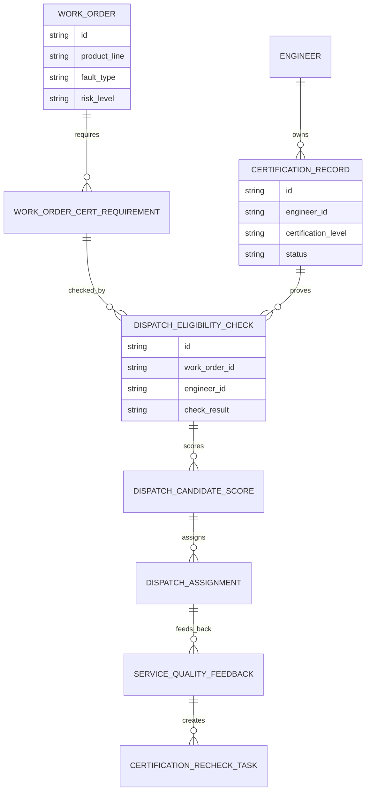
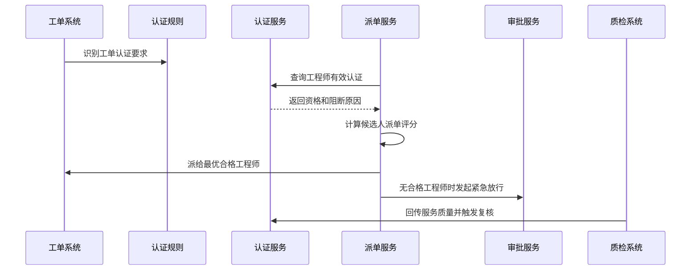
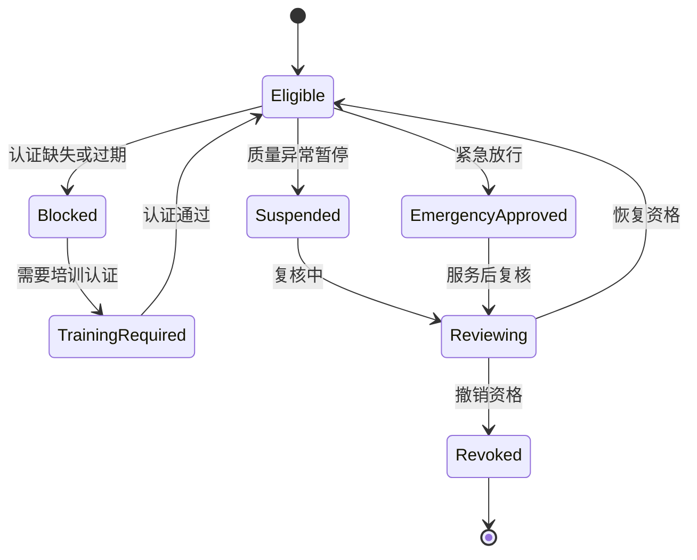
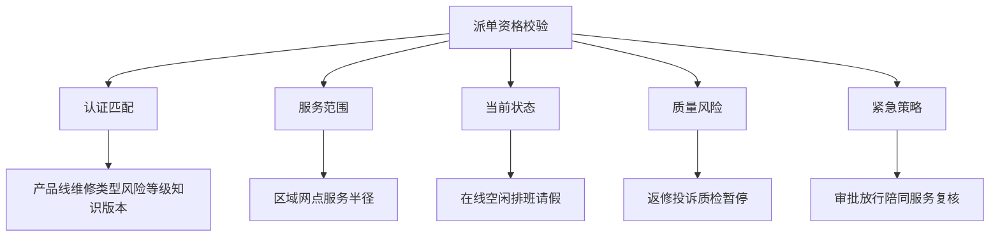
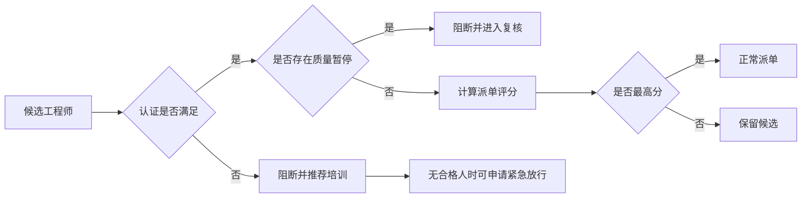

# 售后知识认证派单联动项目案例

## 适合谁看

- 想理解售后工程师认证如何真正影响派单资格的前端开发者。
- 正在做售后知识库、培训认证、报修派单、服务商管理、质检或 SLA 系统的团队。
- 希望避免“培训认证系统有证书，派单系统仍然按距离和空闲度盲派”的项目负责人。

## 业务目标

售后知识培训认证治理让工程师具备明确资质，但认证只有和派单联动才会产生业务价值。派单系统不能只看位置、工时和服务范围，还要判断工程师是否拥有对应产品线、维修类型、风险等级和知识版本的有效认证。

认证派单联动要解决：

- 工单需要哪些认证，工程师有哪些有效认证。
- 认证过期、暂停、撤销或知识版本升级时，派单资格如何实时变化。
- 派单时如何在效率和资质之间做权衡。
- 紧急工单没有合格工程师时如何放行、升级和审计。
- 认证能力如何反向影响培训计划、服务商评级和派单策略。

## 联动链路

派单联动不是在派单前多查一张证书表，而是把认证作为派单资格、评分、阻断和复核的核心条件。

## 核心概念

| 概念 | 说明 |
| --- | --- |
| 工单认证要求 | 工单根据产品线、故障类型、风险等级和政策版本需要满足的认证条件。 |
| 工程师有效认证 | 当前未过期、未暂停、未撤销，并且适用该工单场景的认证。 |
| 派单资格 | 工程师是否允许接某类工单的判断结果。 |
| 阻断原因 | 工程师不能接单的原因，例如认证缺失、过期、区域不符或质量暂停。 |
| 紧急放行 | 在无合格工程师时经过审批临时派单的机制。 |
| 质量回传 | 工单完成后的返修、投诉、质检和 SLA 结果对认证状态产生影响。 |

## 数据模型

资格校验记录必须保存。后续如果出现投诉或事故，需要证明当时为什么派给这个工程师。

## 推荐表结构

| 表 | 作用 | 关键字段 |
| --- | --- | --- |
| `work_order_cert_requirement` | 保存工单认证要求 | `work_order_id`、`product_line`、`repair_type`、`required_level` |
| `dispatch_eligibility_check` | 保存派单资格校验 | `work_order_id`、`engineer_id`、`check_result`、`block_reason` |
| `dispatch_candidate_score` | 保存候选人评分 | `check_id`、`distance_score`、`skill_score`、`sla_score`、`total_score` |
| `dispatch_assignment` | 保存派单结果 | `work_order_id`、`engineer_id`、`assignment_type`、`assigned_at` |
| `emergency_dispatch_approval` | 保存紧急放行 | `work_order_id`、`engineer_id`、`approval_reason`、`approved_by` |
| `service_quality_feedback` | 保存服务质量回传 | `assignment_id`、`feedback_type`、`result`、`severity` |
| `certification_recheck_task` | 保存认证复核任务 | `feedback_id`、`engineer_id`、`task_status`、`result` |

## 派单校验流程

派单评分只能在资格通过后计算。认证不满足的工程师不应该因为距离近而被排到前面。

## 派单资格状态设计

紧急放行不能直接变成长期资格。服务完成后必须进入复核。

## 资格校验维度

页面需要同时展示“为什么可派”和“为什么不可派”，否则调度人员无法解释系统推荐结果。

## 派单决策矩阵

派单推荐要把阻断候选人留在明细里，便于管理者发现服务商能力缺口。

## 前端页面拆分

| 页面 | 核心内容 | 设计重点 |
| --- | --- | --- |
| 工单派单详情 | 认证要求、候选工程师、资格结果、派单评分 | 让调度人员看懂推荐原因。 |
| 资格阻断列表 | 工程师、工单类型、阻断原因、培训建议 | 把派单失败转成能力建设。 |
| 紧急放行 | 工单风险、缺口原因、临时派单人、审批记录 | 强制留痕，避免滥用。 |
| 质量回传 | 返修、投诉、质检、SLA、认证复核状态 | 把服务结果反向影响资格。 |
| 服务商能力看板 | 合格人数、缺口产品线、培训完成率、派单成功率 | 支持服务商评级和培训计划。 |

## 接口拆分建议

| 接口 | 作用 |
| --- | --- |
| `GET /api/after-sales-work-orders/:id/dispatch-cert-requirements` | 查询工单认证要求。 |
| `POST /api/after-sales-work-orders/:id/check-dispatch-eligibility` | 校验候选工程师派单资格。 |
| `GET /api/after-sales-work-orders/:id/dispatch-candidates` | 查询派单候选人和评分。 |
| `POST /api/after-sales-work-orders/:id/assign` | 正常派单。 |
| `POST /api/after-sales-work-orders/:id/emergency-dispatch` | 发起紧急放行派单。 |
| `GET /api/after-sales-dispatch-blocks` | 查询资格阻断记录。 |
| `POST /api/after-sales-service-quality-feedback` | 回传服务质量。 |
| `POST /api/after-sales-certification-recheck-tasks/:id/complete` | 完成认证复核。 |

## 实际项目常见问题

### 1. 派单只看距离

距离最近的人不一定有资质，容易造成返修和安全风险。解决方式是先做认证资格校验，再计算距离和 SLA 分数。

### 2. 认证过期没有实时阻断

证书过期后仍然接单。解决方式是认证状态变化要实时同步派单资格，并在派单前再次校验。

### 3. 阻断原因不透明

调度人员只看到“不可派”，不知道怎么处理。解决方式是返回缺失认证、过期、区域不符、暂停等具体原因。

### 4. 紧急放行被滥用

为了赶 SLA 经常绕过认证。解决方式是紧急放行必须审批、限制场景，并在服务后复核。

### 5. 派单失败没有反哺培训

很多工单无人可派，但培训计划没有变化。解决方式是汇总阻断记录，自动生成服务商能力缺口和培训建议。

## 权限与审计

| 权限 | 说明 |
| --- | --- |
| 查看资格校验 | 可以查看候选工程师是否满足认证要求。 |
| 正常派单 | 可以将工单派给合格工程师。 |
| 紧急放行 | 可以发起或审批临时派单。 |
| 处理资格阻断 | 可以创建培训或复核任务。 |
| 查看能力看板 | 可以查看服务商认证覆盖和派单缺口。 |

认证要求、资格校验、阻断原因、派单评分、紧急放行、质量回传和资格复核都要保留审计。

## 验收清单

- 能根据工单自动识别认证要求。
- 能查询工程师有效认证并判断派单资格。
- 能保存资格校验结果和阻断原因。
- 能在资格通过后计算派单评分。
- 能支持无合格工程师时的紧急放行审批。
- 能把服务质量回传到认证复核流程。
- 能汇总服务商认证缺口并生成培训建议。

## 下一步学习

- [售后知识培训认证治理项目案例](/projects/after-sales-knowledge-training-certification-governance-case)
- [报修派单项目案例](/projects/repair-dispatch-case)
- [售后服务商评级项目案例](/projects/after-sales-provider-rating-case)
