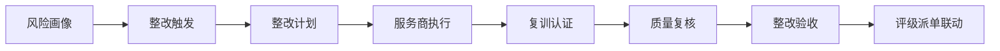
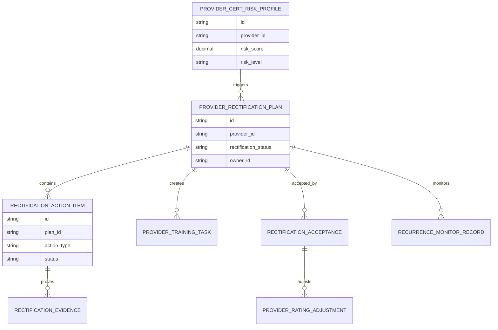
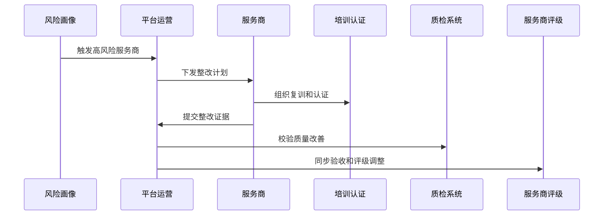
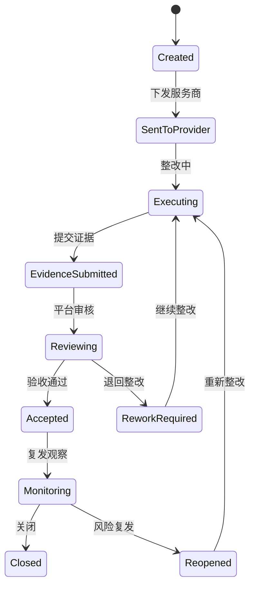
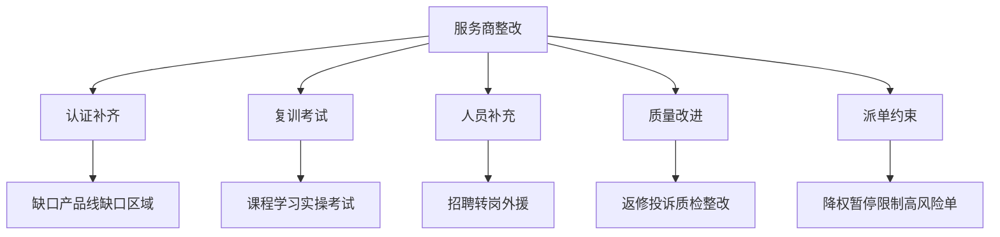
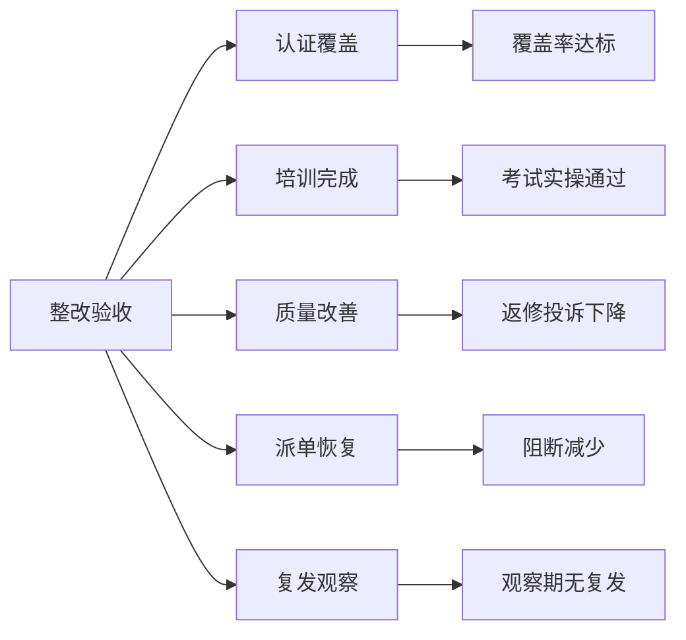

# 售后知识认证服务商整改项目案例

## 适合谁看

- 想理解售后认证风险画像如何驱动服务商整改的前端开发者。
- 正在做售后知识库、培训认证、服务商管理、派单、质检、评级或合规整改系统的团队。
- 希望避免“看到了服务商认证风险，但整改仍靠微信群催促和线下表格”的项目负责人。

## 业务目标

售后知识认证风险画像能发现服务商在产品线、区域、工程师能力和质量表现上的风险，但风险只有转成整改任务才有价值。服务商整改要把认证缺口、质量事件、紧急放行、复训失败和派单阻断转成整改计划、责任人、期限、验收和评级影响。

服务商整改要解决：

- 哪些认证风险需要服务商整改。
- 整改计划如何拆到产品线、工程师和课程。
- 服务商如何提交整改证据和复训结果。
- 平台如何验收整改是否有效。
- 整改结果如何影响服务商评级、派单权重和合作策略。

## 服务商整改链路

整改的重点不是发通知，而是把风险、行动、证据、验收和后续约束串起来。

## 核心概念

| 概念 | 说明 |
| --- | --- |
| 整改触发 | 认证覆盖不足、质量风险过高、紧急放行异常或复训失败触发整改。 |
| 整改计划 | 服务商需要完成的培训、认证、人员补充、质量改进和制度动作。 |
| 整改证据 | 服务商提交的学习记录、考试结果、实操证明、人员安排和质检结果。 |
| 整改验收 | 平台根据认证恢复、质量改善和派单表现判断是否达标。 |
| 评级联动 | 整改结果影响服务商评级、派单权重、保证金或合作资格。 |
| 复发监控 | 整改完成后继续观察一段时间，防止风险反弹。 |

## 数据模型

整改计划要绑定风险画像，后续才能证明整改是针对哪些风险发起的。

## 推荐表结构

| 表 | 作用 | 关键字段 |
| --- | --- | --- |
| `provider_rectification_plan` | 保存整改计划 | `provider_id`、`risk_profile_id`、`rectification_status`、`due_at` |
| `rectification_action_item` | 保存整改动作 | `plan_id`、`action_type`、`owner_id`、`status` |
| `rectification_evidence` | 保存整改证据 | `action_id`、`evidence_type`、`evidence_url`、`submitted_at` |
| `provider_training_task` | 保存复训任务 | `plan_id`、`course_id`、`engineer_id`、`task_status` |
| `rectification_acceptance` | 保存验收记录 | `plan_id`、`acceptance_result`、`reviewer_id`、`comment` |
| `provider_rating_adjustment` | 保存评级调整 | `acceptance_id`、`before_rating`、`after_rating`、`reason` |
| `recurrence_monitor_record` | 保存复发监控 | `plan_id`、`monitor_period`、`risk_change`、`result` |

## 整改执行流程

服务商整改要给服务商操作入口，不能只在内部后台流转。

## 整改状态设计

复发观察期很重要，否则服务商可能只为验收短期补材料。

## 整改动作拆解

整改动作要能拆到具体工程师和产品线，否则服务商无法执行。

## 验收标准矩阵

验收标准要提前写入整改计划，服务商才知道如何达标。

## 前端页面拆分

| 页面 | 核心内容 | 设计重点 |
| --- | --- | --- |
| 整改计划列表 | 服务商、风险等级、整改状态、逾期、评级影响 | 优先展示高风险和逾期计划。 |
| 整改详情 | 风险画像、整改动作、证据、复训、验收标准 | 让平台和服务商对齐目标。 |
| 服务商提交页 | 待办、证据上传、复训进度、问题反馈 | 给外部服务商使用，步骤要清晰。 |
| 验收工作台 | 证据审核、质量复核、评级调整、退回原因 | 支持平台审核。 |
| 复发监控 | 风险趋势、质量事件、派单表现、观察结果 | 防止整改后风险反弹。 |

## 接口拆分建议

| 接口 | 作用 |
| --- | --- |
| `GET /api/after-sales-provider-rectifications` | 查询服务商整改计划。 |
| `POST /api/after-sales-provider-rectifications` | 创建整改计划。 |
| `GET /api/after-sales-provider-rectifications/:id` | 查询整改详情。 |
| `POST /api/after-sales-provider-rectifications/:id/send` | 下发服务商。 |
| `POST /api/after-sales-provider-rectification-actions/:id/evidence` | 提交整改证据。 |
| `POST /api/after-sales-provider-rectifications/:id/review` | 审核整改。 |
| `POST /api/after-sales-provider-rectifications/:id/accept` | 验收整改。 |
| `POST /api/after-sales-provider-rectifications/:id/rating-adjustment` | 调整服务商评级。 |

## 实际项目常见问题

### 1. 风险画像没有转成计划

看板显示高风险，但没人整改。解决方式是高风险阈值自动生成整改计划。

### 2. 整改动作太抽象

服务商不知道做什么。解决方式是按产品线、工程师、课程和质量问题拆分动作。

### 3. 证据无法验证

服务商上传材料但无法判断真假。解决方式是证据要关联培训、考试、质检和认证系统。

### 4. 验收只看材料

材料齐全但现场质量没有改善。解决方式是验收必须包含质量指标和派单表现。

### 5. 整改后风险复发

短期通过后又回到原状态。解决方式是设置复发观察期和重新打开机制。

## 权限与审计

| 权限 | 说明 |
| --- | --- |
| 创建整改计划 | 可以基于风险画像发起整改。 |
| 服务商提交证据 | 服务商可以提交整改材料和复训结果。 |
| 审核整改 | 平台可以审核证据和退回整改。 |
| 验收整改 | 平台可以确认整改达标或不达标。 |
| 调整评级 | 可以根据整改结果调整服务商评级。 |

整改触发、计划下发、证据提交、审核验收、评级调整和复发监控都要保留审计。

## 验收清单

- 能从服务商风险画像创建整改计划。
- 能拆分认证、复训、人员和质量整改动作。
- 能让服务商提交证据和反馈。
- 能关联培训、考试、质检和认证结果。
- 能按标准验收整改结果。
- 能联动服务商评级和派单权重。
- 能设置复发观察并重新打开整改。

## 下一步学习

- [售后知识认证风险画像项目案例](/projects/after-sales-knowledge-certification-risk-profile-case)
- [售后知识认证质量稽核项目案例](/projects/after-sales-knowledge-certification-quality-audit-case)
- [售后服务商评级项目案例](/projects/after-sales-provider-rating-case)
