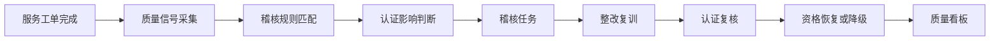
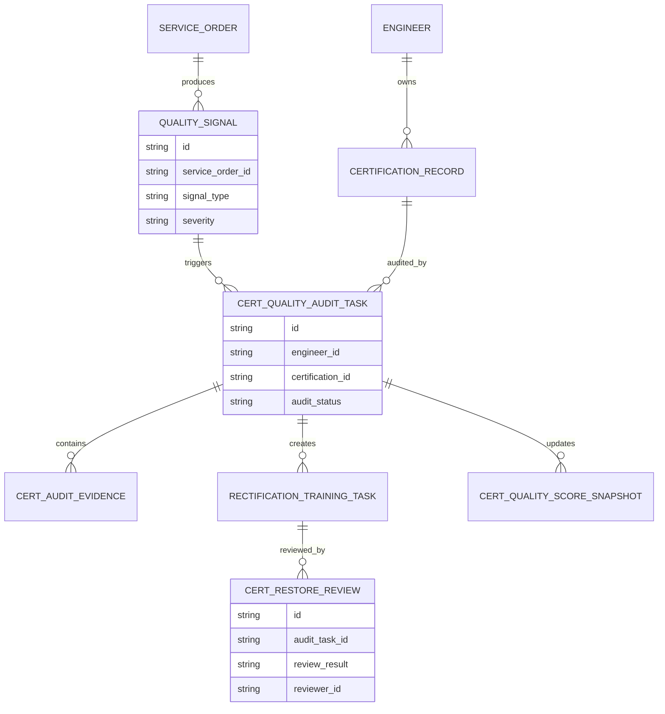
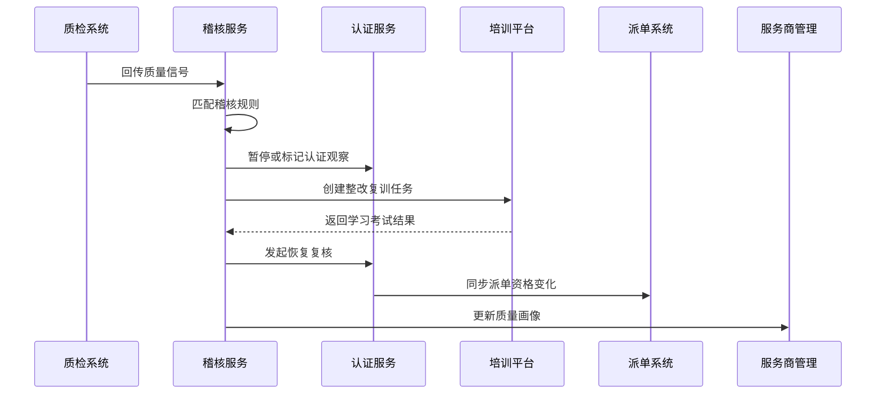
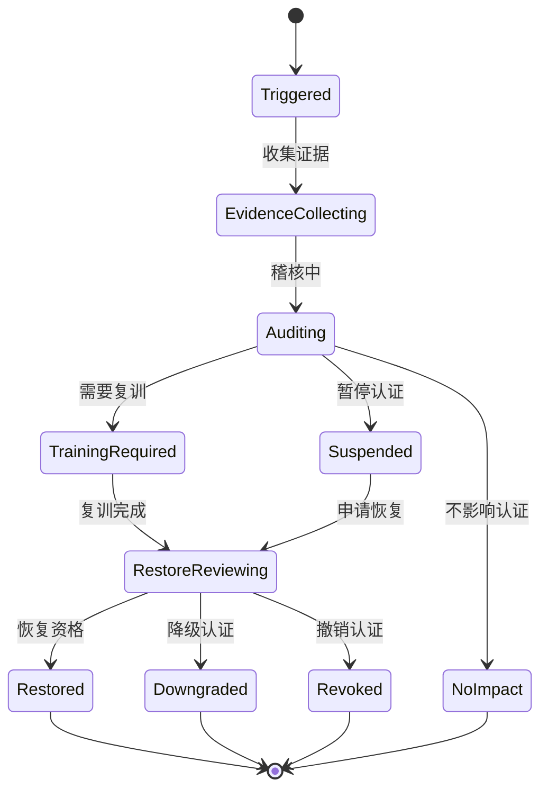
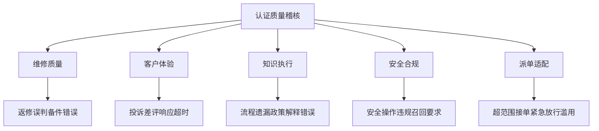
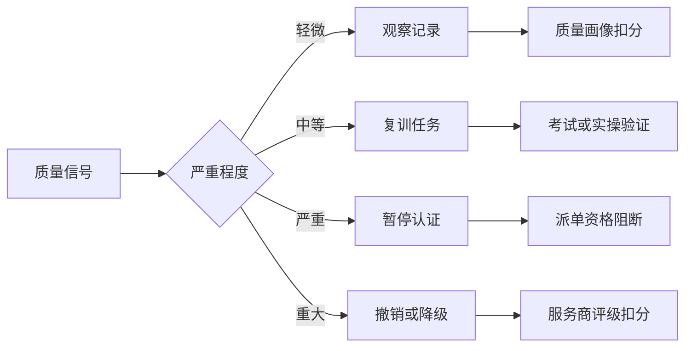

# 售后知识认证质量稽核项目案例

## 适合谁看

- 想理解售后认证如何通过质量稽核持续保持可信的前端开发者。
- 正在做售后知识库、培训认证、报修派单、服务商管理、质检、投诉或评级系统的团队。
- 希望避免“工程师有证书，但现场维修质量长期不达标，认证系统没有反馈”的项目负责人。

## 业务目标

售后知识认证派单联动能保证工程师具备接单资格，但认证并不是一次性通过就永远可信。现场服务中仍然可能出现返修、投诉、误操作、备件使用错误、质保政策解释错误和安全风险。质量稽核要把工单质量结果反向连接到认证状态，持续判断工程师是否仍然符合认证要求。

认证质量稽核要解决：

- 哪些服务质量问题会触发认证稽核。
- 稽核如何区分知识缺口、操作失误、服务态度和外部原因。
- 稽核结果如何影响认证暂停、降级、复训和派单资格。
- 服务商、工程师和产品线的认证质量如何形成看板。
- 稽核证据、整改和恢复资格如何闭环。

## 质量稽核链路

质量稽核不是额外质检，而是把质检结果转成认证治理动作。

## 核心概念

| 概念 | 说明 |
| --- | --- |
| 质量信号 | 返修、投诉、质检不合格、SLA 超时、备件错误、政策解释错误等事件。 |
| 稽核规则 | 判断质量信号是否影响认证的规则。 |
| 认证影响 | 暂停、降级、复训、观察或不影响。 |
| 稽核任务 | 针对工程师、服务商或产品线发起的认证质量检查任务。 |
| 整改复训 | 根据稽核结论安排课程、考试、实操验证或现场陪同。 |
| 质量画像 | 工程师和服务商在认证覆盖、质量事件、复训效果上的综合视图。 |

## 数据模型

稽核任务要绑定认证记录，而不是只绑定工程师。一个工程师可能在不同产品线有不同认证。

## 推荐表结构

| 表 | 作用 | 关键字段 |
| --- | --- | --- |
| `quality_signal` | 保存质量信号 | `service_order_id`、`engineer_id`、`signal_type`、`severity` |
| `cert_audit_rule` | 保存稽核规则 | `signal_type`、`severity_threshold`、`impact_action`、`enabled` |
| `cert_quality_audit_task` | 保存稽核任务 | `engineer_id`、`certification_id`、`audit_status`、`owner_id` |
| `cert_audit_evidence` | 保存稽核证据 | `audit_task_id`、`evidence_type`、`evidence_url`、`summary` |
| `rectification_training_task` | 保存整改复训 | `audit_task_id`、`course_id`、`exam_required`、`task_status` |
| `cert_restore_review` | 保存恢复复核 | `audit_task_id`、`review_result`、`reviewer_id`、`comment` |
| `cert_quality_score_snapshot` | 保存质量评分 | `engineer_id`、`certification_id`、`score`、`risk_level` |

## 稽核执行流程

认证状态变化必须同步派单系统，否则稽核结论无法约束实际接单。

## 稽核状态设计

不影响认证也要记录原因，避免后续重复稽核时缺少上下文。

## 稽核信号拆解

稽核信号要分类型处理。客户态度问题不一定说明知识认证失效，安全违规通常需要立即暂停。

## 认证影响矩阵

影响动作要可配置，不同产品线的安全要求可能不同。

## 前端页面拆分

| 页面 | 核心内容 | 设计重点 |
| --- | --- | --- |
| 稽核任务列表 | 工程师、认证、质量信号、状态、影响动作 | 优先展示严重和逾期任务。 |
| 稽核详情 | 工单证据、认证记录、稽核规则、处理结论 | 帮用户理解为什么影响认证。 |
| 整改复训 | 课程、考试、实操、完成情况、复核结论 | 把稽核问题转成能力提升。 |
| 认证质量看板 | 工程师质量分、服务商风险、产品线缺口 | 支持管理层查看认证可信度。 |
| 稽核规则配置 | 信号类型、严重度、影响动作、恢复条件 | 规则需要可审计和可回滚。 |

## 接口拆分建议

| 接口 | 作用 |
| --- | --- |
| `GET /api/after-sales-cert-quality-audits` | 查询认证质量稽核任务。 |
| `POST /api/after-sales-cert-quality-audits` | 创建稽核任务。 |
| `GET /api/after-sales-cert-quality-audits/:id` | 查询稽核详情。 |
| `POST /api/after-sales-cert-quality-audits/:id/audit` | 提交稽核结论。 |
| `POST /api/after-sales-cert-quality-audits/:id/training-tasks` | 创建整改复训任务。 |
| `POST /api/after-sales-cert-quality-audits/:id/restore-review` | 提交恢复资格复核。 |
| `GET /api/after-sales-cert-quality-dashboard` | 查询认证质量看板。 |
| `GET /api/after-sales-cert-audit-rules` | 查询稽核规则。 |

## 实际项目常见问题

### 1. 质检和认证系统脱节

质检发现问题，但认证仍然有效。解决方式是质量信号通过规则自动生成稽核任务。

### 2. 所有质量问题都暂停认证

轻微服务态度问题也阻断派单，影响服务能力。解决方式是按信号类型和严重度配置影响动作。

### 3. 稽核证据不完整

工程师申诉时无法说明原因。解决方式是稽核任务必须保留工单、照片、录音、质检记录和规则命中证据。

### 4. 复训完成但资格未恢复

培训系统通过了，派单系统仍阻断。解决方式是恢复复核通过后统一同步认证和派单资格。

### 5. 服务商看不到能力缺口

只处理单个工程师，没有形成组织改进。解决方式是认证质量看板按服务商和产品线汇总。

## 权限与审计

| 权限 | 说明 |
| --- | --- |
| 查看稽核任务 | 可以查看认证质量稽核列表和详情。 |
| 提交稽核结论 | 可以判断质量信号是否影响认证。 |
| 配置稽核规则 | 可以维护信号和影响动作。 |
| 恢复资格复核 | 可以审核复训后是否恢复派单资格。 |
| 查看质量看板 | 可以查看工程师和服务商认证质量画像。 |

质量信号、规则命中、稽核结论、复训结果、恢复复核和派单资格同步都要保留审计。

## 验收清单

- 能从质量信号创建认证稽核任务。
- 能按规则判断认证影响动作。
- 能暂停、降级、观察或不影响认证。
- 能创建整改复训并跟踪完成。
- 能复核恢复资格并同步派单系统。
- 能展示工程师、服务商和产品线质量画像。
- 能保留稽核全过程证据和审计记录。

## 下一步学习

- [售后知识认证派单联动项目案例](/projects/after-sales-knowledge-certification-dispatch-linkage-case)
- [售后知识培训认证治理项目案例](/projects/after-sales-knowledge-training-certification-governance-case)
- [售后维修质量复盘项目案例](/projects/after-sales-repair-quality-review-case)
