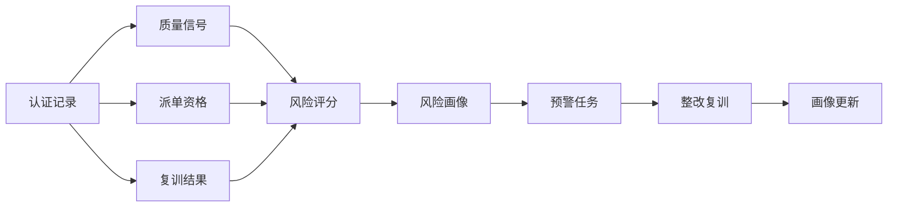
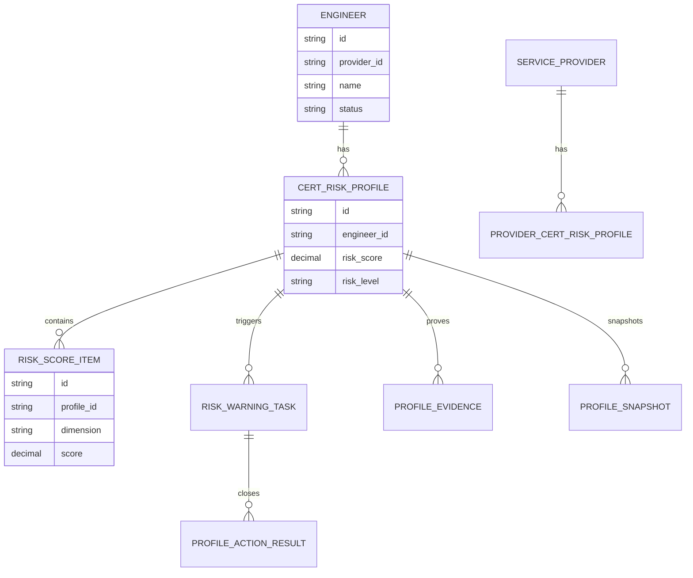
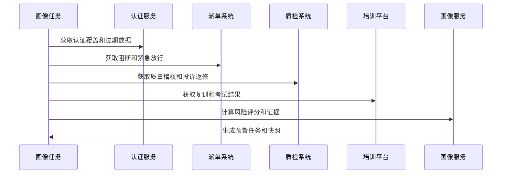
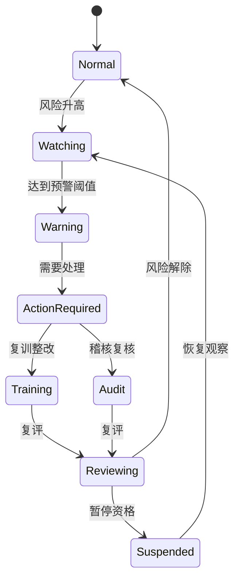
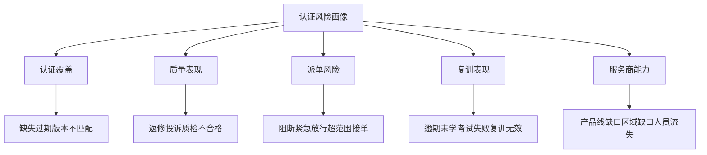
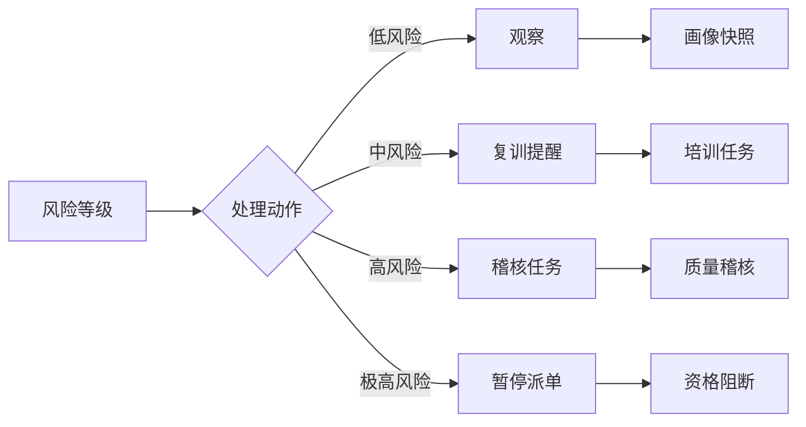

# 售后知识认证风险画像项目案例

## 适合谁看

- 想理解售后工程师认证风险如何形成画像和预警的前端开发者。
- 正在做售后知识库、培训认证、报修派单、服务商管理、质检、投诉或评级系统的团队。
- 希望避免“认证状态只有有效或无效，看不出哪些工程师、服务商和产品线正在积累风险”的项目负责人。

## 业务目标

售后知识认证质量稽核能处理具体质量事件，但管理团队还需要提前发现认证风险。风险画像要把认证覆盖、过期趋势、质量事件、派单阻断、紧急放行、复训结果和服务商能力缺口汇总成工程师、服务商、产品线和区域维度的风险评分。

认证风险画像要解决：

- 哪些工程师虽然有证书，但近期质量风险升高。
- 哪些服务商在关键产品线上认证覆盖不足。
- 哪些产品线认证过期集中爆发，可能影响派单 SLA。
- 紧急放行是否被滥用，是否掩盖认证能力缺口。
- 风险画像如何触发复训、稽核、暂停资格和服务商整改。

## 风险画像链路

风险画像的目标是提前预警，而不是等事故或投诉出现后再稽核。

## 核心概念

| 概念 | 说明 |
| --- | --- |
| 工程师画像 | 单个工程师的认证覆盖、质量表现、派单资格、复训和风险趋势。 |
| 服务商画像 | 服务商整体认证能力、缺口产品线、质量风险和整改表现。 |
| 产品线风险 | 某产品线认证覆盖不足、质量事件集中或知识版本切换带来的风险。 |
| 风险评分 | 综合认证、质量、派单、复训和紧急放行形成的分数。 |
| 风险预警 | 画像达到阈值后自动生成的提醒、稽核或复训任务。 |
| 风险解释 | 告诉用户风险分来自哪些证据，而不是只显示红黄绿。 |

## 数据模型

画像要支持快照，否则无法比较风险趋势和整改效果。

## 推荐表结构

| 表 | 作用 | 关键字段 |
| --- | --- | --- |
| `cert_risk_profile` | 保存工程师画像 | `engineer_id`、`risk_score`、`risk_level`、`updated_at` |
| `provider_cert_risk_profile` | 保存服务商画像 | `provider_id`、`risk_score`、`coverage_rate`、`risk_level` |
| `risk_score_item` | 保存评分明细 | `profile_id`、`dimension`、`score`、`reason` |
| `profile_evidence` | 保存画像证据 | `profile_id`、`evidence_type`、`source_id`、`summary` |
| `risk_warning_task` | 保存风险预警 | `profile_id`、`warning_type`、`owner_id`、`task_status` |
| `profile_action_result` | 保存处理结果 | `task_id`、`action_type`、`result`、`review_comment` |
| `profile_snapshot` | 保存画像快照 | `profile_id`、`snapshot_period`、`risk_score`、`risk_level` |

## 画像生成流程

画像适合周期生成，并在严重质量事件发生时触发增量刷新。

## 画像状态设计

画像风险解除后不要立即删除历史，仍要保留一段观察期。

## 风险维度拆解

风险画像页面要展示维度评分和证据，不能只显示一个风险等级。

## 风险动作矩阵

动作矩阵需要可配置，不同产品线和风险等级的处理方式不一样。

## 前端页面拆分

| 页面 | 核心内容 | 设计重点 |
| --- | --- | --- |
| 风险画像总览 | 风险分布、高风险工程师、服务商缺口、趋势 | 管理层快速看到风险集中点。 |
| 工程师画像 | 认证、质量、派单、复训、风险证据 | 解释单个人为什么高风险。 |
| 服务商画像 | 覆盖率、缺口产品线、质量事件、整改任务 | 支持服务商治理。 |
| 产品线风险 | 认证覆盖、过期趋势、质量问题、派单影响 | 发现产品线级能力缺口。 |
| 风险预警任务 | 预警类型、负责人、动作、处理结果 | 把画像转成闭环任务。 |

## 接口拆分建议

| 接口 | 作用 |
| --- | --- |
| `GET /api/after-sales-cert-risk-profiles/dashboard` | 查询风险画像总览。 |
| `GET /api/after-sales-engineers/:id/cert-risk-profile` | 查询工程师认证风险画像。 |
| `GET /api/after-sales-providers/:id/cert-risk-profile` | 查询服务商认证风险画像。 |
| `GET /api/after-sales-cert-risk-profiles/product-lines` | 查询产品线风险。 |
| `POST /api/after-sales-cert-risk-profiles/generate` | 生成画像快照。 |
| `GET /api/after-sales-cert-risk-warning-tasks` | 查询风险预警任务。 |
| `POST /api/after-sales-cert-risk-warning-tasks/:id/actions` | 提交预警处理动作。 |

## 实际项目常见问题

### 1. 画像只有红黄绿

管理者不知道风险来自哪里。解决方式是展示维度评分、证据和趋势。

### 2. 只看工程师不看服务商

个人风险处理完，服务商能力缺口仍存在。解决方式是同时做工程师画像和服务商画像。

### 3. 紧急放行没有进入风险

长期靠放行接单，掩盖认证不足。解决方式是紧急放行次数和原因纳入风险评分。

### 4. 画像刷新太慢

严重投诉后仍显示低风险。解决方式是周期快照加严重事件增量刷新。

### 5. 预警没有闭环

看板发现高风险，但没有任务。解决方式是风险阈值触发复训、稽核或暂停资格任务。

## 权限与审计

| 权限 | 说明 |
| --- | --- |
| 查看画像总览 | 可以查看整体风险分布和趋势。 |
| 查看工程师画像 | 可以查看个人认证和质量证据。 |
| 查看服务商画像 | 可以查看服务商能力缺口。 |
| 生成画像 | 可以手动触发画像计算。 |
| 处理预警 | 可以提交复训、稽核或暂停动作。 |

画像计算、评分规则、证据来源、预警任务和处理结果都要保留审计。

## 验收清单

- 能生成工程师、服务商和产品线风险画像。
- 能展示认证覆盖、质量、派单、复训和服务商能力维度。
- 能解释风险评分来源。
- 能按阈值生成预警任务。
- 能把预警转成复训、稽核或暂停资格动作。
- 能保留画像快照和风险趋势。
- 能按角色控制敏感证据访问。

## 下一步学习

- [售后知识认证质量稽核项目案例](/projects/after-sales-knowledge-certification-quality-audit-case)
- [售后知识认证派单联动项目案例](/projects/after-sales-knowledge-certification-dispatch-linkage-case)
- [售后服务商评级项目案例](/projects/after-sales-provider-rating-case)
