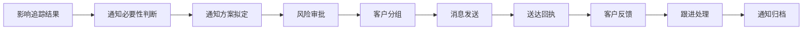
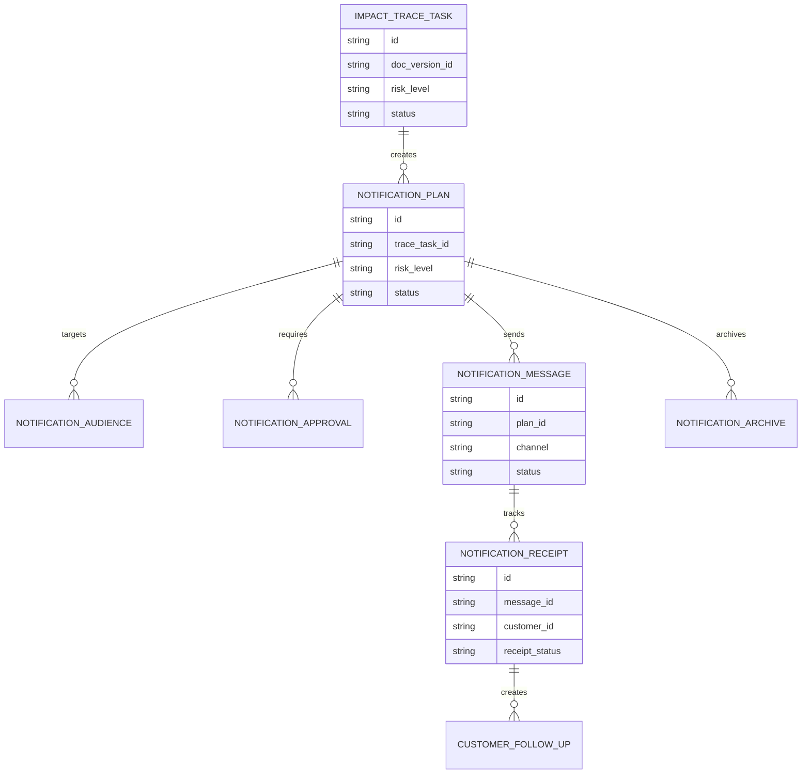
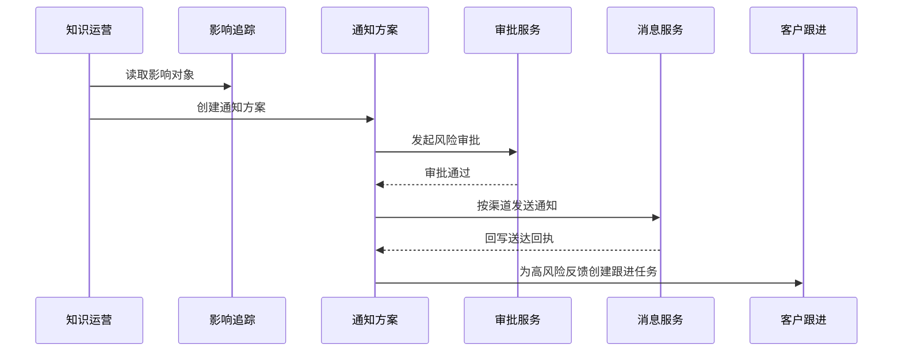
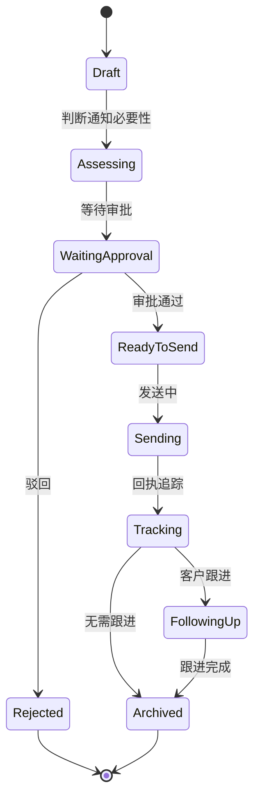
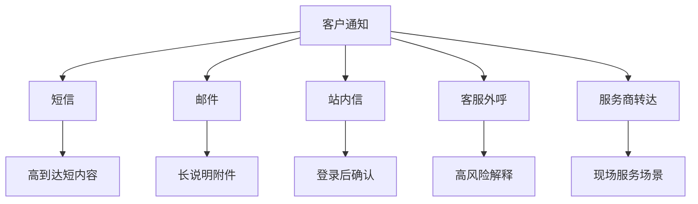

# 售后知识客户通知治理项目案例

## 适合谁看

- 想理解知识错误、回滚或高风险变更后，如何判断是否通知客户并追踪结果的前端开发者。
- 正在做售后知识库、客户服务、AI 问答、工单系统、客户通知或合规治理系统的团队。
- 希望避免“错误知识影响客户，但通知过度、漏通知或无法追踪”的项目负责人。

## 业务目标

售后知识影响追踪能识别哪些工单、问答或客户可能受影响。客户通知治理解决下一步：哪些情况必须通知客户、谁来审批、怎么发、发了以后是否确认。

它要回答：

- 哪些错误知识需要客户通知，哪些只需要内部复核。
- 通知客户前是否需要法务、服务负责人或合规审批。
- 通知内容如何避免扩大误解。
- 通知发送后是否送达、是否阅读、是否需要二次跟进。
- 客户反馈是否要重新打开工单或触发赔付流程。

这个模块的关键不是“批量发消息”，而是把客户通知变成可控、可审计、可闭环的治理流程。

## 客户通知治理链路

客户通知必须谨慎。低风险问题过度通知会制造焦虑，高风险问题不通知会带来投诉、合规和安全风险。

## 核心概念

| 概念 | 说明 |
| --- | --- |
| 通知必要性 | 根据风险等级、客户影响、是否已误操作判断是否需要通知客户。 |
| 通知方案 | 通知对象、渠道、文案、发送时间、审批要求和跟进策略。 |
| 客户分组 | 按产品、地区、服务等级、影响场景对客户分组。 |
| 通知审批 | 对高风险或敏感通知进行法务、合规或服务负责人审批。 |
| 回执追踪 | 记录消息是否发送、送达、阅读、确认和退订。 |
| 跟进闭环 | 对客户反馈、二次咨询、投诉和赔付进行后续处理。 |

## 数据模型

通知计划和消息发送要分开。一个通知计划可能拆成短信、邮件、站内信、客服外呼多个渠道，也可能按客户分组分批发送。

## 推荐表结构

| 表 | 作用 | 关键字段 |
| --- | --- | --- |
| `notification_plan` | 保存通知方案 | `trace_task_id`、`risk_level`、`reason`、`status` |
| `notification_audience` | 保存通知对象 | `plan_id`、`customer_id`、`segment_code`、`impact_object_id` |
| `notification_approval` | 保存审批记录 | `plan_id`、`approver_id`、`result`、`comment` |
| `notification_message` | 保存消息批次 | `plan_id`、`channel`、`template_id`、`send_at`、`status` |
| `notification_receipt` | 保存回执 | `message_id`、`customer_id`、`receipt_status`、`read_at` |
| `customer_follow_up` | 保存跟进任务 | `receipt_id`、`task_type`、`owner_id`、`status` |
| `notification_archive` | 保存归档证据 | `plan_id`、`archive_type`、`file_id`、`summary` |

## 通知执行流程

通知发送前最好有预览和试发。客户通知文案一旦发出，很难撤回。

## 通知状态设计

状态里要保留“判断通知必要性”。不是所有影响追踪任务都要进入发送阶段。

## 通知渠道拆解

不同渠道适合不同风险等级。高风险问题通常需要外呼或服务商确认，低风险问题可以用站内信或邮件说明。

## 前端页面拆分

| 页面 | 核心内容 | 设计重点 |
| --- | --- | --- |
| 通知方案列表 | 关联知识、风险等级、客户数量、状态、负责人 | 高风险和待审批方案要突出。 |
| 通知方案详情 | 影响范围、必要性判断、文案、审批记录 | 文案和影响证据要放在一起看。 |
| 客户对象列表 | 客户、影响场景、通知渠道、回执、跟进状态 | 支持按未送达、未确认、高风险筛选。 |
| 消息发送记录 | 渠道、模板、批次、成功率、失败原因 | 批量发送必须能追踪失败。 |
| 客户跟进工作台 | 客户反馈、工单、外呼记录、处理结论 | 跟进任务要能闭环。 |

## 接口拆分建议

| 接口 | 作用 |
| --- | --- |
| `GET /api/knowledge-customer-notifications` | 查询通知方案列表。 |
| `POST /api/knowledge-customer-notifications` | 创建通知方案。 |
| `GET /api/knowledge-customer-notifications/:id` | 查询通知方案详情。 |
| `POST /api/knowledge-customer-notifications/:id/assess` | 判断通知必要性。 |
| `POST /api/knowledge-customer-notifications/:id/approve` | 审批通知方案。 |
| `POST /api/knowledge-customer-notifications/:id/send` | 发送通知。 |
| `GET /api/knowledge-customer-notifications/:id/receipts` | 查询通知回执。 |
| `POST /api/knowledge-customer-notification-receipts/:id/follow-up` | 创建客户跟进。 |

## 实际项目常见问题

### 1. 影响追踪结果直接群发客户

不是所有影响都需要通知客户，直接群发可能造成恐慌或投诉。解决方式是增加通知必要性判断和审批。

### 2. 通知文案没有审校

文案表述不清，客户反而误解问题。解决方式是高风险通知必须经过服务、法务或合规审批，并保存审批版本。

### 3. 只记录发送成功，不记录客户是否收到

消息服务返回成功不代表客户已读。解决方式是记录送达、阅读、确认和退回状态。

### 4. 客户反馈没有回到工单系统

客户回复后没人处理。解决方式是高风险反馈自动创建跟进任务或重新打开工单。

### 5. 多渠道重复打扰客户

短信、邮件、外呼都发一遍，客户体验很差。解决方式是建立渠道优先级和去重规则。

## 权限与审计

| 权限 | 说明 |
| --- | --- |
| 创建通知方案 | 可以从影响追踪结果生成通知方案。 |
| 查看客户对象 | 可以查看受影响客户和通知状态。 |
| 审批通知 | 可以审核高风险通知文案和发送范围。 |
| 发送通知 | 可以执行消息发送。 |
| 处理跟进 | 可以处理客户反馈和后续工单。 |

客户通知涉及客户隐私和合规风险，必须记录文案版本、审批记录、发送范围、回执和跟进结果。导出客户清单也要审计。

## 验收清单

- 能从知识影响追踪结果创建通知方案。
- 能判断通知必要性并保留判断依据。
- 高风险通知必须经过审批后才能发送。
- 能按客户分组、渠道和风险等级发送通知。
- 能追踪送达、阅读、确认和失败回执。
- 高风险客户反馈能生成跟进任务。
- 通知方案关闭时能归档文案、审批、回执和处理结果。

## 下一步学习

- [售后知识影响追踪项目案例](/projects/after-sales-knowledge-impact-trace-case)
- [售后知识回滚治理项目案例](/projects/after-sales-knowledge-rollback-governance-case)
- [售后知识发布灰度项目案例](/projects/after-sales-knowledge-release-gray-case)
