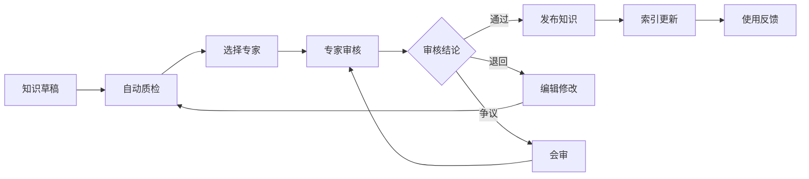
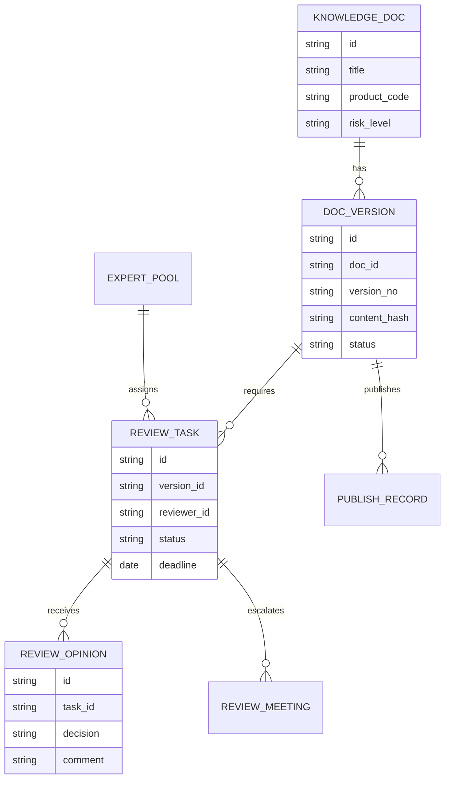
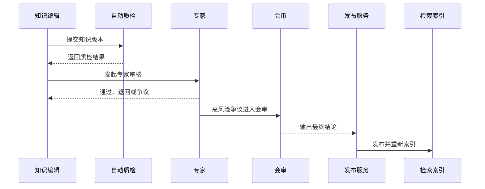
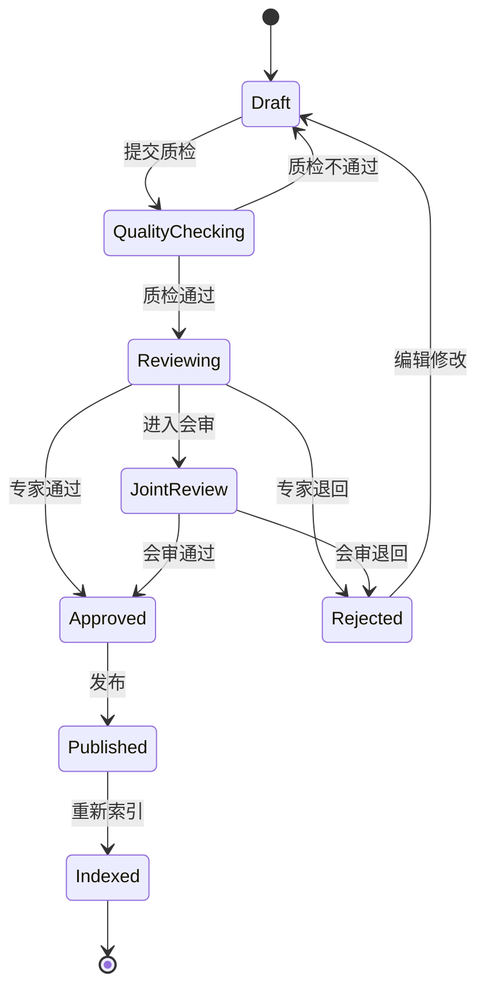
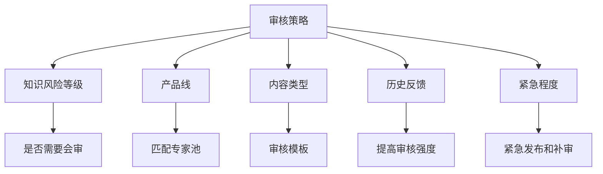

# 售后知识专家审核项目案例

## 适合谁看

- 想理解知识内容从草稿到专家审核、发布和持续治理流程的前端开发者。
- 正在做售后知识库、专家协同、客服助手、RAG 内容治理系统的团队。
- 希望把知识发布从“谁都能改”升级为“专家审核、版本追溯、质量闭环”的项目负责人。

## 业务目标

售后知识专家审核的目标，是确保维修方案、故障解释、客户话术、风险提示和 AI 问答引用的知识内容，经过合适专家确认后再发布。

它主要解决：

- 文档未经专家确认就被客服使用。
- 不同专家给出相互冲突的处理方案。
- 文档更新后不知道谁审核过。
- AI 助手引用了还在草稿或未审核的内容。
- 紧急知识需要快速发布，但仍要保留补审机制。

## 专家审核链路

可以把它理解成“售后知识的发布门禁”。不是所有知识都需要复杂审批，但高风险知识必须经过专家确认。

## 核心概念

| 概念 | 说明 | 例子 |
| --- | --- | --- |
| 审核等级 | 不同知识需要不同审核强度 | 普通审核、专家审核、会审 |
| 专家池 | 可审核某类知识的专家集合 | 空调电控专家、压缩机专家 |
| 审核意见 | 专家对内容的结论和修改建议 | 通过、退回、补充风险提示 |
| 会审 | 多专家处理争议或高风险内容 | 涉及安全风险的维修方案 |
| 紧急发布 | 先临时发布再补审 | 重大故障临时处理方案 |
| 版本追溯 | 每次发布和审核都可回查 | 文档 V3 由谁审核通过 |

## 数据模型

## 推荐表结构

| 表 | 关键字段 | 作用 |
| --- | --- | --- |
| `knowledge_doc` | `title`、`product_code`、`risk_level`、`owner_id` | 知识主档 |
| `doc_version` | `doc_id`、`version_no`、`content_hash`、`status` | 文档版本 |
| `expert_pool` | `name`、`domain_code`、`enabled` | 专家池 |
| `expert_pool_member` | `pool_id`、`user_id`、`expert_level`、`available` | 专家成员 |
| `review_task` | `version_id`、`reviewer_id`、`deadline_at`、`status` | 审核任务 |
| `review_opinion` | `task_id`、`decision`、`comment`、`risk_notes` | 审核意见 |
| `publish_record` | `version_id`、`publish_type`、`published_at`、`index_status` | 发布记录 |

## 审核发布流程

## 审核状态设计

## 审核规则拆解

审核规则示例：

- 安全风险类知识必须会审。
- 普通话术类知识可由单专家审核。
- 被多次负反馈的知识，下次修订提高审核等级。
- 紧急知识允许临时发布，但必须在 24 小时内补审。

## 前端页面拆分

| 页面 | 主要内容 | 设计重点 |
| --- | --- | --- |
| 待审核列表 | 文档、产品线、风险等级、截止时间、状态 | 专家优先处理高风险和即将超时 |
| 审核详情 | 草稿内容、变更对比、质检结果、历史反馈 | 让专家快速判断风险 |
| 审核意见 | 通过、退回、会审、风险提示、修改建议 | 意见结构化，便于编辑修改 |
| 会审工作台 | 多专家意见、争议点、最终结论 | 支持分歧沉淀 |
| 发布记录 | 版本、审核人、发布时间、索引状态 | 支持追溯 |

## 接口拆分建议

| 接口 | 方法 | 说明 |
| --- | --- | --- |
| `/api/knowledge-reviews/tasks` | GET | 查询审核任务 |
| `/api/knowledge-reviews/tasks` | POST | 创建审核任务 |
| `/api/knowledge-reviews/tasks/:id` | GET | 查询审核详情 |
| `/api/knowledge-reviews/tasks/:id/opinion` | POST | 提交审核意见 |
| `/api/knowledge-reviews/tasks/:id/joint-review` | POST | 发起会审 |
| `/api/knowledge-reviews/experts/match` | POST | 匹配专家 |
| `/api/knowledge-docs/:id/publish` | POST | 发布知识版本 |

## 实际项目常见问题

### 1. 专家只看到正文，看不到修改了什么

审核详情必须展示版本 diff、质检结果、历史负反馈和引用场景。专家不能只靠通读全文判断。

如果知识会被 AI 问答引用，还要展示可能触发的问题样例。

### 2. 审核任务分配给不合适的专家

专家匹配要基于产品线、故障类型、内容风险和专家可用状态。不要只按部门随机分配。

专家池也要定期维护，避免离职或转岗人员还在审核链路里。

### 3. 紧急知识发布卡住

可以设计紧急发布模式：先由值班专家快速审核发布，系统自动创建补审任务。

紧急发布必须有有效期，到期未补审要自动下线或升级提醒。

### 4. 专家意见太随意，编辑不知道怎么改

审核意见要结构化：问题位置、问题类型、修改建议、风险等级。

不要只允许专家写一句“重新修改”。

### 5. 发布后没有重新索引

知识发布不是结束。发布后要触发切片、向量更新、搜索缓存刷新，并在发布记录里展示索引状态。

索引失败时，知识不应进入 AI 可引用范围。

## 权限与审计

| 动作 | 权限建议 | 审计内容 |
| --- | --- | --- |
| 提交审核 | 知识编辑 | 文档版本和变更摘要 |
| 审核通过 | 匹配专家 | 审核意见和风险提示 |
| 发起会审 | 专家或知识主管 | 争议原因 |
| 紧急发布 | 值班专家和主管 | 紧急原因和补审截止时间 |
| 修改专家池 | 知识管理员 | 成员变化和领域 |

## 验收清单

- 知识版本能提交自动质检和专家审核。
- 系统能按产品线、风险等级和内容类型匹配专家。
- 审核详情能展示变更对比、质检结果和历史反馈。
- 专家意见结构化，可退回、通过或会审。
- 发布后能重新索引，并记录索引状态。
- 紧急发布有有效期和补审机制。

## 下一步学习

完成这个案例后，可以继续学习：

- [售后知识自动质检项目案例](/projects/after-sales-knowledge-auto-quality-inspection-case)
- [售后知识问答助手项目案例](/projects/after-sales-knowledge-qa-assistant-case)
- [售后专家协同项目案例](/projects/after-sales-expert-collaboration-case)

