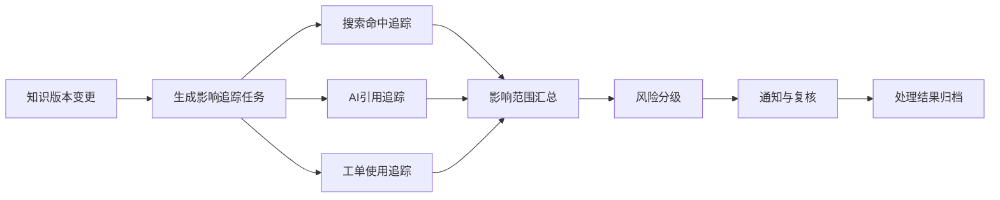
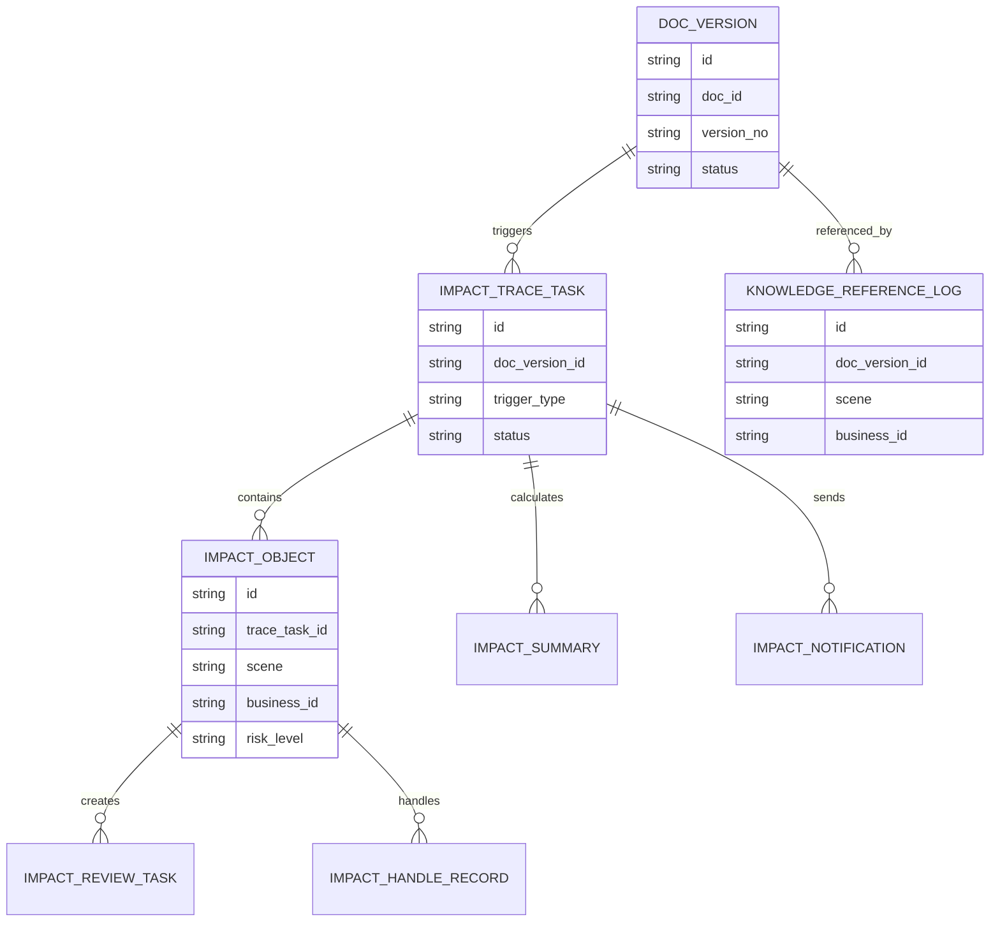
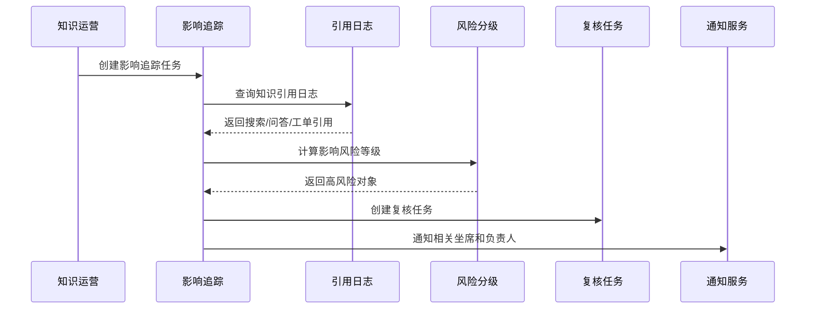
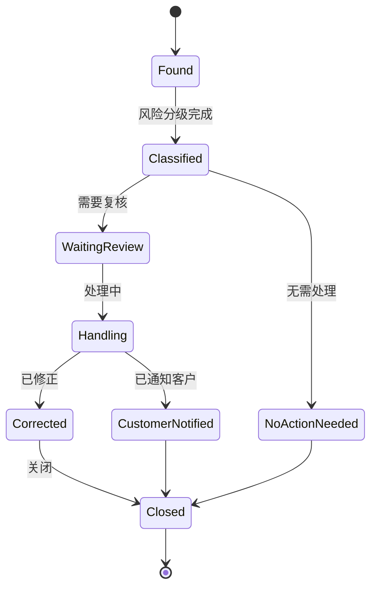
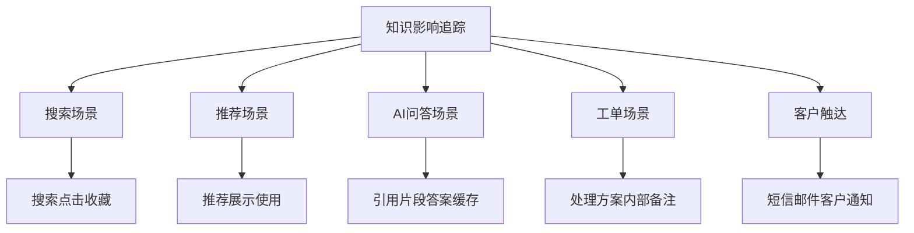

# 售后知识影响追踪项目案例

## 适合谁看

- 想理解知识库内容变更后如何追踪搜索、问答、工单和客户影响范围的前端开发者。
- 正在做售后知识库、AI 问答、搜索推荐、坐席辅助或内容治理系统的团队。
- 希望避免“知识改了、回滚了、下线了，但不知道哪些业务已经受影响”的项目负责人。

## 业务目标

售后知识回滚治理能在错误知识发布后恢复旧版本，但恢复旧版本只是第一步。真正难的是判断这条错误知识已经影响了哪些场景：

- 哪些坐席搜索并打开过这篇知识？
- 哪些 AI 问答引用过这篇知识？
- 哪些工单处理结果依赖了这篇知识？
- 哪些客户可能收到了错误指导？
- 哪些缓存、索引、推荐结果需要刷新？

售后知识影响追踪的目标是把知识内容、搜索、推荐、AI 回答、工单处理和客户触达连接起来，形成可追溯的影响链。

## 影响追踪链路

影响追踪不是简单查访问日志。它要把不同系统里的“引用关系”统一到一个追踪任务里，并按风险等级判断是否需要通知、复核或重新处理。

## 核心概念

| 概念 | 说明 |
| --- | --- |
| 追踪任务 | 针对某个知识版本、变更、下线或回滚生成的影响分析任务。 |
| 引用场景 | 搜索点击、推荐展示、AI 回答引用、工单引用、客户通知等场景。 |
| 影响对象 | 被影响的工单、问答、客户、坐席、推荐记录或缓存条目。 |
| 风险分级 | 根据知识类型、错误程度、客户影响和业务场景判断风险等级。 |
| 复核任务 | 对受影响对象进行人工检查和修正。 |
| 处理闭环 | 记录通知、复核、修正、关闭和追责过程。 |

## 数据模型

关键是有统一的 `knowledge_reference_log`。如果搜索、问答、推荐、工单都不记录引用日志，后续只能靠模糊查询，很难准确判断影响范围。

## 推荐表结构

| 表 | 作用 | 关键字段 |
| --- | --- | --- |
| `knowledge_reference_log` | 保存知识引用日志 | `doc_version_id`、`scene`、`business_id`、`user_id`、`referenced_at` |
| `impact_trace_task` | 保存影响追踪任务 | `doc_version_id`、`trigger_type`、`risk_level`、`status` |
| `impact_object` | 保存受影响对象 | `trace_task_id`、`scene`、`business_id`、`risk_level`、`handle_status` |
| `impact_summary` | 保存影响汇总 | `trace_task_id`、`scene`、`object_count`、`high_risk_count` |
| `impact_review_task` | 保存复核任务 | `impact_object_id`、`owner_id`、`deadline`、`status` |
| `impact_notification` | 保存通知记录 | `trace_task_id`、`receiver_type`、`receiver_id`、`sent_at` |
| `impact_handle_record` | 保存处理记录 | `impact_object_id`、`action_type`、`result`、`handled_by` |

## 追踪执行流程

追踪任务要异步执行。引用日志可能非常多，尤其是 AI 问答和搜索点击，前端应该展示任务进度，而不是等待接口同步返回全部结果。

## 影响对象状态设计

不是所有影响对象都需要处理。低风险搜索点击可能只需要记录，高风险 AI 错误指导可能需要复核工单甚至通知客户。

## 影响场景拆解

影响场景要按业务动作区分。搜索“看过”不等于采纳，工单“引用”比搜索点击风险更高，客户通知比内部使用更敏感。

## 前端页面拆分

| 页面 | 核心内容 | 设计重点 |
| --- | --- | --- |
| 追踪任务列表 | 知识版本、触发原因、影响数量、风险等级、状态 | 运营能快速找到高风险任务。 |
| 追踪任务详情 | 影响汇总、场景分布、执行进度、处理进度 | 先总览，再下钻到对象。 |
| 影响对象列表 | 场景、业务单号、风险等级、处理状态、负责人 | 支持筛选高风险和待处理对象。 |
| 复核工作台 | 工单、问答、引用片段、建议动作、处理记录 | 让复核人员能直接判断是否修正。 |
| 通知记录 | 通知对象、通知内容、发送状态、回执 | 高风险通知要能追溯。 |

## 接口拆分建议

| 接口 | 作用 |
| --- | --- |
| `GET /api/knowledge-impact-traces` | 查询影响追踪任务列表。 |
| `POST /api/knowledge-impact-traces` | 创建影响追踪任务。 |
| `GET /api/knowledge-impact-traces/:id` | 查询追踪任务详情。 |
| `GET /api/knowledge-impact-traces/:id/objects` | 查询受影响对象。 |
| `POST /api/knowledge-impact-objects/:id/review` | 提交复核结果。 |
| `POST /api/knowledge-impact-objects/:id/handle` | 提交处理记录。 |
| `POST /api/knowledge-impact-traces/:id/notifications` | 发送影响通知。 |
| `GET /api/knowledge-impact-traces/:id/summary` | 查询影响汇总。 |

## 实际项目常见问题

### 1. 没有引用日志，无法追踪影响

知识库上线时只做了搜索和展示，没有记录“谁在什么业务场景引用了哪个版本”。解决方式是把引用日志作为知识平台的基础能力。

### 2. 只追踪文档 ID，不追踪版本 ID

文档已更新多次后，无法判断错误内容来自哪个版本。解决方式是所有引用都记录 `doc_version_id`。

### 3. 影响对象没有风险分级

几千条搜索点击和几个高风险工单混在一起，运营不知道先处理哪个。解决方式是按场景、客户等级、知识类型和错误类型分级。

### 4. 通知客户过度

不是所有错误都需要通知客户，过度通知会放大影响。解决方式是建立通知阈值，高风险且确实可能造成误操作时才触达客户。

### 5. 复核结果没有回写知识治理

复核发现错误原因后没有沉淀，后续还会重复。解决方式是把复核结论回写到知识质量治理、专家审核和自动质检规则。

## 权限与审计

| 权限 | 说明 |
| --- | --- |
| 创建追踪任务 | 可以针对知识版本发起影响追踪。 |
| 查看影响对象 | 可以查看受影响工单、问答和客户信息。 |
| 处理复核任务 | 可以提交复核结论和修正记录。 |
| 发送客户通知 | 可以触达客户或服务商。 |
| 关闭追踪任务 | 可以确认影响已处理完毕。 |

客户信息、工单内容和 AI 问答内容可能包含敏感数据，影响追踪页面必须按角色脱敏，并记录查看和导出行为。

## 验收清单

- 搜索、推荐、AI 问答和工单引用都能记录知识版本 ID。
- 能针对知识版本创建影响追踪任务。
- 能按场景汇总受影响对象数量。
- 能识别高风险对象并生成复核任务。
- 能记录复核、修正、通知和关闭过程。
- 能追踪通知发送状态和处理结果。
- 能把复核结论回写到知识质量治理流程。

## 下一步学习

- [售后知识回滚治理项目案例](/projects/after-sales-knowledge-rollback-governance-case)
- [售后知识发布灰度项目案例](/projects/after-sales-knowledge-release-gray-case)
- [售后知识问答助手项目案例](/projects/after-sales-knowledge-qa-assistant-case)
