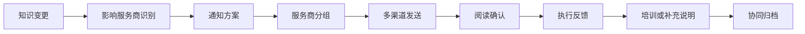
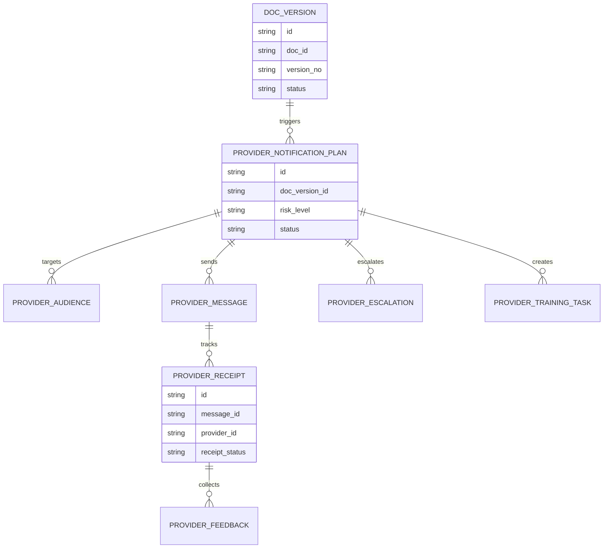
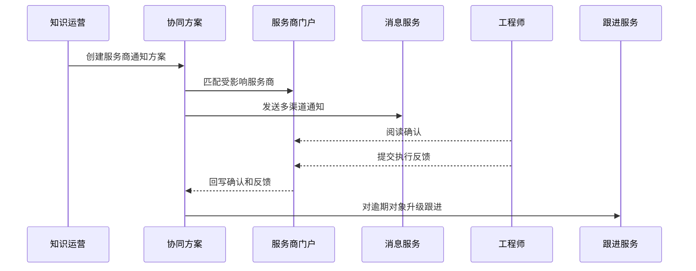
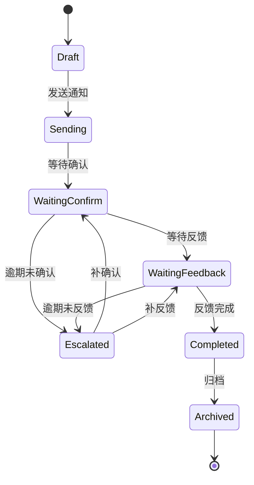
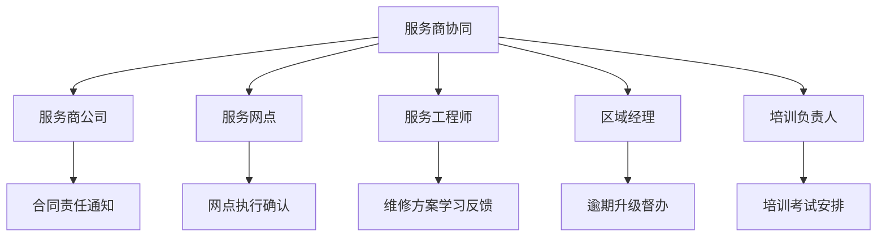

# 售后知识外部服务商通知协同项目案例

## 适合谁看

- 想理解售后知识变更后，如何通知外部服务商并确认执行结果的前端开发者。
- 正在做售后服务、服务商门户、知识库、维修工单、客户通知或渠道协同系统的团队。
- 希望避免“内部知识已修正，但外部服务商仍按旧方案维修”的项目负责人。

## 业务目标

售后知识客户通知治理关注客户侧告知，外部服务商通知协同关注服务执行侧。很多企业的现场维修、备件更换、检测流程由外部服务商完成，如果知识变更没有及时同步，就会出现：

- 服务商继续使用旧维修方案。
- 旧知识导致二次故障或安全风险。
- 客户已收到说明，但现场人员不知道。
- 服务商无法确认是否学习、执行和反馈。
- 出现争议时无法证明通知已经到达。

这个模块要把“通知服务商”做成有对象、有渠道、有确认、有跟进、有审计的协同流程。

## 服务商通知协同链路

服务商通知不能只发站内信。高风险知识变更可能需要确认学习、考试、外呼或现场督导。

## 核心概念

| 概念 | 说明 |
| --- | --- |
| 服务商范围 | 受知识变更影响的服务商、网点、工程师和区域。 |
| 通知方案 | 通知内容、渠道、确认方式、截止时间和跟进策略。 |
| 确认要求 | 仅阅读、必须确认、必须考试、必须提交执行反馈等要求。 |
| 执行反馈 | 服务商是否已按新知识执行，是否遇到问题。 |
| 逾期跟进 | 到期未确认或未反馈时自动提醒和升级。 |
| 协同归档 | 通知、阅读、确认、反馈、培训和升级记录归档。 |

## 数据模型

通知对象要能细到服务工程师。只通知服务商公司不够，真正执行维修的人必须知道知识变化。

## 推荐表结构

| 表 | 作用 | 关键字段 |
| --- | --- | --- |
| `provider_notification_plan` | 保存服务商通知方案 | `doc_version_id`、`risk_level`、`confirm_required`、`status` |
| `provider_audience` | 保存通知对象 | `plan_id`、`provider_id`、`outlet_id`、`engineer_id`、`region_code` |
| `provider_message` | 保存消息批次 | `plan_id`、`channel`、`template_id`、`send_at`、`status` |
| `provider_receipt` | 保存阅读确认 | `message_id`、`provider_id`、`engineer_id`、`receipt_status`、`confirmed_at` |
| `provider_feedback` | 保存执行反馈 | `receipt_id`、`feedback_type`、`content`、`file_id` |
| `provider_escalation` | 保存逾期升级 | `plan_id`、`provider_id`、`level`、`status` |
| `provider_training_task` | 保存培训任务 | `plan_id`、`target_id`、`training_type`、`status` |

## 通知协同流程

服务商门户需要给工程师一个清晰的任务视图：为什么通知、要做什么、什么时候截止、是否需要反馈。

## 协同状态设计

确认和反馈要分开。读过通知不代表已经按新知识执行。

## 服务商协同对象拆解

不同对象看到的任务不同。公司负责人关注合同和责任，工程师关注具体操作变化，区域经理关注逾期和覆盖率。

## 前端页面拆分

| 页面 | 核心内容 | 设计重点 |
| --- | --- | --- |
| 服务商通知方案 | 知识版本、风险等级、服务商数量、确认要求 | 快速判断通知范围和风险。 |
| 服务商对象列表 | 公司、网点、工程师、阅读、确认、反馈状态 | 支持按未确认、未反馈筛选。 |
| 工程师任务页 | 变更说明、操作步骤、确认按钮、反馈入口 | 文案要短，动作要明确。 |
| 逾期跟进 | 逾期对象、升级层级、负责人、处理进度 | 便于服务经理督办。 |
| 协同归档 | 发送记录、确认记录、反馈、培训、升级 | 支持审计和争议处理。 |

## 接口拆分建议

| 接口 | 作用 |
| --- | --- |
| `GET /api/provider-knowledge-notifications` | 查询服务商通知方案。 |
| `POST /api/provider-knowledge-notifications` | 创建通知方案。 |
| `GET /api/provider-knowledge-notifications/:id` | 查询方案详情。 |
| `POST /api/provider-knowledge-notifications/:id/send` | 发送服务商通知。 |
| `GET /api/provider-knowledge-notifications/:id/audiences` | 查询通知对象。 |
| `POST /api/provider-knowledge-receipts/:id/confirm` | 提交阅读确认。 |
| `POST /api/provider-knowledge-receipts/:id/feedback` | 提交执行反馈。 |
| `POST /api/provider-knowledge-notifications/:id/escalate` | 逾期升级。 |

## 实际项目常见问题

### 1. 只通知服务商负责人

负责人收到通知，但一线工程师不知道。解决方式是按服务商、网点、工程师多层级生成通知对象。

### 2. 阅读确认被当成执行完成

工程师点了确认，但维修现场仍按旧方案。解决方式是高风险知识需要提交执行反馈或完成培训任务。

### 3. 服务商门户和内部知识库不同步

内部已更新，外部仍看到旧版本。解决方式是通知方案绑定知识版本，并在服务商门户展示当前有效版本。

### 4. 逾期未确认没人跟进

通知发出后没有人盯结果。解决方式是配置确认截止时间和逐级升级规则。

### 5. 争议时无法证明已通知

服务商说没收到，内部说已发。解决方式是保存发送、送达、阅读、确认、反馈和升级证据。

## 权限与审计

| 权限 | 说明 |
| --- | --- |
| 创建协同方案 | 可以选择知识版本和服务商范围。 |
| 发送通知 | 可以向服务商和工程师发送通知。 |
| 查看确认状态 | 可以查看阅读、确认和反馈状态。 |
| 处理逾期 | 可以对未确认对象升级跟进。 |
| 查看归档 | 可以查看协同证据和审计记录。 |

服务商通知涉及外部协同和责任认定，必须保留完整证据链。

## 验收清单

- 能根据知识版本识别受影响服务商、网点和工程师。
- 能创建通知方案并配置确认要求和截止时间。
- 能通过多渠道发送服务商通知。
- 能追踪阅读、确认、反馈和逾期状态。
- 高风险通知能创建培训或反馈任务。
- 逾期未确认或未反馈能自动升级。
- 能归档发送、确认、反馈、培训和升级证据。

## 下一步学习

- [售后知识客户通知治理项目案例](/projects/after-sales-knowledge-customer-notification-governance-case)
- [售后知识影响追踪项目案例](/projects/after-sales-knowledge-impact-trace-case)
- [供应商协同门户项目案例](/projects/supplier-collaboration-portal-case)
