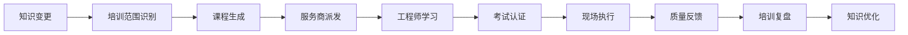
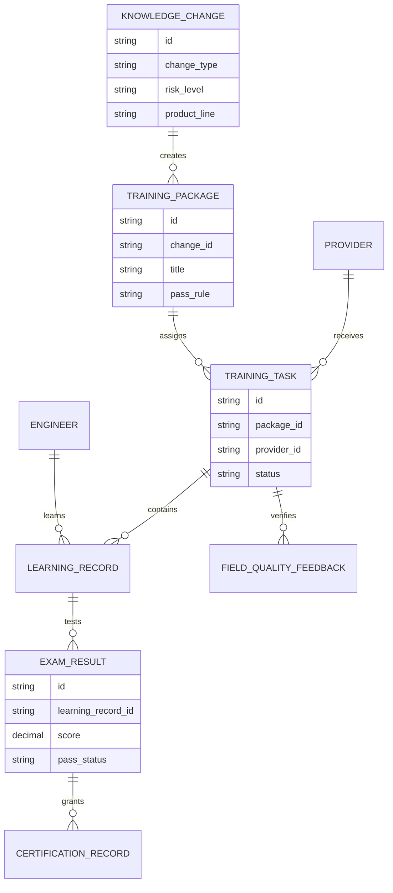
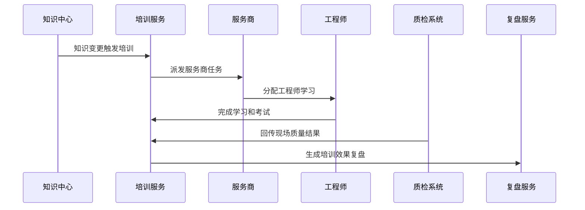
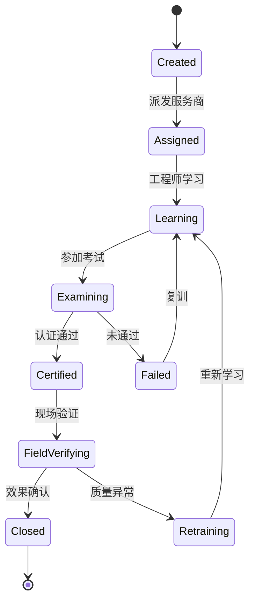
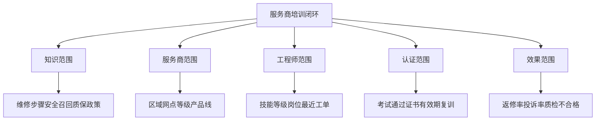

# 售后知识服务商培训闭环项目案例

## 适合谁看

- 想理解售后知识如何同步给外部服务商，并通过培训、考试和现场反馈形成闭环的前端开发者。
- 正在做售后知识库、服务商协同、培训平台、现场维修、质量复盘或客户服务系统的团队。
- 希望避免“知识文档发出去了，但服务商没学会，现场仍然按旧方法维修”的项目负责人。

## 业务目标

售后知识外部服务商通知协同解决“把知识变更通知给谁”的问题，但通知不等于掌握。复杂产品的维修、安全、召回和质保规则更新后，还需要确认服务商是否学习、考试、执行和反馈。

服务商培训闭环要解决：

- 哪些知识变更必须转成培训任务。
- 哪些服务商、工程师、网点必须学习。
- 培训完成、考试通过和现场执行如何证明。
- 未学习或考试失败如何升级提醒。
- 培训效果如何通过维修质量、返修率和投诉率验证。

## 培训闭环链路

培训闭环的重点是“知识变更是否真正进入现场行为”，不是简单统计学习人数。

## 核心概念

| 概念 | 说明 |
| --- | --- |
| 培训范围 | 需要学习某次知识变更的服务商、网点、工程师和角色。 |
| 课程包 | 由知识条目、视频、图文步骤、注意事项和考试题组成的培训内容。 |
| 学习任务 | 派发给服务商或工程师的学习要求，包含截止时间和通过标准。 |
| 认证结果 | 考试分数、通过状态、重考次数和证书有效期。 |
| 现场验证 | 通过维修工单、返修、质检和客户投诉验证培训是否生效。 |
| 复训机制 | 对未通过、超期、质量异常或高风险服务商重新派发培训。 |

## 数据模型

培训任务要区分服务商层级和工程师层级。服务商完成派发不代表每个工程师都完成学习。

## 推荐表结构

| 表 | 作用 | 关键字段 |
| --- | --- | --- |
| `knowledge_change` | 保存知识变更 | `change_type`、`risk_level`、`product_line`、`published_at` |
| `training_package` | 保存课程包 | `change_id`、`title`、`pass_rule`、`valid_days` |
| `training_task` | 保存培训任务 | `package_id`、`provider_id`、`due_at`、`status` |
| `learning_record` | 保存学习记录 | `task_id`、`engineer_id`、`progress`、`completed_at` |
| `exam_result` | 保存考试结果 | `learning_record_id`、`score`、`pass_status`、`retry_count` |
| `certification_record` | 保存认证结果 | `engineer_id`、`package_id`、`valid_until`、`status` |
| `field_quality_feedback` | 保存现场反馈 | `task_id`、`work_order_id`、`quality_result`、`issue_type` |

## 培训派发流程

考试通过只是中间状态。高风险知识必须继续看现场质量结果。

## 培训任务状态设计

培训闭环要保留失败和复训路径。只展示完成率会掩盖真正的质量风险。

## 培训对象拆解

培训范围不应只按服务商名单派发，还要结合产品线、工程师技能和最近服务过的工单类型。

## 前端页面拆分

| 页面 | 核心内容 | 设计重点 |
| --- | --- | --- |
| 培训任务列表 | 知识变更、服务商、完成率、考试通过率、逾期 | 先看高风险和逾期任务。 |
| 课程包详情 | 关联知识、学习材料、考试题、通过标准 | 让运营确认课程覆盖关键变化。 |
| 服务商进度 | 网点完成率、工程师明细、逾期人员 | 服务商完成和工程师完成要分开。 |
| 考试认证 | 分数、重考、证书、有效期、复训 | 高风险岗位要强制认证。 |
| 效果复盘 | 返修、投诉、质检、现场问题和复训建议 | 用现场数据判断培训是否有效。 |

## 接口拆分建议

| 接口 | 作用 |
| --- | --- |
| `GET /api/after-sales-training-packages` | 查询课程包。 |
| `POST /api/after-sales-training-packages` | 创建课程包。 |
| `POST /api/after-sales-training-packages/:id/assign` | 派发培训任务。 |
| `GET /api/after-sales-training-tasks` | 查询培训任务。 |
| `GET /api/after-sales-training-tasks/:id/progress` | 查询学习进度。 |
| `POST /api/after-sales-learning-records/:id/exam` | 提交考试结果。 |
| `GET /api/after-sales-training-tasks/:id/effect-review` | 查询培训效果复盘。 |

## 实际项目常见问题

### 1. 通知已读被当成学习完成

服务商点了已读，但工程师没有真正学习。解决方式是通知、学习、考试和现场验证分成不同状态。

### 2. 服务商完成率很高，现场仍然出错

培训内容可能没有覆盖关键步骤，或者工程师只刷题没理解。解决方式是引入质检、返修和投诉数据做效果复盘。

### 3. 高风险知识没有强制认证

安全维修、召回和质保政策如果只做普通培训，风险很大。解决方式是按风险等级配置考试、证书和复训规则。

### 4. 外部工程师变动频繁

新工程师加入后不知道历史培训要求。解决方式是认证和人员资质绑定，新人自动补派必修课程。

### 5. 培训逾期没有升级

服务商长期未完成培训，客户现场仍在服务。解决方式是逾期升级到区域经理，并限制高风险工单派单。

## 权限与审计

| 权限 | 说明 |
| --- | --- |
| 创建课程包 | 可以把知识变更转成培训内容。 |
| 派发培训 | 可以选择服务商、网点和工程师范围。 |
| 查看进度 | 可以查看学习、考试和逾期情况。 |
| 管理认证 | 可以确认通过、重考、复训和证书有效期。 |
| 查看效果 | 可以查看质检、返修和投诉反馈。 |

培训派发、考试结果、证书变更、复训和派单限制都要保留审计，避免服务质量争议时无法举证。

## 验收清单

- 能从知识变更创建培训课程包。
- 能按产品线、区域、服务商、网点和工程师派发任务。
- 能跟踪学习进度、考试结果、重考和认证有效期。
- 能对逾期、未通过和高风险对象升级提醒。
- 能用维修质检、返修和投诉数据验证培训效果。
- 能对质量异常人员或服务商发起复训。
- 能保留培训、考试、认证和现场反馈的审计记录。

## 下一步学习

- [售后知识外部服务商通知协同项目案例](/projects/after-sales-knowledge-provider-notification-collaboration-case)
- [售后知识质量治理项目案例](/projects/after-sales-knowledge-quality-governance-case)
- [教育培训平台项目案例](/projects/education-training-platform-case)
