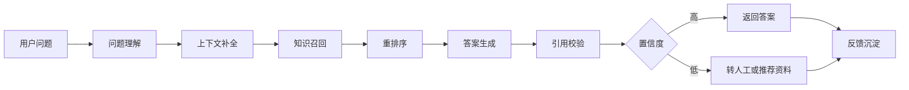
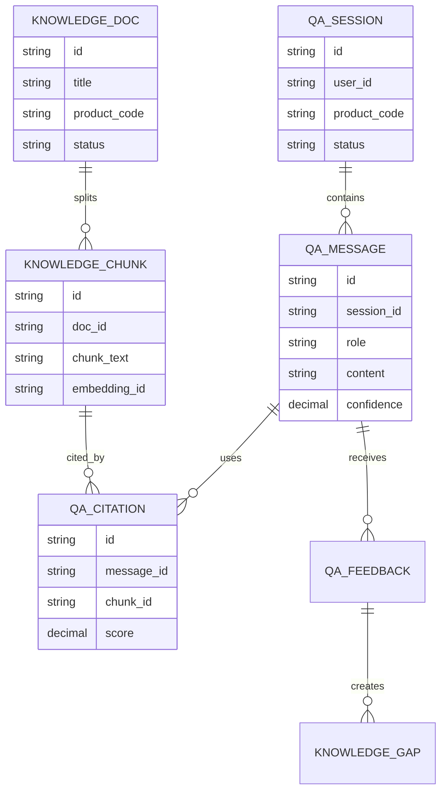
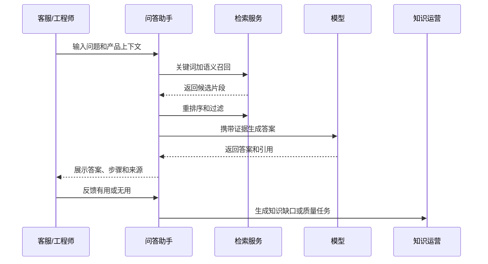
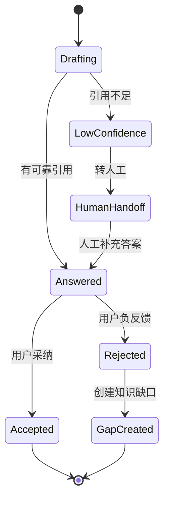
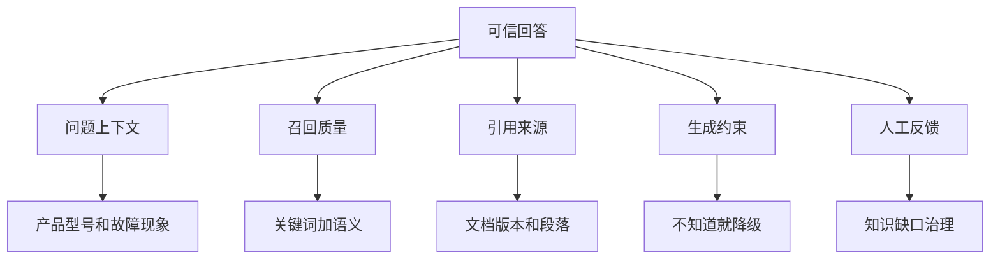

# 售后知识问答助手项目案例

## 适合谁看

- 想把 RAG、知识库、客服工单和售后诊断结合起来的前端开发者。
- 正在做客服助手、售后知识库、维修诊断或 AI 工程落地的团队。
- 希望让客服和工程师更快找到答案，同时降低 AI 胡说风险的项目负责人。

## 业务目标

售后知识问答助手不是普通聊天机器人。它必须基于企业自己的知识库、产品手册、维修 SOP、历史工单和专家结论回答问题，并且告诉用户答案来自哪里。

一个可上线的助手至少要做到：

1. 能理解用户问题和产品上下文。
2. 能从知识库召回可靠资料。
3. 能生成结构化、可执行的答案。
4. 能展示引用来源，方便人工确认。
5. 能把无答案、低置信度和错误答案反馈给知识运营。

## 问答助手链路

可以把它理解成“带证据的售后问答”。没有引用来源的答案，在售后场景里通常不能直接用于指导客户操作。

## 核心概念

| 概念 | 说明 | 上线要求 |
| --- | --- | --- |
| 问题理解 | 识别产品、型号、故障、场景 | 不能只看用户一句话 |
| 知识召回 | 找到相关文档片段 | 要支持关键词和语义召回 |
| 重排序 | 从召回结果中选最相关证据 | 减少无关片段进入生成 |
| 引用来源 | 答案依据的文档或工单 | 必须可点击查看 |
| 置信度 | 答案可信程度 | 低置信度要降级 |
| 反馈闭环 | 用户对答案的评价 | 用于知识治理 |

## 数据模型

## 推荐表结构

| 表 | 关键字段 | 作用 |
| --- | --- | --- |
| `knowledge_doc` | `title`、`product_code`、`version`、`status` | 知识文档主表 |
| `knowledge_chunk` | `doc_id`、`chunk_text`、`section_title`、`embedding_id` | 检索片段 |
| `qa_session` | `user_id`、`product_code`、`ticket_id`、`status` | 问答会话 |
| `qa_message` | `session_id`、`role`、`content`、`confidence` | 问答消息 |
| `qa_citation` | `message_id`、`chunk_id`、`score`、`quote_text` | 答案引用 |
| `qa_feedback` | `message_id`、`rating`、`reason`、`handled_status` | 用户反馈 |
| `knowledge_gap` | `question`、`product_code`、`gap_type`、`owner_id` | 知识缺口 |

## 问答生成流程

## 答案状态设计

## 可信回答拆解

答案模板建议固定为：

1. 结论：先告诉用户可能原因。
2. 排查步骤：按顺序给出可操作步骤。
3. 注意事项：说明风险和禁止操作。
4. 引用来源：列出文档标题、版本和片段。
5. 仍未解决：给出转人工或派单建议。

## 前端页面拆分

| 页面 | 主要内容 | 设计重点 |
| --- | --- | --- |
| 问答工作台 | 会话、问题输入、答案、引用、反馈 | 答案和引用要同屏可见 |
| 关联工单问答 | 工单上下文、产品信息、历史处理记录 | 自动带入上下文，减少重复输入 |
| 引用详情 | 文档标题、版本、片段、更新时间 | 让客服能判断来源是否可靠 |
| 反馈列表 | 无用答案、错误答案、无答案问题 | 给知识运营处理 |
| 知识缺口 | 缺口类型、问题样例、影响次数、负责人 | 推动知识库补全 |

## 接口拆分建议

| 接口 | 方法 | 说明 |
| --- | --- | --- |
| `/api/qa/sessions` | POST | 创建问答会话 |
| `/api/qa/sessions/:id/messages` | POST | 提交问题并生成答案 |
| `/api/qa/messages/:id/citations` | GET | 查询引用来源 |
| `/api/qa/messages/:id/feedback` | POST | 提交答案反馈 |
| `/api/qa/search-preview` | POST | 预览召回片段 |
| `/api/knowledge-gaps` | GET | 查询知识缺口 |
| `/api/knowledge-gaps/:id/resolve` | POST | 关闭知识缺口 |

## 实际项目常见问题

### 1. AI 回答看起来很像真的，但来源不可靠

必须要求模型基于召回片段回答，并在后端校验引用 ID 是否来自本次检索结果。

如果没有足够证据，答案要明确提示“当前知识库没有可靠结论”，而不是编造步骤。

### 2. 客服不愿意用，因为每次都要输入很多上下文

问答入口要嵌入工单详情。系统自动传入产品型号、故障码、购买时间、保修状态和历史处理记录。

用户只补充“当前现象”，体验会好很多。

### 3. 答案太长，客服看不完

售后问答要先给结论和步骤。详细解释可以折叠到“为什么这样判断”。

移动端或窄屏场景下，引用来源不要挤占主答案区域，可以放在底部抽屉或折叠区。

### 4. 知识库更新后答案仍然旧

要保存文档版本、索引版本和向量更新时间。文档发布后需要触发重新切片和索引。

问答记录里也要保存当时使用的文档版本，方便追溯。

### 5. 负反馈没有人处理

反馈必须进入知识运营待办。常见分类包括：答案错误、引用错误、没有答案、步骤不可执行、文档过期。

只收集点赞点踩但没有处理流程，系统不会变好。

## 权限与审计

| 动作 | 权限建议 | 审计内容 |
| --- | --- | --- |
| 使用问答助手 | 客服、工程师、售后主管 | 问题、上下文、答案 ID |
| 查看引用原文 | 有知识库阅读权限的用户 | 文档 ID 和片段 ID |
| 采纳答案 | 会话参与者 | 采纳时间和工单 ID |
| 标记错误答案 | 会话参与者或主管 | 负反馈原因 |
| 处理知识缺口 | 知识运营 | 处理结论和关联文档 |

## 验收清单

- 问答能带入产品、工单和用户上下文。
- 每个答案都能展示引用来源。
- 低置信度问题不会强行生成确定答案。
- 用户反馈能生成知识运营任务。
- 文档更新后能重新索引并标记版本。
- 问答记录可以追溯使用的模型、提示词、知识片段和答案。

## 下一步学习

完成这个案例后，可以继续学习：

- [售后知识自动推荐项目案例](/projects/after-sales-knowledge-recommendation-case)
- [售后知识智能检索优化项目案例](/projects/after-sales-knowledge-search-optimization-case)
- [文档问答项目](/ai-engineering/rag)

