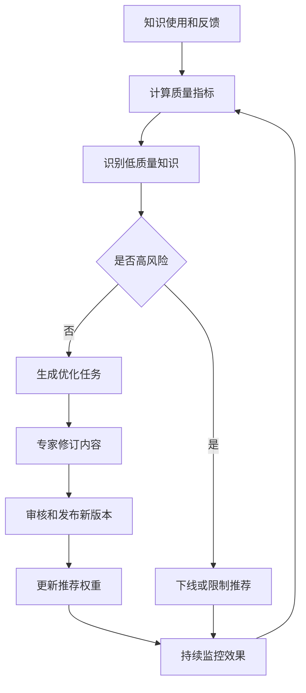
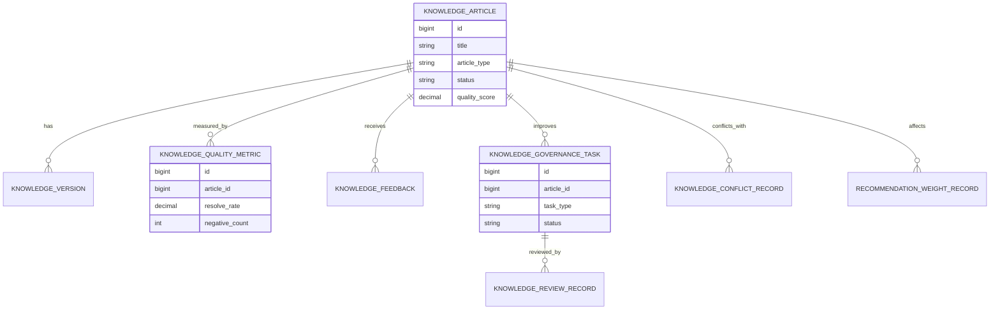
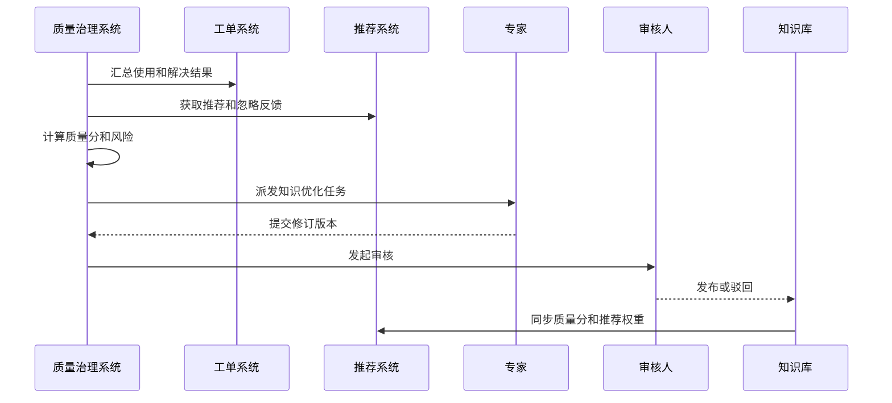
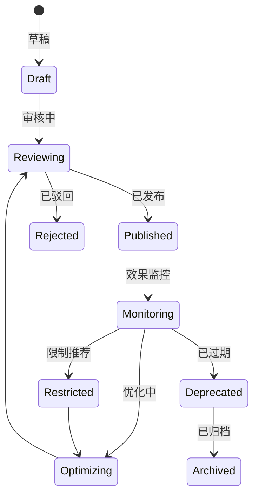
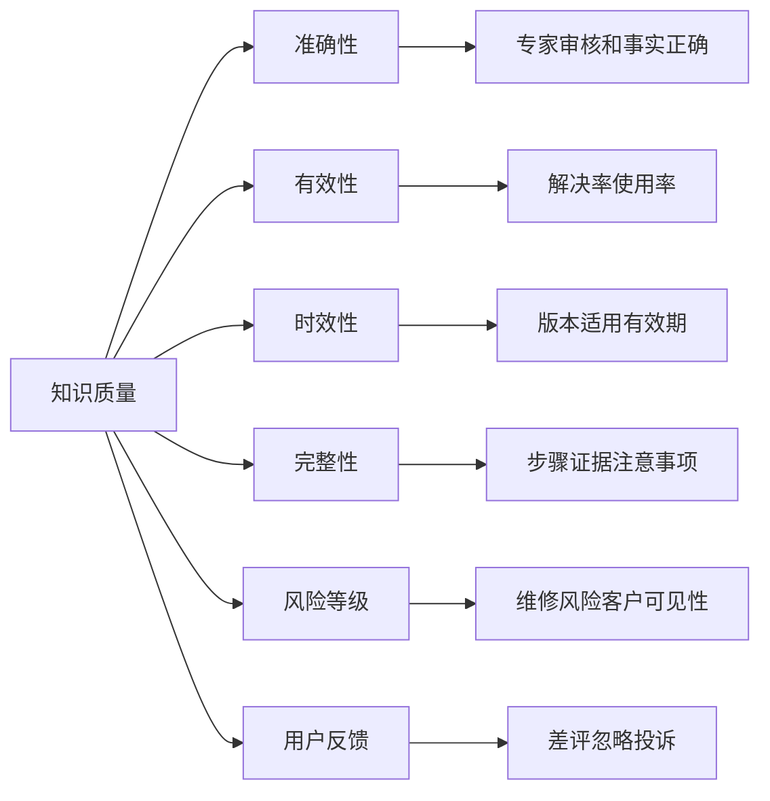

# 售后知识质量治理项目案例

## 适合谁看

如果你做过知识库平台、客服知识运营、售后知识自动推荐、售后专家协同或客服工单，但还不清楚知识内容如何持续保持准确、有效、可推荐，可以学习这个案例。

售后知识质量治理关注的是知识从创建、审核、发布、使用、反馈、复审、下线到改版的全生命周期。它不是只做文章管理，而是用使用效果、解决率、差评、过期风险、冲突检测和专家复审来保证知识真的能解决问题。

## 业务目标

售后知识质量治理要回答 6 个问题：

- 哪些知识已经过期、低效、冲突或不再适用。
- 哪些知识解决率高，应该优先推荐或沉淀为标准流程。
- 用户差评、工单未解决和专家补充如何转成知识优化任务。
- 知识改版、审核和发布如何保证质量。
- 高风险维修步骤、客户可见内容和内部知识如何分级治理。
- 知识质量如何影响自动推荐、坐席辅助和专家协同。

真实项目里，知识库最大的问题不是没有内容，而是内容越来越多后质量参差不齐。质量治理让知识库从“资料库”变成“可用的解决方案库”。

## 售后知识质量治理链路

这条链路说明，知识质量治理要和推荐系统联动。低质量知识不能继续高频推荐。

## 核心概念

| 概念 | 说明 | 新手理解 |
| --- | --- | --- |
| 知识质量 | 知识是否准确、有效、及时 | 能不能解决问题 |
| 解决率 | 使用知识后工单解决比例 | 衡量实际效果 |
| 负反馈 | 用户认为无用或错误 | 需要治理的信号 |
| 复审周期 | 定期检查知识是否过期 | 防止旧内容继续使用 |
| 知识冲突 | 多篇知识给出不同结论 | 用户不知道信谁 |
| 版本治理 | 知识改版留痕 | 改了什么、为什么改 |
| 推荐权重 | 推荐系统给知识的排序影响 | 高质量排更前 |

质量治理的核心是“用效果反推内容”。不是编辑觉得写得好，而是实际能解决工单。

## 数据模型

知识文章、版本、质量指标和治理任务要分开。文章是内容主体，指标是效果，任务是改进动作。

## 推荐表结构

| 表 | 用途 | 关键字段 |
| --- | --- | --- |
| `knowledge_article` | 知识文章 | title、article_type、status、quality_score、risk_level |
| `knowledge_version` | 知识版本 | article_id、version_no、content_hash、change_reason、publish_time |
| `knowledge_quality_metric` | 质量指标 | article_id、use_count、resolve_rate、negative_count、freshness_score |
| `knowledge_feedback` | 用户反馈 | article_id、ticket_id、feedback_type、feedback_text、operator_id |
| `knowledge_governance_task` | 治理任务 | article_id、task_type、owner_id、due_date、status |
| `knowledge_review_record` | 审核记录 | task_id、reviewer_id、review_result、comment |
| `knowledge_conflict_record` | 冲突记录 | article_id、conflict_article_id、conflict_type、status |
| `recommendation_weight_record` | 推荐权重记录 | article_id、weight_change、reason、effective_time |

知识版本要保存内容摘要或 hash。这样能判断某次反馈对应的是哪个版本，而不是当前最新版本。

## 知识治理流程

治理流程要把专家和审核人分开。专家负责内容专业性，审核人负责规范、风险和发布。

## 知识状态设计

限制推荐和下线不同。限制推荐表示内容仍可查看，但不适合主动推给用户。

## 质量因素拆解

质量分不应该只看点击量。点击多但解决率低，说明标题吸引人但内容不解决问题。

## 前端页面拆分

| 页面 | 核心内容 | 设计建议 |
| --- | --- | --- |
| 质量治理工作台 | 低质量、过期、冲突、高风险知识 | 优先展示需要处理的内容 |
| 知识质量详情 | 使用次数、解决率、差评、推荐表现 | 展示趋势和来源 |
| 治理任务页 | 修订、复审、下线、合并、拆分任务 | 有负责人和截止时间 |
| 冲突处理页 | 冲突知识、差异内容、处理结论 | 支持对比 |
| 版本审核页 | 改动内容、原因、风险、审核意见 | 审核人看差异 |
| 推荐影响页 | 质量分、权重变化、推荐排名 | 解释为什么降权 |
| 治理看板 | 质量分布、过期率、解决率、任务完成率 | 管理层看趋势 |

知识治理页面要以“待处理问题”为入口，而不是从文章列表开始。运营人员每天最关心哪些知识需要处理。

## 接口拆分建议

| 接口 | 方法 | 说明 |
| --- | --- | --- |
| `/api/knowledge-quality/articles` | GET | 查询知识质量列表 |
| `/api/knowledge-quality/articles/:id/metrics` | GET | 查询质量指标 |
| `/api/knowledge-quality/tasks` | GET/POST | 查询和创建治理任务 |
| `/api/knowledge-quality/tasks/:id/review` | POST | 提交审核结论 |
| `/api/knowledge-quality/conflicts` | GET/POST | 查询和登记知识冲突 |
| `/api/knowledge-quality/articles/:id/recommendation-weight` | PUT | 调整推荐权重 |
| `/api/knowledge-quality/dashboard` | GET | 查询治理看板 |

治理接口要保留变更原因。尤其是下线、限制推荐和权重调整，都需要审计。

## 实际项目常见问题

### 1. 知识越积越多，没人清理

旧知识还在被搜索和推荐，导致用户按过期步骤处理问题。

解决方式：

- 设置复审周期和过期提醒。
- 过期知识自动进入治理任务。
- 高风险知识到期后限制推荐。
- 归档知识保留历史但不主动展示。

### 2. 只看阅读量，不看解决率

热门知识不一定有效，可能只是标题匹配高。

解决方式：

- 采集使用后是否解决。
- 计算解决率和负反馈率。
- 低解决率高曝光知识优先治理。
- 推荐排序纳入质量分。

### 3. 多篇知识互相矛盾

不同专家写了不同处理步骤，坐席不知道该用哪一篇。

解决方式：

- 按产品、故障码和关键词识别冲突。
- 冲突知识进入合并或标记流程。
- 发布标准答案后限制旧知识推荐。
- 冲突处理有审核记录。

### 4. 改版后不知道影响哪些工单

知识更新了，但使用旧版本处理的工单无法追踪。

解决方式：

- 推荐和使用反馈记录知识版本。
- 改版保留版本差异。
- 高风险改版通知相关角色。
- 重大改版触发重新培训。

### 5. AI 生成内容缺少事实校验

AI 帮助总结知识，但可能遗漏风险提示或生成错误步骤。

解决方式：

- AI 草稿必须进入人工审核。
- 高风险步骤必须引用来源知识。
- 发布前检查适用范围和禁用场景。
- AI 生成内容标记来源和审核人。

## 权限与审计

| 权限点 | 控制原因 |
| --- | --- |
| 查看质量指标 | 涉及团队和专家内容质量 |
| 创建治理任务 | 会影响知识维护排期 |
| 修改知识版本 | 可能影响售后处理结果 |
| 限制推荐或下线 | 会影响坐席和工程师使用 |
| 调整推荐权重 | 会影响推荐排序 |
| 审核发布 | 对内容准确性负责 |

质量治理的关键操作必须审计。尤其是高风险知识的发布、下线和推荐权重调整。

## 验收清单

- 能采集知识使用、推荐、反馈和解决结果。
- 能计算质量分、解决率、负反馈率和时效分。
- 能识别过期、低效、冲突和高风险知识。
- 能生成治理任务并跟踪审核发布。
- 能保留知识版本和改版原因。
- 质量分能影响推荐权重。
- 下线、限制推荐和权重调整有审计记录。

## 下一步学习

学完这个案例后，可以继续看：

- [售后知识自动推荐项目案例](/projects/after-sales-knowledge-recommendation-case)
- [客服知识运营项目案例](/projects/customer-knowledge-operation-case)
- [知识库平台项目案例](/projects/knowledge-base-case)
- [售后专家协同项目案例](/projects/after-sales-expert-collaboration-case)

