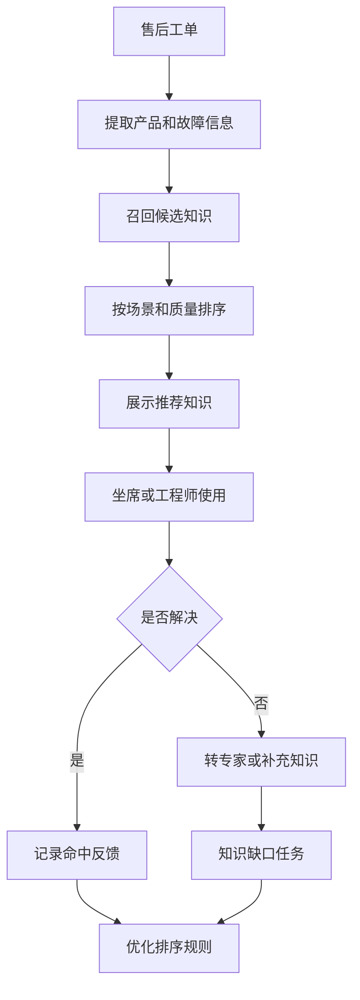
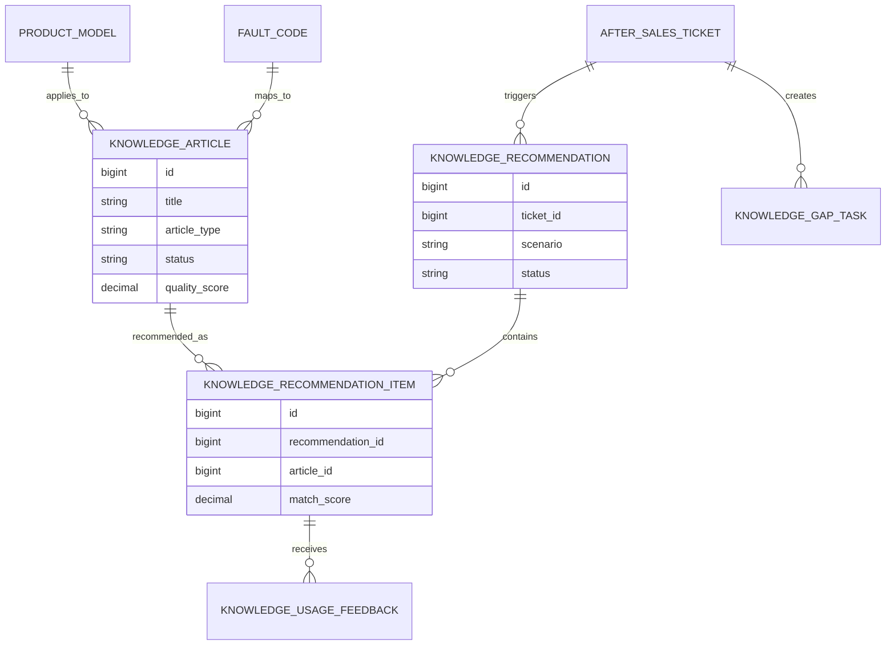
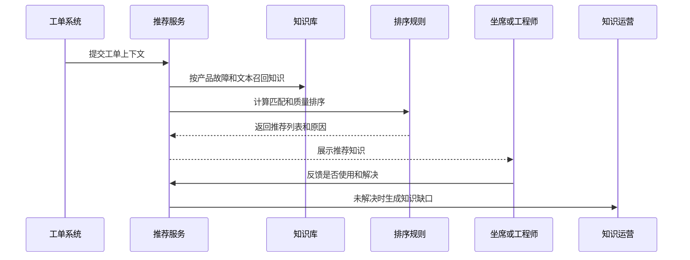
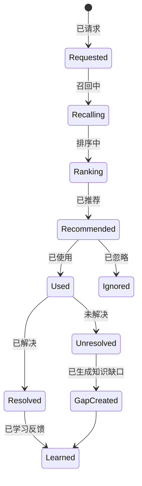
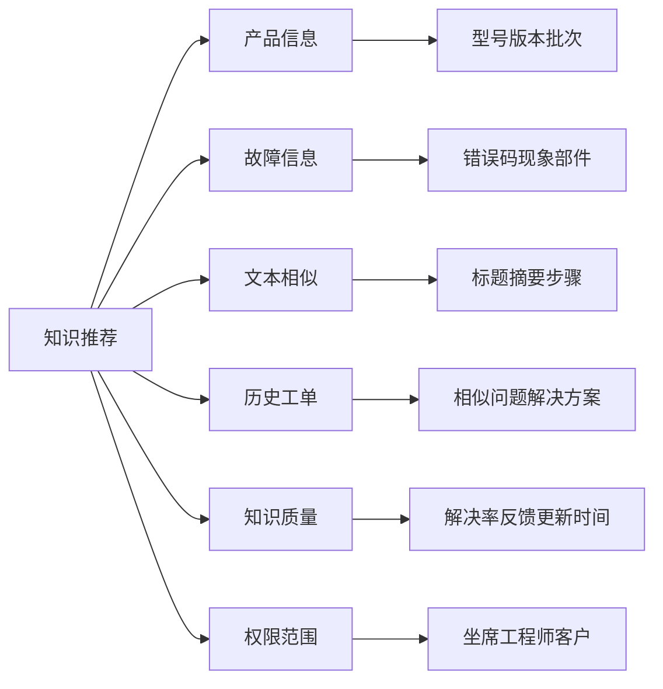

# 售后知识自动推荐项目案例

## 适合谁看

如果你做过知识库平台、客服知识运营、客服工单、售后远程诊断、售后专家协同或工单自动化，但还不清楚如何根据工单内容自动推荐解决方案，可以学习这个案例。

售后知识自动推荐关注的是在客户报修、坐席问答、远程诊断、工程师处理和专家协同时，系统根据产品、故障现象、错误码、历史工单、知识质量和用户角色自动推荐知识。它不是简单的关键词搜索，而是要把召回、排序、证据、反馈和知识更新串起来。

## 业务目标

售后知识自动推荐要回答 6 个问题：

- 当前工单最可能需要哪些知识、脚本、排查步骤或解决方案。
- 推荐结果为什么匹配，证据来自产品、故障码、描述还是历史工单。
- 不同角色看到的知识是否不同，例如坐席、工程师、专家和客户。
- 推荐知识是否真的解决了问题，命中效果如何反馈。
- 低质量、过期、冲突或高风险知识如何避免被推荐。
- 推荐失败时如何沉淀新知识，而不是重复依赖专家。

真实项目里，知识库常见问题是“内容很多但找不到”。自动推荐要解决的是使用场景中的找知识问题。

## 售后知识自动推荐链路

这条链路说明，推荐不是一次搜索结果，而是持续学习的闭环。

## 核心概念

| 概念 | 说明 | 新手理解 |
| --- | --- | --- |
| 知识召回 | 找出可能相关的知识 | 先粗筛一批候选 |
| 知识排序 | 判断哪个更应该排前面 | 再按匹配度和质量排序 |
| 匹配证据 | 推荐原因 | 产品型号、故障码、关键词 |
| 知识质量 | 内容是否准确有效 | 解决率、反馈、更新时间 |
| 使用反馈 | 用户是否采纳和解决 | 推荐系统的学习来源 |
| 知识缺口 | 没有合适知识的问题 | 需要新建或更新知识 |
| 权限范围 | 谁能看到哪些知识 | 内部知识和客户知识不同 |

推荐系统要能解释原因。用户看到“推荐知识 1”还不够，还要知道为什么推荐它。

## 数据模型

推荐结果要保存。这样才能分析当时推荐了什么、用户用了什么、最后有没有解决。

## 推荐表结构

| 表 | 用途 | 关键字段 |
| --- | --- | --- |
| `knowledge_article` | 知识文章 | title、article_type、status、quality_score、version |
| `knowledge_article_scope` | 适用范围 | article_id、product_model、fault_code、role_scope、channel_scope |
| `knowledge_recommendation` | 推荐主记录 | ticket_id、scenario、request_text、status、created_at |
| `knowledge_recommendation_item` | 推荐明细 | recommendation_id、article_id、match_score、rank_no、reason_json |
| `knowledge_usage_feedback` | 使用反馈 | item_id、used_flag、resolved_flag、feedback_text、operator_id |
| `knowledge_gap_task` | 知识缺口任务 | ticket_id、gap_type、owner_id、due_date、status |
| `knowledge_quality_metric` | 知识质量指标 | article_id、use_count、resolve_rate、negative_count、last_used_at |

推荐原因建议用结构化 JSON 保存，例如匹配到的故障码、产品型号、关键词和历史工单相似度。

## 推荐流程

推荐流程要和工单页面结合。用户不应该离开工单再去知识库搜索。

## 推荐状态设计

忽略也要记录。用户长期忽略某类推荐，说明匹配或排序可能有问题。

## 推荐因素拆解

推荐排序不能只看相似度。过期知识、高投诉知识、低解决率知识，即使相似也不应该排在前面。

## 前端页面拆分

| 页面 | 核心内容 | 设计建议 |
| --- | --- | --- |
| 工单推荐侧栏 | 推荐知识、匹配原因、使用按钮 | 不打断处理工单 |
| 推荐详情弹层 | 排查步骤、适用范围、注意事项 | 支持快速复制回复 |
| 推荐反馈组件 | 已使用、已解决、无帮助、原因 | 操作要轻量 |
| 知识缺口页 | 未解决工单、缺口类型、负责人 | 给知识运营处理 |
| 知识质量页 | 使用次数、解决率、差评、过期 | 低质量知识要治理 |
| 推荐规则页 | 召回条件、排序权重、角色范围 | 权重调整要可审计 |
| 推荐效果看板 | 命中率、解决率、转专家率 | 衡量推荐是否有效 |

推荐入口最好放在工单右侧或诊断步骤中，用户处理问题时自然看到，而不是单独进入一个推荐页面。

## 接口拆分建议

| 接口 | 方法 | 说明 |
| --- | --- | --- |
| `/api/knowledge-recommendations` | POST | 根据工单上下文生成推荐 |
| `/api/knowledge-recommendations/:id/items` | GET | 查询推荐结果 |
| `/api/knowledge-recommendations/items/:id/feedback` | POST | 提交使用反馈 |
| `/api/knowledge-recommendations/gaps` | GET/POST | 查询和创建知识缺口 |
| `/api/knowledge-recommendations/articles/:id/metrics` | GET | 查询知识质量指标 |
| `/api/knowledge-recommendations/rules` | GET/PUT | 查询和调整推荐规则 |
| `/api/knowledge-recommendations/effects` | GET | 查询推荐效果 |

推荐接口要返回 `reason_json`。前端可以展示“匹配故障码 E102、适用于 A100 型号、近 30 天解决率 82%”。

## 实际项目常见问题

### 1. 推荐结果像搜索结果，用户不信任

只有标题列表，没有推荐原因。

解决方式：

- 展示匹配证据，例如产品型号、故障码和关键词。
- 展示知识质量，例如解决率和更新时间。
- 标明适用范围和风险提示。
- 用户反馈用于优化排序。

### 2. 过期知识仍然排在前面

旧版本产品的处理步骤已经失效。

解决方式：

- 知识文章维护适用版本和有效期。
- 过期或低质量知识降权。
- 关键知识定期复审。
- 使用反馈差的知识进入治理任务。

### 3. 坐席看到工程师内部知识

权限范围没有参与推荐过滤。

解决方式：

- 知识文章配置角色和渠道范围。
- 推荐前先做权限过滤。
- 内部知识和客户知识分级。
- 越权访问进入审计日志。

### 4. 推荐无效后没有沉淀知识

每次都转专家，专家重复回答同类问题。

解决方式：

- 未解决反馈自动生成知识缺口。
- 专家结论可以转为知识草稿。
- 知识运营跟踪缺口关闭率。
- 相似工单合并为一个知识主题。

### 5. AI 摘要幻觉或引用错误

如果使用 AI 总结知识，可能生成不存在的步骤。

解决方式：

- AI 回复必须绑定知识来源。
- 高风险操作只展示原文步骤。
- 用户可展开引用片段。
- 负反馈进入人工复核。

## 权限与审计

| 权限点 | 控制原因 |
| --- | --- |
| 查看推荐知识 | 需要按角色和渠道过滤 |
| 使用内部知识 | 可能包含维修方案和成本信息 |
| 调整推荐规则 | 会影响所有工单推荐 |
| 查看推荐效果 | 涉及团队绩效和知识质量 |
| 处理知识缺口 | 会影响知识库内容 |
| 导出推荐数据 | 涉及工单和客户问题 |

推荐系统必须先做权限过滤，再做排序。否则排序结果里可能出现用户无权查看的知识。

## 验收清单

- 工单页面可以根据上下文生成推荐知识。
- 推荐结果包含匹配原因和知识质量信号。
- 推荐前会按角色、渠道和产品范围过滤。
- 用户可以反馈已使用、已解决或无帮助。
- 未解决问题可以生成知识缺口任务。
- 低质量、过期和冲突知识可以被识别和治理。
- 推荐效果可以按命中率、解决率和转专家率统计。

## 下一步学习

学完这个案例后，可以继续看：

- [客服知识运营项目案例](/projects/customer-knowledge-operation-case)
- [知识库平台项目案例](/projects/knowledge-base-case)
- [售后专家协同项目案例](/projects/after-sales-expert-collaboration-case)
- [工单自动化项目案例](/projects/ticket-automation-case)

