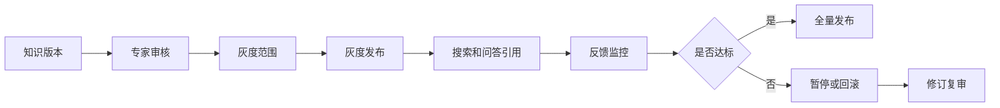
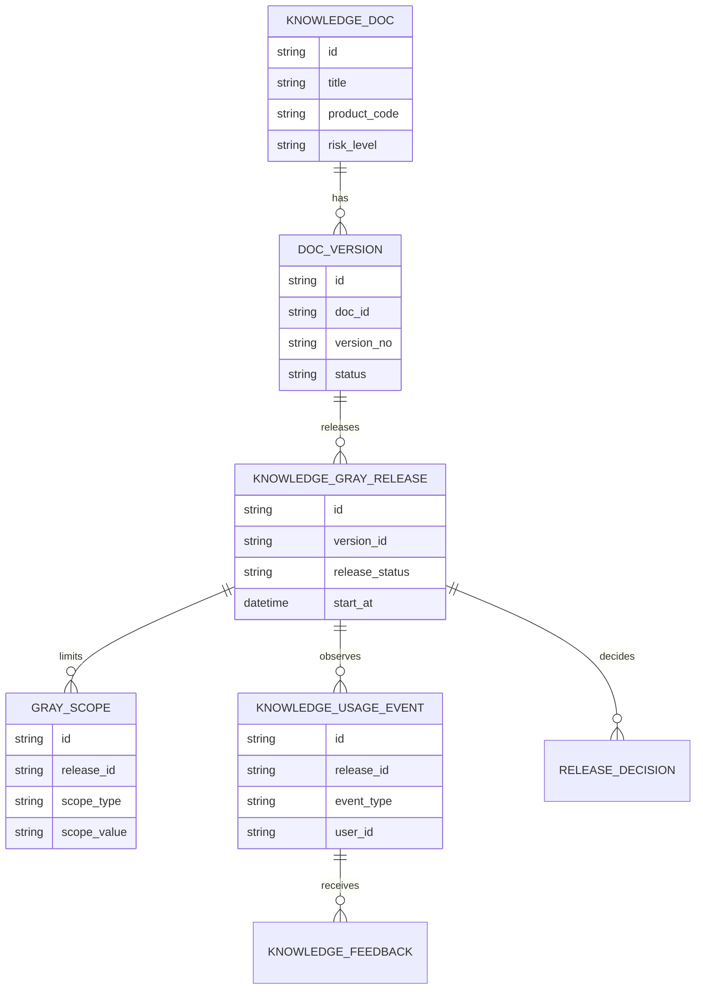
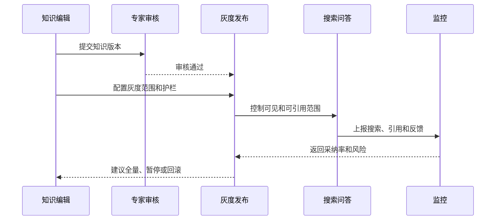
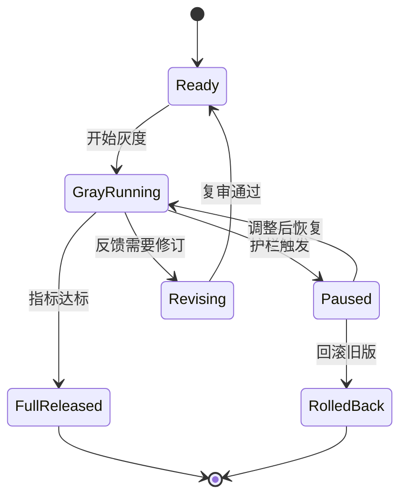
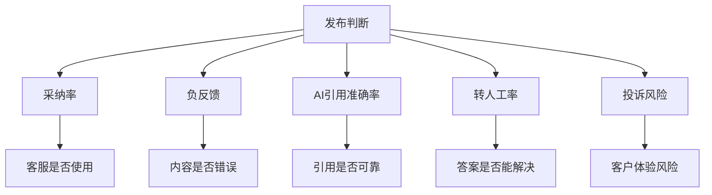

# 售后知识发布灰度项目案例

## 适合谁看

- 想理解知识内容为什么也需要灰度发布、回滚和效果监控的前端开发者。
- 正在做售后知识库、AI 问答、客服助手、搜索推荐或知识运营系统的团队。
- 希望避免“新知识一发布就影响所有客服和 AI 回答”的项目负责人。

## 业务目标

售后知识发布灰度的目标，是让新知识、修订知识或高风险知识先在小范围内生效，观察搜索命中、问答引用、客服采纳、负反馈和投诉风险，再决定是否全量发布。

它尤其适合这些场景：

- 新维修方案尚未大规模验证。
- 旧文档修订了关键步骤。
- AI 问答会引用该知识回答客户。
- 涉及安全风险或保修政策。
- 多版本产品使用不同处理方案。

## 知识发布灰度链路

可以把它理解成“知识内容的试运行”。不是所有文档都需要灰度，但会影响客户操作或 AI 答案的知识，灰度能显著降低风险。

## 核心概念

| 概念 | 说明 | 例子 |
| --- | --- | --- |
| 知识版本 | 文档的某次发布内容 | V2 修订维修步骤 |
| 灰度范围 | 先看到新知识的人或场景 | 资深客服、华东服务商 |
| 引用范围 | 搜索、推荐、问答是否可引用 | 只允许人工搜索，不允许 AI 引用 |
| 反馈指标 | 判断灰度效果的数据 | 采纳率、负反馈、转人工 |
| 回滚 | 停止新版本并恢复旧版 | AI 不再引用 V2 |
| 全量发布 | 扩大到所有目标场景 | 所有客服和问答助手可用 |

## 数据模型

## 推荐表结构

| 表 | 关键字段 | 作用 |
| --- | --- | --- |
| `knowledge_gray_release` | `version_id`、`release_status`、`start_at`、`rollback_version_id` | 灰度发布单 |
| `knowledge_gray_scope` | `release_id`、`scope_type`、`scope_value` | 灰度范围 |
| `knowledge_usage_event` | `release_id`、`event_type`、`scene`、`user_id`、`ticket_id` | 使用事件 |
| `knowledge_feedback` | `usage_event_id`、`rating`、`reason`、`severity` | 使用反馈 |
| `release_guardrail` | `release_id`、`metric_code`、`threshold`、`action` | 护栏指标 |
| `release_decision` | `release_id`、`decision_type`、`reason`、`operator_id` | 发布决策 |

## 灰度发布流程

## 发布状态设计

## 灰度指标拆解

发布灰度不要只看浏览量。知识被看见不代表有用，更要看采纳、解决率、负反馈和是否引发错误操作。

## 前端页面拆分

| 页面 | 主要内容 | 设计重点 |
| --- | --- | --- |
| 灰度发布列表 | 文档、版本、范围、状态、指标、负责人 | 快速看到高风险发布 |
| 灰度配置 | 可见范围、引用范围、护栏指标、回滚版本 | 区分“可搜索”和“可被 AI 引用” |
| 灰度监控 | 采纳率、负反馈、引用次数、转人工、投诉 | 指标要按场景拆分 |
| 反馈明细 | 工单、客服、问题、引用片段、反馈原因 | 帮助编辑修订 |
| 发布决策 | 全量、暂停、回滚、修订和理由 | 决策可追溯 |

## 接口拆分建议

| 接口 | 方法 | 说明 |
| --- | --- | --- |
| `/api/knowledge-gray-releases` | POST | 创建灰度发布 |
| `/api/knowledge-gray-releases/:id/start` | POST | 开始灰度 |
| `/api/knowledge-gray-releases/:id/metrics` | GET | 查询灰度指标 |
| `/api/knowledge-gray-releases/:id/feedback` | GET | 查询反馈明细 |
| `/api/knowledge-gray-releases/:id/full-release` | POST | 全量发布 |
| `/api/knowledge-gray-releases/:id/rollback` | POST | 回滚旧版 |
| `/api/knowledge-gray-releases/:id/decision` | POST | 提交发布决策 |

## 实际项目常见问题

### 1. 灰度只控制页面可见，没有控制 AI 引用

搜索可见和 AI 可引用是两件事。高风险知识可以先允许专家搜索，不允许 AI 自动引用。

灰度配置要明确场景范围：搜索、推荐、问答、工单助手分别是否启用。

### 2. 全量发布后发现错误，无法回滚

发布单必须记录回滚版本。回滚时不仅要恢复文档状态，还要刷新索引和缓存。

如果 AI 引用缓存没有刷新，用户仍可能看到旧答案。

### 3. 指标太少，不知道是否该全量

至少要看采纳率、负反馈率、引用准确率和转人工率。对高风险知识，还要看投诉和误操作反馈。

### 4. 灰度范围选错

不要只按随机用户灰度。售后知识更适合按产品线、服务商、专家组、客服等级和工单类型灰度。

### 5. 反馈没有进入修订流程

灰度期间的负反馈要能一键转为修订任务或专家复审任务。否则灰度只是延迟发布，并没有降低风险。

## 权限与审计

| 动作 | 权限建议 | 审计内容 |
| --- | --- | --- |
| 创建灰度 | 知识运营 | 文档版本和范围 |
| 配置 AI 引用 | 知识主管或 AI 管理员 | 引用范围和原因 |
| 全量发布 | 知识主管 | 指标和决策 |
| 回滚 | 应急角色 | 回滚原因和版本 |
| 查看反馈 | 知识运营、专家 | 工单和引用片段 |

## 验收清单

- 知识版本能配置灰度范围。
- 能区分搜索可见、推荐可见和 AI 可引用。
- 能监控采纳率、负反馈、引用次数和转人工率。
- 护栏触发后能暂停或回滚。
- 全量发布和回滚都能刷新索引。
- 灰度反馈能转为修订或专家审核任务。

## 下一步学习

完成这个案例后，可以继续学习：

- [售后知识专家审核项目案例](/projects/after-sales-knowledge-expert-review-case)
- [售后知识自动质检项目案例](/projects/after-sales-knowledge-auto-quality-inspection-case)
- [售后知识问答助手项目案例](/projects/after-sales-knowledge-qa-assistant-case)

