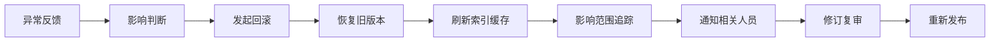
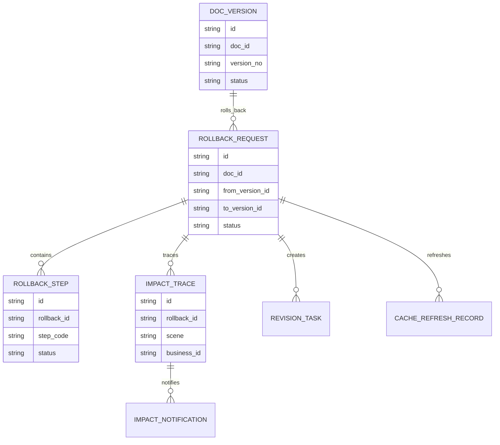
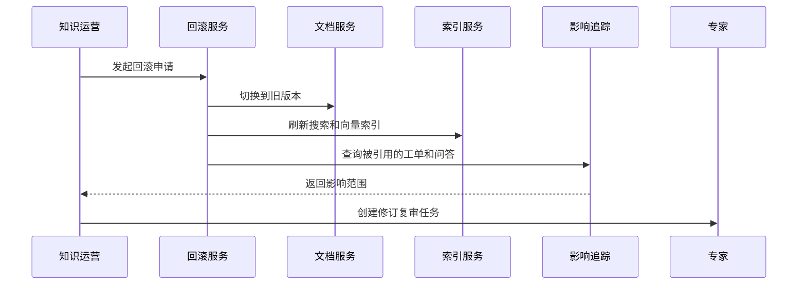
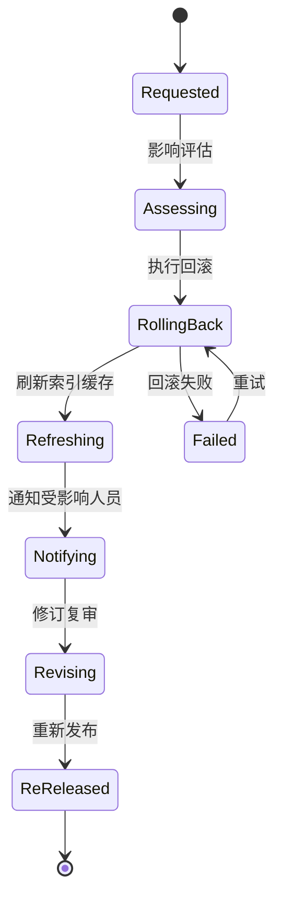
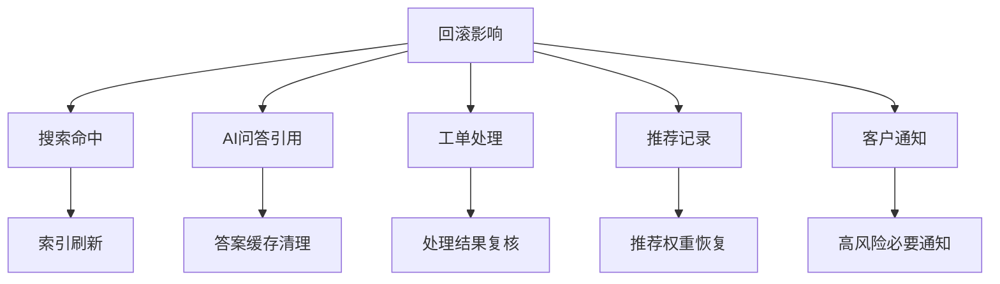

# 售后知识回滚治理项目案例

## 适合谁看

- 想理解知识发布后出错如何快速回滚并追溯影响范围的前端开发者。
- 正在做售后知识库、AI 问答、搜索推荐、知识灰度或内容治理系统的团队。
- 希望避免“错误知识已发布但不知道谁用了、怎么撤回、怎么修复”的项目负责人。

## 业务目标

售后知识回滚治理的目标，是当新知识版本出现错误、投诉、误导 AI 回答或引发高风险操作时，能够快速停止新版本，恢复旧版本，刷新索引和缓存，并追踪已经受影响的工单和用户。

它要解决：

- 知识回滚只改了文档状态，AI 仍引用旧内容。
- 不知道错误知识影响了哪些工单。
- 回滚后没有修订和复审流程。
- 回滚原因没有沉淀，后续重复发生。
- 多场景发布状态不一致。

## 回滚治理链路

可以把它理解成“知识发布的应急刹车”。回滚不仅是把版本切回去，还要处理已经产生的引用和影响。

## 核心概念

| 概念 | 说明 | 举例 |
| --- | --- | --- |
| 回滚触发 | 触发回滚的原因 | 专家判定错误、客户投诉 |
| 回滚版本 | 要恢复到的旧版本 | 从 V3 回滚到 V2 |
| 影响范围 | 新版本被使用过的地方 | 工单、问答、搜索、推荐 |
| 缓存刷新 | 清理搜索和 AI 相关缓存 | 向量索引、答案缓存 |
| 受影响通知 | 告知使用过错误知识的人员 | 通知客服重新处理工单 |
| 修订复审 | 回滚后重新修复内容 | 编辑修改、专家审核 |

## 数据模型

## 推荐表结构

| 表 | 关键字段 | 作用 |
| --- | --- | --- |
| `rollback_request` | `doc_id`、`from_version_id`、`to_version_id`、`reason`、`status` | 回滚申请 |
| `rollback_step` | `rollback_id`、`step_code`、`status`、`error_message` | 回滚步骤 |
| `impact_trace` | `rollback_id`、`scene`、`business_id`、`user_id`、`used_at` | 影响追踪 |
| `impact_notification` | `trace_id`、`notify_target`、`notify_status` | 影响通知 |
| `cache_refresh_record` | `rollback_id`、`cache_type`、`refresh_status` | 缓存刷新 |
| `revision_task` | `rollback_id`、`owner_id`、`deadline_at`、`status` | 修订任务 |
| `rollback_review` | `rollback_id`、`review_result`、`summary` | 回滚复盘 |

## 回滚执行流程

## 回滚状态设计

## 回滚影响拆解

回滚治理最容易漏掉 AI 引用。即使文档状态已经回滚，如果向量索引和答案缓存没有刷新，AI 仍可能继续给出错误答案。

## 前端页面拆分

| 页面 | 主要内容 | 设计重点 |
| --- | --- | --- |
| 回滚申请列表 | 文档、版本、原因、状态、发起人 | 突出高风险回滚 |
| 回滚详情 | 新旧版本、差异、原因、步骤进度 | 展示每一步是否成功 |
| 影响范围 | 工单、问答、搜索、推荐、用户 | 支持筛选高风险影响 |
| 通知中心 | 受影响客服、专家、客户通知状态 | 追踪是否已处理 |
| 修订复审 | 修订任务、专家审核、重新发布 | 防止回滚后无人修复 |

## 接口拆分建议

| 接口 | 方法 | 说明 |
| --- | --- | --- |
| `/api/knowledge-rollbacks` | POST | 发起回滚 |
| `/api/knowledge-rollbacks` | GET | 查询回滚列表 |
| `/api/knowledge-rollbacks/:id` | GET | 查询回滚详情 |
| `/api/knowledge-rollbacks/:id/impact` | GET | 查询影响范围 |
| `/api/knowledge-rollbacks/:id/retry-step` | POST | 重试失败步骤 |
| `/api/knowledge-rollbacks/:id/notifications` | POST | 发送影响通知 |
| `/api/knowledge-rollbacks/:id/review` | POST | 提交回滚复盘 |

## 实际项目常见问题

### 1. 回滚只改文档版本，没有刷新索引

回滚步骤要拆成文档状态、搜索索引、向量索引、答案缓存和推荐缓存。任何一步失败都要可见。

### 2. 不知道错误知识影响了谁

搜索、问答、推荐都要记录知识版本 ID。否则回滚时无法追踪影响范围。

### 3. 回滚后没有修订责任人

回滚只能止血，不能解决内容质量问题。系统应自动创建修订任务，并指定负责人和截止时间。

### 4. 高风险错误没有通知

如果错误知识可能导致客户误操作，需要通知使用过该知识的客服或服务商，必要时通知客户。

通知范围要基于影响追踪，不要全量广播。

### 5. 回滚权限过宽

回滚会影响线上知识和 AI 答案，必须限制权限。高风险知识回滚可以支持应急角色，但要补审。

## 权限与审计

| 动作 | 权限建议 | 审计内容 |
| --- | --- | --- |
| 发起回滚 | 知识主管、应急角色 | 回滚原因 |
| 执行回滚 | 系统自动或管理员 | 回滚步骤 |
| 查看影响范围 | 知识运营、专家、主管 | 查询范围 |
| 发送通知 | 知识运营 | 通知对象 |
| 关闭回滚 | 知识主管 | 复盘结果 |

## 验收清单

- 能从指定版本回滚到旧版本。
- 回滚步骤可见且可重试。
- 搜索、向量和答案缓存能刷新。
- 能追踪受影响的工单、问答和推荐。
- 能通知相关人员并跟踪处理状态。
- 回滚后能生成修订复审任务。

## 下一步学习

完成这个案例后，可以继续学习：

- [售后知识发布灰度项目案例](/projects/after-sales-knowledge-release-gray-case)
- [售后知识专家审核项目案例](/projects/after-sales-knowledge-expert-review-case)
- [售后知识自动质检项目案例](/projects/after-sales-knowledge-auto-quality-inspection-case)

