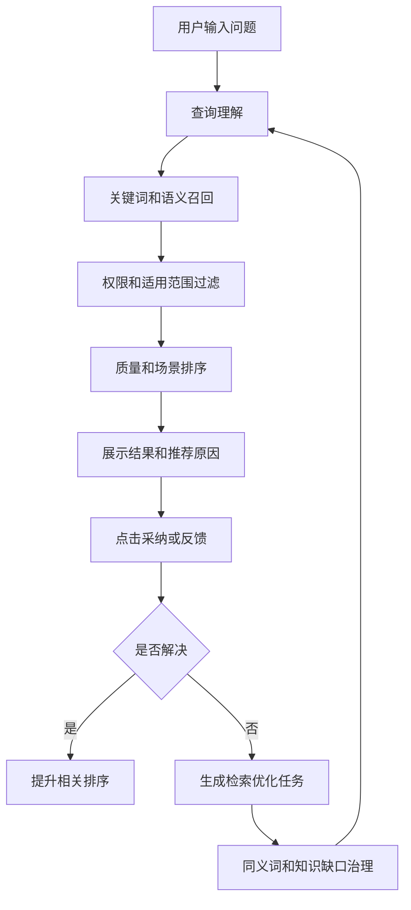
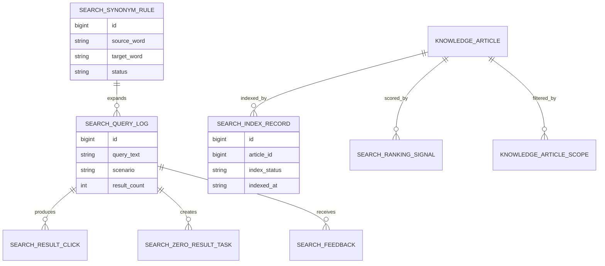
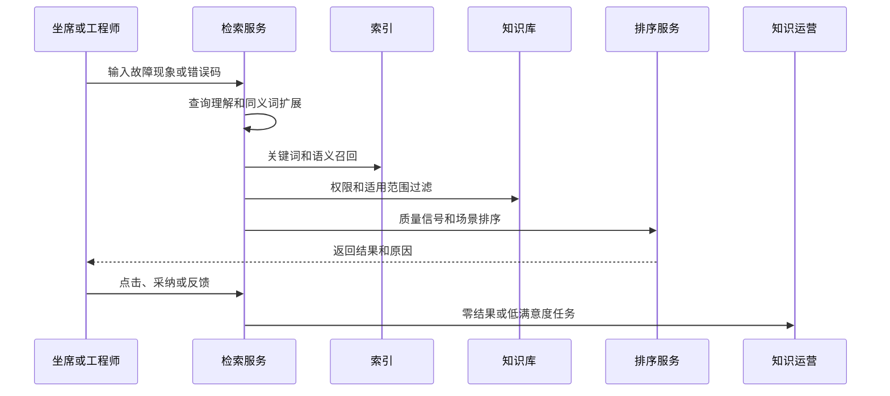
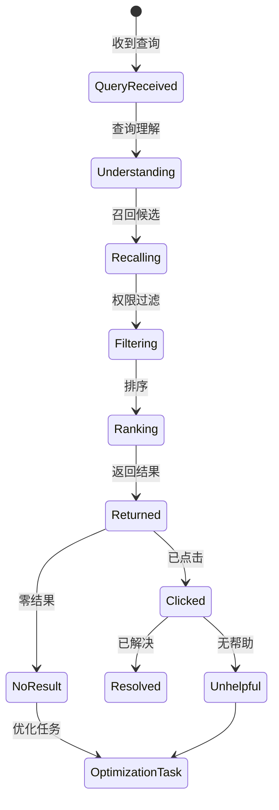
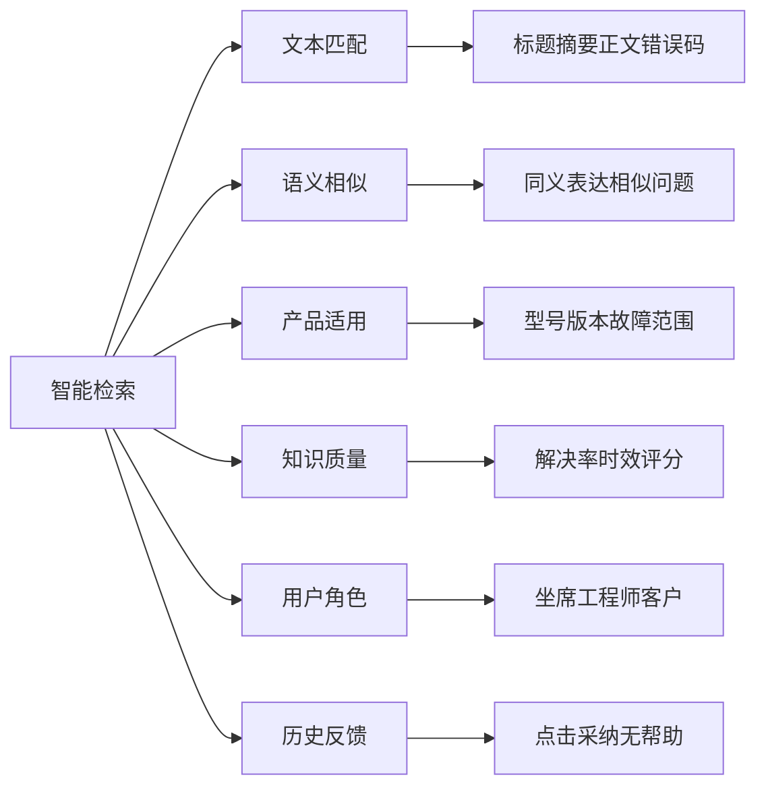

# 售后知识智能检索优化项目案例

## 适合谁看

如果你做过知识库平台、客服知识运营、售后知识自动推荐、售后知识质量治理或客服工单，但还不清楚如何让坐席和工程师更快找到正确知识，可以学习这个案例。

售后知识智能检索优化关注的是把关键词搜索、语义召回、过滤条件、排序规则、同义词、知识质量和用户反馈结合起来。它不是只接一个搜索框，而是围绕真实工单场景优化“搜得到、排得准、解释清、能反馈”的检索体验。

## 业务目标

售后知识智能检索优化要回答 6 个问题：

- 用户输入故障现象、错误码、产品型号时，能否找到相关知识。
- 搜索结果为什么排序在前面，是否考虑知识质量和适用范围。
- 同义词、错别字、型号别名和行业俗称是否能被识别。
- 用户搜索无结果时，如何生成知识缺口或同义词建议。
- 搜索点击、采纳、解决和无帮助反馈如何优化排序。
- 不同角色能否只检索到自己有权限查看的知识。

真实项目里，知识库不是没有内容，而是搜索体验差：搜不到、搜出一堆旧内容、结果和产品不匹配。

## 售后知识智能检索链路

这条链路说明，智能检索不是一次查询，而是依赖反馈持续优化。

## 核心概念

| 概念 | 说明 | 新手理解 |
| --- | --- | --- |
| 查询理解 | 分析用户到底想找什么 | 产品、故障、错误码 |
| 召回 | 找出候选知识 | 先尽量找全 |
| 排序 | 把更可能有用的排前面 | 再尽量排准 |
| 同义词 | 不同说法指向同一概念 | 黑屏、无显示、屏幕不亮 |
| 适用范围 | 知识适合哪些产品和角色 | 不匹配就过滤 |
| 搜索反馈 | 点击、采纳、无帮助 | 用来优化排序 |
| 零结果 | 搜不到内容 | 可能是知识缺口 |

智能检索的核心是“先过滤权限和适用范围，再排序”。不能把用户无权看的知识排出来。

## 数据模型

搜索日志很重要。没有搜索日志，就不知道用户搜什么、搜不到什么、点击什么。

## 推荐表结构

| 表 | 用途 | 关键字段 |
| --- | --- | --- |
| `search_index_record` | 索引记录 | article_id、index_status、content_hash、indexed_at |
| `search_query_log` | 查询日志 | query_text、scenario、user_role、result_count、created_at |
| `search_result_click` | 点击记录 | query_id、article_id、rank_no、clicked_at |
| `search_feedback` | 搜索反馈 | query_id、article_id、feedback_type、resolved_flag |
| `search_synonym_rule` | 同义词规则 | source_word、target_word、scope_type、status、version |
| `search_zero_result_task` | 零结果任务 | query_text、frequency、owner_id、status |
| `search_ranking_signal` | 排序信号 | article_id、signal_type、signal_value、updated_at |

索引记录要保存内容 hash。知识更新后要能判断是否需要重建索引。

## 检索流程

检索服务要记录场景。工单页搜索、知识库首页搜索、专家协同搜索的排序策略可能不同。

## 检索状态设计

零结果和无帮助是重要状态。它们通常意味着同义词、索引或知识内容需要治理。

## 检索因素拆解

排序不能只看文本相似。产品不适用、质量低、用户无权查看的内容都不应该排在前面。

## 前端页面拆分

| 页面 | 核心内容 | 设计建议 |
| --- | --- | --- |
| 知识搜索页 | 搜索框、筛选、结果、原因 | 结果卡展示适用范围 |
| 工单内搜索 | 带入产品、故障码、客户问题 | 减少用户重复输入 |
| 结果详情页 | 命中片段、步骤、引用、反馈 | 支持快速采纳 |
| 零结果看板 | 高频无结果词、场景、用户角色 | 生成运营任务 |
| 同义词管理页 | 词条、别名、适用范围、版本 | 变更要审核 |
| 排序配置页 | 质量权重、场景权重、降权规则 | 谨慎开放权限 |
| 搜索效果页 | 搜索量、点击率、解决率、无结果率 | 按场景分析 |

搜索结果要展示“为什么命中”。例如命中错误码、适用型号、解决率高，这能提升用户信任。

## 接口拆分建议

| 接口 | 方法 | 说明 |
| --- | --- | --- |
| `/api/knowledge-search/query` | POST | 执行知识检索 |
| `/api/knowledge-search/feedback` | POST | 提交点击、采纳和无帮助反馈 |
| `/api/knowledge-search/synonyms` | GET/POST | 查询和维护同义词 |
| `/api/knowledge-search/zero-result-tasks` | GET/POST | 查询和创建零结果任务 |
| `/api/knowledge-search/index-records` | GET | 查询索引状态 |
| `/api/knowledge-search/ranking-signals` | GET/PUT | 查询和调整排序信号 |
| `/api/knowledge-search/effects` | GET | 查询搜索效果 |

检索接口要传入场景、角色、产品、故障码和文本，不要只传一个关键词。

## 实际项目常见问题

### 1. 搜不到用户常用说法

知识里写“无显示”，用户搜“黑屏”没有结果。

解决方式：

- 建立同义词和别名表。
- 从零结果日志挖掘高频词。
- 同义词按产品和场景生效。
- 同义词变更保留版本。

### 2. 搜出很多不适用知识

不同型号处理方法不同，用户误用旧步骤。

解决方式：

- 检索时带入产品型号和版本。
- 先按适用范围过滤。
- 过期知识降权或隐藏。
- 结果卡展示适用范围。

### 3. 点击率高但解决率低

标题匹配，内容却无法解决问题。

解决方式：

- 采集采纳和解决反馈。
- 排序加入解决率和负反馈率。
- 低解决率高点击知识进入治理。
- 结果页提示知识质量。

### 4. 无权限知识出现在结果里

坐席看到了工程师内部维修方案。

解决方式：

- 检索前传入用户角色和渠道。
- 召回后先做权限过滤。
- 结果中不返回无权知识摘要。
- 越权检索进入安全审计。

### 5. 知识更新后搜索仍是旧内容

索引没有及时刷新。

解决方式：

- 知识发布后触发索引重建。
- 索引记录保存 content_hash。
- 索引失败进入重试队列。
- 搜索效果页展示索引延迟。

## 权限与审计

| 权限点 | 控制原因 |
| --- | --- |
| 查看搜索日志 | 涉及用户问题和工单内容 |
| 维护同义词 | 会影响搜索召回 |
| 调整排序权重 | 会影响所有用户结果 |
| 查看无结果任务 | 可能包含客户敏感问题 |
| 导出搜索效果 | 涉及知识运营数据 |
| 查看内部知识结果 | 需要角色授权 |

智能检索要先做权限过滤，再展示结果和命中片段。

## 验收清单

- 能按关键词、语义、错误码和产品范围检索知识。
- 能根据角色和适用范围过滤结果。
- 搜索结果包含命中原因和质量信号。
- 能记录点击、采纳、解决和无帮助反馈。
- 零结果能生成知识缺口或同义词任务。
- 知识更新能触发索引刷新。
- 搜索效果能按场景统计点击率、解决率和无结果率。

## 下一步学习

学完这个案例后，可以继续看：

- [售后知识自动推荐项目案例](/projects/after-sales-knowledge-recommendation-case)
- [售后知识质量治理项目案例](/projects/after-sales-knowledge-quality-governance-case)
- [客服知识运营项目案例](/projects/customer-knowledge-operation-case)
- [知识库平台项目案例](/projects/knowledge-base-case)

