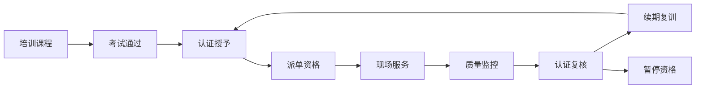
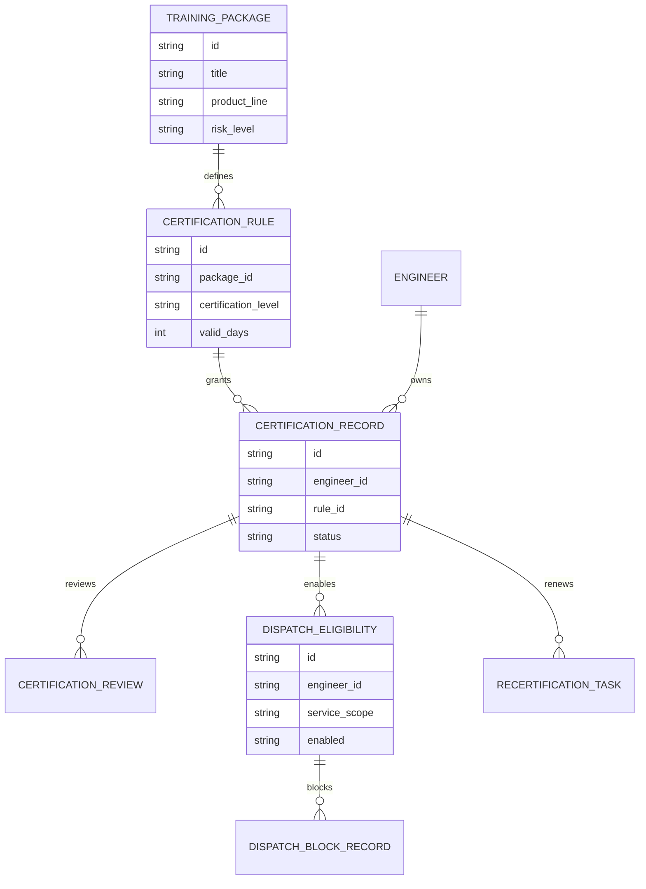
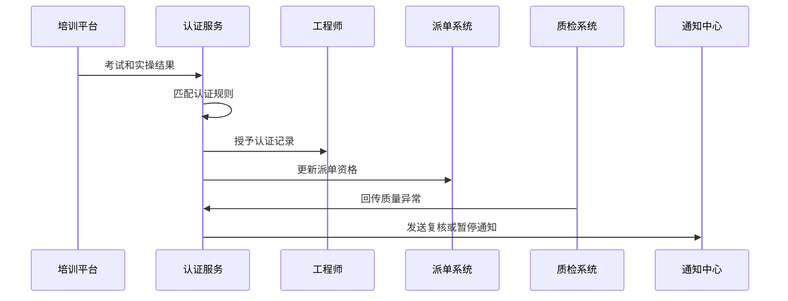
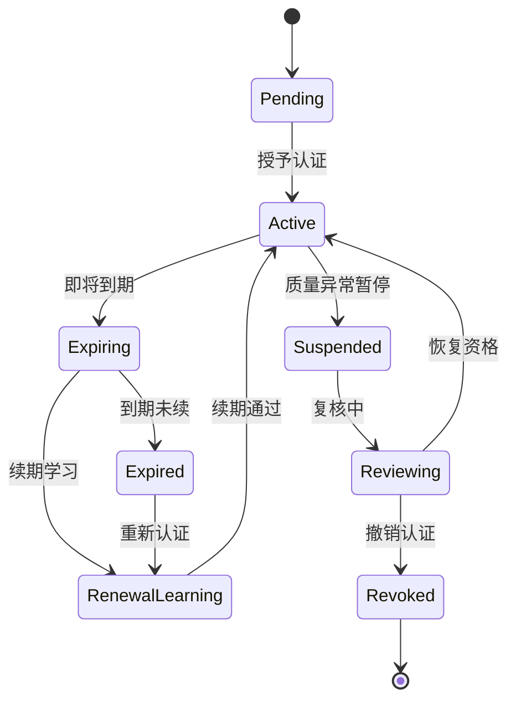
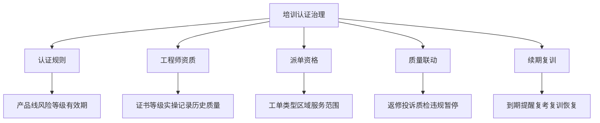

# 售后知识培训认证治理项目案例

## 适合谁看

- 想理解售后培训如何从“学过”升级为“具备认证资质”的前端开发者。
- 正在做售后知识库、服务商培训、工程师资质、派单权限、质检或服务商评级系统的团队。
- 希望避免“工程师考过一次就长期接高风险工单，认证过期和技能不匹配没人管”的项目负责人。

## 业务目标

售后知识培训效果复盘能判断培训是否改善现场质量，但对于高风险产品、召回维修、安全操作和质保政策，还需要把培训结果转化为认证治理。认证治理的重点是让工程师的知识掌握程度和派单资格绑定。

培训认证治理要解决：

- 哪些知识培训需要生成认证。
- 认证等级、有效期、复训要求和失效条件如何配置。
- 工程师是否具备接某类工单的资质。
- 认证过期、质量异常或投诉后如何暂停资格。
- 认证治理如何反哺派单、服务商评级和培训计划。

## 认证治理链路

认证治理不是多发一个证书，而是把学习、考试、现场质量和派单权限连接起来。

## 核心概念

| 概念 | 说明 |
| --- | --- |
| 认证规则 | 决定课程、考试、实操、有效期和复训要求的配置。 |
| 认证等级 | 工程师可处理的产品线、风险等级、维修类型和服务场景。 |
| 认证有效期 | 认证从授予到失效的时间范围。 |
| 派单资格 | 派单系统判断工程师是否可接某类工单的依据。 |
| 暂停资格 | 因认证过期、质量异常、投诉或违规暂停派单资格。 |
| 续期复训 | 认证到期前重新学习、考试或实操验证。 |

## 数据模型

认证记录和派单资格要分开。认证是资质事实，派单资格还会受服务区域、当前状态、投诉和黑名单影响。

## 推荐表结构

| 表 | 作用 | 关键字段 |
| --- | --- | --- |
| `certification_rule` | 保存认证规则 | `package_id`、`certification_level`、`valid_days`、`renewal_rule` |
| `certification_record` | 保存认证记录 | `engineer_id`、`rule_id`、`issued_at`、`expires_at`、`status` |
| `certification_review` | 保存认证复核 | `record_id`、`review_type`、`result`、`reason` |
| `dispatch_eligibility` | 保存派单资格 | `engineer_id`、`service_scope`、`enabled`、`source_record_id` |
| `dispatch_block_record` | 保存资格阻断 | `eligibility_id`、`block_reason`、`start_at`、`end_at` |
| `recertification_task` | 保存续期任务 | `record_id`、`due_at`、`task_status`、`result` |
| `certification_audit_log` | 保存审计日志 | `biz_id`、`action_type`、`operator_id`、`created_at` |

## 认证授予流程

认证服务要接收质检系统反馈，不能只依赖培训平台的一次考试结果。

## 认证状态设计

暂停和撤销要分开。暂停可能通过复核恢复，撤销通常意味着需要重新认证。

## 认证治理维度拆解

认证治理页面要能从工程师、服务商、产品线和工单类型四个方向查询。

## 前端页面拆分

| 页面 | 核心内容 | 设计重点 |
| --- | --- | --- |
| 认证规则 | 课程、等级、有效期、续期要求、派单范围 | 规则配置要清楚影响哪些工单。 |
| 工程师认证档案 | 认证列表、有效期、质量记录、暂停记录 | 让管理者快速判断资质是否可信。 |
| 派单资格 | 产品线、维修类型、区域、可派状态、阻断原因 | 与派单系统保持一致。 |
| 续期任务 | 即将到期、复训进度、考试结果、逾期风险 | 防止认证过期仍然接单。 |
| 质量联动 | 返修、投诉、质检异常、资格暂停和恢复 | 把现场质量反向约束认证。 |

## 接口拆分建议

| 接口 | 作用 |
| --- | --- |
| `GET /api/after-sales-certification-rules` | 查询认证规则。 |
| `POST /api/after-sales-certification-rules` | 创建认证规则。 |
| `GET /api/after-sales-engineers/:id/certifications` | 查询工程师认证档案。 |
| `POST /api/after-sales-certification-records` | 授予认证。 |
| `POST /api/after-sales-certification-records/:id/suspend` | 暂停认证资格。 |
| `POST /api/after-sales-certification-records/:id/renew` | 发起续期复训。 |
| `GET /api/after-sales-dispatch-eligibilities` | 查询派单资格。 |
| `POST /api/after-sales-dispatch-eligibilities/sync` | 同步派单资格。 |

## 实际项目常见问题

### 1. 考试通过就永久有效

产品和维修步骤会变化。解决方式是认证必须有有效期，并随知识版本变化触发复训。

### 2. 认证和派单脱节

培训系统显示未认证，派单系统仍然派单。解决方式是派单资格由认证服务统一输出。

### 3. 质量异常不影响认证

工程师反复返修或投诉，但仍可接高风险工单。解决方式是质检和投诉触发认证复核或暂停。

### 4. 服务商人员身份不统一

同一工程师在培训、派单和质检系统里有多个编号。解决方式是建立工程师统一身份映射。

### 5. 续期提醒太晚

到期当天才提醒，服务商来不及安排复训。解决方式是按风险等级提前生成续期任务。

## 权限与审计

| 权限 | 说明 |
| --- | --- |
| 管理认证规则 | 可以配置认证等级、有效期和派单范围。 |
| 授予认证 | 可以根据培训和考试结果发证。 |
| 暂停资格 | 可以因质量异常暂停认证或派单资格。 |
| 恢复资格 | 可以在复核通过后恢复。 |
| 查看派单资格 | 可以查看工程师可接工单范围。 |

认证授予、暂停、恢复、撤销、续期和派单资格同步都要写审计日志。

## 验收清单

- 能配置认证规则和有效期。
- 能从培训结果授予工程师认证。
- 能把认证结果同步为派单资格。
- 能按产品线、维修类型和风险等级控制接单范围。
- 能因质量异常暂停或复核认证。
- 能在认证到期前生成续期复训任务。
- 能保留认证治理全过程审计。

## 下一步学习

- [售后知识培训效果复盘项目案例](/projects/after-sales-knowledge-training-effect-review-case)
- [售后知识服务商培训闭环项目案例](/projects/after-sales-knowledge-provider-training-closed-loop-case)
- [报修派单项目案例](/projects/repair-dispatch-case)
