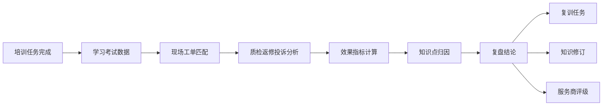
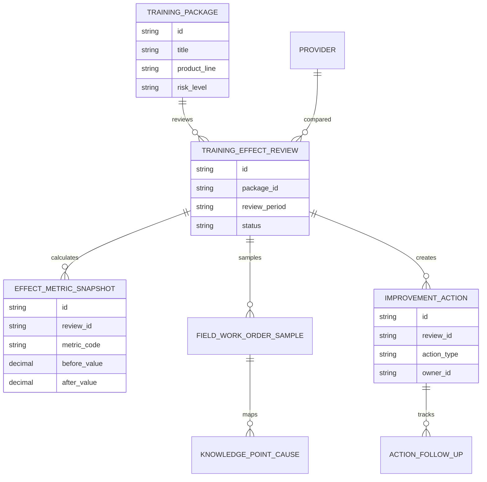
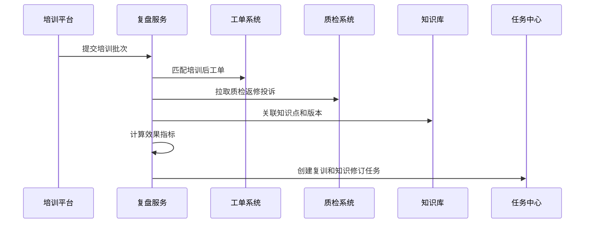
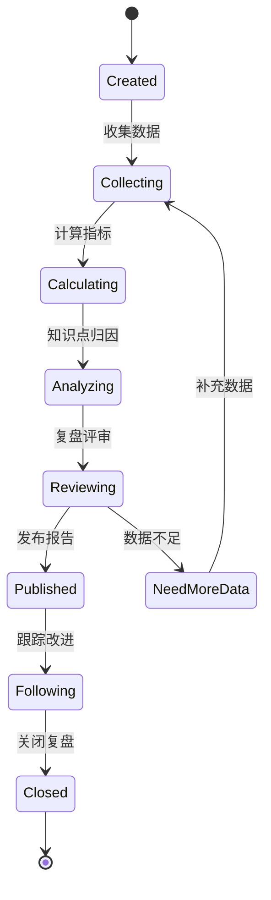
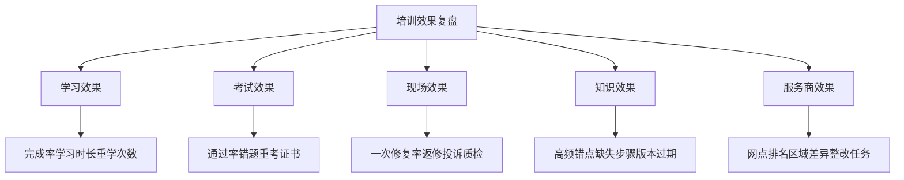

# 售后知识培训效果复盘项目案例

## 适合谁看

- 想理解售后知识培训完成后如何评估真实效果、发现知识缺口和触发复训的前端开发者。
- 正在做售后知识库、服务商培训、维修质检、客户投诉、工单分析或服务商评级系统的团队。
- 希望避免“学习率和考试通过率很好，但现场维修质量没有变好”的项目负责人。

## 业务目标

售后知识服务商培训闭环解决培训派发、学习、考试和现场验证，但管理者还需要定期复盘培训是否真正改善了服务质量。

培训效果复盘要解决：

- 某次知识培训后，相关工单质量是否提升。
- 服务商、网点和工程师之间的学习效果差异在哪里。
- 考试通过率和现场维修质量是否一致。
- 哪些知识点仍然导致返修、投诉、误判或超时。
- 复盘结论如何触发知识修订、复训、认证调整和服务商评级。

## 效果复盘链路

复盘的重点是把培训数据和现场服务结果连接起来，而不是只看学习平台里的完成率。

## 核心概念

| 概念 | 说明 |
| --- | --- |
| 培训批次 | 某次知识变更后派发的一组培训任务。 |
| 效果窗口 | 培训完成后用于观察工单质量变化的时间范围。 |
| 现场匹配 | 将工程师学习记录和后续维修工单关联。 |
| 效果指标 | 返修率、一次修复率、质检通过率、投诉率、平均处理时长等。 |
| 知识点归因 | 将现场问题关联到具体知识条目、课程章节或考试题。 |
| 改进动作 | 复训、知识修订、题库调整、认证收紧或服务商整改。 |

## 数据模型

效果指标要保存培训前后对比。只看培训后的绝对值，很难判断培训是否真的带来改善。

## 推荐表结构

| 表 | 作用 | 关键字段 |
| --- | --- | --- |
| `training_effect_review` | 保存复盘报告 | `package_id`、`review_period`、`owner_id`、`status` |
| `effect_metric_snapshot` | 保存指标快照 | `review_id`、`metric_code`、`before_value`、`after_value` |
| `field_work_order_sample` | 保存现场样本 | `review_id`、`work_order_id`、`engineer_id`、`quality_result` |
| `knowledge_point_cause` | 保存知识点归因 | `sample_id`、`knowledge_id`、`cause_type`、`confidence` |
| `provider_effect_ranking` | 保存服务商效果排名 | `review_id`、`provider_id`、`score`、`risk_tag` |
| `improvement_action` | 保存改进动作 | `review_id`、`action_type`、`owner_id`、`due_at` |
| `action_follow_up` | 保存跟进记录 | `action_id`、`progress`、`result`、`updated_at` |

## 复盘生成流程

复盘不能只从培训平台取数。必须连接工单、质检、投诉和知识版本。

## 复盘状态设计

如果样本量不足，不能强行输出结论。应等待更多工单或缩小复盘范围。

## 效果维度拆解

同一个培训批次要能按服务商、网点、工程师、产品线和知识点多维下钻。

## 前端页面拆分

| 页面 | 核心内容 | 设计重点 |
| --- | --- | --- |
| 复盘报告列表 | 培训批次、产品线、效果评分、风险服务商、状态 | 优先展示效果差和高风险知识。 |
| 复盘详情 | 培训前后指标、样本工单、归因结论、改进动作 | 让管理者看到数据证据。 |
| 指标对比 | 完成率、通过率、返修率、投诉率、质检通过率 | 不只看学习指标，也看现场指标。 |
| 知识点归因 | 错题、返修原因、投诉原因、知识条目 | 找出真正需要修订的内容。 |
| 改进跟踪 | 复训、知识修订、认证调整、服务商整改 | 复盘结论必须落到动作。 |

## 接口拆分建议

| 接口 | 作用 |
| --- | --- |
| `GET /api/after-sales-training-effect-reviews` | 查询培训效果复盘列表。 |
| `POST /api/after-sales-training-effect-reviews` | 创建效果复盘。 |
| `GET /api/after-sales-training-effect-reviews/:id` | 查询复盘详情。 |
| `POST /api/after-sales-training-effect-reviews/:id/calculate` | 计算效果指标。 |
| `GET /api/after-sales-training-effect-reviews/:id/work-orders` | 查询样本工单。 |
| `POST /api/after-sales-training-effect-reviews/:id/causes` | 提交知识点归因。 |
| `POST /api/after-sales-training-effect-reviews/:id/actions` | 创建改进动作。 |

## 实际项目常见问题

### 1. 只看完成率和通过率

学习平台数据很好，但现场返修率没降。解决方式是必须接入工单、质检和投诉数据。

### 2. 培训效果被其他因素干扰

同一时期产品质量或备件供应也变化了。解决方式是选择明确效果窗口，并标记干扰因素。

### 3. 样本工单无法匹配工程师学习记录

外部服务商人员编码不统一。解决方式是统一工程师身份，并在派单和学习系统之间打通人员映射。

### 4. 复盘只到服务商，不到知识点

知道某个服务商效果差，但不知道哪里没学会。解决方式是把错题、返修原因和知识条目关联。

### 5. 复盘结论没有动作

报告显示效果不好，但没有复训和知识修订。解决方式是复盘必须生成改进动作并跟踪关闭。

## 权限与审计

| 权限 | 说明 |
| --- | --- |
| 创建复盘 | 可以选择培训批次和效果窗口。 |
| 查看现场数据 | 可以查看工单、质检、返修和投诉样本。 |
| 编辑归因 | 可以维护知识点和服务商问题归因。 |
| 发布报告 | 可以发布培训效果结论。 |
| 跟踪改进 | 可以推进复训、修订和整改任务。 |

复盘指标、样本选择、归因结论、报告发布和改进动作都要保留审计记录。

## 验收清单

- 能从培训批次创建效果复盘。
- 能配置培训前后效果窗口。
- 能关联工单、质检、返修和投诉数据。
- 能比较学习指标、考试指标和现场质量指标。
- 能按服务商、网点、工程师和知识点下钻。
- 能生成复训、知识修订、题库调整或服务商整改动作。
- 能跟踪改进动作完成情况并关闭复盘。

## 下一步学习

- [售后知识服务商培训闭环项目案例](/projects/after-sales-knowledge-provider-training-closed-loop-case)
- [售后知识质量治理项目案例](/projects/after-sales-knowledge-quality-governance-case)
- [客服质检项目案例](/projects/customer-service-quality-case)
