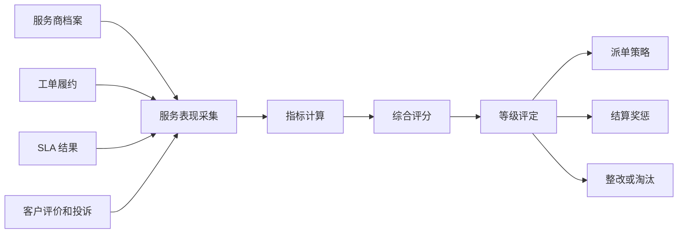
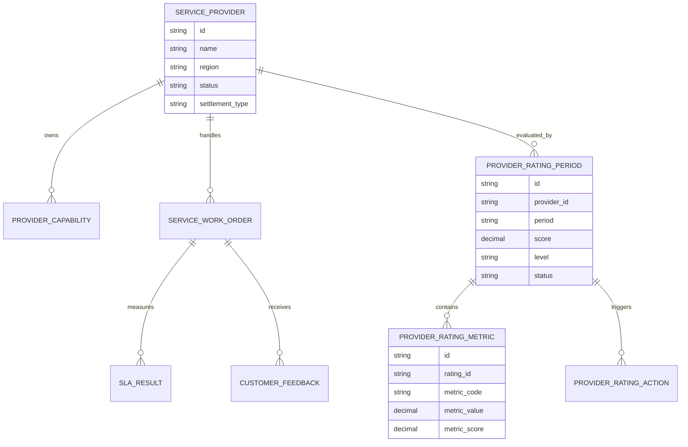
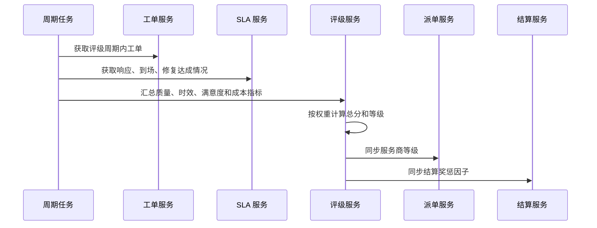
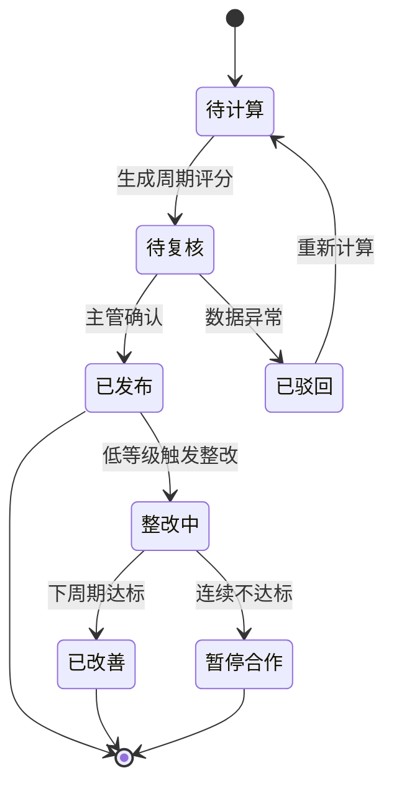
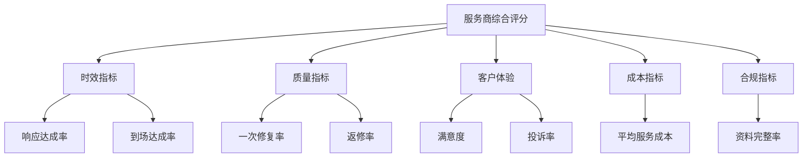

# 售后服务商评级项目案例

## 适合谁看

如果你做过售后服务、服务网点、报修派单或 SLA 赔付，但不清楚怎么评价外部服务商，可以学习这个案例。

售后服务商评级不是简单给服务商打星，而是把响应速度、到场及时率、修复质量、客户满意度、成本、赔付和投诉结合起来，形成可调整派单策略和结算策略的评价体系。

## 业务目标

服务商评级要解决三个问题：

1. 哪些服务商值得优先派单？
2. 哪些服务商质量差、成本高或经常超 SLA？
3. 评级结果如何影响派单、结算、培训和淘汰？

如果评级只展示分数，但不影响业务动作，它就会变成一个没人看的报表。真正有效的评级系统，要把评分结果写回服务商管理、派单规则和结算策略。

## 售后服务商评级链路

评级链路的重点是结果要能回到业务策略。A级服务商可以优先派单，C级服务商可能限制派单或要求整改。

## 核心概念

| 概念 | 含义 | 项目里怎么用 |
| --- | --- | --- |
| 服务商 | 承接售后维修、上门、安装的外部团队 | 系统评级的对象 |
| 服务区域 | 服务商覆盖的省市区或网点范围 | 派单时决定可选服务商 |
| 服务能力 | 可处理的产品、技能、等级和容量 | 防止派给不能处理的服务商 |
| SLA 达成率 | 是否按约定时间响应、到场、修复 | 评级的重要指标 |
| 一次修复率 | 第一次服务就解决问题的比例 | 衡量质量 |
| 评级周期 | 按月、季度或半年计算分数 | 防止单个工单影响过大 |

## 数据模型

评级建议按周期生成快照。不要每次查询都实时计算所有历史工单，否则性能差，也不利于复盘。

## 推荐表结构

| 表 | 作用 | 关键字段 |
| --- | --- | --- |
| `service_provider` | 服务商档案 | 名称、区域、状态、结算方式、负责人 |
| `provider_capability` | 服务能力 | 产品线、技能、等级、日容量、覆盖区域 |
| `service_work_order` | 服务工单 | 服务商、响应时间、到场时间、修复时间、费用 |
| `sla_result` | SLA 结果 | 响应是否达标、到场是否达标、修复是否达标 |
| `customer_feedback` | 客户反馈 | 满意度、投诉、评价标签 |
| `provider_rating_period` | 周期评级 | 周期、总分、等级、状态、发布时间 |
| `provider_rating_metric` | 指标明细 | 指标编码、指标值、权重、得分 |
| `provider_rating_action` | 评级动作 | 优先派单、整改、降级、暂停、淘汰 |

## 评级计算流程

评级可以按月跑批生成。派单系统不应该实时计算评级，而应该读取已经发布的服务商等级。

## 评级状态设计

评级不要计算完就直接生效。服务商评级会影响派单和收入，通常需要复核、发布和申诉机制。

## 指标体系拆解

指标要分层，不要把所有指标平铺。业务人员更容易理解“时效、质量、体验、成本、合规”五类。

## 前端页面拆分

| 页面 | 核心内容 | 设计建议 |
| --- | --- | --- |
| 评级看板 | 服务商等级分布、低分排行、趋势、区域分布 | 管理者先看整体质量 |
| 服务商列表 | 当前等级、得分、区域、能力、状态 | 支持按等级和区域筛选 |
| 评级详情 | 总分、指标得分、工单明细、扣分原因 | 要能解释为什么是这个等级 |
| 指标配置 | 指标权重、评分规则、适用范围 | 权重变更必须留版本 |
| 整改任务 | 问题、措施、负责人、截止时间、复核结果 | 低等级服务商必须闭环 |
| 评级申诉 | 服务商申诉、证据、复核结论 | 防止评分争议线下处理 |

## 接口拆分建议

| 接口 | 说明 |
| --- | --- |
| `GET /api/provider-ratings/dashboard` | 查询服务商评级总览 |
| `GET /api/provider-ratings` | 查询服务商周期评级列表 |
| `GET /api/provider-ratings/:id` | 查询评级详情和指标明细 |
| `POST /api/provider-ratings/:id/publish` | 发布评级结果 |
| `POST /api/provider-ratings/:id/appeals` | 提交评级申诉 |
| `POST /api/provider-ratings/:id/improvement-tasks` | 创建整改任务 |
| `GET /api/provider-rating-rules` | 查询评级规则 |
| `PUT /api/provider-rating-rules/:id` | 修改指标权重或评分规则 |

## 实际项目常见问题

### 1. 工单数量少的服务商分数波动很大

样本太少时，一个投诉或一次超时就会严重影响分数。

解决方式：

- 设置最小样本量，不足样本只显示观察等级。
- 小样本服务商按多个周期合并计算。
- 指标展示置信提示，例如“样本不足，谨慎解读”。
- 不要直接用小样本评级做淘汰依据。

### 2. 服务商只接简单工单，评分反而更高

如果不考虑工单难度，服务商可能倾向于挑简单任务。

解决方式：

- 引入工单复杂度系数。
- 按产品线、故障类型、区域距离分别比较。
- 派单系统记录拒单和转单情况。
- 评级中加入复杂工单承接能力。

### 3. 客户满意度被刷分

满意度容易被人工引导，不能作为唯一质量指标。

解决方式：

- 满意度和一次修复率、返修率、投诉率一起看。
- 异常高分但返修率高的服务商进入复核。
- 评价链接和工单绑定，防止重复评价。
- 对短时间大量评价做异常检测。

### 4. 评级结果和派单策略脱节

如果派单系统不使用评级，评级没有业务价值。

解决方式：

- 派单候选排序加入服务商等级。
- 低等级服务商限制高价值或高难度工单。
- 连续低评级自动触发整改或暂停合作。
- A级服务商可以获得更多派单或奖励结算。

### 5. 指标权重经常争议

不同部门关注不同指标：客服关注满意度，财务关注成本，运营关注 SLA。

解决方式：

- 指标分组并说明业务含义。
- 权重配置支持版本。
- 权重变更前用历史数据模拟影响。
- 发布前由服务、财务、运营共同复核。

## 权限与审计

| 权限点 | 控制原因 |
| --- | --- |
| 查看全部评级 | 涉及服务商绩效和合作策略 |
| 查看本服务商评级 | 外部服务商只能看自己的评级 |
| 修改评级规则 | 影响派单和结算 |
| 发布评级结果 | 发布后会影响业务策略 |
| 处理申诉 | 需要复核证据和结论 |
| 暂停服务商 | 影响合作关系 |

审计日志要记录规则变更、评级发布、申诉处理、等级调整、整改关闭、暂停合作和导出操作。

## 验收清单

- 能按周期生成服务商评分和等级。
- 能展示时效、质量、体验、成本和合规指标。
- 评级详情能解释扣分原因和关联工单。
- 样本不足时有明确提示或观察等级。
- 评级结果能同步给派单和结算系统。
- 低评级能触发整改、限制派单或暂停合作。
- 指标权重支持版本和审计。

## 下一步学习

- [售后服务项目案例](/projects/after-sales-service-case)
- [服务网点项目案例](/projects/service-outlet-case)
- [售后 SLA 赔付分析项目案例](/projects/after-sales-sla-compensation-case)
- [报修派单项目案例](/projects/repair-dispatch-case)
