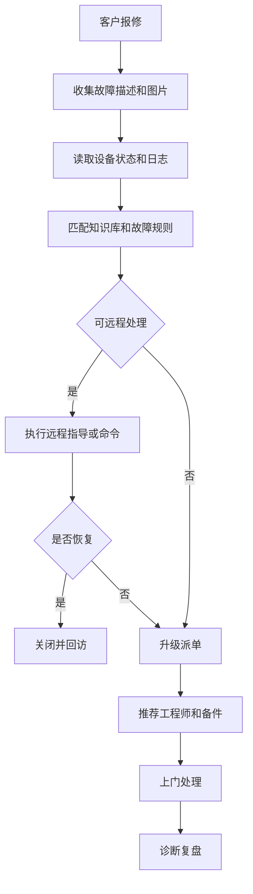
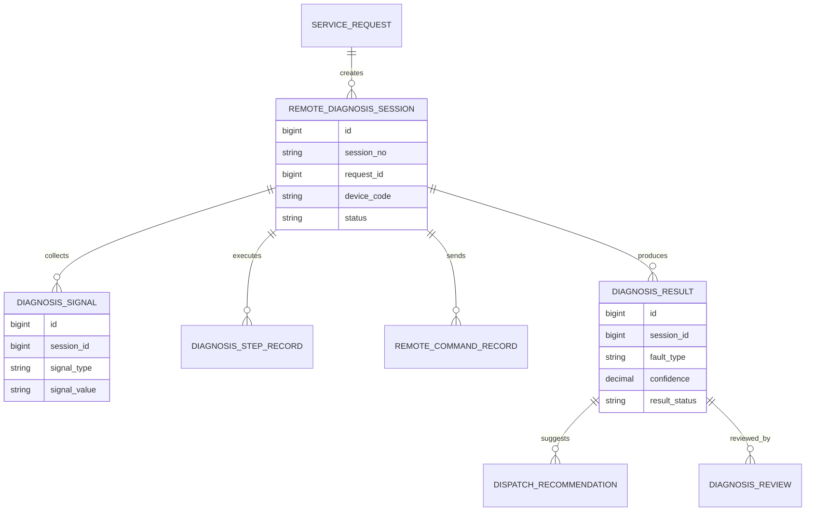
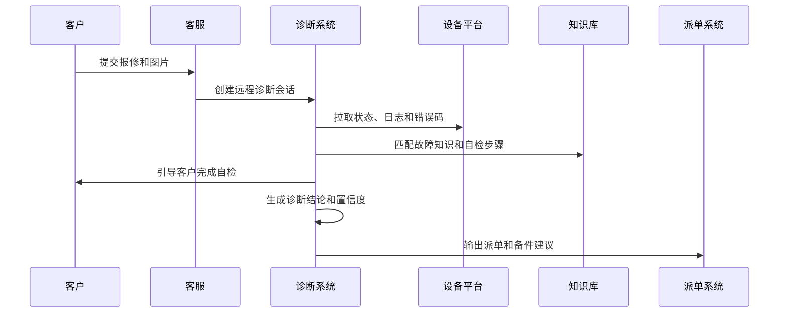
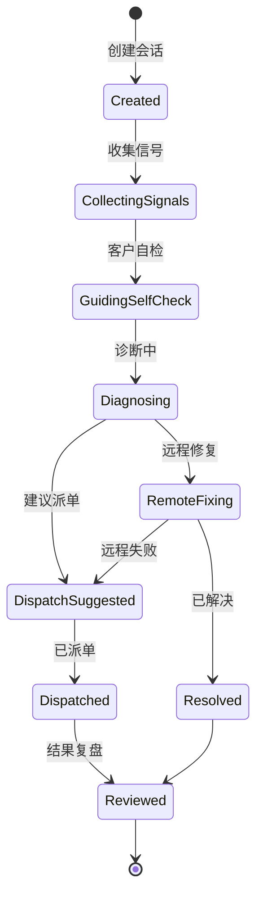
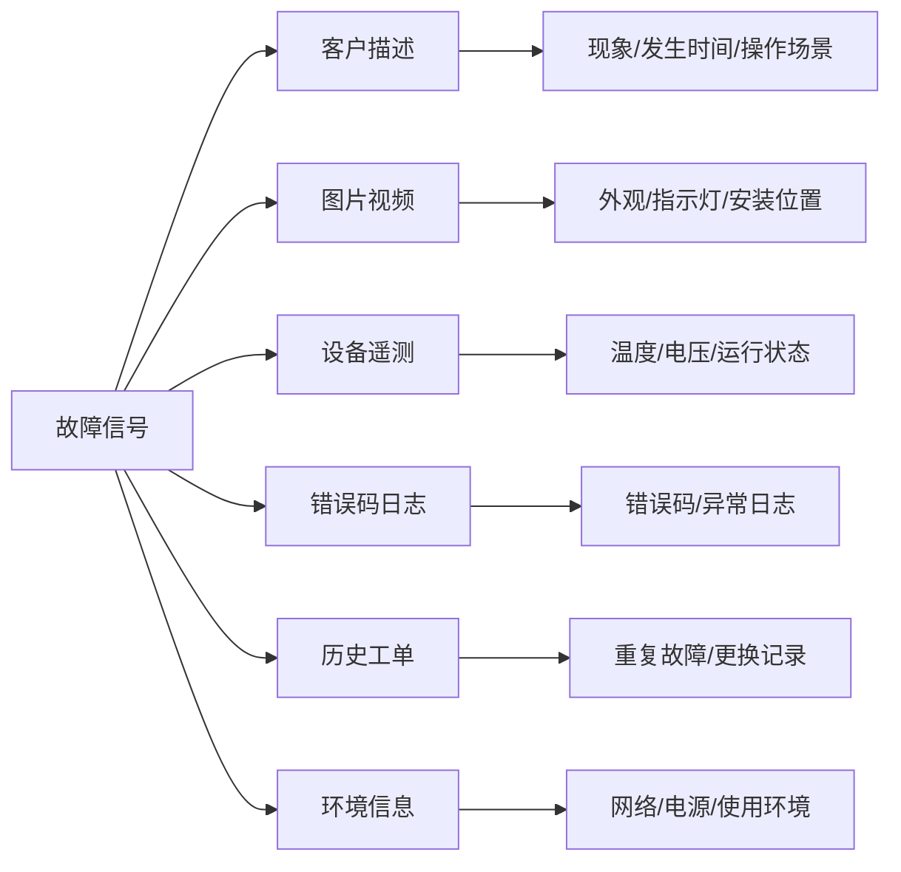

# 售后远程诊断项目案例

## 适合谁看

如果你做过售后服务、报修派单、IoT 设备管理或售后服务成本优化，但还不清楚如何减少无效上门、提前判断故障和提升一次修复率，可以学习这个案例。

售后远程诊断关注的是客户报修后，先通过设备状态、日志、图片视频、客户自检、远程命令和知识库判断故障原因，再决定远程解决、派工程师、调备件还是升级专家。

## 业务目标

售后远程诊断要回答 6 个问题：

- 客户报修后，是否可以远程判断故障类型和严重程度。
- 是否可以通过客户自检、远程命令或参数调整解决问题。
- 如果必须上门，应该带什么备件，派什么技能的工程师。
- 远程诊断是否降低了重复上门和服务成本。
- 诊断结论是否可靠，误判如何复盘。
- 高频故障如何反馈产品、知识库和备件计划。

真实项目中，远程诊断不能为了降本强行替代上门。它必须有适用条件、风险等级和升级机制。

## 售后远程诊断链路

远程诊断的价值不只是减少上门，还包括提升派单准确率和备件准备准确率。

## 核心概念

| 概念 | 说明 | 新手理解 |
| --- | --- | --- |
| 诊断会话 | 一次远程诊断过程 | 客户报修后的判断记录 |
| 故障信号 | 判断故障的证据 | 错误码、日志、图片、声音 |
| 自检步骤 | 客户可执行的检查 | 重启、拍照、确认指示灯 |
| 远程命令 | 系统下发到设备的操作 | 重启、参数读取、日志上传 |
| 诊断结论 | 当前判断的故障类型 | 软件、硬件、耗材、网络 |
| 派单建议 | 是否上门及带什么 | 工程师技能和备件 |
| 误判复盘 | 诊断和实际不一致 | 优化规则和知识库 |

诊断结论要有置信度。低置信度不能直接关闭工单，应该进入人工复核或派单。

## 数据模型

诊断会话要独立于工单。一个报修可能多次诊断，诊断失败后再派单，上门结果还要回写诊断复盘。

## 推荐表结构

| 表 | 用途 | 关键字段 |
| --- | --- | --- |
| `remote_diagnosis_session` | 诊断会话 | session_no、request_id、device_code、status、operator_id |
| `diagnosis_signal` | 诊断信号 | session_id、signal_type、signal_value、collected_at |
| `diagnosis_step_record` | 自检步骤 | session_id、step_code、customer_result、evidence_file_id |
| `remote_command_record` | 远程命令 | session_id、command_code、command_status、response_json |
| `diagnosis_rule` | 诊断规则 | rule_code、fault_type、condition_json、confidence_weight |
| `diagnosis_result` | 诊断结论 | session_id、fault_type、confidence、suggested_action |
| `dispatch_recommendation` | 派单建议 | result_id、skill_required、parts_required、priority |
| `diagnosis_review` | 诊断复盘 | result_id、actual_fault_type、is_correct、review_comment |

远程命令必须有安全控制。不能随意下发会影响设备、数据或客户现场安全的命令。

## 诊断执行流程

如果设备不在线，诊断系统也要能基于客户描述、历史故障和知识库做弱诊断，但置信度应更低。

## 诊断会话状态设计

诊断会话关闭前要有结果：远程解决、派单、客户取消或无法诊断。不要让会话停在“诊断中”。

## 故障信号拆解

信号越完整，诊断越可靠。页面要引导客服或客户补齐关键信号。

## 前端页面拆分

| 页面 | 核心内容 | 设计建议 |
| --- | --- | --- |
| 诊断工作台 | 待诊断、诊断中、待派单、已解决 | 客服快速处理 |
| 诊断会话详情 | 信号、步骤、命令、结论、时间线 | 所有证据集中展示 |
| 自检引导页 | 步骤、图片示例、客户反馈 | 适合客户或客服协助 |
| 设备状态页 | 在线状态、错误码、日志、遥测 | 对接 IoT 平台 |
| 派单建议页 | 故障类型、技能、备件、优先级 | 减少无效上门 |
| 诊断规则页 | 规则条件、故障类型、置信度 | 需要版本和审计 |
| 误判复盘页 | 诊断结论、实际故障、原因 | 优化知识库和规则 |

远程诊断页面要避免一次展示太多技术字段。客服需要明确下一步动作，专家才需要看完整日志。

## 接口拆分建议

| 接口 | 方法 | 说明 |
| --- | --- | --- |
| `/api/remote-diagnosis/sessions` | GET/POST | 查询和创建诊断会话 |
| `/api/remote-diagnosis/sessions/:id/signals` | GET/POST | 查询和提交诊断信号 |
| `/api/remote-diagnosis/sessions/:id/self-check` | POST | 提交自检步骤结果 |
| `/api/remote-diagnosis/sessions/:id/device-state` | GET | 查询设备状态 |
| `/api/remote-diagnosis/sessions/:id/commands` | POST | 下发远程命令 |
| `/api/remote-diagnosis/sessions/:id/diagnose` | POST | 生成诊断结论 |
| `/api/remote-diagnosis/results/:id/review` | POST | 提交诊断复盘 |

远程命令接口必须做权限、设备状态、命令白名单和审计校验。

## 实际项目常见问题

### 1. 客户描述太模糊，无法诊断

客户只写“不能用”，客服不知道该问什么。

解决方式：

- 按产品和故障类型生成自检问题。
- 要求上传关键照片或视频。
- 常见故障提供示例图。
- 信息不足时标记低置信度。

### 2. 远程诊断误判导致二次上门

规则只看单一错误码，没有结合场景。

解决方式：

- 诊断结论带置信度。
- 低置信度进入专家复核。
- 上门结果回写误判复盘。
- 高频误判规则下线或调权重。

### 3. 远程命令存在安全风险

客服可能误操作影响设备。

解决方式：

- 命令白名单和权限分级。
- 高风险命令二次确认或审批。
- 命令执行前检查设备状态。
- 命令记录请求、响应和操作者。

### 4. 诊断系统和派单系统割裂

诊断结论没有传给工程师。

解决方式：

- 派单建议包含故障类型、备件和技能。
- 工程师 App 展示诊断记录。
- 上门结果回写诊断复盘。
- 备件建议关联库存。

### 5. 远程解决率提高但满意度下降

客户觉得被反复要求自检，体验变差。

解决方式：

- 自检步骤控制数量和时长。
- 高价值客户或紧急故障直接人工介入。
- 远程失败快速升级派单。
- 复盘远程解决率和满意度。

## 权限与审计

| 权限点 | 控制原因 |
| --- | --- |
| 查看诊断会话 | 涉及客户和设备信息 |
| 查看设备日志 | 可能包含敏感运行数据 |
| 下发远程命令 | 可能影响设备状态 |
| 维护诊断规则 | 会影响诊断结果 |
| 关闭诊断会话 | 代表问题已处理 |
| 导出诊断数据 | 涉及客户和设备数据 |

审计日志要记录会话创建、信号采集、命令下发、诊断结论、派单建议、关闭原因和误判复盘。

## 验收清单

- 能创建远程诊断会话并关联报修单和设备。
- 能采集客户描述、图片视频、设备状态、错误码和历史工单。
- 能按规则生成诊断结论和置信度。
- 能支持客户自检和远程命令。
- 能输出派单技能和备件建议。
- 能回写上门结果并复盘诊断准确率。
- 能监控远程解决率、一次修复率、满意度和服务成本。

## 下一步学习

建议继续阅读：

- [售后服务项目案例](/projects/after-sales-service-case)
- [报修派单项目案例](/projects/repair-dispatch-case)
- [IoT 设备管理项目案例](/projects/iot-device-management-case)
- [售后服务成本优化项目案例](/projects/after-sales-service-cost-optimization-case)
