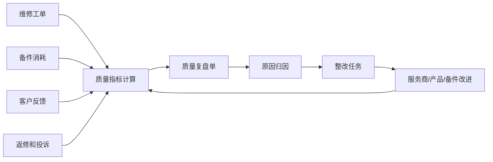
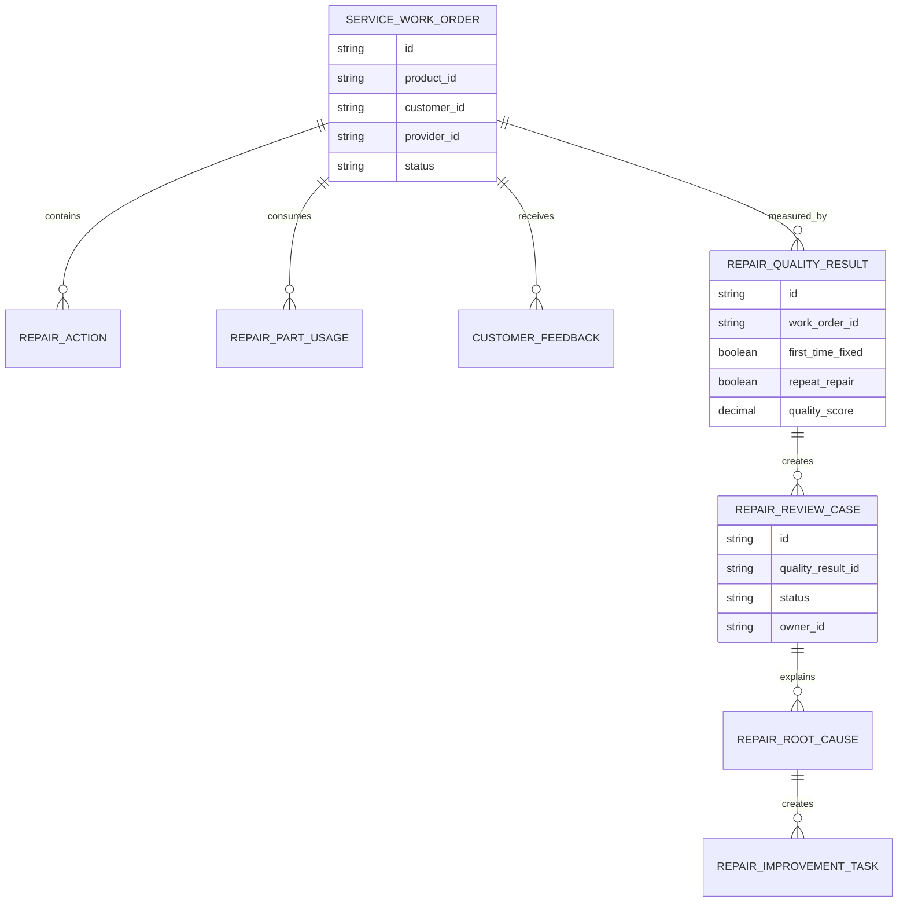
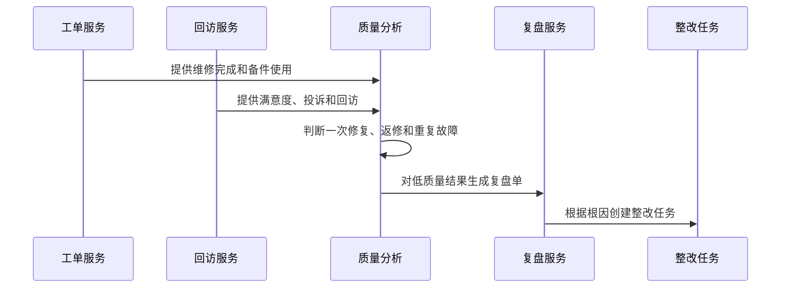
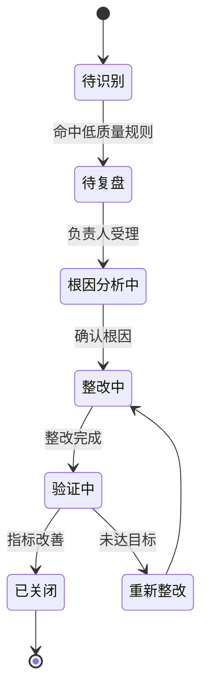
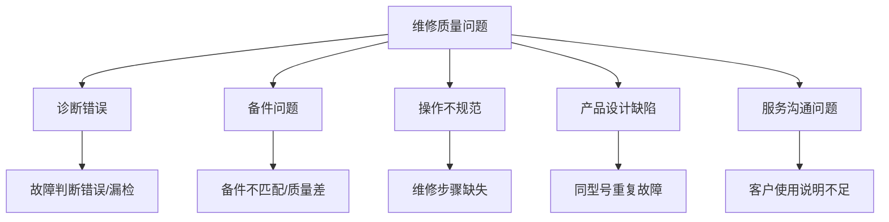

# 售后维修质量复盘项目案例

## 适合谁看

如果你做过售后服务、报修派单、售后 SLA 赔付或售后服务商评级，但不知道如何分析“维修质量到底好不好”，可以学习这个案例。

售后维修质量复盘关注维修是否一次解决、是否返修、是否重复故障、是否使用正确备件、客户是否满意，以及问题是否能反馈给产品、供应商和服务商。

## 业务目标

售后维修质量复盘要回答：

1. 哪些维修没有真正解决问题？
2. 返修和重复故障集中在哪些产品、备件、服务商或工程师？
3. 维修质量问题是诊断、备件、工艺、培训还是产品缺陷导致？
4. 复盘结果如何影响服务商评级、产品改进和备件策略？

它不是售后满意度报表，而是一个质量闭环：从维修工单到返修识别，再到原因归因和整改验证。

## 售后维修质量复盘链路

维修质量复盘的核心是把“工单完成”之后的数据也纳入分析。工单关闭不代表问题真正解决。

## 核心概念

| 概念 | 含义 | 初学者理解 |
| --- | --- | --- |
| 一次修复率 | 第一次维修就解决问题的比例 | 越高说明维修质量越好 |
| 返修 | 同一问题在短时间内再次报修 | 说明可能没修好 |
| 重复故障 | 同设备或同型号频繁出现相同故障 | 可能是产品或备件问题 |
| 维修质量复盘 | 对低质量维修做原因分析 | 找出为什么没修好 |
| 整改任务 | 针对原因制定行动 | 培训、换备件、改流程、反馈研发 |
| 质量闭环 | 从发现问题到验证改善 | 不止写一份报告 |

## 数据模型

复盘单不要直接等同于工单。一个复盘单可能关联多个重复工单，用来分析同一类质量问题。

## 推荐表结构

| 表 | 作用 | 关键字段 |
| --- | --- | --- |
| `service_work_order` | 售后工单 | 客户、产品、故障、服务商、工程师、状态 |
| `repair_action` | 维修动作 | 诊断、处理方案、工时、结果 |
| `repair_part_usage` | 备件使用 | 备件、数量、旧件、替代料、成本 |
| `customer_feedback` | 客户反馈 | 满意度、评价、投诉、回访结果 |
| `repair_quality_result` | 质量结果 | 一次修复、返修、重复故障、质量分 |
| `repair_review_case` | 复盘单 | 复盘对象、状态、负责人、结论 |
| `repair_root_cause` | 根因 | 诊断错误、备件问题、操作问题、产品缺陷 |
| `repair_improvement_task` | 整改任务 | 措施、责任方、截止时间、验证结果 |

## 质量识别流程

返修判断要有时间窗口。例如 30 天内同设备同故障再次报修，才算返修；不同故障不能简单归为返修。

## 复盘状态设计

复盘闭环必须有验证阶段。只写“已整改”不够，需要看返修率、满意度或重复故障是否真的改善。

## 维修质量原因拆解

原因归因要能反馈给不同责任方：服务商负责培训，备件团队负责替代料，产品团队负责设计缺陷。

## 前端页面拆分

| 页面 | 核心内容 | 设计建议 |
| --- | --- | --- |
| 维修质量看板 | 一次修复率、返修率、投诉率、低质量工单 | 管理者先看趋势 |
| 复盘单列表 | 产品、客户、工单、服务商、根因、状态 | 默认展示待复盘和高影响 |
| 复盘详情 | 关联工单、维修动作、备件、反馈、证据 | 证据链要完整 |
| 根因分析 | 原因分类、责任方、影响范围 | 支持多根因 |
| 整改任务 | 培训、流程、备件、产品改进、验证 | 任务必须有验证指标 |
| 质量报表 | 产品、服务商、工程师、故障类型排行 | 用于持续改进 |

## 接口拆分建议

| 接口 | 说明 |
| --- | --- |
| `GET /api/repair-quality/dashboard` | 查询维修质量总览 |
| `GET /api/repair-quality/review-cases` | 查询复盘单列表 |
| `GET /api/repair-quality/review-cases/:id` | 查询复盘详情 |
| `POST /api/repair-quality/review-cases/:id/root-causes` | 录入根因 |
| `POST /api/repair-quality/review-cases/:id/tasks` | 创建整改任务 |
| `POST /api/repair-quality/review-cases/:id/verify` | 验证整改效果 |
| `GET /api/repair-quality/reports/root-causes` | 查询根因分析报表 |

## 实际项目常见问题

### 1. 客户再次报修，但不是同一个问题

不能把所有重复报修都算返修。

解决方式：

- 返修规则包含设备、故障类型、时间窗口。
- 不同故障类型只算重复服务，不算返修。
- 复盘详情展示两次工单的故障描述。
- 人工复核可以调整返修判断。

### 2. 服务商认为返修不是自己的责任

返修可能来自产品缺陷、备件质量或客户误用。

解决方式：

- 复盘单支持多根因。
- 根因必须关联证据。
- 责任方可以是服务商、产品、备件、客户培训。
- 评级只读取确认后的责任结果。

### 3. 一次修复率高，但客户满意度低

修好了不代表服务体验好。

解决方式：

- 同时看一次修复率、满意度、投诉率和响应时效。
- 服务态度、沟通和预约体验单独记录。
- 质量复盘可以生成服务培训任务。
- 不要用单一指标评价服务质量。

### 4. 复盘结论无法反馈给产品团队

售后数据如果不进入研发和质量系统，就无法改善产品。

解决方式：

- 同型号重复故障自动生成产品质量线索。
- 根因标记为产品缺陷时推送研发或质量团队。
- 产品改进任务关联复盘单。
- 后续版本继续跟踪故障是否下降。

### 5. 整改任务完成后没有验证

没有验证，质量复盘会变成形式化流程。

解决方式：

- 整改任务必须绑定验证指标。
- 验证期内继续监控返修和投诉。
- 未达目标自动重新整改。
- 看板展示整改后的指标变化。

## 权限与审计

| 权限点 | 控制原因 |
| --- | --- |
| 查看维修质量数据 | 涉及客户、服务商和产品问题 |
| 录入根因 | 影响责任归属 |
| 关闭复盘单 | 需要确认整改有效 |
| 修改返修判断 | 影响服务商评级 |
| 导出质量报表 | 涉及产品和服务质量数据 |

审计日志要记录根因修改、责任方调整、复盘关闭、返修判断修正、整改验证和导出操作。

## 验收清单

- 能识别一次修复、返修和重复故障。
- 能按产品、服务商、工程师和故障类型分析质量。
- 低质量工单能生成复盘单。
- 复盘单能记录根因、责任方和证据。
- 整改任务能验证效果。
- 复盘结果能反馈服务商评级、备件策略和产品改进。
- 关键操作有权限和审计。

## 下一步学习

- [售后服务项目案例](/projects/after-sales-service-case)
- [售后服务商评级项目案例](/projects/after-sales-provider-rating-case)
- [售后 SLA 赔付分析项目案例](/projects/after-sales-sla-compensation-case)
- [售后备件周转分析项目案例](/projects/after-sales-spare-parts-turnover-case)
