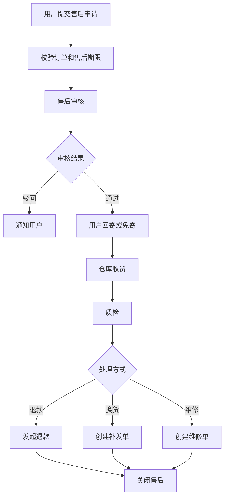
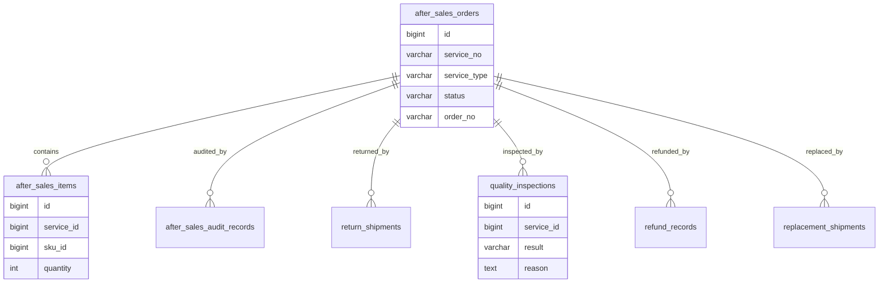
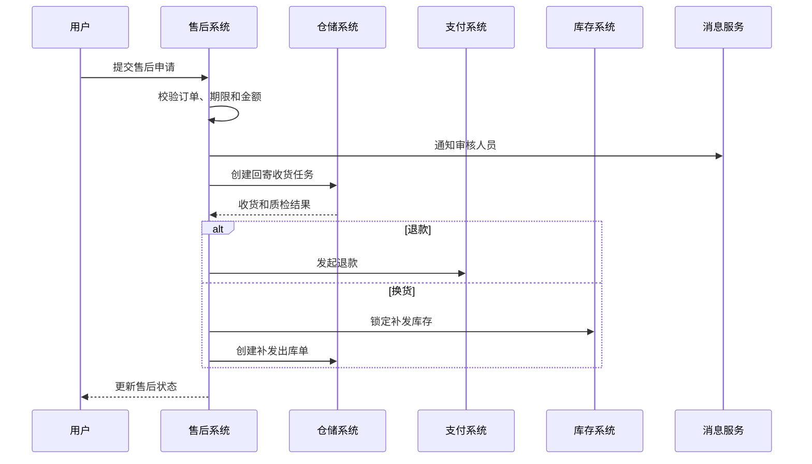

# 售后服务项目案例

## 适合谁看

适合需要做退货、换货、维修、退款、补发、售后审核、物流回寄、质检和售后原因分析的开发者。

售后服务不是“用户点一下退款”。真实项目里，售后会连接订单、支付、库存、仓储、物流、客服、财务和商品质量。售后流程设计不好，会出现重复退款、退货未入库、补发未扣库存、客户投诉无法追踪等问题。

## 业务目标

第一版售后服务支持：

- 创建退货、换货、维修和补发申请。
- 售后审核。
- 回寄物流登记。
- 仓库收货和质检。
- 退款或补发处理。
- 售后状态追踪。
- 售后原因统计。
- 售后操作审计。

## 售后流程图

售后要按类型拆流程。退货退款、换货、维修和补发看起来相似，但库存、支付和物流动作不同。

## 数据模型

## 推荐表结构

| 表 | 作用 | 关键字段 |
| --- | --- | --- |
| `after_sales_orders` | 售后单 | `service_no`、`order_no`、`service_type`、`status`、`reason_code` |
| `after_sales_items` | 售后明细 | `service_id`、`sku_id`、`quantity`、`refund_amount` |
| `after_sales_audit_records` | 审核记录 | `service_id`、`action`、`comment`、`operator_id` |
| `return_shipments` | 回寄物流 | `service_id`、`carrier_code`、`tracking_no`、`received_at` |
| `quality_inspections` | 质检记录 | `service_id`、`result`、`responsibility`、`inspection_images` |
| `refund_records` | 退款记录 | `service_id`、`refund_no`、`amount`、`status` |
| `replacement_shipments` | 换货补发 | `service_id`、`shipment_no`、`status` |
| `after_sales_reason_stats` | 原因统计 | `reason_code`、`sku_id`、`count_value`、`period` |

售后单要保存订单快照和商品快照。订单后续变化不能影响已经提交的售后判断。

## 退款换货流程

退款必须幂等。支付系统回调可能重复推送，售后系统不能重复退款。

## 售后类型

| 类型 | 关键动作 | 注意点 |
| --- | --- | --- |
| 仅退款 | 审核后退款 | 适合未发货或无需退回 |
| 退货退款 | 回寄、质检、退款、入库 | 入库状态影响退款 |
| 换货 | 回寄、质检、补发 | 补发要扣库存 |
| 维修 | 回寄、维修、寄回 | 需要维修状态 |
| 补发 | 审核后重新发货 | 避免重复补发 |
| 赔付 | 财务付款或优惠券 | 需要审批和审计 |

## 前端页面拆分

| 页面 | 作用 | 注意点 |
| --- | --- | --- |
| 售后申请 | 用户选择订单和原因 | 展示可售后数量和金额 |
| 售后审核 | 客服或运营审核 | 展示订单、物流和历史售后 |
| 回寄管理 | 查看用户回寄物流 | 超时未寄提醒 |
| 质检处理 | 仓库判断商品状态 | 支持图片和责任判定 |
| 退款处理 | 查看退款进度 | 金额和支付渠道清晰 |
| 换货补发 | 创建补发出库 | 防止重复补发 |
| 售后详情 | 查看完整时间线 | 用户和内部备注分开 |
| 原因分析 | 统计售后原因和 SKU | 发现质量问题 |

## 实际项目常见问题

### 问题 1：同一订单被重复退款

退款记录必须有唯一退款号，并按售后单和支付流水做幂等处理。重复回调只更新状态，不再次发起退款。

### 问题 2：退货收到了但库存没增加

退货入库要由质检结果驱动。可二次销售的商品增加可用库存，损坏商品进入异常库存。

### 问题 3：补发后用户又申请退款

售后系统要校验当前售后状态和订单剩余可售后数量，不能只看原始订单数量。

## 验收清单

- 售后类型和状态清晰。
- 售后申请校验订单、期限、数量和金额。
- 售后审核有记录。
- 回寄物流和质检结果可追踪。
- 退款具备幂等性。
- 换货补发会影响库存和仓储。
- 售后详情有完整时间线。
- 用户可见信息和内部备注隔离。
- 售后原因可以统计。
- 高金额售后有审批和审计。

## 下一步学习

继续学习 [客服工单项目案例](/projects/support-ticket-case)、[仓储物流项目案例](/projects/warehouse-logistics-case) 和 [支付订单项目案例](/projects/payment-order-case)。
