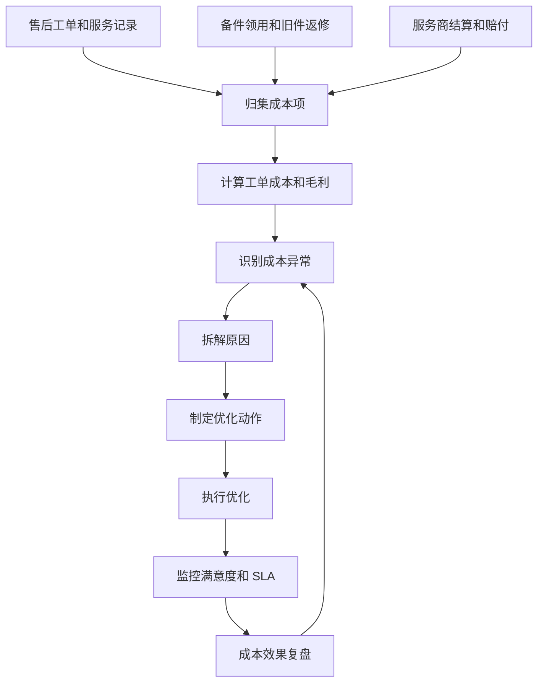
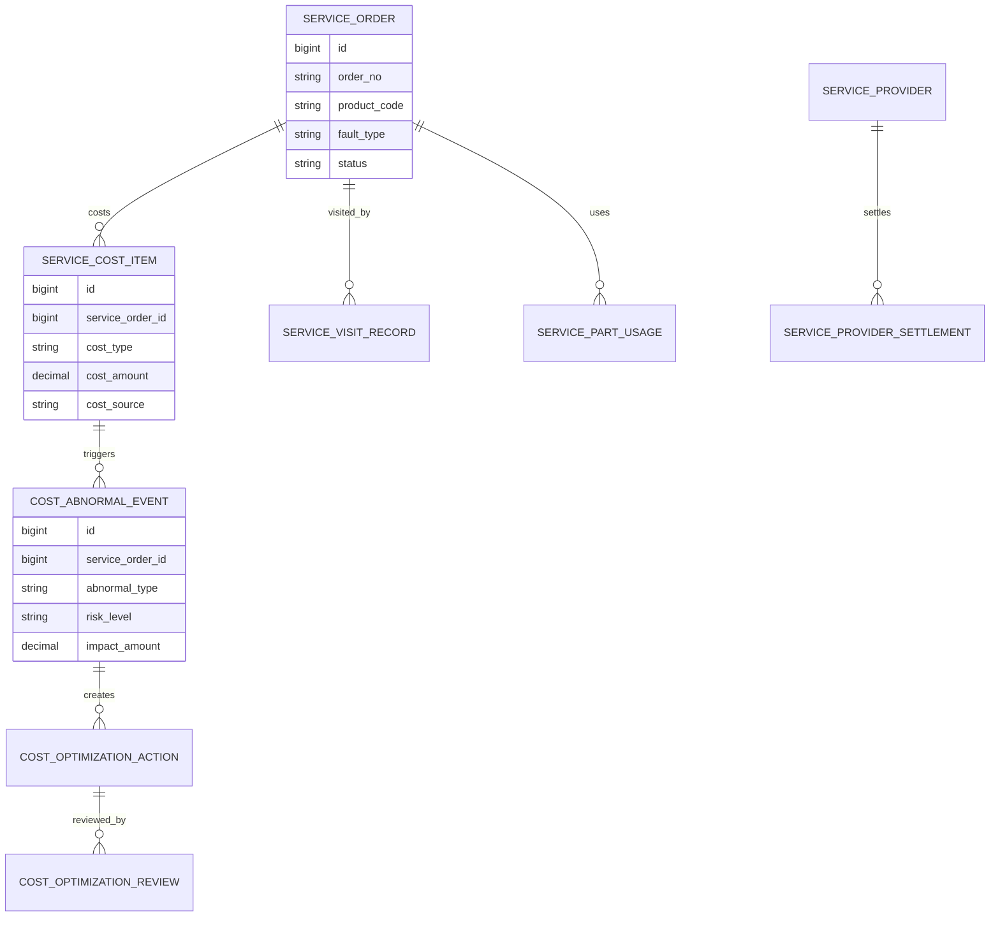
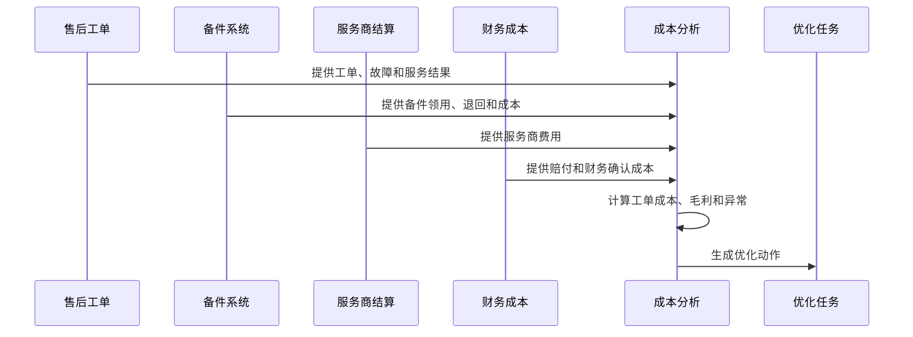
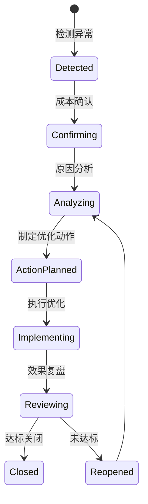
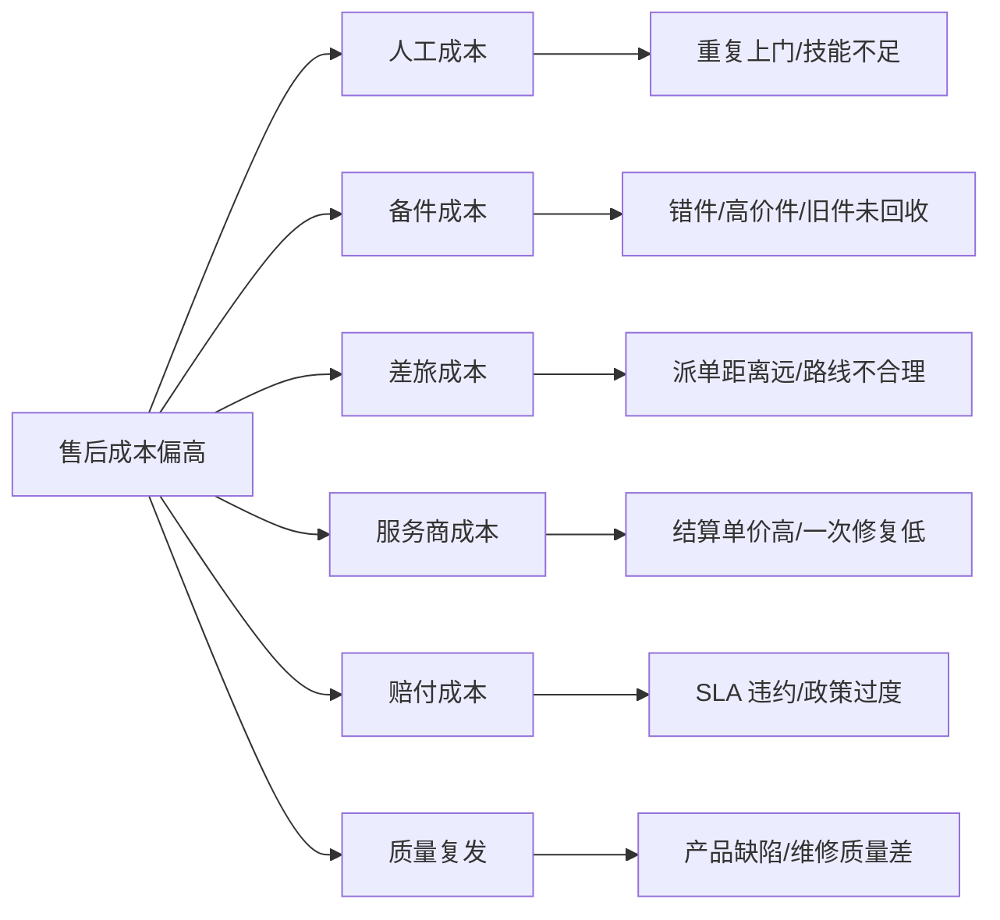

# 售后服务成本优化项目案例

## 适合谁看

如果你做过售后服务、现场服务收费、售后备件成本核算或售后成本毛利分析，但还不清楚如何系统性降低售后成本，可以学习这个案例。

售后服务成本优化不是简单要求少派单、少换件、少赔付。它要把工单、派单、人工、差旅、备件、服务商、赔付、返修、一次修复率和客户满意度一起看，在不牺牲客户体验的前提下降低无效成本。

## 业务目标

售后服务成本优化要回答 6 个问题：

- 售后成本主要花在哪里：人工、备件、差旅、服务商、赔付还是返修。
- 哪些产品、区域、服务商、故障类型成本异常高。
- 成本高是因为一次修复率低、派单不合理、备件错发、重复上门还是政策过度赔付。
- 哪些优化动作可以降低成本，同时不伤害满意度和 SLA。
- 优化动作执行后，成本、毛利、满意度和复发率是否改善。
- 成本结论如何反哺产品质量、备件计划和服务商管理。

真实项目中，售后成本优化的难点是“成本降低”和“客户体验”天然有冲突。系统必须同时看成本指标和服务质量指标。

## 售后服务成本优化链路

这条链路说明，成本优化不是财务报表，而是一个跨售后、备件、服务商、产品质量的改进闭环。

## 核心概念

| 概念 | 说明 | 新手理解 |
| --- | --- | --- |
| 工单成本 | 单个售后工单产生的总成本 | 人工、备件、差旅、服务商 |
| 成本项 | 成本的明细类型 | 备件费、上门费、赔付 |
| 一次修复率 | 一次服务就解决问题的比例 | 越低越容易重复上门 |
| 重复上门 | 同一问题多次派单 | 成本高、体验差 |
| 备件错配 | 发错件或用错件 | 增加物流和服务成本 |
| 服务商成本 | 外部服务商结算费用 | 需要和质量一起看 |
| 优化动作 | 降本措施 | 远程诊断、备件前置、培训 |
| 效果复盘 | 降本后是否影响体验 | 成本下降但满意度不能崩 |

售后成本不能只看平均值。要下钻到产品、区域、服务商、故障类型和工单场景。

## 数据模型

成本项要明细化。只在工单上保存一个总成本，后续就无法知道到底是备件贵、上门多、服务商费用高还是赔付多。

## 推荐表结构

| 表 | 用途 | 关键字段 |
| --- | --- | --- |
| `service_order` | 售后工单 | order_no、product_code、fault_type、customer_id、status |
| `service_cost_item` | 成本项 | service_order_id、cost_type、cost_amount、cost_source、confirmed_at |
| `service_visit_record` | 上门记录 | service_order_id、engineer_id、visit_type、travel_distance、result |
| `service_part_usage` | 备件使用 | service_order_id、part_code、qty、cost_amount、return_required |
| `service_provider_settlement` | 服务商结算 | provider_id、service_order_id、settlement_amount、quality_score |
| `cost_abnormal_event` | 成本异常 | service_order_id、abnormal_type、impact_amount、status |
| `cost_optimization_action` | 优化动作 | abnormal_id、action_type、owner_id、due_date、status |
| `cost_optimization_review` | 优化复盘 | action_id、cost_before、cost_after、satisfaction_change、result |

售后成本优化要保留服务质量字段，例如一次修复、满意度、SLA、投诉。否则很容易为了降本牺牲客户体验。

## 成本归集流程

成本归集要考虑时间差。备件成本、服务商结算、赔付可能不是工单关闭当天就确定。

## 成本异常状态设计

成本异常关闭前要看成本是否下降，也要看满意度、SLA 和返修率是否恶化。

## 成本原因拆解

原因拆解能直接对应优化动作：远程诊断、派单优化、备件前置、工程师培训、服务商淘汰或产品质量改进。

## 前端页面拆分

| 页面 | 核心内容 | 设计建议 |
| --- | --- | --- |
| 成本总览 | 总成本、单均成本、毛利、异常成本 | 同时展示满意度和 SLA |
| 工单成本详情 | 成本项、服务记录、备件、赔付 | 能解释每一分钱来源 |
| 成本异常工作台 | 异常类型、影响金额、责任团队 | 支持按产品、区域、服务商筛选 |
| 服务商成本页 | 结算、一次修复、投诉、成本排名 | 不只看价格 |
| 备件成本页 | 高成本件、错件、旧件回收、返修 | 关联库存和旧件 |
| 优化任务页 | 动作、负责人、截止时间、验证指标 | 降本动作要闭环 |
| 效果复盘页 | 成本前后对比、满意度变化、复发率 | 防止短期降本长期变差 |

售后成本页面要避免只做财务看板。它应该能帮助业务定位具体工单、产品、服务商和改善动作。

## 接口拆分建议

| 接口 | 方法 | 说明 |
| --- | --- | --- |
| `/api/after-sales/costs/overview` | GET | 查询成本总览 |
| `/api/after-sales/service-orders/:id/costs` | GET | 查询工单成本明细 |
| `/api/after-sales/cost-abnormal-events` | GET | 查询成本异常 |
| `/api/after-sales/cost-abnormal-events/:id/analyze` | POST | 提交原因分析 |
| `/api/after-sales/cost-actions` | GET/POST | 查询和创建优化动作 |
| `/api/after-sales/cost-actions/:id/review` | POST | 提交效果复盘 |
| `/api/after-sales/costs/provider-ranking` | GET | 查询服务商成本质量排名 |
| `/api/after-sales/costs/parts-analysis` | GET | 查询备件成本分析 |

成本分析接口建议支持按产品、故障、区域、服务商、时间范围和成本类型筛选。

## 实际项目常见问题

### 1. 售后成本总是对不上财务

工单成本来自业务系统，财务成本来自结算和入账，时间口径不同。

解决方式：

- 成本项保存来源和确认状态。
- 区分预估成本和财务确认成本。
- 月结后锁定历史成本。
- 差异通过调整项记录，不直接覆盖。

### 2. 降低上门次数后投诉上升

为了降本强推远程处理，但问题没有解决。

解决方式：

- 远程处理只适用于低风险故障。
- 监控远程处理后的重复报修和满意度。
- 高价值客户或高风险故障优先保证服务质量。
- 成本优化复盘必须看满意度变化。

### 3. 备件成本高但不知道原因

只知道换件金额高，不知道是产品质量、错配还是旧件未回收。

解决方式：

- 备件使用关联故障类型和维修结果。
- 高价件要求旧件回收。
- 错件和重复领用生成异常。
- 高频备件问题反馈产品质量和备件计划。

### 4. 服务商便宜但质量差

单价低的服务商一次修复率低，导致重复上门成本更高。

解决方式：

- 服务商排名同时看成本、一次修复率、投诉和 SLA。
- 低价低质服务商进入整改。
- 派单策略考虑服务质量而不只看价格。
- 重复上门成本归因到服务商。

### 5. 成本优化没有落到任务

看板发现问题后，没有负责人跟进。

解决方式：

- 成本异常生成优化任务。
- 任务绑定影响金额和验证指标。
- 逾期任务升级。
- 复盘时看成本下降和体验变化。

## 权限与审计

| 权限点 | 控制原因 |
| --- | --- |
| 查看成本总览 | 涉及经营成本和毛利 |
| 查看工单成本明细 | 涉及客户和服务商信息 |
| 调整成本项 | 会影响财务口径 |
| 创建优化任务 | 会影响服务策略 |
| 关闭优化任务 | 代表降本验证完成 |
| 导出成本报表 | 涉及经营敏感数据 |

审计日志要记录成本项确认、成本调整、异常确认、原因分析、优化任务创建、验证结果和报表导出。

## 验收清单

- 能归集工单人工、备件、差旅、服务商、赔付和返修成本。
- 能区分预估成本和财务确认成本。
- 能按产品、区域、故障、服务商和成本类型分析异常。
- 能识别重复上门、备件错配、高赔付和低质服务商。
- 能把成本异常转为优化任务。
- 能复盘成本下降、满意度、SLA 和返修率变化。
- 能把结论反馈到产品质量、备件计划和服务商管理。

## 下一步学习

建议继续阅读：

- [售后成本毛利分析项目案例](/projects/after-sales-cost-margin-case)
- [售后备件成本核算项目案例](/projects/after-sales-spare-part-cost-case)
- [售后服务商评级项目案例](/projects/after-sales-provider-rating-case)
- [售后维修质量复盘项目案例](/projects/after-sales-repair-quality-review-case)
